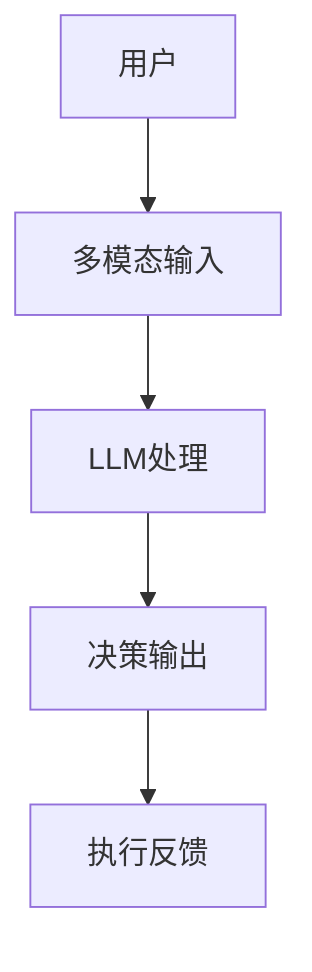
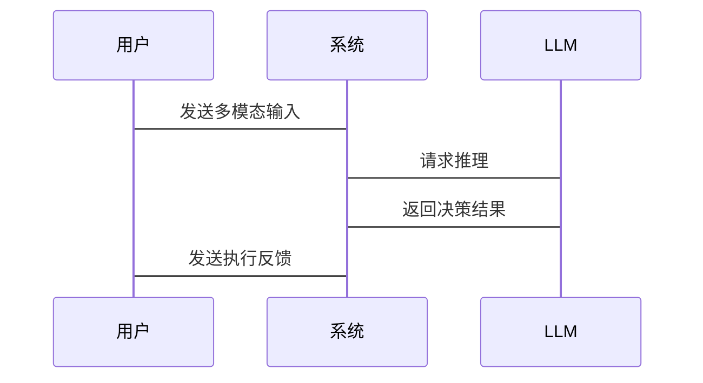

                 


# 跨感官AI Agent：融合LLM与多模态感知输入

> 关键词：跨感官AI Agent，LLM，多模态感知输入，AI多模态处理，跨感官融合算法，AI智能体

> 摘要：  
跨感官AI Agent是一种结合了大型语言模型（LLM）与多模态感知输入的智能体，旨在通过融合来自不同感官的数据（如视觉、听觉、触觉等）来实现更强大的感知和决策能力。本文将深入探讨跨感官AI Agent的核心概念、算法原理、系统架构以及实际应用，帮助读者全面理解这一前沿技术。

---

## 第一部分：背景介绍

### 第1章：跨感官AI Agent的背景与问题背景

#### 1.1 跨感官AI Agent的定义与概念
跨感官AI Agent是一种能够同时处理和融合来自多种感官数据（如视觉、听觉、触觉等）的智能体。它结合了大型语言模型（LLM）的强大语言处理能力，能够通过多模态输入实现更复杂的任务。

#### 1.2 跨感官AI Agent的问题背景
传统的AI Agent通常只能处理单一类型的数据（如文本或图像），但在实际应用中，复杂的任务往往需要结合多种感官数据进行决策。例如，在智能机器人或自动驾驶系统中，仅依靠视觉信息是不够的，还需要结合听觉、触觉等信息来提高感知能力。

---

## 第二部分：核心概念与联系

### 第2章：跨感官AI Agent的核心概念与联系

#### 2.1 跨感官AI Agent的核心原理
跨感官AI Agent的核心在于将多模态数据（如图像、语音、文本等）进行融合，并通过LLM进行理解和决策。其工作流程包括以下几个步骤：
1. **多模态感知输入**：通过多种传感器获取数据（如摄像头获取图像，麦克风获取语音）。
2. **数据预处理**：对不同感官数据进行标准化处理，使其能够被模型统一处理。
3. **数据融合**：将多种感官数据进行融合，提取有用的特征。
4. **LLM处理**：将融合后的特征输入到LLM中，进行语义理解和生成决策。
5. **决策输出**：根据LLM的输出生成最终的行动或响应。

#### 2.2 跨感官AI Agent的核心要素对比
以下是几种核心要素的对比：

| **要素**       | **文本处理**         | **视觉处理**         | **听觉处理**         |
|----------------|--------------------|--------------------|--------------------|
| 数据类型       | 文本字符串          | 图像/视频流         | 音频流             |
| 处理方法       | 词嵌入、句嵌入      | 图像识别、目标检测  | 语音识别、声纹分析  |
| 融合方式       | 文本+图像           | 图像+语音           | 文本+语音           |

#### 2.3 跨感官AI Agent的ER实体关系图


---

## 第三部分：算法原理

### 第3章：跨感官AI Agent的算法原理

#### 3.1 跨感官数据融合算法
跨感官数据融合的核心在于将不同感官的数据进行有效整合。常用的融合方法包括：

1. **特征级融合**：将不同感官的特征向量进行拼接或加权融合。
2. **决策级融合**：分别对每种感官数据进行决策，然后将决策结果进行融合。

##### 3.1.1 多模态数据预处理
以图像和文本为例，预处理步骤包括：
1. **图像预处理**：归一化、调整分辨率、归一化等。
2. **文本预处理**：分词、去除停用词、词向量转换等。

##### 3.1.2 融合算法的数学模型
融合模型可以表示为：
$$ y = f(x_1, x_2, ..., x_n) $$
其中，$x_i$表示不同感官的输入数据，$y$表示融合后的输出。

#### 3.2 跨感官LLM微调算法
为了使LLM能够更好地处理多模态输入，通常需要进行微调。

##### 3.2.1 微调的目标函数
常用的目标函数为：
$$ L = \sum_{i=1}^{n} (y_i - y_{\text{pred}})^2 $$

##### 3.2.2 微调过程的优化策略
1. **学习率调整**：采用学习率衰减策略。
2. **批量归一化**：在每一层中添加批量归一化层以加速收敛。

#### 3.3 跨感官AI Agent的推理算法
推理过程包括以下几个步骤：
1. **输入数据获取**：获取多模态输入数据。
2. **数据预处理**：对数据进行标准化处理。
3. **数据融合**：将不同感官数据进行融合。
4. **LLM推理**：将融合后的数据输入到LLM中进行推理。
5. **输出决策**：生成最终的决策结果。

---

## 第四部分：系统架构

### 第4章：跨感官AI Agent的系统架构设计

#### 4.1 系统功能设计
跨感官AI Agent的系统功能模块包括：
1. **感知输入模块**：负责获取多模态输入数据。
2. **数据处理模块**：对输入数据进行预处理和融合。
3. **LLM处理模块**：将融合后的数据输入到LLM中进行推理。
4. **决策执行模块**：根据LLM的输出生成决策并执行。

#### 4.2 系统架构设计


#### 4.3 系统接口设计
系统接口包括：
1. **输入接口**：接收多模态数据。
2. **输出接口**：输出决策结果或执行反馈。

#### 4.4 系统交互设计


---

## 第五部分：项目实战

### 第5章：跨感官AI Agent的项目实战

#### 5.1 环境安装与配置
1. **安装依赖**：
   ```bash
   pip install numpy pandas torch transformers
   ```
2. **配置LLM模型**：
   ```bash
   # 下载预训练模型
   wget https://example.com/model.pth
   ```

#### 5.2 核心代码实现
以下是跨感官数据融合与LLM推理的核心代码示例：

##### 数据融合模块
```python
import torch

def fuse_modalities(text_embeds, image_embeds):
    # 拼接特征向量
    fused = torch.cat([text_embeds, image_embeds], dim=-1)
    return fused
```

##### LLM推理模块
```python
from transformers import AutoModelForCausalLM, AutoTokenizer

def llm_inference(modalities, model, tokenizer):
    # 将多模态数据转换为文本输入
    input_str = " ".join([str(modalities)])
    inputs = tokenizer(input_str, return_tensors="pt")
    outputs = model.generate(inputs.input_ids)
    return tokenizer.decode(outputs[0])
```

#### 5.3 实际应用分析
以智能客服为例，跨感官AI Agent可以通过融合用户的文本输入和语音情感进行更准确的意图识别和响应生成。

---

## 第六部分：最佳实践与小结

### 第6章：跨感官AI Agent的最佳实践

#### 6.1 小结
跨感官AI Agent通过融合多模态数据，显著提升了AI Agent的感知和决策能力，适用于多种复杂场景。

#### 6.2 注意事项
1. **数据质量**：确保多模态数据的准确性和一致性。
2. **模型选择**：根据具体任务选择合适的LLM模型。
3. **性能优化**：优化数据融合算法和模型训练效率。

#### 6.3 未来展望
随着多模态数据处理技术的进步，跨感官AI Agent将在更多领域得到广泛应用。

---

## 作者信息

作者：AI天才研究院/AI Genius Institute & 禅与计算机程序设计艺术/Zen And The Art of Computer Programming

---

通过以上内容，您可以深入了解跨感官AI Agent的核心概念、算法原理和实际应用。希望本文对您有所帮助！

