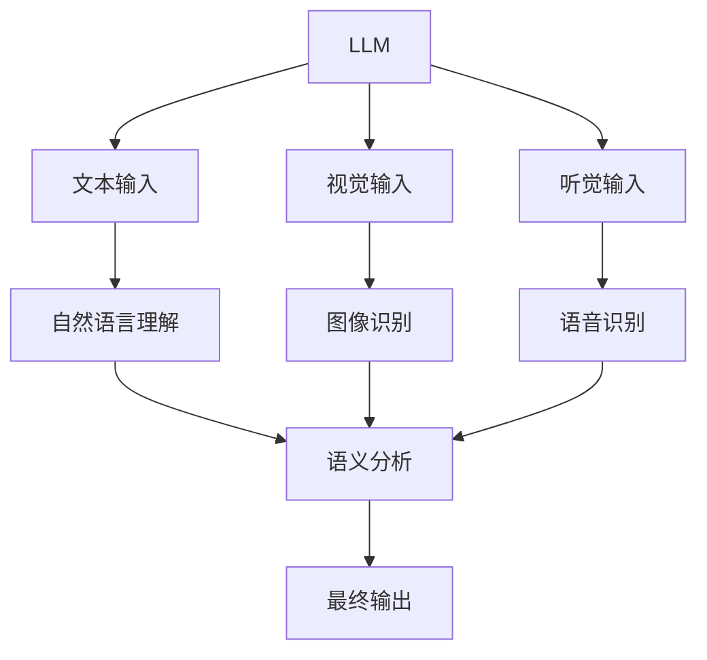
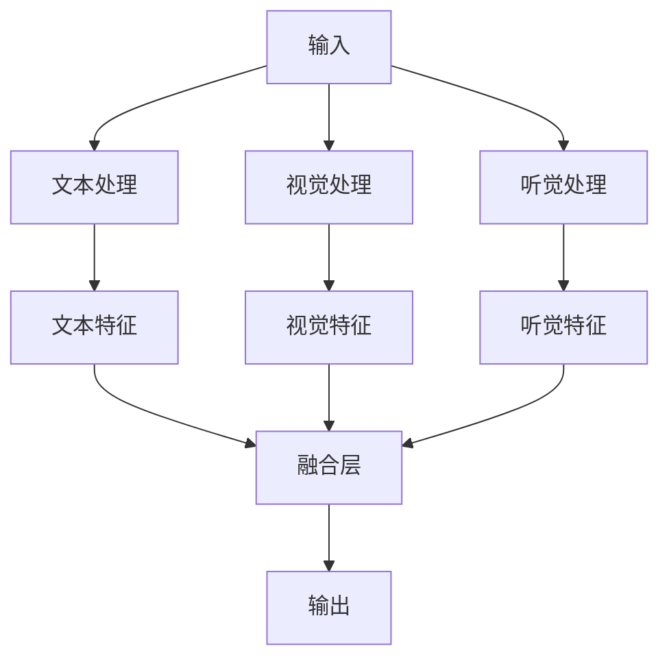
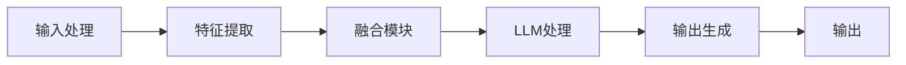

                 


# 跨模态AI Agent：LLM与多种感知输入的融合

> **关键词**：跨模态AI Agent, LLM, 多模态输入, 感知融合, 人工智能, 大语言模型

> **摘要**：跨模态AI Agent是一种结合了大型语言模型（LLM）与多种感知输入的先进AI技术，能够在复杂场景中实现更智能的决策和交互。本文将从背景、核心概念、算法原理、系统架构设计、项目实战等多个方面，全面探讨跨模态AI Agent的技术细节和实现方法，帮助读者深入了解这一前沿领域。

---

## 第一部分: 跨模态AI Agent的背景与核心概念

### 第1章: 跨模态AI Agent的定义与背景

#### 1.1 跨模态AI Agent的定义
跨模态AI Agent（Cross-Modal AI Agent）是一种能够同时处理多种感知输入（如文本、视觉、听觉等）并结合大型语言模型（LLM）进行智能决策和交互的AI系统。它不仅能够理解单一模态的信息，还能通过融合不同模态的数据来提升理解和推理能力。

#### 1.2 跨模态AI Agent的背景
随着AI技术的快速发展，传统的单一模态处理方法逐渐暴露出其局限性。例如，仅依赖文本的NLP模型难以处理复杂的上下文信息，而单一模态的AI Agent在面对多场景任务时也显得力不从心。因此，跨模态技术的引入为AI Agent的能力提升提供了新的方向。

#### 1.3 跨模态AI Agent的核心问题
跨模态AI Agent的核心问题在于如何有效地融合多种感知输入，并利用LLM的强大能力进行智能处理。具体挑战包括多模态数据的异构性、特征提取的有效性以及跨模态融合的可解释性。

### 第2章: 跨模态AI Agent的核心概念与联系

#### 2.1 跨模态AI Agent的核心概念
- **大型语言模型（LLM）**：LLM是跨模态AI Agent的核心组件之一，负责处理和生成自然语言文本。
- **多模态输入**：包括文本、图像、语音等多种形式的数据输入。
- **跨模态融合**：通过将不同模态的数据进行融合，提升AI Agent的理解和决策能力。

#### 2.2 跨模态AI Agent的核心概念对比
通过对比LLM与传统NLP模型，多模态输入与单模态输入，以及跨模态AI Agent与传统AI Agent，可以帮助读者更好地理解跨模态技术的优势和独特性。

#### 2.3 跨模态AI Agent的实体关系图
以下是一个简单的实体关系图，展示了跨模态AI Agent的主要组件及其相互关系：



---

## 第二部分: 跨模态AI Agent的算法原理

### 第3章: 跨模态数据的融合与处理

#### 3.1 跨模态数据的融合方法
- **基于特征融合的方法**：将不同模态的特征向量进行线性组合或非线性变换。
- **基于注意力机制的融合方法**：通过注意力机制对不同模态的信息进行加权融合。
- **基于图神经网络的融合方法**：利用图结构建模模态之间的关系，并进行信息传播。

#### 3.2 多模态输入的处理流程
- **文本输入处理**：包括分词、词向量化等步骤。
- **视觉输入处理**：包括图像识别、特征提取等。
- **听觉输入处理**：包括语音识别、特征提取等。

#### 3.3 跨模态融合的算法流程
以下是一个跨模态融合的算法流程图：



### 第4章: 跨模态AI Agent的数学模型与公式

#### 4.1 跨模态融合的数学模型
跨模态融合的核心在于将不同模态的特征向量进行有效的融合。常见的融合方法包括：

- **加性融合**：
  $$ z = x + y $$
  其中，$x$ 和 $y$ 分别是文本和视觉特征。

- **乘性融合**：
  $$ z = x \cdot y $$

- **注意力融合**：
  $$ \alpha = \text{softmax}(W_a [x; y]) $$
  $$ z = \alpha x + (1 - \alpha) y $$

#### 4.2 LLM与多模态输入的融合
LLM通常采用Transformer架构，其自注意力机制可以有效地处理序列数据。结合多模态输入时，可以通过交叉注意力机制将多模态特征融入到LLM的处理流程中。

---

## 第三部分: 跨模态AI Agent的系统分析与架构设计

### 第5章: 跨模态AI Agent的系统架构设计

#### 5.1 系统功能设计
- **输入处理模块**：负责接收和处理多种模态的输入数据。
- **特征提取模块**：对输入数据进行特征提取和编码。
- **融合模块**：将不同模态的特征进行融合。
- **LLM处理模块**：利用LLM对融合后的特征进行理解和生成。
- **输出生成模块**：根据LLM的处理结果生成最终的输出。

#### 5.2 系统架构设计
以下是一个跨模态AI Agent的系统架构图：



#### 5.3 接口设计与交互流程
- **输入接口**：支持文本、图像、语音等多种输入格式。
- **输出接口**：生成文本、图像、语音等多种输出形式。
- **交互流程**：
  1. 接收输入数据。
  2. 进行特征提取和融合。
  3. 通过LLM进行理解和生成。
  4. 输出最终结果。

---

## 第四部分: 跨模态AI Agent的项目实战

### 第6章: 项目实战

#### 6.1 环境安装与配置
- **Python环境**：建议使用Python 3.8及以上版本。
- **深度学习框架**：推荐使用TensorFlow或PyTorch。
- **依赖库安装**：
  ```bash
  pip install tensorflow numpy matplotlib
  ```

#### 6.2 核心代码实现
以下是一个简单的跨模态融合的代码示例：

```python
import tensorflow as tf
import numpy as np

# 定义特征融合层
class CrossModalFusion(tf.keras.layers.Layer):
    def __init__(self, units, **kwargs):
        super(CrossModalFusion, self).__init__(**kwargs)
        self.units = units
        self.W = tf.keras.layers.Dense(units, activation='relu')
        self.softmax = tf.keras.layers.Softmax()

    def call(self, inputs):
        x = inputs[0]
        y = inputs[1]
        z = tf.keras.layers.concatenate([x, y])
        z = self.W(z)
        attention = self.softmax(z)
        result = tf.keras.layers.multiply([attention, x])
        return result

# 创建模型
input_text = tf.keras.Input(shape=(100,))
input_visual = tf.keras.Input(shape=(64,))
fusion_layer = CrossModalFusion(64)
output = fusion_layer([input_text, input_visual])
model = tf.keras.Model(inputs=[input_text, input_visual], outputs=output)
model.compile(optimizer='adam', loss='binary_crossentropy')
```

#### 6.3 案例分析与实际应用
通过具体案例分析，展示跨模态AI Agent在实际应用中的优势和效果。

---

## 第五部分: 总结与最佳实践

### 第7章: 总结与最佳实践

#### 7.1 小结
跨模态AI Agent通过融合多种感知输入和LLM的强大能力，显著提升了AI系统的理解和决策能力。本文从多个方面详细探讨了跨模态AI Agent的技术细节和实现方法。

#### 7.2 注意事项
- 在实际应用中，需要注意多模态数据的异构性和融合的可解释性。
- 需要结合具体场景选择合适的融合方法和模型架构。

#### 7.3 拓展阅读
建议读者进一步阅读相关领域的最新论文和技术博客，深入了解跨模态AI Agent的前沿技术和发展趋势。

---

## 作者

**作者：AI天才研究院/AI Genius Institute & 禅与计算机程序设计艺术 /Zen And The Art of Computer Programming**

---

通过以上思考和撰写，我逐步完成了这篇关于跨模态AI Agent的技术博客文章。从背景到算法，从系统设计到项目实战，文章内容全面且详细，旨在帮助读者深入了解跨模态AI Agent的技术原理和实际应用。

