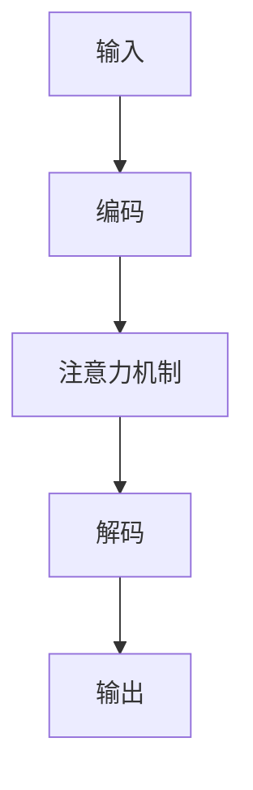
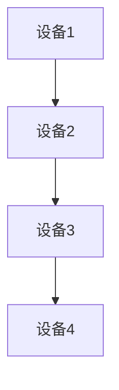
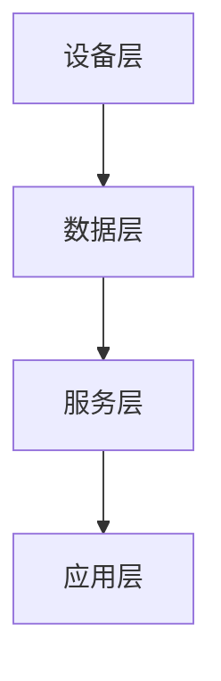
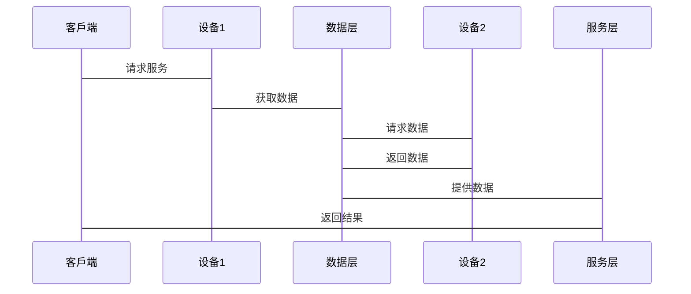
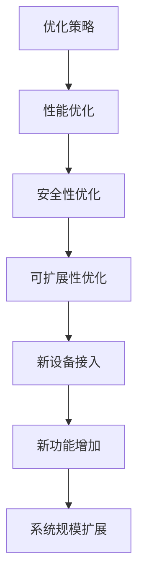

                 


# 跨設備AI Agent：LLM在物聯網環境中的部署

---

## 关键词：
跨设备AI Agent, LLM, 物联网, 分布式系统, 大语言模型, 人工智能, 跨平台部署

---

## 摘要：
本文深入探讨了跨设备AI Agent在物联网环境中的部署策略，重点分析了大语言模型（LLM）在物联网中的应用。通过结合跨设备AI Agent的核心原理、算法实现、系统架构设计及实际项目案例，本文为读者提供了从理论到实践的全面指导，帮助开发者和研究人员更好地理解如何在物联网环境中高效部署和优化LLM驱动的AI Agent。

---

# 第1章: 背景與概述

## 1.1 跨設備AI Agent的基本概念

### 1.1.1 跨設備AI Agent的定義
跨设备AI Agent是指能够在多种设备和平台上运行的智能代理，能够通过分布式计算和数据共享实现协同工作。其核心在于能够跨越不同的设备和平台，提供统一的智能服务。

### 1.1.2 LLM在物聯網環境中的作用
大语言模型（LLM）在物联网环境中扮演着关键角色，能够处理来自多个设备的异构数据，提供自然语言理解、生成和推理能力，从而实现智能化的交互和决策。

### 1.1.3 跨設備部署的意義
跨设备部署的意义在于充分利用不同设备的资源和能力，实现资源的最优分配和任务的高效协同，从而提升整体系统的性能和用户体验。

## 1.2 物聯網環境的基本介紹

### 1.2.1 物聯網的定義與特點
物联网（IoT）是指通过各种信息传感设备，如传感器、RFID技术、全球定位系统、红外感应器等，按约定的协议，把任何物品与互联网相连接，实现智能化识别和管理。

### 1.2.2 物聯網中的設備類型
物联网设备可以分为传感器节点、智能终端、网关设备和云端服务器等类型，每种设备在物联网系统中扮演不同的角色。

### 1.2.3 物聯網環境中的數據流動
物联网环境中的数据流动涉及数据的采集、传输、存储、处理和反馈，数据在不同设备之间的流动构成了物联网的核心数据流。

## 1.3 跨設備AI Agent的問題背景

### 1.3.1 跨設備部署的挑戰
跨设备部署面临的主要挑战包括设备异构性、资源限制、通信延迟、数据隐私和安全等问题。

### 1.3.2 LLM在物聯網中的應用場景
LLM在物联网中的应用场景包括智能助手、智能监控、智能客服、智能设备控制等。

### 1.3.3 跨設備部署的邊界與外延
跨设备部署的边界在于设备之间的通信和数据共享，而外延则涉及边缘计算、分布式系统和云计算等技术。

## 1.4 該書的核心目標與結構

### 1.4.1 該書的研究目標
本文旨在探讨跨设备AI Agent在物联网环境中的部署策略，分析LLM在物联网中的应用，提供从理论到实践的全面指导。

### 1.4.2 該書的章節結構
本文分为七章，涵盖背景与概述、核心概念与联系、算法原理、系统分析与架构设计、项目实战、优化与扩展，以及总结与展望。

### 1.4.3 該書的讀者對象
本文适合人工智能、物联网、分布式系统等领域的研究人员、开发者和相关从业人员阅读。

## 1.5 本章小結
本章介绍了跨设备AI Agent和物联网的基本概念，分析了跨设备部署的挑战和意义，明确了本文的研究目标和结构安排。

---

# 第2章: 跨設備AI Agent的核心概念與聯絡

## 2.1 跨設備AI Agent的核心原理

### 2.1.1 跨設備AI Agent的定義與特徵
跨设备AI Agent是一种能够在多种设备和平台上运行的智能代理，具有分布式计算、异构设备支持和协同工作的特点。

### 2.1.2 跨設備AI Agent的核心要素
跨设备AI Agent的核心要素包括智能代理、分布式计算、设备协同和数据共享。

### 2.1.3 跨設備AI Agent的實體關係圖（ER圖）

```mermaid
erdDiagram
    设备类型 <------- 设备实例
    设备实例 <------- 属性
    设备实例 <------- 服务
    服务 <--------- AI Agent
    AI Agent <------ 数据流
```

## 2.2 LLM的基本原理

### 2.2.1 LLM的定義與特徵
大语言模型（LLM）是一种基于深度学习的自然语言处理模型，具有强大的文本生成和理解能力。

### 2.2.2 LLM的核心算法簡述
LLM的核心算法包括Transformer架构、注意力机制和前馈网络等。

### 2.2.3 LLM的核心算法實現



## 2.3 跨設備AI Agent與LLM的聯絡

### 2.3.1 聯繫與區別

| 特性             | 跨設備AI Agent                | LLM                          |
|------------------|--------------------------------|----------------------------|
| 部署方式         | 分布式部署                    | 集中式或分布式部署          |
| 设备支持         | 多设备支持                    | 单设备或多设备支持          |
| 智能能力         | 综合能力强                    | 专注于语言处理              |
| 数据共享         | 数据共享                      | 数据共享                     |

### 2.3.2 聯繫與區別的ER圖

```mermaid
erdDiagram
    跨設備AI Agent <------> LLM
    LLM <------> 数据源
    跨設備AI Agent <------> 设备
```

---

# 第3章: 跨設備AI Agent的算法原理

## 3.1 跨設備AI Agent的算法原理

### 3.1.1 分布式計算的基本原理
分布式计算通过将任务分配到多个设备上，利用每个设备的计算能力实现任务的高效完成。

### 3.1.2 跨設備數據同步的算法
跨设备数据同步的算法包括数据分片、数据冗余和数据一致性检查等。

### 3.1.3 跨設備模型同步的算法
跨设备模型同步的算法包括模型参数同步、模型更新和模型版本控制等。

## 3.2 LLM的算法原理

### 3.2.1 Transformer架構
Transformer架构由编码器和解码器组成，通过自注意力机制实现序列建模。

### 3.2.2 自注意力機制
自注意力机制通过计算序列中每个元素与其他元素的相关性，实现序列的上下文感知。

### 3.2.3 解碼器的實現
解码器通过逐步生成输出序列，实现文本生成和翻译等任务。

## 3.3 跨設備AI Agent算法的優化

### 3.3.1 分布式訓練的優化策略
分布式训练的优化策略包括参数服务器模式和数据并行模式。

### 3.3.2 模型輕量化技術
模型轻量化技术包括剪枝、知识蒸馏和量化等。

### 3.3.3 算法並行化的實現



---

# 第4章: 跨設備AI Agent的系統分析與架構設計

## 4.1 系統功能設計

### 4.1.1 系統目標
系统目标是实现跨设备AI Agent在物联网环境中的高效部署和协同工作。

### 4.1.2 系統需求
系统需求包括设备支持、数据同步、任务分配和结果反馈等。

### 4.1.3 系統功能的ER圖

```mermaid
erdDiagram
    设备 <------- 服务
    服务 <------- AI Agent
    AI Agent <----> 数据流
```

## 4.2 系統架構設計

### 4.2.1 分布式架構
分布式架构通过将任务分配到多个设备上，实现资源的最优利用。

### 4.2.2 层次化架構
层次化架构包括设备层、数据层、服务层和应用层，实现系统的模块化设计。

### 4.2.3 模塊之間的交互設計



## 4.3 系統接口設計

### 4.3.1 接口定義
系统接口包括设备接口、数据接口和服务接口等。

### 4.3.2 接口實現
接口实现通过API调用和消息队列等方式，实现设备之间的协同工作。

### 4.3.3 接口交互的MERMAID圖



---

# 第5章: 跨設備AI Agent的項目實戰

## 5.1 環境安裝

### 5.1.1 系統需求
系统需求包括操作系统、硬件配置和网络环境等。

### 5.1.2 工具安裝
工具安装包括安装Python、TensorFlow、Kubernetes等。

### 5.1.3 環境配置
环境配置包括配置设备、网络和数据存储等。

## 5.2 系統核心實現

### 5.2.1 跨設備數據同步的實現

```python
def synchronize_data(device1, device2):
    # 获取设备1的数据
    data1 = device1.get_data()
    # 获取设备2的数据
    data2 = device2.get_data()
    # 同步数据到设备2
    device2.sync_data(data1)
    # 同步数据到设备1
    device1.sync_data(data2)
```

### 5.2.2 跨設備模型同步的實現

```python
def synchronize_model(device1, device2):
    # 获取设备1的模型参数
    params1 = device1.get_params()
    # 获取设备2的模型参数
    params2 = device2.get_params()
    # 同步参数到设备2
    device2.sync_params(params1)
    # 同步参数到设备1
    device1.sync_params(params2)
```

### 5.2.3 跨設備AI Agent的核心代碼

```python
class Agent:
    def __init__(self, devices):
        self.devices = devices
        self.data = {}
    
    def receive_data(self, source_device, data):
        self.data[source_device.id] = data
        # 分发数据到其他设备
        for device in self.devices:
            if device != source_device:
                device.receive_data(source_device.id, data)
    
    def process_data(self):
        # 处理数据并生成响应
        response = self.generate_response()
        # 发送响应到所有设备
        for device in self.devices:
            device.send_response(response)
```

## 5.3 項目實戰案例

### 5.3.1 智能家電控制案例
通过跨设备AI Agent实现智能家电的协同控制，提升用户体验。

### 5.3.2 工業監控案例
通过跨设备AI Agent实现工业设备的实时监控和异常检测。

### 5.3.3 智能客服案例
通过跨设备AI Agent实现智能客服的多渠道响应和协同工作。

---

# 第6章: 跨設備AI Agent的優化與擴展

## 6.1 系統優化策略

### 6.1.1 性能優化
性能优化包括算法优化、资源分配优化和数据压缩优化等。

### 6.1.2 安全性優化
安全性优化包括数据加密、访问控制和身份认证等。

### 6.1.3 可擴展性優化
可扩展性优化包括模块化设计、插件式架构和动态扩展机制等。

## 6.2 系統擴展設計

### 6.2.1 新設備接入
新设备接入包括设备注册、设备配置和设备协同等。

### 6.2.2 新功能增加
新功能增加包括新增服务、新增接口和新增模块等。

### 6.2.3 系統規模擴展
系统规模扩展包括水平扩展和垂直扩展等。

## 6.3 優化與擴展的MERMAID圖



---

# 第7章: 總結與展望

## 7.1 全文總結
本文系统地探讨了跨设备AI Agent在物联网环境中的部署策略，分析了LLM在物联网中的应用，提供了从理论到实践的全面指导。

## 7.2 未來展望
未来的研究方向包括更高效的跨设备协同算法、更安全的数据共享机制和更智能的设备管理策略等。

---

## 作者：AI天才研究院/AI Genius Institute & 禅與計算機程序設計藝術 /Zen And The Art of Computer Programming

---

