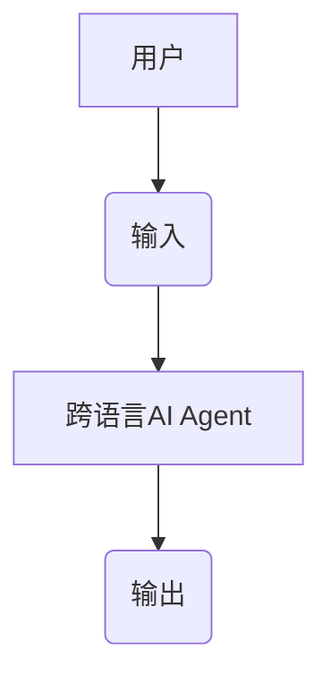
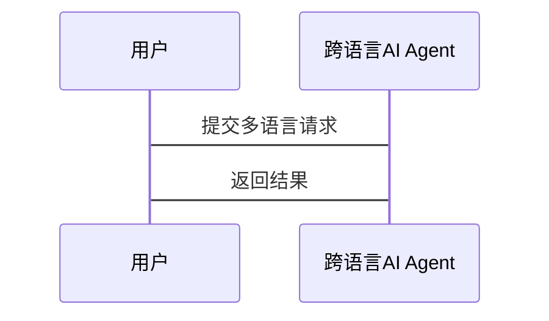

                 


# 跨语言 AI Agent：多语言 LLM 在国际化场景中的應用

---

## 关键词：
- 跨语言 AI Agent
- 多语言 LLM
- 国际化场景
- 人工智能
- 大语言模型
- 系统架构
- 项目实战

---

## 摘要：
本文探讨了跨语言 AI Agent 在多语言 LLM 技术下的应用，分析其在国际化场景中的核心概念、技术原理、系统架构及项目实战。通过深入解析多语言 LLM 的训练机制、跨语言 AI Agent 的实现原理，结合实际案例，展示了如何在国际化环境中构建高效、智能的 AI 系统。文章还总结了最佳实践和未来发展趋势，为技术从业者提供了实用的参考。

---

# 第1章：跨语言 AI Agent 的背景与问题描述

## 1.1 跨语言 AI Agent 的定义与核心概念

### 1.1.1 跨语言 AI Agent 的定义
跨语言 AI Agent 是一种能够理解、生成和处理多种语言信息的智能体，通过多语言大语言模型（LLM）实现跨语言交互和任务执行。

### 1.1.2 跨语言 AI Agent 的核心要素
- **多语言支持**：支持多种语言的自然语言处理能力。
- **跨语言推理**：能够理解不同语言间的语义关系。
- **智能交互**：通过多种语言与用户或系统进行交互。

### 1.1.3 跨语言 AI Agent 的应用场景
- **国际化客户服务**：为多语言用户提供支持。
- **多语言内容生成**：生成多种语言的文本内容。
- **跨语言数据分析**：分析多种语言的数据并提取洞察。

## 1.2 多语言 LLM 的发展与挑战

### 1.2.1 多语言 LLM 的发展现状
- **技术进步**：多语言 LLM 在准确性、效率和可扩展性方面不断进步。
- **应用场景拓展**：从单一语言应用扩展到跨语言场景。

### 1.2.2 多语言 LLM 的主要挑战
- **模型训练难度**：需要处理多种语言的数据，训练复杂度高。
- **计算资源需求**：多语言模型的训练和推理需要大量计算资源。
- **语义一致性**：不同语言间的语义差异可能导致理解错误。

### 1.2.3 跨语言 AI Agent 的独特优势
- **全球化能力**：能够服务全球用户，适应不同文化背景。
- **高效交互**：通过多语言能力提高用户交互效率。
- **多场景应用**：适用于客服、翻译、内容生成等多种场景。

## 1.3 跨语言 AI Agent 在国际化场景中的应用价值

### 1.3.1 跨语言 AI Agent 的应用场景
- **全球客户服务**：为不同语言的用户提供支持。
- **多语言内容管理**：生成和管理多种语言的内容。
- **跨语言数据分析**：分析多语言数据，提取有价值的信息。

### 1.3.2 跨语言 AI Agent 的核心价值
- **提升用户体验**：通过多语言支持，提高用户满意度。
- **扩展市场覆盖**：帮助企业在多语言市场中占据优势。
- **提高效率**：自动化处理多语言任务，节省时间和成本。

### 1.3.3 跨语言 AI Agent 的未来趋势
- **智能化提升**：通过改进模型算法，提高跨语言理解能力。
- **应用范围扩大**：从特定领域扩展到更多行业应用。
- **技术融合**：与边缘计算、区块链等技术结合，拓展应用场景。

---

# 第2章：多语言 LLM 的核心原理与实现机制

## 2.1 多语言 LLM 的核心原理

### 2.1.1 多语言 LLM 的训练目标
- **跨语言对齐**：通过对比不同语言的数据，实现语义对齐。
- **多任务学习**：同时学习多种语言的文本生成任务。

### 2.1.2 多语言 LLM 的模型架构
- **编码器-解码器结构**：编码器处理输入，解码器生成输出。
- **跨语言注意力机制**：通过注意力机制捕捉不同语言间的语义关系。

### 2.1.3 多语言 LLM 的推理机制
- **多语言上下文理解**：理解输入文本的多语言上下文。
- **跨语言生成**：根据理解生成目标语言的文本。

## 2.2 跨语言 AI Agent 的技术实现

### 2.2.1 跨语言 AI Agent 的架构设计
- **语言适配层**：处理不同语言的输入输出。
- **跨语言推理引擎**：负责多语言语义理解和推理。
- **交互界面**：提供用户与 AI Agent 的交互界面。

### 2.2.2 跨语言 AI Agent 的通信机制
- **多语言协议**：支持多种语言的通信协议。
- **语言适配接口**：提供语言间的转换和适配接口。

### 2.2.3 跨语言 AI Agent 的任务分解
- **任务识别**：识别用户需求并分解成多个子任务。
- **多语言执行**：根据任务分解，执行相应的操作。
- **结果汇总与反馈**：汇总执行结果并反馈给用户。

---

# 第3章：多语言 LLM 的数学模型与算法实现

## 3.1 多语言 LLM 的数学模型

### 3.1.1 多语言 LLM 的概率分布模型
$$ P(y|x) = \prod_{i=1}^{n} P(y_i | y_{i-1}, x) $$
其中，$x$ 是输入，$y$ 是输出序列。

### 3.1.2 多语言 LLM 的损失函数
$$ \text{Loss} = -\sum_{i=1}^{n} \log P(y_i | y_{i-1}, x) $$

### 3.1.3 多语言 LLM 的训练过程
- **前向传播**：计算模型输出和损失。
- **反向传播**：计算梯度并更新模型参数。
- **优化**：通过优化算法（如Adam）改进模型参数。

## 3.2 跨语言 AI Agent 的算法实现

### 3.2.1 跨语言 AI Agent 的算法流程
1. 接收多语言输入。
2. 解码输入语言并提取语义。
3. 根据语义生成目标语言的输出。
4. 返回输出结果。

### 3.2.2 跨语言 AI Agent 的实现代码
```python
def cross_language_agent(input_text, target_language):
    # 解码输入语言
    source_language = detect_language(input_text)
    # 跨语言推理
    result = cross_language_inference(input_text, source_language, target_language)
    # 返回目标语言结果
    return result
```

### 3.2.3 跨语言 AI Agent 的性能优化
- **模型并行计算**：利用分布式计算加速模型训练。
- **缓存机制**：缓存频繁访问的语言模型参数，提高推理效率。

---

# 第4章：跨语言 AI Agent 的系统架构与设计

## 4.1 系统架构设计

### 4.1.1 系统架构图


### 4.1.2 系统功能模块
- **输入处理模块**：接收多语言输入并解析。
- **跨语言推理模块**：进行语义理解和推理。
- **输出生成模块**：生成目标语言的输出。

### 4.1.3 系统接口设计
- **输入接口**：支持多种语言的文本输入。
- **输出接口**：支持多种语言的文本输出。
- **控制接口**：用于系统管理和监控。

## 4.2 系统交互流程

### 4.2.1 交互流程图


### 4.2.2 系统交互机制
- **请求处理**：接收用户的请求并进行解析。
- **响应生成**：根据解析结果生成响应。
- **反馈机制**：提供用户反馈接口，优化系统性能。

---

# 第5章：跨语言 AI Agent 的项目实战

## 5.1 项目环境安装

### 5.1.1 安装依赖
- 安装 Python 和相关库（如 transformers、numpy）。
- 安装 Mermaid 图形生成工具。

### 5.1.2 安装步骤
```bash
pip install transformers numpy
npm install mermaid-js
```

## 5.2 核心代码实现

### 5.2.1 模型加载与初始化
```python
from transformers import AutoTokenizer, AutoModelForCausalLM

tokenizer = AutoTokenizer.from_pretrained("multi-language-model")
model = AutoModelForCausalLM.from_pretrained("multi-language-model")
```

### 5.2.2 跨语言推理实现
```python
def cross_language_inference(input_text, source_language, target_language):
    inputs = tokenizer(input_text, return_tensors="np")
    outputs = model.generate(**inputs)
    return tokenizer.decode(outputs[0], skip_special_tokens=True)
```

## 5.3 案例分析与结果解读

### 5.3.1 案例分析
- **输入**：用户输入“Hello”，目标语言为中文。
- **输出**：“你好”。

### 5.3.2 结果解读
- **输入解析**：识别输入语言为英语。
- **语义理解**：理解“Hello”的含义。
- **生成输出**：生成中文“你好”。

## 5.4 项目总结
- **项目实现**：成功构建了一个跨语言 AI Agent 系统。
- **性能优化**：通过缓存机制提高了推理效率。
- **未来改进**：计划引入更多语言和优化模型性能。

---

# 第6章：跨语言 AI Agent 的最佳实践与总结

## 6.1 最佳实践 tips

### 6.1.1 模型选择
- 根据需求选择适合的多语言模型。
- 定期更新模型，保持性能。

### 6.1.2 语言支持
- 根据目标市场选择支持的语言。
- 提供语言切换功能，方便用户选择。

### 6.1.3 系统优化
- 优化模型推理速度，降低延迟。
- 提供错误处理机制，提高系统稳定性。

## 6.2 总结与展望

### 6.2.1 总结
- 本文详细介绍了跨语言 AI Agent 的背景、原理、系统架构及实现。
- 通过项目实战展示了如何构建和优化跨语言 AI Agent 系统。

### 6.2.2 展望
- 随着技术进步，跨语言 AI Agent 的应用将更加广泛。
- 结合边缘计算和区块链等技术，跨语言 AI Agent 将迎来更多创新应用。

---

# 结语

跨语言 AI Agent 作为多语言 LLM 技术的重要应用，正在改变国际化场景中的信息处理方式。通过本文的系统介绍和深入分析，读者可以全面了解跨语言 AI Agent 的核心原理、技术实现和实际应用。未来，随着技术的不断发展，跨语言 AI Agent 将在更多领域发挥重要作用。

---

## 作者：AI天才研究院 & 禅与计算机程序设计艺术

