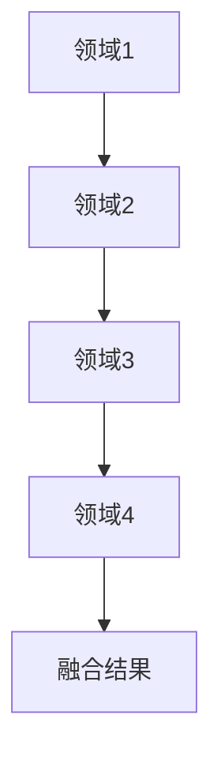
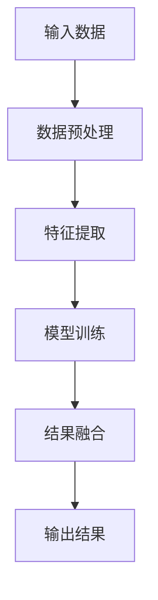
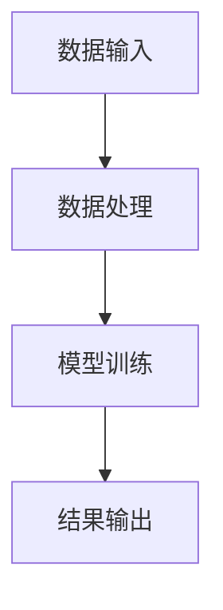

                 


# 跨领域知识融合AI Agent：LLM的跨学科应用

> 关键词：跨领域知识融合，AI Agent，大语言模型，LLM，跨学科应用

> 摘要：跨领域知识融合AI Agent是人工智能领域的重要研究方向，通过将大语言模型（LLM）与其他领域的知识相结合，实现跨学科的应用。本文系统地介绍了跨领域知识融合的基本概念、核心算法、系统架构设计以及实际项目实现，深入剖析了LLM在跨学科应用中的优势与挑战。

---

## 第一章: 跨领域知识融合与AI Agent基础

### 1.1 跨领域知识融合的定义与背景

#### 1.1.1 跨领域知识融合的定义
跨领域知识融合是指将不同领域（如自然语言处理、计算机视觉、机器学习等）的知识进行整合，形成统一的表达和理解。其核心目标是通过多源信息的融合，提升AI系统在复杂场景下的理解和决策能力。

#### 1.1.2 跨领域知识融合的背景与意义
随着人工智能技术的快速发展，单一领域的人工智能系统已经难以满足复杂场景的需求。例如，在医疗领域，可能需要结合医学知识、患者数据和自然语言处理技术来实现智能诊断。跨领域知识融合能够将这些分散的知识和数据整合起来，为AI系统提供更全面的支持。

#### 1.1.3 跨领域知识融合的核心问题与挑战
跨领域知识融合的核心问题是如何将不同领域、不同形式的知识进行统一表达和有效融合。其主要挑战包括：
1. 不同领域知识的异构性问题。
2. 知识融合的可解释性问题。
3. 跨领域融合的计算效率问题。

### 1.2 AI Agent的基本概念

#### 1.2.1 AI Agent的定义
AI Agent（智能体）是指能够感知环境、自主决策并执行任务的智能系统。它可以是一个软件程序、机器人或其他智能设备。

#### 1.2.2 AI Agent的分类与特点
AI Agent可以根据功能、智能水平和应用场景进行分类：
1. **按功能分类**：分为感知型Agent、决策型Agent和执行型Agent。
2. **按智能水平分类**：分为反应式Agent、基于模型的Agent和完全智能的Agent。
3. **按应用场景分类**：分为服务型Agent、监控型Agent和社交型Agent。

#### 1.2.3 AI Agent在跨领域应用中的作用
AI Agent在跨领域知识融合中扮演着桥梁的角色，它能够协调不同领域的知识和资源，实现复杂任务的协同完成。例如，在智能客服系统中，AI Agent可以整合自然语言处理、知识库查询和用户行为分析等多种技术。

### 1.3 大语言模型（LLM）的跨学科应用

#### 1.3.1 LLM的定义与技术特点
大语言模型（LLM）是指基于深度学习的大型神经网络模型，具有强大的自然语言理解和生成能力。其技术特点包括：
1. **大规模训练数据**：通常基于海量文本数据进行预训练。
2. **多任务学习能力**：能够适应多种不同的自然语言处理任务。
3. **上下文理解能力**：能够通过上下文理解语义，生成连贯的文本。

#### 1.3.2 LLM在跨领域知识融合中的优势
LLM在跨领域知识融合中的优势主要体现在：
1. **强大的语言理解能力**：能够处理多种语言和复杂的语义结构。
2. **知识的可扩展性**：可以通过微调和迁移学习快速适应新的领域知识。
3. **多模态融合潜力**：可以通过多模态输入（如文本、图像）进行跨领域知识融合。

#### 1.3.3 LLM与其他AI技术的结合
LLM可以与其他AI技术（如计算机视觉、强化学习）结合，形成多模态、多任务的智能系统。例如，结合图像识别技术，LLM可以实现基于图像的智能问答。

---

## 第二章: 跨领域知识融合的核心概念与联系

### 2.1 跨领域知识融合的核心原理

#### 2.1.1 跨领域知识融合的数学模型
跨领域知识融合的数学模型通常基于概率论和优化理论。例如，可以通过概率生成模型（如GMM）来表示不同领域的知识分布，并通过优化算法（如EM算法）进行参数估计。

公式1：概率生成模型的数学表达
$$
p(x|z) = \prod_{i=1}^{k} p(x_i|z_i)
$$

其中，$x$ 表示数据，$z$ 表示隐变量，$k$ 表示领域的数量。

#### 2.1.2 跨领域知识融合的算法原理
跨领域知识融合的主要算法包括：
1. **基于规则的融合算法**：通过预定义的规则对不同领域的知识进行合并。
2. **基于概率的融合算法**：基于概率论对不同领域的知识进行加权融合。
3. **基于学习的融合算法**：通过机器学习模型自动学习知识的融合策略。

#### 2.1.3 跨领域知识融合的实现步骤
1. 数据预处理：对不同领域的数据进行清洗和标准化。
2. 特征提取：提取各领域数据的特征表示。
3. 模型训练：训练跨领域知识融合的模型。
4. 结果融合：将各领域的融合结果进行统一输出。

### 2.2 跨领域知识融合的实体关系图

#### 2.2.1 实体关系图的构建
跨领域知识融合的实体关系图可以通过ER图（实体关系图）来描述。例如：



#### 2.2.2 实体关系图的分析
通过实体关系图可以清晰地看到不同领域之间的关联关系，以及融合结果的输出。

### 2.3 跨领域知识融合的流程图

#### 2.3.1 流程图的构建
跨领域知识融合的流程图可以通过以下步骤构建：



#### 2.3.2 流程图的分析
通过流程图可以清晰地看到跨领域知识融合的整个流程，从数据输入到结果输出的每一步骤。

---

## 第三章: 跨领域知识融合的算法原理

### 3.1 跨领域知识融合的主要算法

#### 3.1.1 基于概率的融合算法
基于概率的融合算法通过概率论对不同领域的知识进行加权融合。例如，可以通过贝叶斯定理对各领域的概率分布进行融合。

公式2：贝叶斯定理的数学表达
$$
P(A|B) = \frac{P(B|A)P(A)}{P(B)}
$$

其中，$A$ 和 $B$ 分别表示两个不同的领域。

#### 3.1.2 基于规则的融合算法
基于规则的融合算法通过预定义的规则对不同领域的知识进行合并。例如，可以通过简单的加权平均对多个领域的结果进行融合。

公式3：加权平均的数学表达
$$
y = \sum_{i=1}^{n} w_i x_i
$$

其中，$w_i$ 表示第 $i$ 个领域的权重，$x_i$ 表示第 $i$ 个领域的输入。

#### 3.1.3 基于学习的融合算法
基于学习的融合算法通过机器学习模型自动学习知识的融合策略。例如，可以通过神经网络模型对多领域的特征进行非线性组合。

公式4：神经网络模型的数学表达
$$
y = f(x_1, x_2, \ldots, x_n)
$$

其中，$x_i$ 表示第 $i$ 个领域的输入，$f$ 表示神经网络模型。

### 3.2 跨领域知识融合的数学模型

#### 3.2.1 融合模型的数学表达
跨领域知识融合的数学模型可以通过多种方式表达，例如：

公式5：融合模型的数学表达
$$
y = w_1 x_1 + w_2 x_2 + \ldots + w_n x_n
$$

其中，$w_i$ 表示第 $i$ 个领域的权重，$x_i$ 表示第 $i$ 个领域的输入，$y$ 表示融合结果。

#### 3.2.2 融合模型的优化过程
跨领域知识融合的优化过程通常基于梯度下降算法，通过不断优化权重参数来提升融合效果。

公式6：梯度下降算法的数学表达
$$
w_{i+1} = w_i - \eta \frac{\partial L}{\partial w_i}
$$

其中，$\eta$ 表示学习率，$L$ 表示损失函数，$\frac{\partial L}{\partial w_i}$ 表示权重参数 $w_i$ 的梯度。

#### 3.2.3 融合模型的评估指标
跨领域知识融合的评估指标通常包括准确率、召回率、F1值等。

---

## 第四章: 跨领域知识融合的系统架构设计

### 4.1 跨领域知识融合系统的功能设计

#### 4.1.1 数据输入模块
数据输入模块负责接收来自不同领域的数据输入，例如文本数据、图像数据等。

#### 4.1.2 数据处理模块
数据处理模块对输入数据进行预处理，例如数据清洗、特征提取等。

#### 4.1.3 模型训练模块
模型训练模块负责训练跨领域知识融合的模型，例如神经网络模型、概率生成模型等。

#### 4.1.4 结果输出模块
结果输出模块将融合结果输出到用户界面或下游系统。

### 4.2 跨领域知识融合系统的架构图

#### 4.2.1 系统架构图的构建
跨领域知识融合系统的架构图可以通过以下步骤构建：



#### 4.2.2 系统架构图的分析
通过架构图可以清晰地看到系统的各个模块及其之间的关系。

### 4.3 跨领域知识融合系统的接口设计

#### 4.3.1 输入接口
输入接口负责接收来自不同领域的数据输入，例如文本数据、图像数据等。

#### 4.3.2 输出接口
输出接口负责将融合结果输出到用户界面或下游系统。

#### 4.3.3 调用接口
调用接口负责协调各个模块之间的通信与协作。

---

## 第五章: 跨领域知识融合的项目实战

### 5.1 环境安装与配置

#### 5.1.1 系统环境要求
跨领域知识融合项目需要较高的计算资源，建议使用高性能计算服务器或云平台。

#### 5.1.2 开发工具安装
需要安装Python、TensorFlow、Keras等开发工具。

#### 5.1.3 数据集准备
需要准备多领域的数据集，例如文本数据、图像数据等。

### 5.2 系统核心实现

#### 5.2.1 数据预处理代码
```python
def preprocess(data):
    # 数据清洗
    cleaned_data = data.dropna()
    # 特征提取
    features = cleaned_data[['feature1', 'feature2']]
    return features
```

#### 5.2.2 模型训练代码
```python
def train_model(features, labels):
    # 模型定义
    model = keras.Sequential([
        layers.Dense(64, activation='relu'),
        layers.Dense(1, activation='sigmoid')
    ])
    # 模型编译
    model.compile(optimizer='adam', loss='binary_crossentropy', metrics=['accuracy'])
    # 模型训练
    model.fit(features, labels, epochs=100, batch_size=32)
    return model
```

#### 5.2.3 结果融合代码
```python
def fuse_results(results):
    # 加权平均
    fused_result = np.mean(results, axis=0)
    return fused_result
```

### 5.3 代码应用解读与分析

#### 5.3.1 数据预处理代码解读
数据预处理代码首先对输入数据进行清洗，去除缺失值，然后提取特征。

#### 5.3.2 模型训练代码解读
模型训练代码定义了一个简单的神经网络模型，包含两个全连接层。模型通过Adam优化器和二进制交叉熵损失函数进行训练。

#### 5.3.3 结果融合代码解读
结果融合代码通过加权平均的方式对多个模型的结果进行融合。

---

## 第六章: 总结与展望

### 6.1 跨领域知识融合的总结
跨领域知识融合是一项具有挑战性的任务，但其在人工智能领域的应用前景广阔。通过结合大语言模型（LLM）和其他领域的知识，可以实现更强大的智能系统。

### 6.2 跨领域知识融合的未来展望
未来，跨领域知识融合的研究将更加注重多模态、多任务的融合，以及知识的可解释性和安全性。同时，随着大语言模型（LLM）的不断发展，跨领域知识融合将更加智能化和自动化。

---

## 作者信息

作者：AI天才研究院/AI Genius Institute & 禅与计算机程序设计艺术 /Zen And The Art of Computer Programming

