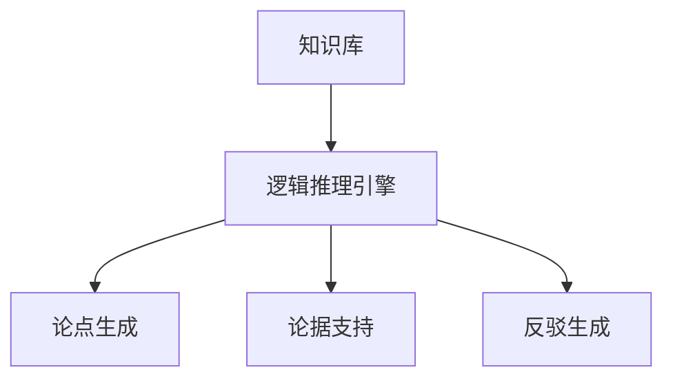
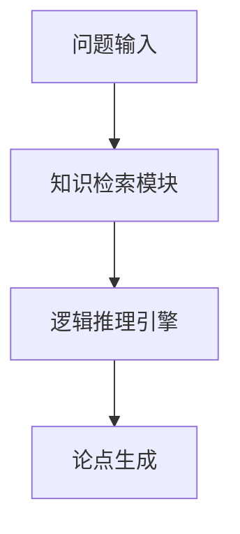
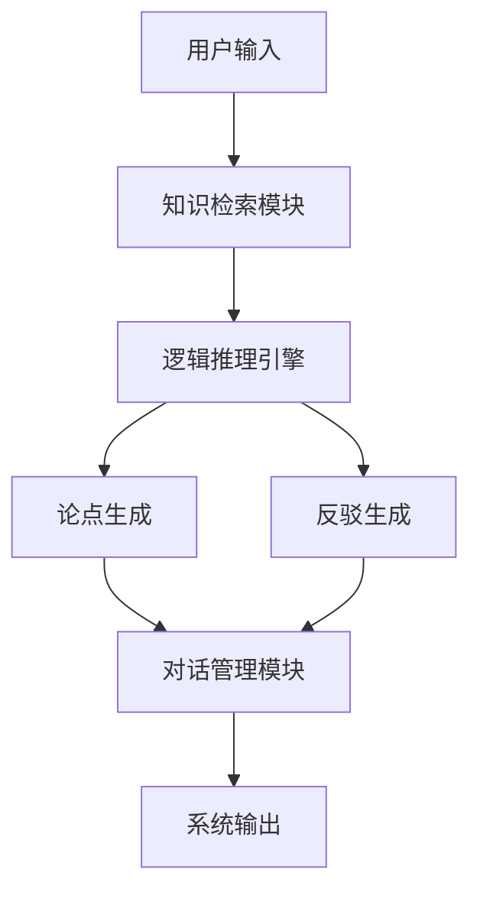
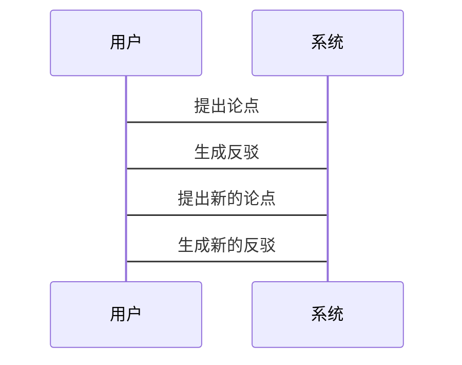

                 


# 辩论系统AI Agent：LLM驱动的论证与反驳能力

## 关键词：
- 辩论系统
- AI Agent
- LLM
- 论证
- 论证与反驳
- 逻辑推理

## 摘要：
本文将深入探讨LLM（Large Language Model）驱动的辩论系统AI Agent的论证与反驳能力。通过分析其核心概念、算法原理、系统架构和实际应用，揭示其在逻辑推理、知识表示、对话管理和系统设计等方面的技术细节。我们将从背景介绍、核心概念、算法原理、数学模型、系统架构、项目实战等多个维度展开，结合实际案例和代码实现，全面解析辩论系统AI Agent的工作原理和应用潜力。

---

# 第一部分: 背景介绍

## 第1章: 辩论系统AI Agent概述

### 1.1 问题背景
#### 1.1.1 辩论系统的定义与特点
辩论是一种通过逻辑推理和语言表达来争取支持、反驳对手的智力活动。在现代社会中，辩论广泛应用于政治、法律、商业和学术等领域。传统的辩论依赖于人类的逻辑思维和知识储备，而随着人工智能技术的发展，AI Agent（智能体）逐渐成为辩论系统的重要组成部分。

#### 1.1.2 辩论系统在现代社会中的应用领域
- **政治辩论**：AI Agent可以辅助政治家进行政策讨论和选举辩论。
- **法律辩论**：AI Agent可以帮助律师分析案例、寻找法律依据。
- **商业谈判**：AI Agent可以辅助商务人士进行商业谈判和合同协商。
- **学术辩论**：AI Agent可以辅助学者进行学术讨论和论文答辩。

#### 1.1.3 辩论系统AI Agent的必要性与优势
- **高效性**：AI Agent可以快速分析大量数据，生成合理的论点。
- **准确性**：通过自然语言处理和逻辑推理，AI Agent可以提供更准确的论据。
- **可扩展性**：AI Agent可以在多种场景下应用，适应不同的辩论需求。

### 1.2 问题描述
#### 1.2.1 辩论过程中的关键问题
- **论点生成**：如何生成合理的论点并支持其有效性。
- **论据检索**：如何快速检索相关知识和证据。
- **逻辑推理**：如何构建逻辑严密的推理链。
- **对话管理**：如何在对话中动态调整策略。

#### 1.2.2 AI Agent在辩论中的角色与功能
- **知识检索**：快速检索相关领域的知识和数据。
- **逻辑推理**：根据已有信息进行逻辑推理，生成论点。
- **对话管理**：根据对话上下文调整回应策略。
- **反驳生成**：针对对手的论点进行有效反驳。

#### 1.2.3 辩论系统AI Agent的核心挑战
- **动态性**：辩论过程中的信息是动态变化的，需要实时调整策略。
- **不确定性**：部分信息可能存在模糊性或不确定性，需要进行概率推理。
- **复杂性**：辩论涉及多方面的知识和逻辑推理，系统需要具备较强的综合能力。

### 1.3 问题解决
#### 1.3.1 辩论系统AI Agent的目标与任务
- **目标**：通过自然语言处理和逻辑推理，辅助或替代人类进行辩论。
- **任务**：
  - 生成合理的论点。
  - 检索相关知识和证据。
  - 构建逻辑严密的推理链。
  - 动态调整对话策略。

#### 1.3.2 辩论系统AI Agent的设计原则与方法
- **模块化设计**：将系统划分为知识检索、逻辑推理、对话管理等模块。
- **数据驱动**：利用大规模语料库进行训练，提升系统的学习能力。
- **动态适应**：根据对话上下文动态调整策略。

#### 1.3.3 辩论系统AI Agent的实现路径
- **数据收集与预处理**：收集辩论相关数据，进行清洗和标注。
- **模型训练**：基于LLM训练辩论系统AI Agent。
- **系统集成**：将各模块集成，进行测试和优化。

### 1.4 边界与外延
#### 1.4.1 辩论系统AI Agent的边界
- **输入范围**：系统仅处理特定领域的辩论任务。
- **输出范围**：系统生成的论点和反驳需符合逻辑和事实依据。

#### 1.4.2 辩论系统AI Agent的外延与扩展
- **跨领域应用**：将系统应用于不同领域，如法律、商业等。
- **多语言支持**：支持多种语言的辩论任务。

#### 1.4.3 辩论系统AI Agent与其他相关技术的关系
- **自然语言处理（NLP）**：NLP技术是AI Agent的核心技术之一。
- **逻辑推理**：逻辑推理是AI Agent进行论点生成和反驳的基础。
- **对话系统**：AI Agent可以看作是一种特殊的对话系统，专注于辩论任务。

### 1.5 核心要素组成
#### 1.5.1 辩论系统AI Agent的核心要素
- **知识库**：存储相关领域的知识和数据。
- **逻辑推理引擎**：负责构建逻辑推理链。
- **对话管理模块**：动态调整对话策略。

#### 1.5.2 各要素之间的关系与作用
- **知识库与逻辑推理引擎**：知识库为逻辑推理提供数据支持，逻辑推理引擎利用知识库生成论点。
- **对话管理模块与其他模块**：对话管理模块协调其他模块的工作，确保系统在对话中顺利运行。

#### 1.5.3 核心要素的实现与优化
- **知识库优化**：通过数据挖掘和知识图谱技术，提升知识库的结构化程度。
- **逻辑推理引擎优化**：引入概率推理和模糊逻辑，提升系统的应对复杂问题的能力。
- **对话管理模块优化**：通过机器学习算法，动态调整对话策略。

---

# 第二部分: 核心概念与联系

## 第2章: 辩论系统AI Agent的核心概念

### 2.1 逻辑推理与知识表示
#### 2.1.1 逻辑推理的基本原理
逻辑推理是AI Agent进行论点生成和反驳的核心技术。通过逻辑推理，系统可以从已知的前提中推导出结论。常见的逻辑推理方法包括演绎推理和归纳推理。

- **演绎推理**：从一般到特殊的推理方式，例如三段论。
- **归纳推理**：从特殊到一般的推理方式，例如统计推理。

#### 2.1.2 知识表示的方法与技术
知识表示是将知识以计算机可以理解的形式存储的技术。常见的知识表示方法包括：
- **一阶逻辑（First-order Logic, FOL）**：通过谓词和变量表示知识。
- **知识图谱（Knowledge Graph）**：通过实体和关系表示知识。
- **语义网络（Semantic Network）**：通过节点和边表示知识。

#### 2.1.3

---

### 2.1.3 逻辑推理与知识表示的对比

| **属性**       | **逻辑推理**               | **知识表示**               |
|-----------------|---------------------------|---------------------------|
| **核心目标**    | 推导出新的结论             | 表示知识的结构和关系       |
| **输入**        | 已知的前提和规则           | 知识库中的数据和关系       |
| **输出**        | 新的结论或决策             | 结构化的知识表示           |
| **应用场景**    | 辩论中的论点生成和反驳     | 辩论知识的存储与检索       |

#### 2.1.4 逻辑推理与知识表示的结合
通过结合逻辑推理和知识表示技术，AI Agent可以在辩论中实现以下功能：
- **论点生成**：基于知识库中的知识，生成合理的论点。
- **论据支持**：从知识库中检索相关证据，支持论点。
- **反驳生成**：根据知识库中的知识，生成针对对手论点的反驳。

### 2.2 逻辑推理与知识表示的实现



---

## 第3章: 辩论系统AI Agent的实现原理

### 3.1 论点生成与检索
#### 3.1.1 论点生成的基本原理
论点生成是AI Agent在辩论中的核心任务之一。通过分析问题背景和目标，系统需要生成合理的论点。论点生成的过程包括：
1. **问题分析**：理解问题的背景和目标。
2. **知识检索**：从知识库中检索相关知识。
3. **逻辑推理**：基于检索到的知识，生成论点。

#### 3.1.2 论点生成的算法实现



---

### 3.2 论证与反驳的实现

#### 3.2.1 论证的生成
论证的生成需要结合逻辑推理和语言生成技术。通过分析问题的关键词和上下文，系统可以生成合理的论点。

#### 3.2.2 论证的反驳
反驳是辩论系统AI Agent的重要功能之一。通过分析对手的论点，系统可以生成有效的反驳。反驳的过程包括：
1. **论点分析**：分析对手论点的结构和逻辑。
2. **证据检索**：检索与论点相关的证据。
3. **逻辑推理**：基于检索到的证据，生成反驳论点。

---

## 第4章: 辩论系统AI Agent的数学模型与公式

### 4.1 逻辑推理的数学模型
逻辑推理的数学模型是AI Agent进行论点生成和反驳的基础。常见的逻辑推理模型包括：
- **命题逻辑（Propositional Logic）**：通过命题和逻辑连接词表示知识。
- **一阶逻辑（First-order Logic, FOL）**：通过谓词和变量表示知识。

#### 4.1.1 命题逻辑的基本公式
命题逻辑的基本公式包括：
- **合取（AND）**：$A \land B$
- **析取（OR）**：$A \lor B$
- **否定（NOT）**：$\lnot A$
- **蕴含（IMPLIES）**：$A \rightarrow B$

#### 4.1.2 一阶逻辑的基本公式
一阶逻辑的基本公式包括：
- **全称量词（∀）**：$\forall x, P(x)$
- **存在量词（∃）**：$\exists x, P(x)$

---

### 4.2 概率推理的数学模型
概率推理是处理不确定性问题的重要方法。常见的概率推理模型包括：
- **贝叶斯网络（Bayesian Network）**：通过概率图模型表示变量之间的关系。
- **马尔可夫链（Markov Chain）**：通过状态转移概率表示变量之间的关系。

#### 4.2.1 贝叶斯定理
贝叶斯定理是概率推理的核心公式，用于计算条件概率。公式如下：

$$
P(A|B) = \frac{P(B|A)P(A)}{P(B)}
$$

其中：
- $P(A|B)$：在B发生的条件下，A发生的概率。
- $P(B|A)$：在A发生的条件下，B发生的概率。
- $P(A)$：A发生的先验概率。
- $P(B)$：B发生的先验概率。

---

## 第5章: 辩论系统AI Agent的系统架构

### 5.1 系统架构设计
#### 5.1.1 系统功能模块
- **知识检索模块**：从知识库中检索相关知识。
- **逻辑推理引擎**：基于检索到的知识，生成论点和反驳。
- **对话管理模块**：动态调整对话策略。

#### 5.1.2 系统架构图



---

### 5.2 系统接口与交互流程
#### 5.2.1 系统接口设计
- **输入接口**：接收用户的输入，包括问题描述和对话历史。
- **输出接口**：输出系统的论点和反驳。

#### 5.2.2 系统交互流程



---

## 第6章: 辩论系统AI Agent的项目实战

### 6.1 环境安装与配置
#### 6.1.1 环境要求
- **Python 3.8 或更高版本**
- **TensorFlow 2.0 或更高版本**
- **自然语言处理库（如spaCy）**
- **知识图谱库（如Neo4j）**

#### 6.1.2 安装步骤
```bash
pip install python
pip install tensorflow
pip install spacy
pip install neo4j
```

### 6.2 核心代码实现

#### 6.2.1 知识检索模块
```python
import spacy

# 加载预训练的自然语言处理模型
nlp = spacy.load("en_core_web_sm")

# 知识检索函数
def retrieveKnowledge(query):
    doc = nlp(query)
    # 实现知识检索逻辑
    return results
```

#### 6.2.2 逻辑推理引擎
```python
import tensorflow as tf

# 定义逻辑推理模型
class LogicReasoningModel:
    def __init__(self):
        self.model = tf.keras.Sequential([
            tf.keras.layers.Dense(64, activation='relu'),
            tf.keras.layers.Dense(1, activation='sigmoid')
        ])
        self.model.compile(optimizer='adam', loss='binary_crossentropy')

    def train(self, x, y):
        self.model.fit(x, y, epochs=10, batch_size=32)

    def predict(self, x):
        return self.model.predict(x)
```

#### 6.2.3 对话管理模块
```python
class DialogueManager:
    def __init__(self):
        self.dialogue_history = []

    def add_to_history(self, utterance):
        self.dialogue_history.append(utterance)

    def get_context(self):
        return self.dialogue_history
```

### 6.3 实际案例分析
#### 6.3.1 案例背景
假设我们正在辩论“人工智能对社会的积极影响”。

#### 6.3.2 系统输入
用户输入：“人工智能可以提高生产效率。”

#### 6.3.3 系统输出
系统检索相关知识，生成论点：“人工智能可以通过自动化技术提高生产效率。”
系统生成反驳：“人工智能可能导致就业机会减少。”

---

## 第7章: 总结与展望

### 7.1 最佳实践 tips
- **数据质量**：确保知识库中的数据准确且全面。
- **模型优化**：通过不断训练和优化模型，提升系统的推理能力。
- **人机协作**：结合人类专家的指导，提升系统的辩论能力。

### 7.2 小结
本文详细介绍了LLM驱动的辩论系统AI Agent的论证与反驳能力。通过分析其核心概念、算法原理、系统架构和实际应用，揭示了其在逻辑推理、知识表示、对话管理和系统设计等方面的技术细节。

### 7.3 注意事项
- **数据隐私**：确保系统中的数据符合隐私保护要求。
- **伦理问题**：避免AI Agent在辩论中传播不实信息或误导性论点。

### 7.4 拓展阅读
- **相关书籍**：《自然语言处理实战》、《机器学习实战》。
- **相关论文**：《基于LLM的智能辩论系统研究》、《AI驱动的逻辑推理技术》。

---

## 作者：AI天才研究院/AI Genius Institute & 禅与计算机程序设计艺术 /Zen And The Art of Computer Programming

