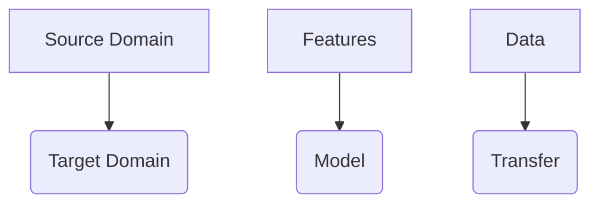
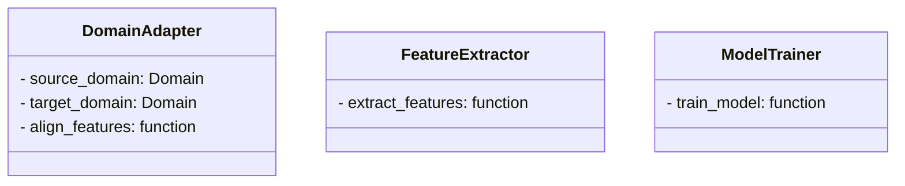
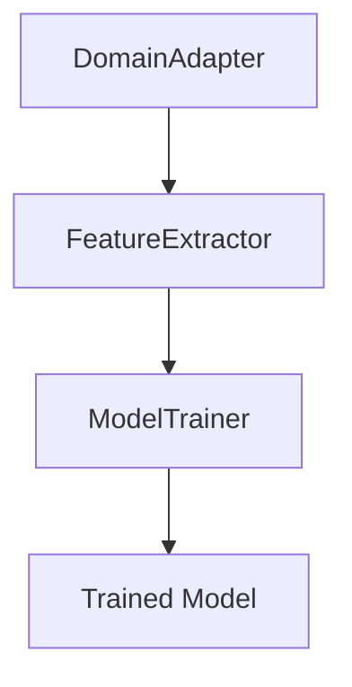

                 


# 迁移学习：让AI Agent快速适应新领域

> 关键词：迁移学习，机器学习，AI Agent，领域适应，算法，系统架构，实际应用

> 摘要：迁移学习是一种通过将一个领域中的知识应用到另一个领域，从而提高AI Agent在新环境中的适应能力的技术。本文将详细介绍迁移学习的基本概念、算法原理、系统架构设计以及实际项目中的应用，帮助读者全面理解如何利用迁移学习让AI Agent快速适应新领域。

---

## 第一部分: 迁移学习背景与核心概念

### 第1章: 迁移学习的基本概念

#### 1.1 什么是迁移学习
- **定义**：迁移学习是将一个领域中的知识迁移到另一个领域，以提高模型在目标领域的性能。
- **核心思想**：利用源领域和目标领域之间的相似性，减少数据稀缺性对模型性能的影响。
- **与传统机器学习的区别**：传统机器学习依赖大量目标领域的数据，而迁移学习可以利用其他领域的数据。

#### 1.2 迁移学习的背景与问题背景
- **数据稀缺性问题**：目标领域数据不足时，传统机器学习难以训练出有效的模型。
- **领域适应性问题**：模型在源领域表现优秀，但在目标领域可能性能下降。
- **迁移学习的必要性**：通过迁移学习，可以在目标领域数据有限的情况下，利用源领域的知识提升模型性能。

#### 1.3 迁移学习的应用场景
- **自然语言处理**：跨语言模型训练，如将英语模型迁移到低资源语言。
- **计算机视觉**：图像分类在不同光照条件下的迁移。
- **AI Agent**：在不同环境或任务中快速适应。

---

### 第2章: 迁移学习的核心概念与联系

#### 2.1 迁移学习的核心原理
- **数据分布的差异性**：源领域和目标领域数据分布可能不同。
- **特征空间的对齐**：通过特征变换使源领域和目标领域的特征对齐。
- **迁移学习的目标函数**：最小化源领域和目标领域之间的差异。

#### 2.2 核心概念对比
- **迁移学习与领域适应**：领域适应是迁移学习的一种形式，专注于将模型从源领域迁移到目标领域。
- **迁移学习与多任务学习**：多任务学习同时学习多个任务，而迁移学习关注将一个任务的知识迁移到另一个任务。
- **迁移学习与自适应学习**：自适应学习关注模型在动态环境中的调整，迁移学习更关注领域之间的知识转移。

#### 2.3 ER实体关系图


---

## 第二部分: 迁移学习的算法原理

### 第3章: 基于特征对齐的迁移学习算法

#### 3.1 算法流程
- 数据预处理：对源领域和目标领域的数据进行标准化或归一化处理。
- 特征提取：使用如卷积神经网络（CNN）提取数据特征。
- 特征对齐：通过线性变换或非线性变换使源领域和目标领域的特征对齐。
- 模型训练：在对齐后的特征上训练分类器或回归器。

#### 3.2 关键步骤
- 数据预处理：确保源和目标数据格式一致。
- 特征提取：选择适合数据类型的特征提取方法。
- 特征对齐：使用线性变换（如最大均值差异）或非线性变换（如深度学习模型）。

#### 3.3 代码实现
```python
import numpy as np
from sklearn.preprocessing import StandardScaler

# 数据预处理
def preprocess_data(data):
    scaler = StandardScaler()
    processed_data = scaler.fit_transform(data)
    return processed_data

# 特征对齐（假设使用线性变换）
def align_features(source, target):
    # 假设source和target都是二维数组，每行为一个样本
    # 使用最大均值差异进行对齐
    mean_source = np.mean(source, axis=0)
    mean_target = np.mean(target, axis=0)
    aligned_target = target - (mean_target - mean_source)
    return aligned_target

# 示例代码
source_data = np.random.randn(100, 2)
target_data = np.random.randn(50, 2) + np.array([1, 0])

source_processed = preprocess_data(source_data)
target_processed = preprocess_data(target_data)

aligned_target = align_features(source_processed, target_processed)
```

---

### 第4章: 基于分布匹配的迁移学习算法

#### 4.1 算法原理
- 目标：使源领域和目标领域的数据分布尽可能接近。
- 方法：使用概率密度函数匹配或分布估计方法。
- 实现：通过对抗训练或梯度下降优化分布差异。

#### 4.2 实验结果
- 对抗训练在某些任务中表现优于传统特征对齐方法。
- 分布匹配可以提高模型的泛化能力。

#### 4.3 代码实现
```python
import tensorflow as tf
from tensorflow.keras import layers

# 分布匹配网络
def distribution_matching_network(input_shape):
    inputs = layers.Input(shape=input_shape)
    x = layers.Dense(64, activation='relu')(inputs)
    x = layers.Dense(32, activation='relu')(x)
    outputs = layers.Dense(1, activation='sigmoid')(x)
    return tf.keras.Model(inputs=inputs, outputs=outputs)

# 示例代码
source_data = np.random.randn(100, 2)
target_data = np.random.randn(50, 2) + np.array([1, 0])

# 训练分布匹配网络
model = distribution_matching_network((2,))
model.compile(optimizer='adam', loss='binary_crossentropy')
model.fit(np.concatenate([source_data, target_data]), np.zeros(len(source_data) + len(target_data)), epochs=10)
```

---

## 第三部分: 迁移学习的数学模型与公式

### 第5章: 迁移学习的数学模型

#### 5.1 基于特征对齐的数学模型
- 概率密度函数：
  $$ p(x) $$
- 优化目标：
  $$ \min_{\theta} \mathbb{E}_{x \sim P_{\text{src}}}[f(x)] $$

#### 5.2 基于分布匹配的数学模型
- 对抗训练目标：
  $$ \min_{\theta} \max_{\phi} \mathbb{E}_{x \sim P_{\text{src}}}[\log D_\phi(x)] + \mathbb{E}_{x \sim P_{\text{tar}}}[\log (1 - D_\phi(x))] $$

#### 5.3 基于自适应层的数学模型
- 自适应层参数：
  $$ \theta $$
- 损失函数：
  $$ \mathcal{L} = \mathcal{L}_{\text{source}} + \lambda \mathcal{L}_{\text{target}} $$

---

## 第四部分: 迁移学习的系统架构与设计

### 第6章: 系统分析与架构设计

#### 6.1 问题场景介绍
- 某AI Agent需要从室内导航任务迁移到室外导航任务。
- 目标：利用室内导航数据提升室外导航性能。

#### 6.2 系统功能设计


#### 6.3 系统架构设计


#### 6.4 接口设计
- `preprocess_data(data):` 数据预处理接口。
- `align_features(source, target):` 特征对齐接口。
- `train_model(features, labels):` 模型训练接口。

---

## 第五部分: 迁移学习的实际项目

### 第7章: 项目实战

#### 7.1 环境安装
- 安装依赖：
  ```bash
  pip install numpy scikit-learn tensorflow
  ```

#### 7.2 核心实现代码
```python
import numpy as np
from sklearn.metrics import accuracy_score

def transfer_learning_pipeline(source_data, source_labels, target_data, target_labels):
    # 数据预处理
    source_processed = preprocess_data(source_data)
    target_processed = preprocess_data(target_data)
    
    # 特征对齐
    aligned_target = align_features(source_processed, target_processed)
    
    # 模型训练
    model = train_model(source_processed, source_labels)
    
    # 模型评估
    target_predictions = model.predict(aligned_target)
    accuracy = accuracy_score(target_labels, target_predictions)
    return accuracy

# 示例运行
source_data = np.random.randn(100, 2)
source_labels = np.random.randint(2, size=100)
target_data = np.random.randn(50, 2) + np.array([1, 0])
target_labels = np.random.randint(2, size=50)

accuracy = transfer_learning_pipeline(source_data, source_labels, target_data, target_labels)
print(f"迁移学习准确率: {accuracy}")
```

---

## 第六部分: 最佳实践与总结

### 第8章: 迁移学习的最佳实践

#### 8.1 小结
- 迁移学习是一种有效的技术，可以显著提升AI Agent在新领域的性能。
- 选择合适的迁移学习算法和数据预处理方法是关键。

#### 8.2 注意事项
- 数据质量和数量对迁移学习效果有直接影响。
- 需要处理领域差异和数据分布差异带来的挑战。

#### 8.3 拓展阅读
- 建议阅读《Deep Learning》中的相关章节，了解深度学习中的迁移学习应用。
- 关注最新的迁移学习研究论文，了解前沿技术。

---

## 作者信息

作者：AI天才研究院 & 禅与计算机程序设计艺术

---

以上是《迁移学习：让AI Agent快速适应新领域》的技术博客文章的完整目录和内容概述，您可以根据需要进一步扩展每个章节的具体内容，添加更多详细的技术细节和实际案例分析。

