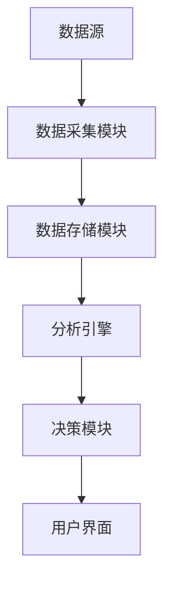

                 


# 《迈克尔·伯里的反向投资策略：逆势而为》

---

## 关键词：
- 逆向投资
- 反向策略
- 投资策略
- 市场分析
- 投资决策

---

## 摘要：
本文深入探讨了迈克尔·伯里的反向投资策略，分析其核心理念、数学模型、系统架构和实战案例。通过逆向思维，投资者在市场低谷时布局，高点时退出，实现超额收益。结合算法和系统设计，本文为读者提供了一套完整的反向投资解决方案。

---

## 第一部分：逆向投资的背景与核心概念

### 第1章：逆向投资的背景与定义

#### 1.1 逆向投资的定义与核心理念
逆向投资是一种反向市场趋势的投资策略，强调在市场低谷时买入，在市场高点时卖出。其核心理念是“别人恐惧我贪婪，别人贪婪我恐惧”。

#### 1.2 逆向投资的起源与发展
逆向投资起源于20世纪中期，随着市场波动的加剧，逐渐发展成为一种成熟的策略。本文将介绍其历史演变和理论基础。

#### 1.3 逆向投资与传统投资的对比
| 投资策略 | 传统投资 | 逆向投资 |
|----------|-----------|----------|
| 定价基准 | 市场价格 | 内在价值 |
| 投资时机 | 市场高点 | 市场低谷 |
| 风险控制 | 风险中性 | 风险偏好 |

### 第2章：迈克尔·伯里的反向投资策略

#### 2.1 策略体系
- **市场周期分析**：识别市场周期的四个阶段：繁荣、衰退、复苏、成熟。
- **逆向思维决策**：在市场恐慌时寻找机会，避免追涨杀跌。

#### 2.2 核心观点
- 市场情绪分析：通过情绪指标（VIX指数）判断市场走势。
- 价值发现：寻找被市场低估的资产。

---

## 第二部分：逆向投资的算法与数学模型

### 第3章：逆向投资的算法原理

#### 3.1 市场情绪分析算法
```python
def market_emotion(trend, volatility):
    if trend > 0 and volatility < 20:
        return "乐观"
    elif trend < 0 and volatility > 80:
        return "悲观"
    else:
        return "中性"
```

#### 3.2 趋势预测模型
使用时间序列分析：
$$
ARIMA模型：y_t = \alpha + \beta y_{t-1} + \epsilon_t
$$

#### 3.3 市场反转点识别
通过均值回归模型识别反转点：
$$
\text{反转点} = \frac{\text{当前价格} - \text{历史平均价格}}{\text{标准差}}
$$

### 第4章：数学模型与公式

#### 4.1 价值评估模型
使用市盈率（P/E）和市净率（P/B）评估资产价值：
$$
\text{内在价值} = \frac{\text{现金流}}{\text{折现率}}
$$

#### 4.2 风险评估模型
计算夏普比率：
$$
\text{夏普比率} = \frac{\text{超额收益}}{\text{收益标准差}}
$$

---

## 第三部分：系统设计与架构

### 第5章：系统设计

#### 5.1 问题场景
- **市场波动**：识别市场周期波动。
- **投资者情绪**：分析投资者情绪指标。

#### 5.2 系统功能设计
- **数据采集**：收集市场数据。
- **分析引擎**：运行算法模型。
- **决策支持**：提供投资建议。

#### 5.3 系统架构图


### 第6章：系统实现

#### 6.1 环境安装
- Python 3.8+
- 数据库：MySQL或PostgreSQL
- 开发工具：Jupyter Notebook或PyCharm

#### 6.2 核心代码实现
```python
import pandas as pd
from sklearn.model_selection import train_test_split
from sklearn.linear_model import LinearRegression

# 数据预处理
data = pd.read_csv('market_data.csv')
X = data[['volatility', 'trend']]
y = data['price']

# 划分训练集和测试集
X_train, X_test, y_train, y_test = train_test_split(X, y, test_size=0.2)

# 训练模型
model = LinearRegression()
model.fit(X_train, y_train)

# 预测和评估
y_pred = model.predict(X_test)
print('预测值:', y_pred)
print('实际值:', y_test)
```

---

## 第四部分：项目实战与案例分析

### 第7章：项目实战

#### 7.1 实战环境
- 数据源： historical market data
- 工具：Python, Pandas, Scikit-learn

#### 7.2 核心代码解读
```python
# 计算市场情绪指数
def calculate_market_sentiment(data):
    volatility = data['volatility'].std()
    trend = data['price'].pct_change().mean()
    return (volatility, trend)

# 应用到实际数据
data = pd.read_csv('market_data.csv')
volatility, trend = calculate_market_sentiment(data)
print(f"市场波动率：{volatility}\n市场趋势：{trend}")
```

#### 7.3 实际案例分析
分析2020年新冠疫情对市场的冲击，应用逆向投资策略，买入被低估的资产。

---

## 第五部分：总结与展望

### 第8章：总结与最佳实践

#### 8.1 总结
- 逆向投资的核心在于识别市场周期和价值低估。
- 结合算法和系统设计，提升投资决策的科学性。

#### 8.2 小结
- 逆向投资需要耐心和纪律。
- 定期复盘和调整策略。

#### 8.3 注意事项
- 风险控制是投资成功的关键。
- 避免情绪化决策。

#### 8.4 拓展阅读
- 建议阅读迈克尔·伯里的专著，深入学习其投资理念。

---

## 作者：
**AI天才研究院/AI Genius Institute**  
**禅与计算机程序设计艺术 /Zen And The Art of Computer Programming**

