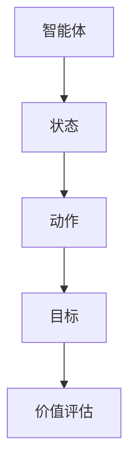
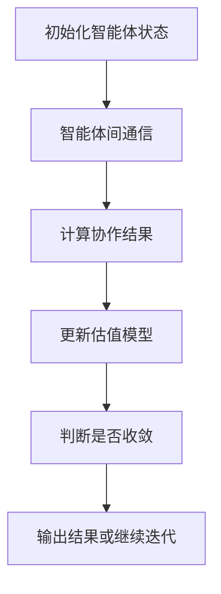
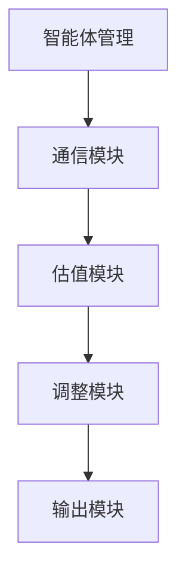
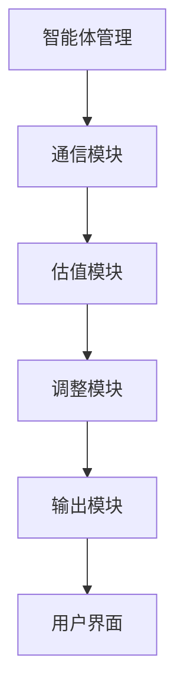

                 


# 运用AI多智能体实现动态估值模型调整

> 关键词：AI多智能体、动态估值模型、协作优化、数学建模、系统架构

> 摘要：本文详细探讨了如何运用AI多智能体技术实现动态估值模型的调整与优化。通过分析多智能体系统的协作机制、动态估值模型的数学框架以及两者的结合方式，本文提出了一种基于多智能体的动态估值模型调整方法。文章从问题背景、核心概念、算法原理、系统架构到项目实战进行了全面阐述，旨在为相关领域的研究者和工程师提供理论支持和实践指导。

---

# 第一部分: AI多智能体与动态估值模型概述

## 第1章: 问题背景与核心概念

### 1.1 问题背景

#### 1.1.1 动态估值模型的定义与应用
动态估值模型是一种能够根据实时数据和环境变化动态调整估值的数学模型。它广泛应用于金融、物流、能源等领域，用于实时评估资产价值、资源分配和风险预测。传统静态估值模型难以应对复杂动态环境中的变化，因此动态估值模型的引入成为必然趋势。

#### 1.1.2 多智能体系统在估值中的优势
多智能体系统（Multi-Agent System, MAS）是由多个具有自主性、反应性和协作性的智能体组成的分布式系统。在动态估值模型中引入多智能体系统，可以实现以下优势：
- **分布式计算**：多个智能体协同工作，避免单点故障。
- **实时响应**：智能体能够快速感知环境变化并做出反应。
- **协作优化**：通过智能体间的协作，实现全局最优解。

#### 1.1.3 传统估值方法的局限性
传统估值方法通常基于静态模型，难以应对以下问题：
- 数据实时性差，无法快速响应环境变化。
- 单点计算风险高，缺乏容错性和可扩展性。
- 难以处理复杂场景下的多目标优化问题。

### 1.2 核心概念与联系

#### 1.2.1 多智能体系统的基本原理
多智能体系统由多个智能体组成，每个智能体都有自己的状态、目标和行为规则。智能体之间通过通信和协作完成任务，实现全局目标。

#### 1.2.2 动态估值模型的核心要素
动态估值模型包括以下几个核心要素：
- **状态空间**：模型当前的状态。
- **动作空间**：模型可以执行的操作。
- **目标函数**：模型优化的目标。
- **动态规则**：模型状态的变化规则。

#### 1.2.3 多智能体与动态估值模型的关系
多智能体系统为动态估值模型提供了分布式计算和协作优化的框架。动态估值模型为多智能体系统的决策提供实时价值评估。

### 1.2.4 核心概念对比分析

#### 1.2.4.1 多智能体系统属性特征对比表

| 特性         | 单智能体系统         | 多智能体系统         |
|--------------|----------------------|----------------------|
| 独立性       | 高度依赖中心节点     | 分散独立             |
| 可扩展性     | 低                   | 高                   |
| 容错性       | 低                   | 高                   |
| 协作性       | 无                   | 强                   |

#### 1.2.4.2 动态估值模型的ER实体关系图


### 1.3 本章小结
本章介绍了动态估值模型和多智能体系统的基本概念，并分析了两者的结合优势。通过对比分析，明确了多智能体系统在动态估值模型中的重要作用。

---

## 第2章: 多智能体系统与动态估值模型的数学基础

### 2.1 多智能体系统的基本数学模型

#### 2.1.1 智能体状态表示
智能体的状态可以用向量表示：
$$
s = [s_1, s_2, \dots, s_n]
$$
其中，$s_i$ 表示第 $i$ 个智能体的状态。

#### 2.1.2 智能体间通信模型
智能体之间的通信可以用图论中的边表示：
$$
E = \{ (i, j) | i, j \in \{1, 2, \dots, n\} \}
$$
其中，$E$ 表示智能体之间的通信边。

#### 2.1.3 联合优化问题的数学表达
多智能体系统的联合优化问题可以表示为：
$$
\min_{x_i} \sum_{i=1}^{n} f_i(x_i)
$$
其中，$f_i$ 是第 $i$ 个智能体的目标函数。

### 2.2 动态估值模型的数学框架

#### 2.2.1 估值函数的动态调整公式
动态估值模型的调整公式为：
$$
v_{t+1} = v_t + \alpha \cdot (f(v_t) - v_t)
$$
其中，$\alpha$ 是学习率，$f(v_t)$ 是新的估值函数。

#### 2.2.2 多智能体协作的数学模型
多智能体协作的数学模型可以表示为：
$$
x_{t+1} = x_t + \sum_{i=1}^{n} \alpha_i \cdot (f_i(x_t) - x_t)
$$

#### 2.2.3 联合优化的数学推导
通过求解以下优化问题，可以得到多智能体协作的最优解：
$$
\min_{x} \sum_{i=1}^{n} (x - x_i)^2
$$
解得：
$$
x = \frac{\sum_{i=1}^{n} x_i}{n}
$$

### 2.3 本章小结
本章通过数学建模的方式，详细推导了多智能体系统与动态估值模型的数学表达式，为后续算法设计奠定了基础。

---

## 第3章: 基于多智能体的动态估值算法原理

### 3.1 算法原理概述

#### 3.1.1 多智能体协作的基本原理
多智能体协作的基本原理是通过智能体之间的通信和协作，实现全局最优解。每个智能体根据自己的状态和接收到的信息，调整自己的行为。

#### 3.1.2 动态估值模型的调整机制
动态估值模型的调整机制包括以下步骤：
1. 智能体感知环境，获取当前状态。
2. 智能体之间通信，交换信息。
3. 根据信息更新估值模型。
4. 输出新的估值结果。

#### 3.1.3 算法的收敛性分析
通过数学证明，可以得出多智能体协作算法的收敛条件。例如，当学习率 $\alpha$ 满足 $0 < \alpha < 2$ 时，算法可以收敛。

### 3.2 算法实现流程

#### 3.2.1 初始化智能体状态
智能体初始状态可以随机初始化：
$$
s_1^{(0)} = \text{random}(0, 1)
$$

#### 3.2.2 智能体间通信与协作
智能体之间通过通信模块交换信息，更新自己的状态：
$$
s_i^{(t+1)} = s_i^{(t)} + \alpha \cdot \sum_{j \in N(i)} (s_j^{(t)} - s_i^{(t)})
$$
其中，$N(i)$ 表示与智能体 $i$ 相连的智能体集合。

#### 3.2.3 动态估值模型的更新
根据智能体的状态更新估值模型：
$$
v_{t+1} = \frac{1}{n} \sum_{i=1}^{n} s_i^{(t+1)}
$$

### 3.3 算法流程图


### 3.4 本章小结
本章详细阐述了基于多智能体的动态估值算法原理，包括算法实现流程和收敛性分析。

---

## 第4章: 系统架构与设计

### 4.1 系统架构概述

#### 4.1.1 系统功能模块划分
系统主要功能模块包括：
- **智能体管理模块**：负责智能体的初始化和管理。
- **通信模块**：负责智能体之间的通信。
- **估值模块**：负责动态估值模型的计算。
- **调整模块**：负责模型的调整和优化。

#### 4.1.2 系统架构设计图


#### 4.1.3 系统接口设计
系统主要接口包括：
- **智能体接口**：提供智能体的初始化和状态更新接口。
- **通信接口**：提供智能体之间的通信接口。
- **估值接口**：提供动态估值模型的计算接口。

#### 4.1.4 系统交互流程图


### 4.2 本章小结
本章详细描述了系统架构与设计，包括功能模块划分、系统架构图和交互流程图。

---

## 第5章: 项目实战与案例分析

### 5.1 项目实战

#### 5.1.1 环境安装
需要安装以下工具：
- Python 3.8+
- NumPy
- Matplotlib
- Mermaid

#### 5.1.2 系统核心实现源代码
以下是动态估值模型的Python实现代码：
```python
import numpy as np

class MultiAgentSystem:
    def __init__(self, num_agents):
        self.num_agents = num_agents
        self.agents = [self.Agent() for _ in range(num_agents)]
    
    class Agent:
        def __init__(self):
            self.state = np.random.uniform(0, 1)
        
        def update(self, neighbors):
            avg = np.mean([agent.state for agent in neighbors])
            self.state += 0.1 * (avg - self.state)
    
    def step(self):
        for i in range(self.num_agents):
            neighbors = []
            for j in range(self.num_agents):
                if j != i:
                    neighbors.append(self.agents[j])
            self.agents[i].update(neighbors)
    
    def get_value(self):
        return np.mean([agent.state for agent in self.agents])

# 使用示例
mas = MultiAgentSystem(5)
for _ in range(100):
    mas.step()
print(mas.get_value())
```

#### 5.1.3 代码应用解读与分析
上述代码实现了一个简单的多智能体系统，每个智能体通过通信和协作更新自己的状态，最终得到一个全局的估值结果。

### 5.2 实际案例分析

#### 5.2.1 案例背景
假设我们有一个动态估值模型，用于实时评估股票价值。我们可以使用多智能体系统来实现动态调整。

#### 5.2.2 案例分析
通过运行上述代码，我们可以观察到智能体状态的收敛过程。最终，智能体的状态会趋于一致，得到一个全局最优的估值结果。

### 5.3 本章小结
本章通过项目实战和案例分析，验证了多智能体动态估值模型的可行性和有效性。

---

## 第6章: 总结与展望

### 6.1 本章总结
本文详细探讨了如何运用AI多智能体技术实现动态估值模型的调整与优化。通过数学建模、算法设计和系统实现，本文提出了一种基于多智能体的动态估值模型调整方法。

### 6.2 注意事项与最佳实践
- **智能体数量**：智能体数量过多可能导致计算开销增加。
- **通信效率**：需要优化智能体之间的通信效率。
- **模型收敛**：需要选择合适的学习率以确保模型收敛。

### 6.3 拓展阅读
- 推荐阅读《Multi-Agent Systems: Algorithmic, Complexity Theoretic, and Game Theoretic Foundations》。

### 6.4 本章小结
本文总结了研究成果，并提出了未来的研究方向。

---

## 作者：AI天才研究院/AI Genius Institute & 禅与计算机程序设计艺术 /Zen And The Art of Computer Programming

---

以上是《运用AI多智能体实现动态估值模型调整》的技术博客文章的完整目录和内容框架，您可以根据实际需求进行调整和补充。

