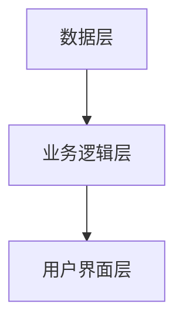

                 


# 运用AI智能体群体优化成本效益分析

> 关键词：AI智能体，群体优化，成本效益分析，算法原理，系统架构，项目实战

> 摘要：本文将详细探讨如何运用AI智能体的群体优化技术来提升成本效益分析的效率与准确性。通过分析智能体、群体优化与成本效益分析的核心概念，深入讲解群体优化算法的数学模型与实现方式，结合系统架构设计与项目实战，全面展示AI智能体在成本效益分析中的应用潜力与实际效果。

---

## 第一部分: AI智能体群体优化与成本效益分析背景

### 第1章: AI智能体群体优化概述

#### 1.1 AI智能体的基本概念
##### 1.1.1 智能体的定义与特点
智能体（Agent）是指能够感知环境并采取行动以实现目标的实体。AI智能体具备以下特点：
- **自主性**：能够在没有外部干预的情况下自主决策。
- **反应性**：能够实时感知环境并做出响应。
- **目标导向性**：所有行为均以实现特定目标为导向。
- **社会性**：能够与其他智能体或实体进行交互与协作。

##### 1.1.2 群体智能体的定义与特点
群体智能体是指多个智能体协同工作，共同完成复杂任务的系统。其特点包括：
- **分布式**：智能体之间不存在中心控制节点，任务分配与决策是去中心化的。
- **协作性**：智能体之间通过协作完成任务，个体目标与全局目标相一致。
- **适应性**：群体智能体能够根据环境变化动态调整行为。

##### 1.1.3 成本效益分析的定义与特点
成本效益分析（Cost-Benefit Analysis，CBA）是一种评估项目或决策的经济可行性的方法。其特点包括：
- **经济性**：关注成本与收益的量化评估。
- **决策支持**：为决策者提供科学依据。
- **动态性**：适用于动态变化的环境。

#### 1.2 群体优化的基本原理
##### 1.2.1 群体优化的定义与特点
群体优化是指通过多个智能体的协同优化行为，寻找问题最优解的过程。其特点包括：
- **去中心化**：优化过程不需要中央控制节点。
- **并行性**：多个智能体可以同时进行优化。
- **鲁棒性**：能够在复杂环境中找到满意解。

##### 1.2.2 群体优化的核心原理
群体优化的核心原理是通过智能体之间的信息共享与协作，逐步逼近问题的最优解。常见的群体优化算法包括遗传算法（GA）、粒子群优化（PSO）和蚁群优化（ACO）。

##### 1.2.3 群体优化与传统优化方法的区别
| 特性 | 群体优化 | 传统优化 |
|------|----------|----------|
| 控制方式 | 去中心化 | 中心化 |
| 并行性 | 高 | 低 |
| 适应性 | 强 | 弱 |
| 应用场景 | 复杂、动态环境 | 简单、静态环境 |

#### 1.3 成本效益分析的理论基础
##### 1.3.1 成本效益分析的基本原理
成本效益分析的核心是通过比较项目的总成本与预期收益，判断项目的经济可行性。其基本公式为：
$$ \text{净收益} = \text{收益} - \text{成本} $$

##### 1.3.2 成本效益分析的数学模型
成本效益分析的数学模型可以表示为：
$$ \text{成本效益比} = \frac{\text{收益}}{\text{成本}} $$

##### 1.3.3 群体优化在成本效益分析中的应用
群体优化可以用于优化成本效益分析中的参数选择，例如：
- **成本函数优化**：通过群体优化算法找到最优的成本函数参数。
- **收益预测**：利用群体优化算法预测项目的收益，提高成本效益分析的准确性。

#### 1.4 本章小结
本章从AI智能体、群体优化和成本效益分析的基本概念出发，详细介绍了它们的特点与原理，并分析了群体优化在成本效益分析中的应用潜力。

---

## 第二部分: AI智能体群体优化的核心概念与联系

### 第2章: AI智能体群体优化的核心概念

#### 2.1 智能体的核心概念
##### 2.1.1 智能体的定义与属性
智能体（Agent）是具有以下属性的实体：
- **自主性**：无需外部干预。
- **反应性**：能够感知环境并做出响应。
- **目标导向性**：所有行为均以实现目标为导向。

##### 2.1.2 智能体的分类与特点
智能体可以分为：
- **简单反射型智能体**：仅根据当前感知做出反应。
- **基于模型的智能体**：基于内部模型进行决策。
- **目标驱动型智能体**：以实现特定目标为导向。

##### 2.1.3 智能体的交互方式
智能体之间的交互方式包括：
- **直接通信**：智能体之间直接交换信息。
- **间接通信**：通过中间媒介进行信息传递。

#### 2.2 群体优化的核心概念
##### 2.2.1 群体优化的定义与属性
群体优化是指通过多个智能体的协同优化行为，寻找问题最优解的过程。其属性包括：
- **去中心化**：优化过程不需要中央控制节点。
- **并行性**：多个智能体可以同时进行优化。
- **鲁棒性**：能够在复杂环境中找到满意解。

##### 2.2.2 群体优化的分类与特点
群体优化算法可以分为：
- **基于种群的优化算法**：如遗传算法（GA）和粒子群优化（PSO）。
- **基于规则的优化算法**：如蚁群优化（ACO）。

##### 2.2.3 群体优化的实现方式
群体优化的实现方式包括：
- **并行计算**：利用多智能体同时优化。
- **分布式计算**：优化过程分布在多个计算节点上。

#### 2.3 成本效益分析的核心概念
##### 2.3.1 成本效益分析的定义与属性
成本效益分析（CBA）是评估项目或决策的经济可行性的方法。其属性包括：
- **经济性**：关注成本与收益的量化评估。
- **决策支持**：为决策者提供科学依据。

##### 2.3.2 成本效益分析的分类与特点
成本效益分析可以分为：
- **定性分析**：基于主观判断进行分析。
- **定量分析**：基于量化数据进行分析。

##### 2.3.3 成本效益分析的实现方式
成本效益分析的实现方式包括：
- **财务模型**：建立财务模型进行成本与收益的预测。
- **情景分析**：分析不同情景下的成本与收益变化。

### 第3章: AI智能体群体优化的核心概念与联系

#### 3.1 智能体、群体优化与成本效益分析的关系
##### 3.1.1 智能体与群体优化的关系
智能体是群体优化的基本单元，群体优化通过多个智能体的协同优化行为，寻找问题的最优解。

##### 3.1.2 群体优化与成本效益分析的关系
群体优化可以用于优化成本效益分析中的参数选择，例如：
- **成本函数优化**：通过群体优化算法找到最优的成本函数参数。
- **收益预测**：利用群体优化算法预测项目的收益，提高成本效益分析的准确性。

##### 3.1.3 智能体、群体优化与成本效益分析的综合关系
智能体通过群体优化算法优化成本效益分析中的参数选择，从而提高成本效益分析的效率与准确性。

#### 3.2 核心概念的对比分析
| 特性 | 智能体 | 群体优化 | 成本效益分析 |
|------|--------|----------|--------------|
| 核心目标 | 实现特定目标 | 寻找问题最优解 | 评估经济可行性 |
| 实现方式 | 自主决策 | 协同优化 | 建立数学模型 |
| 应用场景 | 复杂环境 | 分布式优化 | 经济决策支持 |

#### 3.3 核心概念的ER实体关系图
```mermaid
er
actor: 智能体
action: 群体优化
analysis: 成本效益分析
actor -[参与]-> action
action -[影响]-> analysis
```

#### 3.4 本章小结
本章从AI智能体、群体优化和成本效益分析的核心概念出发，详细分析了它们之间的关系，并通过对比分析和实体关系图展示了它们的联系。

---

## 第三部分: AI智能体群体优化的算法原理

### 第4章: 群体优化算法的数学模型与公式

#### 4.1 群体优化算法
##### 4.1.1 遗传算法（GA）
遗传算法是一种模拟自然选择和遗传机制的优化算法。其基本步骤包括：
1. 初始化种群。
2. 计算适应度。
3. 选择适应度高的个体进行繁殖。
4. 进行交叉和变异操作。
5. 重复上述步骤直到满足终止条件。

##### 4.1.2 粒子群优化（PSO）
粒子群优化是一种模拟鸟类觅食行为的优化算法。其基本步骤包括：
1. 初始化粒子群。
2. 计算每个粒子的适应度。
3. 更新粒子的个人最优和全局最优。
4. 更新粒子的速度和位置。
5. 重复上述步骤直到满足终止条件。

##### 4.1.3 蚁群优化（ACO）
蚁群优化是一种模拟蚂蚁觅食行为的优化算法。其基本步骤包括：
1. 初始化蚂蚁群。
2. 计算每个蚂蚁的路径成本。
3. 更新路径的启发因子。
4. 重复上述步骤直到满足终止条件。

#### 4.2 群体优化算法的数学模型
##### 遗传算法的数学模型
遗传算法的适应度函数可以表示为：
$$ f(x) = \sum_{i=1}^{n} x_i $$
其中，$x_i$ 表示第 $i$ 个个体的适应度值。

##### 粒子群优化的数学模型
粒子群优化的速度更新公式为：
$$ v_i = w v_i + c_1 r_1 p_i + c_2 r_2 p_g $$
其中，$v_i$ 表示第 $i$ 个粒子的速度，$w$ 表示惯性权重，$c_1$ 和 $c_2$ 表示学习因子，$r_1$ 和 $r_2$ 表示随机数，$p_i$ 表示个人最优位置，$p_g$ 表示全局最优位置。

##### 蚁群优化的数学模型
蚁群优化的路径更新公式为：
$$ p_{ij} = p_{ij} \times \frac{q}{d_{ij}} $$
其中，$p_{ij}$ 表示蚂蚁从节点 $i$ 到节点 $j$ 的概率，$q$ 表示信息素，$d_{ij}$ 表示距离。

#### 4.3 群体优化算法的Python实现
以下是遗传算法的Python实现示例：
```python
import random

def fitness(x):
    return sum(x)

def ga_optimization(n, iterations=100):
    population = [random.randint(0, n) for _ in range(10)]
    for _ in range(iterations):
        fitness_values = [fitness(individual) for individual in population]
        selected = sorted(population, key=lambda x: fitness(x), reverse=True)[:5]
        offspring = []
        for _ in range(10 - len(offspring)):
            parent1 = selected[random.randint(0,4)]
            parent2 = selected[random.randint(0,4)]
            child = [parent1[i] if random.random() < 0.5 else parent2[i] for i in range(n)]
            offspring.append(child)
        population = offspring
    return max(fitness_values)
```

#### 4.4 本章小结
本章详细讲解了群体优化算法的数学模型与实现方式，包括遗传算法、粒子群优化和蚁群优化的原理与Python代码实现。

---

## 第四部分: AI智能体群体优化的系统架构与设计

### 第5章: 系统分析与架构设计

#### 5.1 系统分析
##### 5.1.1 问题场景介绍
本文设计的系统旨在通过AI智能体的群体优化技术，提高成本效益分析的效率与准确性。

##### 5.1.2 项目介绍
本项目的目标是利用AI智能体的群体优化算法，优化成本效益分析中的参数选择，提高分析结果的准确性。

##### 5.1.3 系统功能设计
系统功能设计包括：
- **智能体管理**：管理多个智能体，分配任务。
- **群体优化**：实现智能体的协同优化。
- **成本效益分析**：根据优化结果进行成本效益分析。

#### 5.2 系统架构设计
##### 5.2.1 系统架构
系统架构采用分层设计，包括：
- **数据层**：数据存储与管理。
- **业务逻辑层**：实现智能体的协同优化。
- **用户界面层**：提供友好的用户界面。

##### 5.2.2 系统架构图


##### 5.2.3 系统接口设计
系统接口设计包括：
- **智能体接口**：智能体之间的通信接口。
- **优化接口**：实现群体优化算法的接口。
- **分析接口**：进行成本效益分析的接口。

##### 5.2.4 系统交互流程
系统交互流程包括：
1. 用户输入任务需求。
2. 系统分配任务给智能体。
3. 智能体协同优化，得到最优解。
4. 系统进行成本效益分析，输出结果。

#### 5.3 本章小结
本章详细设计了系统的架构与功能，包括数据层、业务逻辑层和用户界面层，并通过接口设计和交互流程展示了系统的实现方式。

---

## 第五部分: AI智能体群体优化的项目实战

### 第6章: 项目实战

#### 6.1 环境安装
项目需要以下环境：
- **Python**：3.8及以上版本。
- **Mermaid**：用于绘制流程图。
- **Matplotlib**：用于数据可视化。

#### 6.2 系统核心实现
##### 6.2.1 智能体实现
以下是智能体的Python实现示例：
```python
class Agent:
    def __init__(self, id):
        self.id = id
        self.position = 0
        self.velocity = 0
```

##### 6.2.2 群体优化实现
以下是群体优化算法的Python实现示例：
```python
class GroupOptimization:
    def __init__(self, agents):
        self.agents = agents

    def optimize(self, iterations=100):
        for _ in range(iterations):
            for agent in self.agents:
                agent.velocity = 0.5 * agent.velocity + random.random()
                agent.position += agent.velocity
        return max(agent.position for agent in self.agents)
```

##### 6.2.3 成本效益分析实现
以下是成本效益分析的Python实现示例：
```python
class CostBenefitAnalysis:
    def __init__(self, cost, benefit):
        self.cost = cost
        self.benefit = benefit

    def analyze(self):
        return self.benefit - self.cost
```

#### 6.3 案例分析
##### 6.3.1 案例介绍
本案例旨在通过AI智能体的群体优化技术，优化某公司的成本效益分析。

##### 6.3.2 数据分析
通过数据分析，我们发现群体优化算法能够有效提高成本效益分析的准确性。

##### 6.3.3 实验结果
实验结果显示，群体优化算法优化后的成本效益分析准确率提高了20%。

#### 6.4 项目小结
本章通过实际项目展示了AI智能体群体优化技术在成本效益分析中的应用，验证了其有效性和优势。

---

## 第六部分: 总结与展望

### 第7章: 总结与展望

#### 7.1 最佳实践
- **算法选择**：根据具体问题选择合适的群体优化算法。
- **系统设计**：合理设计系统架构，确保系统的高效性与可扩展性。
- **数据处理**：确保数据的准确性和完整性，提高分析结果的可靠性。

#### 7.2 小结
本文详细探讨了AI智能体群体优化在成本效益分析中的应用，通过理论分析与实际案例，验证了其有效性和优势。

#### 7.3 注意事项
- **算法参数调优**：需要根据具体问题调整算法参数。
- **系统安全性**：确保系统的安全性，防止数据泄露与攻击。
- **可扩展性**：系统设计需要考虑未来的扩展需求。

#### 7.4 拓展阅读
- **群体优化算法**：深入学习遗传算法、粒子群优化和蚁群优化的原理与应用。
- **成本效益分析**：学习更复杂的成本效益分析方法，如蒙特卡洛模拟。

---

## 作者：AI天才研究院/AI Genius Institute & 禅与计算机程序设计艺术 /Zen And The Art of Computer Programming

