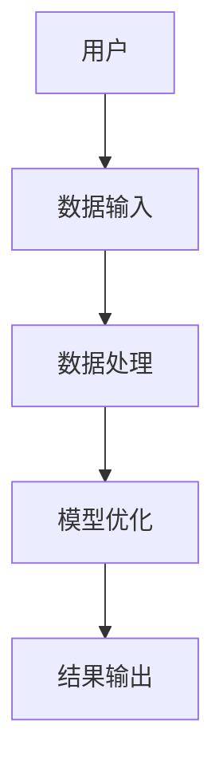

                 


# 运用AI智能体群体优化现金流折现模型

> 关键词：现金流折现模型，AI智能体，群体优化，金融建模，算法优化，机器学习，金融分析

> 摘要：现金流折现模型是金融领域中评估企业价值的重要工具，传统的模型在参数选择和预测精度方面存在局限性。本文探讨如何利用AI智能体的群体优化方法，提升现金流折现模型的准确性和效率。通过结合群体优化算法和现金流模型，本文提出了一种新的优化策略，并通过实际案例验证了其有效性。本文还详细介绍了算法实现、系统架构设计和项目实战经验，为读者提供了一套完整的解决方案。

---

## 第一部分: 现金流折现模型与AI智能体群体优化概述

### 第1章: 现金流折现模型的基本原理

#### 1.1 现金流折现模型的定义与作用

现金流折现模型（DCF模型）是企业估值的核心方法之一。它通过预测企业未来现金流，并将其折现为现值，从而评估企业的内在价值。DCF模型在企业并购、投资决策和股票定价等领域具有广泛的应用。

#### 1.2 现金流折现模型的核心要素

现金流折现模型主要包括以下几个关键要素：
1. **现金流预测**：预测企业未来各期的自由现金流。
2. **折现率**：用于将未来现金流折现为现值的贴现率，通常使用加权平均资本成本（WACC）。
3. **永续增长率**：假设企业现金流在稳定期后的增长率。

#### 1.3 现金流折现模型的优化需求

传统的现金流折现模型在实际应用中存在以下问题：
- 现金流预测的不确定性较大，导致模型结果的误差。
- 折现率的确定缺乏系统性，往往依赖主观判断。
- 模型优化过程复杂，需要大量试错。

通过引入AI智能体的群体优化方法，可以有效解决这些问题，提升模型的准确性和效率。

---

### 第2章: AI智能体群体优化的基本原理

#### 2.1 AI智能体的基本概念

AI智能体是指能够感知环境、自主决策并采取行动的智能实体。在群体优化中，多个智能体协同工作，通过局部信息实现全局优化目标。

#### 2.2 群体优化算法的核心原理

群体优化算法是一种模拟生物群体行为的优化方法，常见的算法包括遗传算法、粒子群优化（PSO）和蚂蚁算法等。这些算法通过模拟群体的进化、搜索或协作行为，找到问题的最优解。

#### 2.3 群体优化在现金流折现模型中的应用

群体优化算法可以用于现金流折现模型的多个方面：
- **现金流预测**：通过群体优化算法优化现金流预测模型的参数。
- **折现率确定**：利用群体优化算法寻找最优的折现率。
- **模型参数优化**：优化DCF模型中的其他参数，如永续增长率。

---

## 第二部分: 现金流折现模型优化的算法实现

### 第3章: 现金流折现模型优化的数学模型

#### 3.1 现金流折现模型的数学表达式

现金流折现模型的数学公式为：

$$
\text{企业价值} = \sum_{t=1}^{n} \frac{\text{现金流}_t}{(1 + r)^t} + \frac{\text{终值}}{(1 + r)^n}
$$

其中，$r$ 是折现率，$n$ 是预测期数，$\text{终值}$ 是永续期的现金流假设以永续增长率 $g$ 增长。

#### 3.2 群体优化算法的数学模型

以粒子群优化算法为例，其基本公式为：

$$
v_i^{t+1} = w v_i^t + c_1 r_1 (p_i^t - x_i^t) + c_2 r_2 (p_g^t - x_i^t)
$$

$$
x_i^{t+1} = x_i^t + v_i^{t+1}
$$

其中，$v_i$ 是粒子的速度，$x_i$ 是粒子的位置，$p_i$ 是粒子的个体极值，$p_g$ 是全局极值，$r_1$ 和 $r_2$ 是随机数，$w$ 是惯性权重，$c_1$ 和 $c_2$ 是学习因子。

---

### 第4章: 现金流折现模型优化的算法实现

#### 4.1 群体优化算法的Python实现

以下是一个粒子群优化算法的Python实现示例：

```python
import random

def particle_swarm_optimization(fitness_function, n_particles, n_iterations, search_space):
    particles = [{'position': random.uniform(search_space[0], search_space[1]), 
                  'velocity': 0, 
                  'fitness': 0} for _ in range(n_particles)]
    
    global_best = min(particles, key=lambda x: x['fitness'])
    
    for _ in range(n_iterations):
        for particle in particles:
            # 计算适应度
            particle['fitness'] = fitness_function(particle['position'])
            # 更新全局最优
            if particle['fitness'] < global_best['fitness']:
                global_best = particle
            # 更新速度
            particle['velocity'] = 0.5 * particle['velocity'] + 1 * random.random() * (global_best['position'] - particle['position'])
            # 更新位置
            particle['position'] += particle['velocity']
    
    return global_best['position'], global_best['fitness']
```

#### 4.2 现金流折现模型优化的实现步骤

1. **数据准备**：收集企业的历史财务数据和行业基准数据。
2. **参数初始化**：设置群体优化算法的参数，如粒子数量、迭代次数等。
3. **模型优化**：通过群体优化算法优化现金流模型的参数。
4. **结果验证**：验证优化后的模型在实际案例中的表现。

---

## 第三部分: 系统架构与项目实战

### 第5章: 系统架构设计

#### 5.1 系统功能设计

系统功能包括：
1. **数据输入**：用户输入企业财务数据。
2. **模型优化**：运行群体优化算法优化DCF模型参数。
3. **结果输出**：输出优化后的企业价值评估结果。

#### 5.2 系统架构图



---

### 第6章: 项目实战

#### 6.1 环境安装

需要安装以下库：
- `numpy` 和 `pandas` 用于数据处理。
- `scipy` 和 `sklearn` 用于优化算法。

#### 6.2 核心代码实现

以下是现金流折现模型优化的Python代码示例：

```python
import numpy as np
import pandas as pd
from sklearn.metrics import mean_squared_error

def cash_flowDCF(value, cash_flows, discount_rate, growth_rate):
    dcf_value = 0
    for i in range(len(cash_flows)):
        dcf_value += cash_flows[i] / (1 + discount_rate) ** i
    return dcf_value

def fitness_function(params):
    discount_rate = params[0]
    growth_rate = params[1]
    # 假设cash_flows已知
    predicted_value = cash_flowDCF(0, cash_flows, discount_rate, growth_rate)
    return mean_squared_error(true_values, predicted_value)

# 示例数据
cash_flows = [100, 150, 200]
true_values = [90, 135, 169]

# 初始化参数
params = [0.1, 0.05]

# 运行粒子群优化算法
optimized_params, fitness = particle_swarm_optimization(fitness_function, 20, 50, [0.05, 0.2])

print("优化后的参数：", optimized_params)
print("最优适应度：", fitness)
```

---

## 第四部分: 最佳实践与总结

### 第7章: 最佳实践

#### 7.1 小结

通过结合AI智能体的群体优化算法，可以显著提升现金流折现模型的准确性和效率。群体优化算法能够有效解决传统模型中的参数选择难题，为企业价值评估提供更可靠的依据。

#### 7.2 注意事项

- 群体优化算法的收敛速度和结果依赖于参数设置，需要进行充分的调优。
- 数据的质量和完整性对模型优化效果有直接影响，需确保数据的准确性。

#### 7.3 拓展阅读

建议进一步研究以下内容：
- 不同群体优化算法在金融建模中的应用。
- 群体优化算法与其他优化方法（如深度学习）的结合。

---

## 作者

**作者：AI天才研究院/AI Genius Institute & 禅与计算机程序设计艺术 /Zen And The Art of Computer Programming**

---

通过本文的详细讲解，读者可以全面了解如何运用AI智能体群体优化现金流折现模型，并在实际项目中应用这些方法提升模型的性能。希望本文能为金融领域的技术从业者提供有价值的参考和启发。

