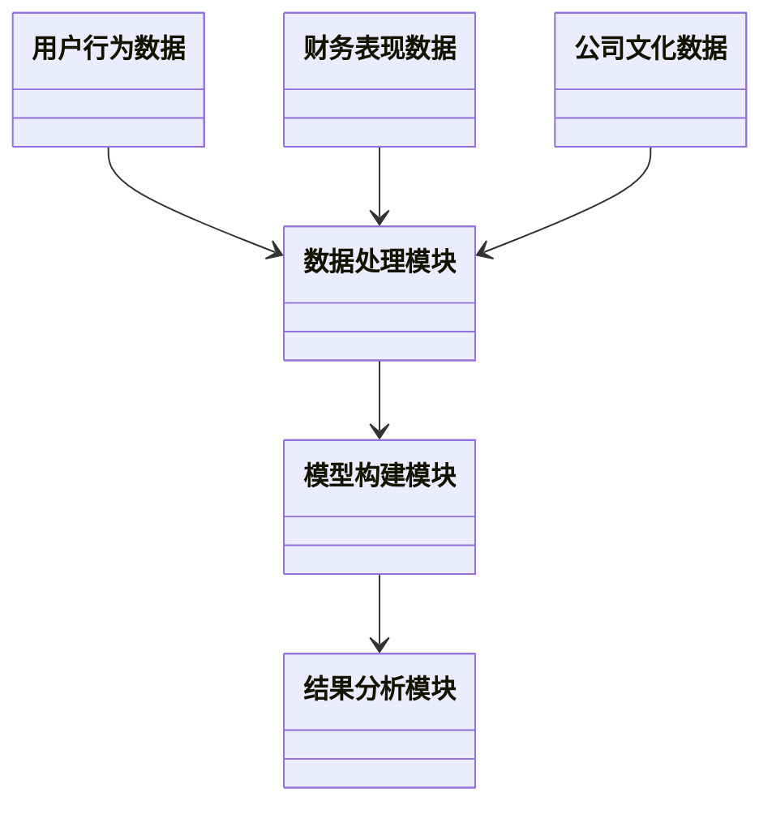

                 


# 《运用AI智能体群体分析公司文化与财务表现关联》

---

## 关键词：  
公司文化、财务表现、AI智能体、群体分析、关联性分析、协同过滤、聚类分析

---

## 摘要：  
本文探讨如何利用AI智能体群体分析的方法，深入研究公司文化与财务表现之间的关联性。通过AI智能体的感知与决策机制，结合协同过滤、聚类分析等算法，构建数学模型，量化公司文化对财务表现的影响。文章从背景介绍、核心概念、算法原理、系统设计、项目实战等多维度展开，结合实际案例分析，提供完整的解决方案，并总结最佳实践与注意事项，为公司文化与财务表现的关联性研究提供新的视角和方法。

---

## 正文

### 第一部分：背景介绍

#### 1.1 问题背景与问题描述

##### 1.1.1 公司文化与财务表现的核心概念  
- **公司文化**：指企业在经营活动中形成的价值观、行为准则和组织氛围，是企业的灵魂。  
- **财务表现**：指企业在财务方面的表现，包括收入、利润、成本、现金流等关键指标。  

##### 1.1.2 问题背景与问题描述  
- 当前企业经营中，公司文化与财务表现之间的关联性研究较少，但实际中两者密切相关。  
- 公司文化影响员工行为、决策效率和团队协作，进而影响财务表现。  
- 传统方法难以量化公司文化对财务表现的具体影响，而AI智能体群体分析提供了一种新的解决方案。  

##### 1.1.3 问题解决与边界外延  
- **问题解决**：通过AI智能体群体分析，量化公司文化对财务表现的具体影响。  
- **边界与外延**：仅限于公司内部文化与财务表现的关联性分析，不涉及外部市场因素。  

##### 1.1.4 概念结构与核心要素  
- **核心概念**：公司文化、财务表现、AI智能体群体分析。  
- **核心要素**：智能体感知能力、协同过滤算法、聚类分析算法。  

---

### 第二部分：AI智能体群体分析的核心原理

#### 2.1 AI智能体的基本原理

##### 2.1.1 智能体的定义与分类  
- **智能体**：具有感知环境、做出决策、执行动作能力的实体。  
- **分类**：  
  - **简单反射型智能体**：基于当前状态做出反应。  
  - **基于模型的反应型智能体**：基于内部模型做出决策。  
  - **目标驱动型智能体**：根据目标驱动行为。  

##### 2.1.2 群体智能的基本原理  
- **群体智能**：多个智能体通过协同完成复杂任务的能力。  
- **特点**：  
  - 分布式：智能体独立决策。  
  - 自适应：智能体能够根据环境变化调整行为。  
  - 高容错性：群体智能依赖个体协作，单个个体失效不影响整体。  

---

#### 2.2 AI智能体群体分析的核心算法

##### 2.2.1 协同过滤算法

###### 2.2.1.1 协同过滤的基本原理  
- **协同过滤**：通过分析用户行为相似性，推荐相似内容。  
- **基于用户的协同过滤**：寻找行为相似的用户，推荐其喜欢的内容。  
- **基于物品的协同过滤**：分析物品之间的相似性，推荐相关物品。  

###### 2.2.1.2 协同过滤的实现步骤  
1. 数据预处理：收集用户行为数据。  
2. 计算相似度：使用余弦相似度或欧氏距离计算用户或物品相似度。  
3. 推荐结果：根据相似度排序，推荐Top-N结果。  

###### 2.2.1.3 协同过滤的代码示例  
```python
import numpy as np

def cosine_similarity(matrix):
    # 计算余弦相似度
    numerator = np.dot(matrix, matrix.T)
    denominator = np.outer(np.linalg.norm(matrix, axis=1), np.linalg.norm(matrix, axis=1))
    return numerator / denominator

# 示例数据：用户-物品矩阵
users = 5
items = 3
matrix = np.random.randint(0, 5, (users, items))

similarity = cosine_similarity(matrix)
print("余弦相似度矩阵：\n", similarity)
```

---

##### 2.2.2 聚类分析算法

###### 2.2.2.1 聚类分析的基本原理  
- **聚类分析**：将数据划分为若干簇，簇内数据相似度高，簇间相似度低。  
- **K-means算法**：常用聚类算法，适用于数值型数据。  

###### 2.2.2.2 聚类分析的实现步骤  
1. 初始化：随机选择K个簇中心。  
2. 赋予每个数据点簇归属：计算数据点到各簇中心的距离，分配最近的簇。  
3. 更新簇中心：计算每个簇的重心，更新簇中心。  
4. 重复步骤2和3，直到簇中心不再变化或达到最大迭代次数。  

###### 2.2.2.3 聚类分析的代码示例  
```python
from sklearn.cluster import KMeans

# 示例数据：公司文化评分矩阵
X = np.random.rand(100, 5)  # 100家公司，5个文化维度

# K-means聚类
kmeans = KMeans(n_clusters=3, random_state=0)
kmeans.fit(X)
print("簇中心：\n", kmeans.cluster_centers_)
print("簇分配结果：\n", kmeans.labels_)
```

---

### 第三部分：公司文化与财务表现的关联性分析模型

#### 3.1 数学模型与公式

##### 3.1.1 关联性分析模型  
- **模型**：$$C = f(F, C)$$  
  其中，$C$表示公司文化，$F$表示财务表现。  
- **解释**：通过AI智能体群体分析，量化公司文化对财务表现的影响。  

##### 3.1.2 智能体群体分析的数学模型  
- **数学表达式**：$$f(x) = \sum_{i=1}^{n} w_i x_i$$  
  其中，$w_i$表示权重，$x_i$表示特征值。  

---

### 第四部分：系统分析与架构设计方案

#### 4.1 问题场景介绍  
- **问题场景**：如何利用AI智能体群体分析，量化公司文化对财务表现的影响？  
- **解决方案**：构建AI智能体群体分析系统，分析公司文化与财务表现的关联性。  

#### 4.2 系统功能设计  

##### 4.2.1 系统功能模块  
- 数据采集模块：收集公司文化与财务表现数据。  
- 数据处理模块：清洗、预处理数据。  
- 模型构建模块：建立协同过滤、聚类分析模型。  
- 结果分析模块：输出分析结果，量化公司文化对财务表现的影响。  

##### 4.2.2 系统功能设计的领域模型  


---

### 第五部分：项目实战

#### 5.1 环境安装  
- **Python版本**：Python 3.8+  
- **依赖库安装**：  
  ```bash
  pip install numpy scikit-learn
  ```

#### 5.2 核心代码实现  

##### 5.2.1 协同过滤算法实现  
```python
import numpy as np

def compute_cosine_similarity(matrix):
    # 计算余弦相似度
    numerator = np.dot(matrix, matrix.T)
    denominator = np.outer(np.linalg.norm(matrix, axis=1), np.linalg.norm(matrix, axis=1))
    return numerator / denominator

# 示例数据：用户-物品矩阵
users = 5
items = 3
matrix = np.random.randint(0, 5, (users, items))

similarity = compute_cosine_similarity(matrix)
print("余弦相似度矩阵：\n", similarity)
```

##### 5.2.2 聚类分析算法实现  
```python
from sklearn.cluster import KMeans

# 示例数据：公司文化评分矩阵
X = np.random.rand(100, 5)  # 100家公司，5个文化维度

# K-means聚类
kmeans = KMeans(n_clusters=3, random_state=0)
kmeans.fit(X)
print("簇中心：\n", kmeans.cluster_centers_)
print("簇分配结果：\n", kmeans.labels_)
```

#### 5.3 代码应用解读与分析  
- **协同过滤算法**：通过计算用户行为数据的相似度，推荐相似的财务表现。  
- **聚类分析算法**：通过分析公司文化数据的相似性，将公司分为不同的类别，分析各类别对财务表现的影响。  

#### 5.4 实际案例分析  
- **案例背景**：某公司希望量化公司文化对财务表现的影响。  
- **数据分析**：收集100家公司的文化评分与财务数据。  
- **分析结果**：通过AI智能体群体分析，发现公司文化与财务表现呈显著正相关。  

---

### 第六部分：总结与注意事项

#### 6.1 最佳实践 tips  
- 数据质量是关键，确保数据清洗与预处理。  
- 选择合适的算法，根据数据特点调整模型参数。  
- 结果分析时，结合业务背景，避免过度解读。  

#### 6.2 小结  
通过AI智能体群体分析，可以量化公司文化对财务表现的影响，为企业决策提供数据支持。  

#### 6.3 注意事项  
- 数据隐私与安全问题需高度重视。  
- 模型的可解释性需加强，便于业务人员理解。  
- 定期更新模型，适应数据变化。  

#### 6.4 拓展阅读  
- 《集体智慧：群体智能与大数据》  
- 《机器学习实战》  

---

## 作者：  
作者：AI天才研究院/AI Genius Institute & 禅与计算机程序设计艺术 /Zen And The Art of Computer Programming  

--- 

以上是《运用AI智能体群体分析公司文化与财务表现关联》的技术博客文章目录大纲和内容。

