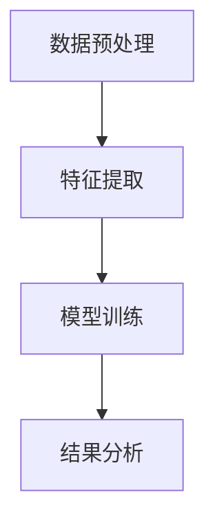
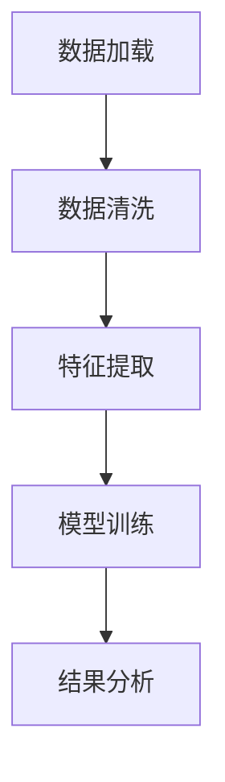
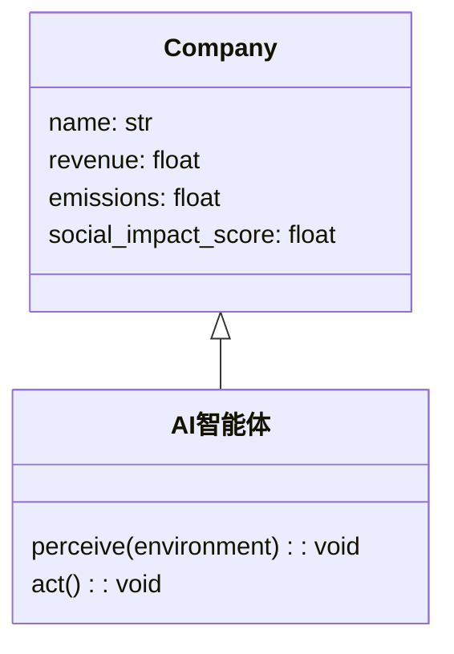
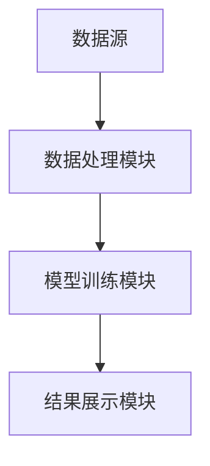
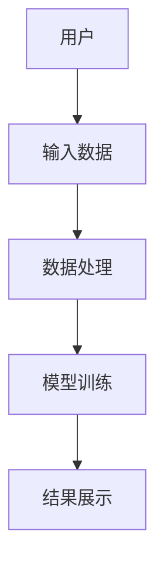

                 


---

# 运用AI智能体群体评估公司的社会影响力

> 关键词：AI智能体、社会影响力、群体智能、算法原理、系统架构

> 摘要：本文详细探讨了运用AI智能体群体评估公司社会影响力的方法。从AI智能体的基本概念到社会影响力评估的维度，再到算法实现和系统设计，最后通过实际案例展示如何运用这些技术。文章旨在为读者提供一个全面的视角，帮助他们理解如何利用AI技术来量化和优化公司的社会影响力。

---

# 第一部分: 引言

## 第1章: 背景介绍

### 1.1 问题背景

#### 1.1.1 什么是AI智能体
AI智能体（Artificial Intelligence Agent）是指能够感知环境并采取行动以实现目标的智能实体。AI智能体可以是软件程序、机器人或其他具备智能决策能力的系统。

#### 1.1.2 什么是社会影响力
社会影响力指的是公司在社会中的影响程度，包括对经济、环境、文化、社会福利等方面的影响。社会影响力评估旨在量化公司对社会的正面或负面影响。

#### 1.1.3 为什么要评估公司的社会影响力
随着全球对可持续发展的关注增加，评估公司的社会影响力变得越来越重要。它有助于企业识别自身的社会价值，优化决策，提升品牌形象，同时也能帮助利益相关者（如投资者、消费者、政府等）做出更明智的选择。

---

### 1.2 问题描述

#### 1.2.1 AI智能体群体的定义
AI智能体群体是指多个相互协作的AI智能体组成的集体，每个智能体都有自己的目标和决策能力，通过协作完成更复杂的任务。

#### 1.2.2 社会影响力评估的维度
社会影响力评估可以从以下几个维度进行：
- **经济贡献**：公司的营收、就业机会、税收等。
- **环境影响**：公司的碳排放、资源消耗、环保措施等。
- **社会贡献**：公司对教育、慈善、社区发展等方面的投入。
- **治理与合规**：公司是否遵守法律法规，是否存在伦理问题。

#### 1.2.3 传统评估方法的局限性
传统的社会影响力评估方法通常依赖于问卷调查、专家评分等方式，存在主观性强、数据采集困难、评估结果缺乏动态性等问题。

---

### 1.3 问题解决

#### 1.3.1 AI智能体群体的优势
AI智能体群体能够通过大数据分析、实时监测和智能决策，提供更客观、动态的社会影响力评估结果。

#### 1.3.2 问题解决的思路
通过构建AI智能体群体，利用自然语言处理、机器学习等技术，从多源数据中提取相关信息，评估公司的社会影响力。

#### 1.3.3 问题解决的步骤
1. 数据采集：收集公司相关的经济、环境、社会等方面的数据。
2. 数据处理：对数据进行清洗、整合和特征提取。
3. 模型训练：训练AI智能体，使其能够理解和评估社会影响力。
4. 结果分析：输出评估结果，并提供改进建议。

---

### 1.4 边界与外延

#### 1.4.1 AI智能体群体的边界
AI智能体群体的边界包括数据范围、评估维度和评估对象。例如，仅评估公司的经济贡献，而不涉及个人影响力。

#### 1.4.2 社会影响力评估的范围
社会影响力评估的范围包括公司内部和外部影响，如员工福利、产品对社会的影响等。

#### 1.4.3 相关概念的区分与联系
AI智能体群体与传统算法的主要区别在于，前者强调协作和分布式决策，后者通常基于集中式计算。

---

### 1.5 概念结构与核心要素

#### 1.5.1 AI智能体群体的构成
AI智能体群体由多个智能体组成，每个智能体负责不同的任务，通过交互协作完成整体目标。

#### 1.5.2 社会影响力评估的核心要素
核心要素包括数据来源、评估指标、模型算法和结果反馈。

#### 1.5.3 两者之间的关系
AI智能体群体通过数据处理、模型训练等过程，帮助实现社会影响力评估。

---

# 第二部分: 核心概念与联系

## 第2章: 核心概念原理

### 2.1 AI智能体群体的原理

#### 2.1.1 AI智能体的基本原理
AI智能体通过感知环境、处理信息并采取行动来实现目标。例如，智能体可以通过自然语言处理技术分析新闻报道，评估公司的社会影响力。

#### 2.1.2 群体智能的核心机制
群体智能依赖于分布式计算、协作学习和自适应优化。AI智能体通过协作完成复杂的任务，如数据清洗、特征提取等。

#### 2.1.3 群体智能与个体智能的关系
群体智能是多个个体智能体的协作结果，个体智能体通过协作实现整体目标。

---

### 2.2 社会影响力评估的原理

#### 2.2.1 社会影响力的主要维度
社会影响力评估可以从经济、环境、社会和治理四个维度进行。

#### 2.2.2 不同维度的评估方法
- **经济贡献**：通过公司财报数据进行评估。
- **环境影响**：通过碳排放数据和环保措施进行评估。
- **社会贡献**：通过慈善捐赠和社区活动进行评估。
- **治理与合规**：通过法律诉讼和伦理事件进行评估。

#### 2.2.3 综合评估的逻辑框架
综合评估需要将各维度的评估结果进行加权计算，得出总体社会影响力得分。

---

### 2.3 核心概念对比

#### 2.3.1 AI智能体与传统算法的对比
| 对比维度 | AI智能体 | 传统算法 |
|----------|----------|----------|
| 决策方式 | 分布式协作 | 集中式计算 |
| 数据处理 | 多源异构数据处理 | 单一数据源处理 |
| 计算能力 | 高度并行计算 | 串行计算 |

#### 2.3.2 群体智能与个体智能的关系
群体智能是多个个体智能体协作的结果，个体智能体通过协作实现整体目标。

---

## 第3章: 核心概念属性与特征对比

### 3.1 AI智能体群体的特征
AI智能体群体具有以下特征：
- **分布式计算**：多个智能体协同工作。
- **自主性**：每个智能体能够自主决策。
- **协作性**：智能体之间能够协作完成任务。

---

# 第三部分: 算法原理

## 第4章: 算法原理

### 4.1 算法概述
社会影响力评估算法通过以下步骤实现：
1. 数据预处理：清洗和整合多源数据。
2. 特征提取：提取关键特征，如经济贡献、环境影响等。
3. 模型训练：训练机器学习模型，预测社会影响力得分。
4. 结果分析：输出评估结果，并提供改进建议。

---

### 4.2 算法实现

#### 4.2.1 数据预处理
```python
import pandas as pd

# 读取数据
data = pd.read_csv('company_data.csv')

# 数据清洗
data.dropna(inplace=True)
data['revenue'] = data['revenue'].astype(float)
```

#### 4.2.2 特征提取
```python
from sklearn.feature_extraction import DictVectorizer

vectorizer = DictVectorizer()
features = vectorizer.fit_transform(data[['company', 'revenue', 'emissions']].to_dict('records'))
```

#### 4.2.3 模型训练
```python
from sklearn.ensemble import RandomForestRegressor

model = RandomForestRegressor(n_estimators=100, random_state=42)
model.fit(features, data['social_impact_score'])
```

#### 4.2.4 结果分析
```python
importances = model.feature_importances_
print(importances)
```

---

### 4.3 算法流程图



---

### 4.4 数学模型

社会影响力评估公式：
$$
\text{社会影响力得分} = \alpha \cdot \text{经济贡献} + \beta \cdot \text{环境影响} + \gamma \cdot \text{社会贡献}
$$
其中，$\alpha + \beta + \gamma = 1$，且$\alpha, \beta, \gamma \geq 0$。

---

## 第5章: 算法实现

### 5.1 算法实现代码
```python
import pandas as pd
from sklearn.ensemble import RandomForestRegressor
from sklearn.feature_extraction import DictVectorizer

# 数据加载与预处理
data = pd.read_csv('company_data.csv')
data.dropna(inplace=True)
data['revenue'] = data['revenue'].astype(float)

# 特征提取
vectorizer = DictVectorizer()
features = vectorizer.fit_transform(data[['company', 'revenue', 'emissions']].to_dict('records'))

# 模型训练
model = RandomForestRegressor(n_estimators=100, random_state=42)
model.fit(features, data['social_impact_score'])

# 结果分析
importances = model.feature_importances_
print("特征重要性：", importances)
```

### 5.2 代码解读
- 数据加载与预处理：读取CSV文件，清洗数据，转换数据类型。
- 特征提取：使用`DictVectorizer`将数据转换为模型可接受的格式。
- 模型训练：使用随机森林回归模型训练社会影响力评估模型。
- 结果分析：输出特征重要性，帮助理解哪些因素对社会影响力影响最大。

---

### 5.3 算法流程图



---

# 第四部分: 系统分析与架构设计

## 第6章: 系统分析

### 6.1 项目背景
本项目旨在通过AI智能体群体评估公司的社会影响力，帮助公司优化决策，提升品牌形象。

---

### 6.2 系统功能设计

#### 6.2.1 领域模型类图


---

### 6.3 系统架构设计

#### 6.3.1 系统架构图


---

## 第7章: 系统架构设计

### 7.1 系统架构图


---

### 7.2 接口设计

#### 7.2.1 输入接口
```python
def input_data(data):
    return data
```

#### 7.2.2 输出接口
```python
def output_result(result):
    print(result)
```

---

### 7.3 交互设计

#### 7.3.1 序列图


---

# 第五部分: 项目实战

## 第8章: 项目实战

### 8.1 环境安装
```bash
pip install pandas scikit-learn
```

---

### 8.2 核心代码实现

#### 8.2.1 数据预处理
```python
import pandas as pd

data = pd.read_csv('company_data.csv')
data.dropna(inplace=True)
data['revenue'] = data['revenue'].astype(float)
```

#### 8.2.2 特征提取
```python
from sklearn.feature_extraction import DictVectorizer

vectorizer = DictVectorizer()
features = vectorizer.fit_transform(data[['company', 'revenue', 'emissions']].to_dict('records'))
```

#### 8.2.3 模型训练
```python
from sklearn.ensemble import RandomForestRegressor

model = RandomForestRegressor(n_estimators=100, random_state=42)
model.fit(features, data['social_impact_score'])
```

---

### 8.3 案例分析

#### 8.3.1 案例背景
假设我们有两家公司A和B，分别位于不同的行业，需要评估它们的社会影响力。

#### 8.3.2 数据准备
```python
data = {
    'company': ['A', 'B'],
    'revenue': [1000, 1500],
    'emissions': [50, 30]
}
data_df = pd.DataFrame(data)
```

#### 8.3.3 模型训练与预测
```python
from sklearn.ensemble import RandomForestRegressor
from sklearn.feature_extraction import DictVectorizer

vectorizer = DictVectorizer()
features = vectorizer.fit_transform(data_df[['company', 'revenue', 'emissions']].to_dict('records'))

model = RandomForestRegressor(n_estimators=100, random_state=42)
model.fit(features, data_df['social_impact_score'])

# 预测新公司C的社会影响力
new_company = {'company': 'C', 'revenue': 1200, 'emissions': 40}
new_features = vectorizer.transform([new_company])
prediction = model.predict(new_features)
print("预测的社会影响力得分为：", prediction[0])
```

---

### 8.4 实战小结
通过案例分析，我们展示了如何运用AI智能体群体评估公司的社会影响力。模型能够根据公司的经济、环境等数据，预测其社会影响力得分，帮助企业优化决策。

---

# 第六部分: 总结与展望

## 第9章: 总结与展望

### 9.1 总结
本文详细探讨了运用AI智能体群体评估公司社会影响力的方法，从理论基础到算法实现，再到系统设计，最后通过案例分析展示了实际应用。

### 9.2 最佳实践Tips
- 确保数据质量，清洗和整合多源数据。
- 选择合适的算法，结合业务需求进行模型调优。
- 定期更新模型，确保评估结果的动态性。

### 9.3 小结
通过AI智能体群体，企业可以更客观、动态地评估社会影响力，优化决策，提升品牌形象。

### 9.4 注意事项
- 数据隐私和安全问题需要高度重视。
- 模型的可解释性需要进一步提升。
- 算法的实时性和高效性需要优化。

### 9.5 拓展阅读
建议读者进一步阅读《集体智能》（Collective Intelligence）和《群体机器人》（Swarm Robotics）等书籍，深入了解群体智能的理论与应用。

---

# 作者

作者：AI天才研究院/AI Genius Institute & 禅与计算机程序设计艺术/Zen And The Art of Computer Programming

