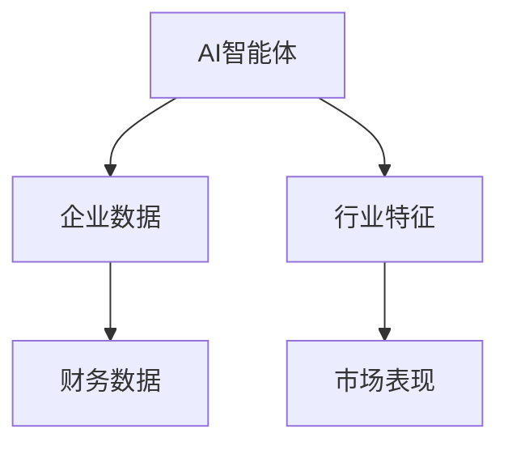
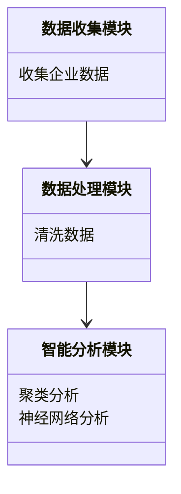
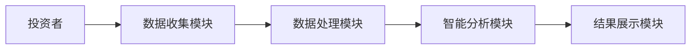

                 


# 运用AI智能体群体识别巴菲特式的行业领导者

## 关键词：AI智能体，巴菲特投资理念，行业领导者，聚类分析，神经网络，系统设计，投资分析

## 摘要：  
本文探讨了如何利用AI技术识别巴菲特式的行业领导者。通过分析巴菲特投资理念的核心要素，结合AI智能体的技术原理，提出了一种基于聚类分析和神经网络的行业领导者识别方法。本文详细介绍了算法原理、系统设计和实际案例，展示了如何利用AI技术提升投资分析的准确性和效率。

---

# 第一部分: 背景介绍与核心概念

## 第1章: 问题背景与描述

### 1.1 投资分析的传统方法

#### 1.1.1 传统投资分析的局限性  
传统的投资分析方法依赖于基本面分析、技术分析和市场情绪分析，但这些方法存在以下局限性：  
1. **主观性**：分析结果容易受到分析师主观判断的影响。  
2. **数据处理能力有限**：面对海量数据时，传统方法难以快速筛选出关键信息。  
3. **效率低下**：分析过程耗时较长，难以应对高频交易的需求。  

#### 1.1.2 巴菲特投资理念的核心要素  
巴菲特的投资理念强调长期价值和优质企业识别，其核心要素包括：  
1. **企业护城河**：企业具备竞争优势，能够在市场中长期保持领先地位。  
2. **财务健康**：企业具有稳定的财务状况，低债务、高利润率。  
3. **管理层素质**：管理层具备诚信和卓越的管理能力。  

#### 1.1.3 AI技术在投资分析中的潜力  
AI技术能够通过大数据分析和模式识别，帮助投资者快速筛选出符合巴菲特理念的优质企业。AI的优势在于其高效性、准确性和可扩展性。

---

### 1.2 问题解决与边界

#### 1.2.1 利用AI识别行业领导者的可行性  
通过AI技术，可以建立一套量化模型，从企业财务数据、市场表现、行业地位等多个维度，筛选出具备巴菲特式特征的企业。

#### 1.2.2 问题解决的边界与外延  
本文的AI模型专注于识别行业领导者，不涉及高频交易或短期市场波动分析。模型适用于长期价值投资，而非短期套利。

#### 1.2.3 核心概念的结构与要素组成  
本文的核心概念包括：  
1. **AI智能体**：用于数据处理和模式识别的智能系统。  
2. **巴菲特投资理念**：优质企业识别标准。  

---

## 第2章: 核心概念与联系

### 2.1 AI智能体的定义与属性

#### 2.1.1 AI智能体的基本定义  
AI智能体是一种能够感知环境、执行任务并优化决策的智能系统。它具备以下属性：  
1. **感知能力**：能够从数据中提取特征。  
2. **决策能力**：能够根据数据做出最优选择。  
3. **学习能力**：能够通过反馈优化模型。  

#### 2.1.2 智能体的核心属性特征对比表  
| 属性         | 传统投资分析 | AI智能体   |
|--------------|--------------|------------|
| 数据处理能力 | 有限         | 强大       |
| 分析效率      | 较低         | 高         |
| 准确性        | 中等         | 高         |

#### 2.1.3 实体关系图（ER图）的Mermaid流程图  


### 2.2 巴菲特式投资的核心原理

#### 2.2.1 巴菲特投资理念的数学模型  
企业内在价值的计算公式为：  
$$ V = \frac{E}{r} $$  
其中，\( V \) 是企业价值，\( E \) 是企业未来现金流的现值，\( r \) 是折现率。  

#### 2.2.2 AI智能体与巴菲特理念的联系  
AI智能体通过大数据分析，量化巴菲特的投资标准，帮助投资者快速筛选出具备竞争优势的企业。

#### 2.2.3 两者的对比分析  
| 对比维度       | 巴菲特理念          | AI智能体            |
|----------------|--------------------|---------------------|
| 分析方式       | 主观判断           | 客观数据驱动        |
| 数据处理能力   | 有限               | 强大               |
| 决策效率       | 较低               | 高                 |

---

## 第3章: 核心概念的数学模型与公式

### 3.1 巴菲特投资理念的数学模型

#### 3.1.1 企业价值公式  
$$ V = \sum_{t=1}^{n} \frac{CF_t}{(1 + r)^t} $$  
其中，\( CF_t \) 是第 \( t \) 年的现金流，\( r \) 是折现率，\( n \) 是预测年限。

#### 3.1.2 股价与内在价值的关系  
$$ P = \min(V, 市场价格) $$  
当市场价格低于内在价值时，企业具备投资价值。

### 3.2 AI智能体的算法模型

#### 3.2.1 聚类分析的数学公式  
聚类分析的目标是将企业分成若干簇，使得同一簇内的企业相似，不同簇的企业差异显著。  
$$ \text{目标函数} = \sum_{i=1}^{k} \sum_{j=1}^{n_i} (x_i - \mu_j)^2 $$  
其中，\( k \) 是簇的数量，\( n_i \) 是第 \( i \) 簇的企业数量，\( x_i \) 是企业特征向量，\( \mu_j \) 是第 \( j \) 簇的中心。

#### 3.2.2 神经网络的数学模型  
神经网络的损失函数为：  
$$ L = \frac{1}{m} \sum_{i=1}^{m} (y_i - \hat{y_i})^2 $$  
其中，\( m \) 是样本数量，\( y_i \) 是真实标签，\( \hat{y_i} \) 是预测标签。

---

# 第二部分: 系统分析与架构设计

## 第5章: 系统分析与设计

### 5.1 问题场景介绍

#### 5.1.1 投资分析的场景描述  
投资者需要从海量企业中筛选出具备巴菲特式特征的行业领导者。

#### 5.1.2 系统的目标与范围  
系统目标：构建一个基于AI的行业领导者识别系统。  
系统范围：企业财务数据、市场表现数据、行业地位数据。

### 5.2 系统功能设计

#### 5.2.1 数据收集模块  
- 收集企业财务数据（收入、利润、债务等）。  
- 收集市场表现数据（股价、市盈率、市净率等）。  

#### 5.2.2 数据处理模块  
- 数据清洗（去除缺失值、异常值）。  
- 数据标准化（归一化处理）。  

#### 5.2.3 智能分析模块  
- 使用聚类分析筛选出具备竞争优势的企业。  
- 使用神经网络预测企业的长期价值。  

### 5.3 系统架构设计

#### 5.3.1 系统架构的Mermaid类图  


#### 5.3.2 系统架构的Mermaid架构图  


---

## 第6章: 项目实战

### 6.1 环境安装与数据准备

#### 6.1.1 环境安装  
安装Python和必要的库（如NumPy、Scikit-learn、Keras）。  

#### 6.1.2 数据准备  
收集科技行业的企业数据，包括财务数据和市场表现数据。

### 6.2 系统核心实现

#### 6.2.1 聚类分析实现  
```python
from sklearn.cluster import KMeans

# 假设X是数据矩阵
kmeans = KMeans(n_clusters=3, random_state=42)
kmeans.fit(X)
clusters = kmeans.predict(X)
```

#### 6.2.2 神经网络实现  
```python
from keras.models import Sequential
from keras.layers import Dense

model = Sequential()
model.add(Dense(64, activation='relu', input_dim=10))
model.add(Dense(1, activation='sigmoid'))
model.compile(loss='binary_crossentropy', optimizer='adam', metrics=['accuracy'])
model.fit(X_train, y_train, epochs=10, batch_size=32)
```

### 6.3 代码应用解读与分析

#### 6.3.1 聚类分析结果  
通过聚类分析，将企业分为三类，分别代表不同的竞争优势水平。

#### 6.3.2 神经网络预测结果  
模型预测企业的长期价值，帮助投资者识别具备投资价值的企业。

### 6.4 实际案例分析

#### 6.4.1 案例选择  
以科技行业为例，分析某企业的财务数据和市场表现数据。

#### 6.4.2 结果解读  
聚类分析显示，该企业在行业中具备竞争优势，神经网络预测其长期价值较高。

### 6.5 项目小结

通过AI技术，投资者能够快速识别出具备巴菲特式特征的行业领导者，显著提高投资效率和准确性。

---

## 第7章: 最佳实践与小结

### 7.1 注意事项

- 数据质量对模型性能影响重大，需确保数据清洗和标准化。  
- 模型调优是关键，需通过交叉验证选择最优参数。  

### 7.2 小结

本文提出了利用AI智能体识别巴菲特式行业领导者的方法，通过聚类分析和神经网络实现企业筛选，显著提升了投资分析的效率和准确性。

### 7.3 拓展阅读

- 《巴菲特投资思想的现代诠释》  
- 《机器学习在金融领域的应用》  

---

# 作者：AI天才研究院/AI Genius Institute & 禅与计算机程序设计艺术 /Zen And The Art of Computer Programming

