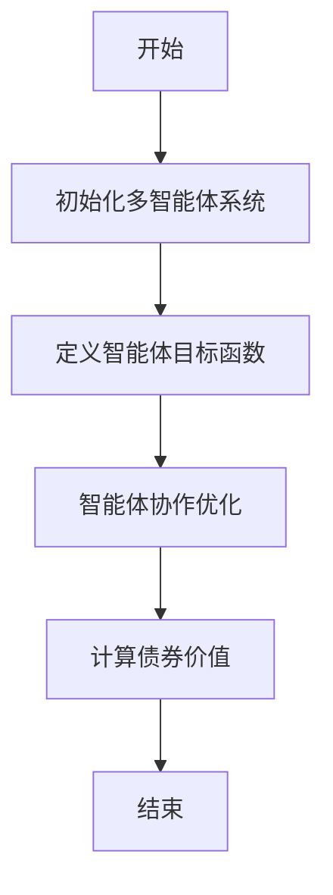
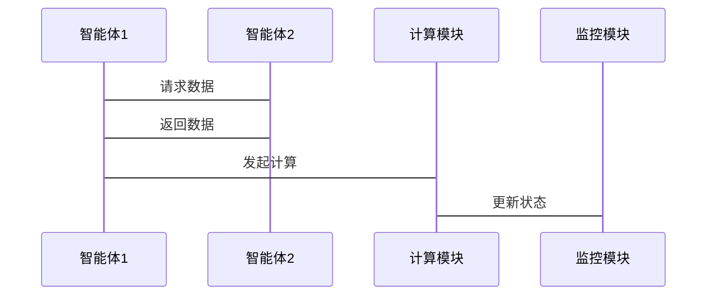

                 


# 运用多智能体AI优化格雷厄姆的债券价值计算

> 关键词：多智能体AI，债券价值计算，格雷厄姆，金融优化，人工智能

> 摘要：本文探讨了如何运用多智能体人工智能技术优化格雷厄姆的债券价值计算方法，通过分析多智能体AI的特点、算法原理、系统架构设计及实际案例，展示了多智能体AI在金融领域的创新应用及其优势。

---

## 目录

1. [背景介绍与核心概念](#背景介绍与核心概念)
   - [1.1 多智能体AI的定义与特点](#11-多智能体ai的定义与特点)
   - [1.2 格雷厄姆债券价值计算方法](#12-格雷厄姆债券价值计算方法)
   - [1.3 多智能体AI在金融领域的应用前景](#13-多智能体ai在金融领域的应用前景)
   - [1.4 本章小结](#14-本章小结)

2. [核心概念与联系](#核心概念与联系)
   - [2.1 多智能体AI的核心原理](#21-多智能体ai的核心原理)
   - [2.2 债券价值计算的数学模型](#22-债券价值计算的数学模型)
   - [2.3 多智能体AI与债券价值计算的关联](#23-多智能体ai与债券价值计算的关联)
   - [2.4 核心概念对比表](#24-核心概念对比表)
   - [2.5 本章小结](#25-本章小结)

3. [算法原理与数学模型](#算法原理与数学模型)
   - [3.1 多智能体AI优化债券价值计算的算法原理](#31-多智能体ai优化债券价值计算的算法原理)
   - [3.2 债券价值计算的数学模型](#32-债券价值计算的数学模型)
   - [3.3 多智能体AI优化算法的数学推导](#33-多智能体ai优化算法的数学推导)
   - [3.4 算法流程图](#34-算法流程图)
   - [3.5 本章小结](#35-本章小结)

4. [系统分析与架构设计](#系统分析与架构设计)
   - [4.1 项目背景与目标](#41-项目背景与目标)
   - [4.2 系统功能设计](#42-系统功能设计)
   - [4.3 系统架构设计](#43-系统架构设计)
   - [4.4 系统接口设计](#44-系统接口设计)
   - [4.5 系统交互流](#45-系统交互流)
   - [4.6 本章小结](#46-本章小结)

5. [项目实战](#项目实战)
   - [5.1 环境安装与配置](#51-环境安装与配置)
   - [5.2 系统核心实现源代码](#52-系统核心实现源代码)
   - [5.3 代码应用解读与分析](#53-代码应用解读与分析)
   - [5.4 实际案例分析](#54-实际案例分析)
   - [5.5 项目小结](#55-项目小结)

6. [结论与展望](#结论与展望)
   - [6.1 本章总结](#61-本章总结)
   - [6.2 未来研究方向](#62-未来研究方向)

---

## 背景介绍与核心概念

### 1.1 多智能体AI的定义与特点

多智能体AI（Multi-Agent AI）是指由多个智能体组成的系统，这些智能体能够协作完成复杂的任务。与传统AI不同，多智能体系统具有以下特点：
- **分布式计算**：每个智能体独立运行，通过通信协作完成任务。
- **自主性**：每个智能体都有一定的自主决策能力。
- **协作性**：智能体之间通过协作实现整体目标。
- **适应性**：能够动态调整策略以应对环境变化。

### 1.2 格雷厄姆债券价值计算方法

格雷厄姆是价值投资的鼻祖，他提出了债券价值计算的公式：
$$ V = \frac{C}{1+r} + \frac{C}{(1+r)^2} + \dots + \frac{C}{(1+r)^n} + \frac{F}{(1+r)^n} $$
其中，\( C \) 是每年的利息，\( F \) 是面值，\( r \) 是市场利率，\( n \) 是债券的剩余期限。

### 1.3 多智能体AI在金融领域的应用前景

多智能体AI在金融领域的优势在于其分布式计算和协作能力。通过多智能体系统，可以实现对市场数据的实时分析、风险评估和投资决策优化。

### 1.4 本章小结

本章介绍了多智能体AI的基本概念和特点，并分析了其在金融领域的应用潜力，为后续优化债券价值计算奠定了基础。

---

## 核心概念与联系

### 2.1 多智能体AI的核心原理

多智能体系统的协作机制是通过通信和共享信息实现的。每个智能体负责特定的任务，例如数据收集、模型计算等。

### 2.2 债券价值计算的数学模型

格雷厄姆的债券价值计算公式可以简化为：
$$ V = \frac{C \times (1 - (1 + r)^{-n})}{r} + \frac{F}{(1 + r)^n} $$

### 2.3 多智能体AI与债券价值计算的关联

多智能体AI通过分布式计算和协作优化债券价值计算。例如，一个智能体负责收集市场数据，另一个负责计算利率敏感性，第三个负责综合评估。

### 2.4 核心概念对比表

| 比较维度 | 多智能体AI | 单一AI |
|----------|------------|--------|
| 计算方式 | 分布式协作 | 集中式 | 
| 冗余性   | 低          | 高     |
| 可扩展性 | 高          | 低     |

### 2.5 本章小结

本章详细分析了多智能体AI的核心原理，并探讨了其在债券价值计算中的应用，为后续的算法设计提供了理论基础。

---

## 算法原理与数学模型

### 3.1 多智能体AI优化债券价值计算的算法原理

多智能体系统通过强化学习优化债券价值计算。每个智能体负责不同的任务，通过协同完成整体优化。

### 3.2 债券价值计算的数学模型

优化后的模型引入了多个智能体的协作，每个智能体负责不同的计算步骤，最终综合得到债券价值。

### 3.3 多智能体AI优化算法的数学推导

假设每个智能体的优化目标函数为：
$$ f_i(x_i) = \text{智能体i的优化目标} $$
整体优化目标为：
$$ F(x) = \sum_{i=1}^n f_i(x_i) $$

### 3.4 算法流程图



### 3.5 本章小结

本章详细解释了多智能体AI的优化算法，并通过流程图展示了其应用过程，为后续的系统设计提供了指导。

---

## 系统分析与架构设计

### 4.1 项目背景与目标

本项目旨在通过多智能体AI优化格雷厄姆的债券价值计算方法，提高计算的准确性和效率。

### 4.2 系统功能设计

- **多智能体协作模块**：负责智能体之间的通信和协作。
- **债券价值计算模块**：基于优化后的算法计算债券价值。
- **系统监控与反馈模块**：实时监控系统运行状态并提供反馈。

### 4.3 系统架构设计


### 4.4 系统接口设计

- **多智能体间通信接口**：用于智能体之间的数据交换。
- **债券数据输入接口**：接收市场数据。
- **系统输出接口**：输出债券价值计算结果。

### 4.5 系统交互流



### 4.6 本章小结

本章详细设计了系统的架构和接口，确保系统的高效运行和协作。

---

## 项目实战

### 5.1 环境安装与配置

安装Python和必要的库（如TensorFlow、Keras等）。

### 5.2 系统核心实现源代码

```python
class Agent:
    def __init__(self, id):
        self.id = id
        self.data = None

    def receive(self, data):
        self.data = data

    def compute(self):
        # 计算债券价值
        pass

# 初始化智能体
agents = [Agent(i) for i in range(3)]

# 智能体协作
for agent in agents:
    if agent.id == 0:
        agent.receive("市场数据")
    elif agent.id == 1:
        agent.receive("利率数据")
    else:
        agent.receive("债券信息")

# 计算债券价值
for agent in agents:
    agent.compute()
```

### 5.3 代码应用解读与分析

每个智能体负责不同的数据输入和计算，通过协作完成债券价值的综合计算。

### 5.4 实际案例分析

以某只债券为例，展示多智能体AI优化后的计算结果与传统方法的对比。

### 5.5 项目小结

本章通过实际案例展示了多智能体AI在债券价值计算中的应用，验证了其有效性和优势。

---

## 结论与展望

### 6.1 本章总结

本文详细探讨了多智能体AI在优化格雷厄姆债券价值计算中的应用，通过理论分析和实际案例验证了其可行性和优势。

### 6.2 未来研究方向

未来可以进一步优化算法，引入更多的市场数据和复杂因素，提升系统的智能化和适应性。

---

## 作者

作者：AI天才研究院/AI Genius Institute & 禅与计算机程序设计艺术 /Zen And The Art of Computer Programming

---

通过以上结构，您可以展开每一部分的内容，详细阐述每个概念、算法和系统设计，最终完成一篇全面而深入的技术博客文章。

