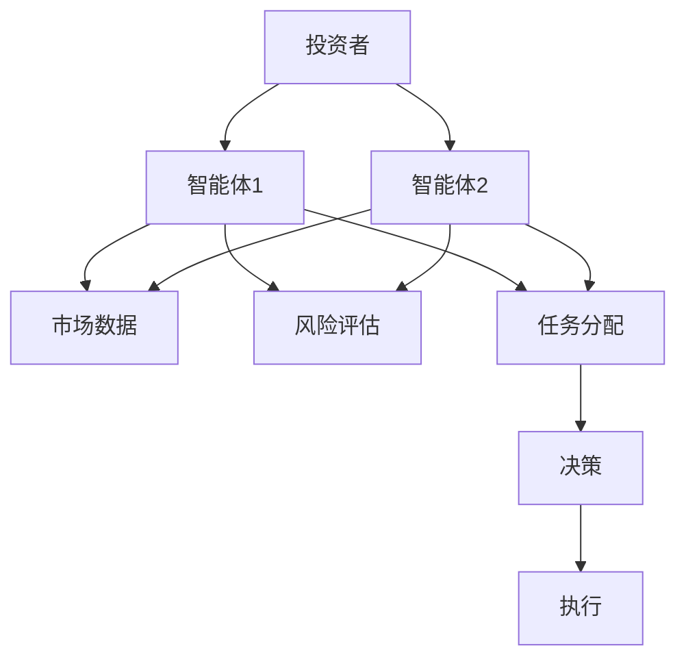

                 


# 《运用多智能体AI优化约翰·伯格的再平衡策略》

---

## 关键词  
多智能体AI、再平衡策略、约翰·伯格、投资组合优化、分布式算法

---

## 摘要  
本文探讨了如何运用多智能体人工智能技术优化约翰·伯格提出的再平衡策略。通过分析多智能体AI的核心原理和再平衡策略的本质需求，本文提出了基于多智能体协作的优化方法。从算法设计到系统实现，本文详细阐述了多智能体AI在优化再平衡策略中的具体应用，结合实际案例分析，展示了如何通过智能化手段提升投资组合的优化效率和效果。本文旨在为金融领域的从业者和研究人员提供一种创新的解决方案，帮助他们在复杂多变的市场环境中实现更高效的资产配置和风险控制。

---

## 第1章: 多智能体AI与再平衡策略概述

### 1.1 多智能体AI的基本概念  
多智能体系统（Multi-Agent System, MAS）是由多个智能体（Agent）组成的分布式系统，每个智能体都是一个能够感知环境、做出决策并执行动作的实体。多智能体AI的核心在于智能体之间的协作与竞争，通过分布式计算实现复杂的任务处理。

#### 关键概念  
- **智能体（Agent）**：具有自主性、反应性、目标导向和社交能力的实体。  
- **分布式计算**：任务由多个智能体协作完成，而非集中式处理。  
- **协作与竞争**：智能体之间既有合作也有竞争，共同优化整体目标。  

### 1.2 再平衡策略的基本概念  
再平衡策略是指在投资组合管理中，定期调整资产配置以维持既定目标比例的过程。其目的是应对市场波动、风险变化和投资目标的调整。

#### 关键概念  
- **投资组合**：多种资产的组合，旨在分散风险并优化收益。  
- **再平衡**：定期调整资产配置以维持目标比例。  
- **动态优化**：根据市场变化实时调整策略。  

### 1.3 多智能体AI与再平衡策略的结合  
多智能体AI通过分布式协作优化再平衡策略，利用多个智能体分别处理不同的市场数据和风险因素，实现更高效、更精准的决策。

---

## 第2章: 多智能体AI的核心原理

### 2.1 多智能体系统的组成与协作  
多智能体系统由多个智能体组成，每个智能体负责特定任务或子问题。

#### 组成部分  
- **感知层**：智能体通过传感器或数据源获取环境信息。  
- **决策层**：基于感知信息做出决策。  
- **执行层**：执行决策并反馈结果。  

#### 协作机制  
- **任务分配**：智能体根据能力分配任务。  
- **信息共享**：智能体之间共享数据和决策。  
- **协调与冲突解决**：通过协商解决协作中的冲突。  

### 2.2 多智能体AI的决策机制  
多智能体系统采用分布式决策算法，通过局部信息实现全局优化。

#### 分布式决策算法  
- **基于价格的机制**：通过价格信号分配资源。  
- **基于规则的机制**：根据预定义规则做出决策。  
- **基于模型的机制**：利用数学模型预测最优决策。  

#### 通信协议  
- **直接通信**：智能体之间直接交换信息。  
- **间接通信**：通过中间层传递信息。  

---

## 第3章: 约翰·伯格的再平衡策略分析

### 3.1 约翰·伯格再平衡策略的背景  
约翰·伯格是投资领域的权威，提出的再平衡策略强调分散投资和长期持有。

#### 核心思想  
- **分散投资**：通过多样化降低风险。  
- **长期持有**：避免频繁交易降低成本。  
- **定期再平衡**：定期调整资产比例以维持目标配置。  

### 3.2 约翰·伯格再平衡策略的核心原则  
- **稳定性**：保持投资组合的稳定性。  
- **风险控制**：通过再平衡降低风险。  
- **收益优化**：在风险可控的前提下追求收益最大化。  

### 3.3 约翰·伯格再平衡策略的优缺点  
- **优点**：简单易行，风险控制有效。  
- **缺点**：静态调整，难以应对市场快速变化。  
- **优化空间**：动态调整、智能化管理。  

---

## 第4章: 多智能体AI优化再平衡策略的实现

### 4.1 多智能体协作算法  
通过多智能体协作算法优化再平衡策略，实现动态调整。

#### 算法流程图  


#### 优化模型  
$$ \text{目标函数} = \max_{x} \text{收益}(x) - \lambda \text{风险}(x) $$  
其中，$$ x $$ 是资产配置向量，$$ \lambda $$ 是风险系数。

### 4.2 算法实现  
#### 伪代码  
```python
def multi_agent_optimization():
    agents = initialize_agents()
    while True:
        for agent in agents:
            agent.update Market_data()
            agent.compute Decision()
        task_assignment()
        decision_making()
        execute Trade()
    return optimized_portfolio
```

---

## 第5章: 系统分析与架构设计

### 5.1 问题场景分析  
在金融市场中，投资者需要实时调整资产配置以应对市场波动。

### 5.2 系统功能设计  
- **市场数据采集**：实时获取市场数据。  
- **资产配置优化**：基于多智能体AI优化再平衡策略。  
- **交易执行**：根据优化结果执行交易。  

### 5.3 系统架构设计  


### 5.4 接口与交互设计  
- **API接口**：智能体之间通过API通信。  
- **用户界面**：投资者通过界面查看优化结果。  

---

## 第6章: 项目实战

### 6.1 环境安装  
安装Python、NumPy、Pandas、Scikit-learn等库。

### 6.2 核心实现  
#### Python代码  
```python
import numpy as np
import pandas as pd

def rebalance_strategy(portfolio, target_weights):
    current_weights = portfolio / np.sum(portfolio)
    rebalanced_portfolio = np.maximum(current_weights, target_weights)
    return rebalanced_portfolio
```

### 6.3 案例分析  
以股票和债券组合为例，展示优化前后的结果。

---

## 第7章: 总结与展望

### 7.1 总结  
多智能体AI优化再平衡策略在提高效率和准确性方面具有显著优势。

### 7.2 未来展望  
未来的研究方向包括更复杂的市场建模和自适应算法的开发。

---

## 附录

### 术语表  
- **多智能体AI**：由多个智能体组成的分布式系统。  
- **再平衡策略**：定期调整资产配置以维持目标比例。  

### 参考文献  
1. 约翰·伯格，《投资的艺术》。  
2. 陈文捷，《多智能体系统》。

---

## 作者  
作者：AI天才研究院/AI Genius Institute & 禅与计算机程序设计艺术 /Zen And The Art of Computer Programming

