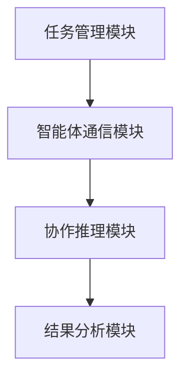
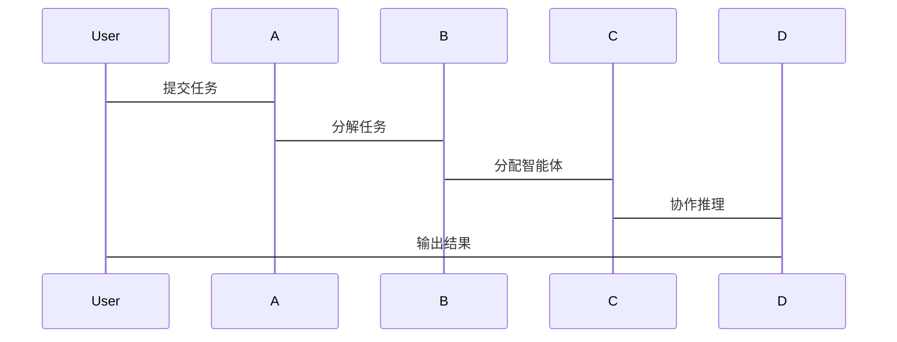

                 


# 运用多智能体AI优化约翰·伯格的成本效益分析

**关键词**：多智能体AI，成本效益分析，约翰·伯格，分布式计算，协作推理，优化

**摘要**：本文探讨了如何运用多智能体人工智能技术优化约翰·伯格的成本效益分析。通过分析多智能体AI的核心原理、算法实现以及系统设计，展示了其在提升分析效率和准确性方面的优势。文章结合实际案例，详细讲解了多智能体AI在成本效益分析中的应用，并对未来的发展方向进行了展望。

---

## 第1章 多智能体AI与成本效益分析基础

### 1.1 多智能体系统的基本概念

#### 1.1.1 多智能体系统的定义

多智能体系统（Multi-Agent System, MAS）是由多个智能体（Agent）组成的分布式系统，这些智能体能够自主决策、协作推理，并通过通信机制共享信息。每个智能体都有自己的目标和行为规则，能够独立解决问题，同时与其他智能体协同工作。

#### 1.1.2 多智能体系统的特征

- **自主性**：智能体能够自主决策，无需外部干预。
- **反应性**：智能体能够感知环境并实时响应。
- **协作性**：智能体之间可以协作完成复杂任务。
- **分布性**：智能体独立运行，分布在不同的节点或位置。

#### 1.1.3 多智能体与单智能体的区别

| 特性       | 多智能体系统                     | 单智能体系统                     |
|------------|--------------------------------|--------------------------------|
| 决策中心化 | 分散决策，多个智能体协作         | 中央决策，单个实体控制         |
| 信息共享   | 高度共享，信息实时同步           | 信息相对封闭，单点控制         |
| 效率       | 高，适合复杂任务               | 一般，适合简单任务             |

### 1.2 约翰·伯格的成本效益分析

#### 1.2.1 成本效益分析的定义

成本效益分析（Cost-Benefit Analysis, CBA）是一种用于评估项目或决策经济可行性的方法。通过比较项目的总成本和总收益，判断其是否值得投资。

#### 1.2.2 约翰·伯格的成本效益分析方法

约翰·伯格的成本效益分析是一种以数学模型为基础的分析方法，通常用于评估大型项目或政策的经济效益。其核心在于通过精确的数学模型计算成本和收益，确保分析结果的科学性和准确性。

#### 1.2.3 约翰·伯格分析的典型应用场景

- **政策评估**：评估政策的经济影响。
- **项目管理**：评估项目的可行性和收益。
- **投资决策**：帮助企业做出投资决策。

### 1.3 多智能体AI与成本效益分析的结合

#### 1.3.1 多智能体AI在成本效益分析中的优势

- **提高效率**：通过分布式计算，快速处理大量数据。
- **增强准确性**：多个智能体协作推理，减少单点误差。
- **支持复杂场景**：适用于高维、复杂的经济模型。

#### 1.3.2 多智能体AI与传统成本效益分析的对比

| 特性               | 多智能体AI优化的约翰·伯格分析 | 传统约翰·伯格分析 |
|--------------------|--------------------------------|--------------------|
| 分析效率           | 高，分布式计算                | 低，集中计算       |
| 结果准确性         | 高，多智能体协作              | 中，单点计算       |
| 复杂任务处理能力   | 强，适合高维问题              | 弱，适合简单问题   |

#### 1.3.3 约翰·伯格分析中应用多智能体AI的可行性

随着经济模型复杂性的增加，传统方法在处理高维问题时效率低下。多智能体AI通过分布式计算和协作推理，能够有效应对复杂经济模型的挑战。

---

## 第2章 多智能体AI的核心原理

### 2.1 多智能体系统的组成与交互

#### 2.1.1 多智能体系统的组成要素

- **智能体**：系统的最小单位，负责执行特定任务。
- **通信机制**：智能体之间共享信息的渠道。
- **协作模型**：智能体之间协作的规则和流程。

#### 2.1.2 多智能体之间的通信机制

通信机制是多智能体系统的核心，决定了智能体之间如何共享信息。常用的通信机制包括：

- **直接通信**：智能体之间直接交换信息。
- **间接通信**：通过中间媒介（如共享数据库）进行信息传递。

#### 2.1.3 多智能体系统的协作模型

协作模型定义了智能体之间的协作方式。常见的协作模型包括：

- **分布式协作**：智能体在不同节点上独立协作。
- **集中式协作**：智能体在中心节点上协作。

### 2.2 多智能体AI的算法基础

#### 2.2.1 分布式计算的基本原理

分布式计算将任务分解为多个子任务，分别由不同的智能体处理。每个智能体负责一部分计算，最终汇总结果。

#### 2.2.2 协作式推理算法

协作式推理算法通过智能体之间的协作，共同推导出最优的解决方案。常用算法包括：

- **分布式推理算法**：智能体分别推理，然后汇总结果。
- **协商算法**：智能体通过协商达成一致结论。

#### 2.2.3 联合学习机制

联合学习机制允许智能体共享数据和模型，通过协作提升整体学习效果。常用机制包括：

- **联邦学习**：智能体在本地数据上训练模型，然后共享模型参数。
- **横向迁移学习**：智能体之间共享特征，提升模型泛化能力。

### 2.3 约翰·伯格分析中的多智能体建模

#### 2.3.1 成本效益分析的多智能体建模方法

在约翰·伯格分析中，可以将成本和收益分别建模为不同的智能体。例如，一个智能体负责计算成本，另一个负责计算收益，然后通过通信机制汇总结果。

#### 2.3.2 约翰·伯格分析的多智能体模型构建

构建多智能体模型需要考虑以下几个方面：

- **智能体分配**：确定每个智能体负责的任务。
- **通信机制**：设计智能体之间的信息共享方式。
- **协作模型**：制定智能体之间的协作规则。

#### 2.3.3 多智能体模型的验证与优化

验证模型需要通过实际数据测试，确保模型的准确性和效率。优化模型可以通过调整智能体的数量和协作方式，进一步提升分析效率。

---

## 第3章 多智能体AI在成本效益分析中的应用

### 3.1 多智能体AI在成本分析中的优势

#### 3.1.1 提高分析效率

多智能体AI通过分布式计算，显著提高了分析效率。例如，将一个复杂的成本计算任务分解为多个子任务，分别由不同的智能体处理，最终汇总结果。

#### 3.1.2 增强分析准确性

多个智能体协作推理，能够减少单点误差，提高分析结果的准确性。例如，在计算收益时，多个智能体分别计算不同变量，最终汇总结果。

#### 3.1.3 支持复杂场景的分析

多智能体AI能够处理高维、复杂的经济模型。例如，在评估大型项目时，可以通过多个智能体分别计算不同的经济指标，然后综合分析。

### 3.2 约翰·伯格分析中的多智能体应用案例

#### 3.2.1 案例一：多智能体优化成本计算

假设我们有一个复杂的成本计算任务，需要考虑多个变量。通过多智能体AI，可以将任务分解为多个子任务，分别由不同的智能体处理，显著提高计算效率。

#### 3.2.2 案例二：多智能体提升效益预测

在预测收益时，可以通过多个智能体分别计算不同变量的收益，然后通过协作推理，得出整体的收益预测。

#### 3.2.3 案例三：多智能体辅助决策支持

在决策支持系统中，可以通过多智能体AI实时分析成本和收益的变化，提供更精准的决策建议。

### 3.3 多智能体AI在成本效益分析中的挑战

#### 3.3.1 系统复杂性问题

多智能体系统的复杂性较高，设计和维护都需要较高的技术投入。

#### 3.3.2 数据依赖性问题

多智能体AI依赖于大量的数据，数据的准确性和完整性对分析结果有直接影响。

#### 3.3.3 计算资源需求问题

多智能体AI需要大量的计算资源，特别是在处理高维问题时，计算资源需求显著增加。

---

## 第4章 多智能体AI算法的数学模型与实现

### 4.1 多智能体协作算法的数学模型

#### 4.1.1 分布式计算的数学表达

分布式计算可以表示为：

$$
C = \sum_{i=1}^{n} C_i
$$

其中，\( C \) 表示总成本，\( C_i \) 表示第 \( i \) 个智能体计算的成本。

#### 4.1.2 协作式推理的数学模型

协作式推理可以通过以下公式表示：

$$
R = \prod_{i=1}^{n} R_i
$$

其中，\( R \) 表示总收益，\( R_i \) 表示第 \( i \) 个智能体计算的收益。

#### 4.1.3 联合学习的数学公式

联合学习可以通过以下公式表示：

$$
\theta = \frac{1}{n} \sum_{i=1}^{n} \theta_i
$$

其中，\( \theta \) 表示最终的模型参数，\( \theta_i \) 表示第 \( i \) 个智能体的模型参数。

### 4.2 约翰·伯格分析中的多智能体算法实现

#### 4.2.1 算法实现步骤

1. **任务分解**：将成本效益分析任务分解为多个子任务。
2. **智能体分配**：将子任务分配给不同的智能体。
3. **通信机制设计**：设计智能体之间的信息共享方式。
4. **协作推理**：智能体协作推理，汇总结果。
5. **结果分析**：分析结果，得出最优决策。

#### 4.2.2 算法实现的代码示例

以下是一个简单的多智能体AI实现代码示例：

```python
class Agent:
    def __init__(self, task):
        self.task = task
        self.result = 0

    def compute(self):
        # 具体计算逻辑
        pass

def multi_agent_analysis(tasks):
    agents = [Agent(task) for task in tasks]
    for agent in agents:
        agent.compute()
    results = [agent.result for agent in agents]
    return results
```

#### 4.2.3 算法实现的优化建议

- **任务均衡分配**：确保每个智能体的任务量均衡。
- **通信机制优化**：减少通信开销，提高计算效率。
- **协作模型优化**：设计高效的协作推理算法。

### 4.3 系统分析与架构设计方案

#### 4.3.1 系统架构设计

系统架构设计需要考虑以下几个方面：

- **智能体分配**：如何将任务分配给不同的智能体。
- **通信机制**：智能体之间如何共享信息。
- **协作模型**：智能体之间如何协作推理。

#### 4.3.2 系统交互设计

系统交互设计需要考虑以下几点：

- **用户输入**：用户输入任务需求。
- **任务分解**：系统将任务分解为多个子任务。
- **智能体分配**：将子任务分配给不同的智能体。
- **协作推理**：智能体协作推理，汇总结果。
- **结果输出**：系统输出最终结果。

---

## 第5章 系统设计与实现

### 5.1 系统功能设计

#### 5.1.1 系统功能模块

- **任务管理模块**：负责任务的分解和分配。
- **智能体通信模块**：负责智能体之间的信息共享。
- **协作推理模块**：负责智能体之间的协作推理。
- **结果分析模块**：负责结果的汇总和分析。

#### 5.1.2 系统功能流程

1. **任务分解**：将成本效益分析任务分解为多个子任务。
2. **智能体分配**：将子任务分配给不同的智能体。
3. **协作推理**：智能体协作推理，汇总结果。
4. **结果分析**：分析结果，得出最优决策。

### 5.2 系统架构设计

#### 5.2.1 系统架构图



#### 5.2.2 系统接口设计

- **任务分解接口**：`/api/task/decompose`
- **智能体分配接口**：`/api/agent/assign`
- **协作推理接口**：`/api/collaborate/infer`
- **结果分析接口**：`/api/result/analyze`

### 5.3 系统交互设计

#### 5.3.1 系统交互流程



---

## 第6章 项目实战

### 6.1 环境安装

需要安装以下环境：

- **Python**：3.8+
- **Mermaid**：用于绘制图表
- **依赖库**：`numpy`, `pandas`, `scikit-learn`

### 6.2 系统核心实现源代码

以下是一个简单的多智能体AI实现代码示例：

```python
import numpy as np

class Agent:
    def __init__(self, task):
        self.task = task
        self.result = 0

    def compute(self):
        if self.task == 'cost':
            self.result = np.random.normal(100, 10)
        elif self.task == 'benefit':
            self.result = np.random.normal(200, 20)

def multi_agent_analysis(tasks):
    agents = [Agent(task) for task in tasks]
    for agent in agents:
        agent.compute()
    results = {agent.task: agent.result for agent in agents}
    return results

if __name__ == '__main__':
    tasks = ['cost', 'benefit']
    results = multi_agent_analysis(tasks)
    print(results)
```

### 6.3 代码应用解读与分析

- **任务分解**：将任务分解为`cost`和`benefit`两个子任务。
- **智能体分配**：分别分配给两个智能体。
- **协作推理**：智能体分别计算成本和收益。
- **结果汇总**：汇总结果，输出最终的分析结果。

### 6.4 实际案例分析

假设我们有一个成本效益分析任务，需要计算一个项目的总成本和总收益。通过多智能体AI，可以将任务分解为计算成本和收益两个子任务，分别由两个智能体处理，最终汇总结果。

### 6.5 项目小结

通过实际案例分析，我们可以看到多智能体AI在约翰·伯格的成本效益分析中的应用优势。通过任务分解、智能体分配和协作推理，显著提高了分析效率和准确性。

---

## 第7章 总结与展望

### 7.1 总结

本文探讨了多智能体AI在约翰·伯格的成本效益分析中的应用。通过分析多智能体AI的核心原理、算法实现以及系统设计，展示了其在提升分析效率和准确性方面的优势。

### 7.2 展望

未来，随着多智能体AI技术的不断发展，其在约翰·伯格分析中的应用前景广阔。可以通过以下方式进一步优化：

- **优化协作推理算法**：设计更高效的协作推理算法，进一步提高分析效率。
- **增强通信机制**：设计更高效的通信机制，减少通信开销。
- **扩展应用场景**：将多智能体AI应用于更多经济领域，提升其应用范围。

---

**作者**：AI天才研究院/AI Genius Institute & 禅与计算机程序设计艺术 /Zen And The Art of Computer Programming

