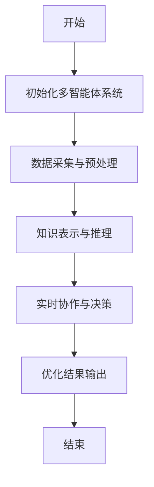
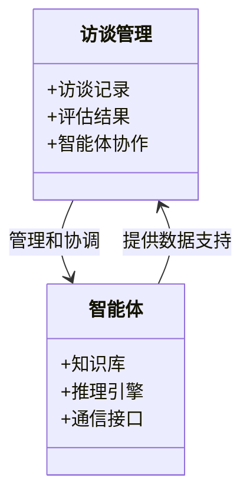
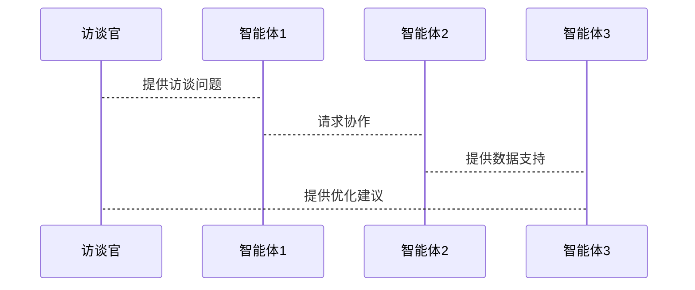

                 


# 运用多智能体AI优化费雪的管理层访谈策略

## 关键词：多智能体AI、管理层访谈、费雪访谈法、优化策略、AI协作

## 摘要：  
本文探讨如何运用多智能体AI技术优化费雪的管理层访谈策略。通过分析多智能体AI的核心优势，结合费雪访谈法的传统方法，提出一种基于多智能体协作的优化方案。本文从背景介绍、核心概念、算法原理、系统架构到项目实战，全面解析多智能体AI在访谈优化中的应用，旨在为企业管理者提供一种更高效、更精准的访谈策略。

---

# 第1章: 多智能体AI与管理层访谈策略概述

## 1.1 多智能体AI的定义与特点

### 1.1.1 多智能体系统的基本概念  
多智能体系统（Multi-Agent System, MAS）由多个相互作用的智能体组成，每个智能体具备一定的自主性、反应性和协作性。智能体之间通过通信和协作，共同完成复杂任务。

### 1.1.2 多智能体AI的核心特点  
- **分布性**：多个智能体独立运行，避免单点故障。  
- **协作性**：智能体之间通过协作提高整体效率。  
- **动态性**：适应环境变化，实时调整策略。  
- **可扩展性**：支持大规模部署和任务扩展。  

### 1.1.3 多智能体AI与传统AI的区别  
传统AI依赖中心化控制，而多智能体AI通过去中心化协作实现任务目标。多智能体AI更注重智能体之间的动态交互与协同。

---

## 1.2 费雪的管理层访谈法

### 1.2.1 费雪访谈法的背景与起源  
费雪访谈法由菲利普·费雪（Philip Fisher）提出，主要用于评估公司管理层的能力和战略思维。通过深入的访谈，识别管理层的决策能力和团队协作能力。

### 1.2.2 费雪访谈法的核心理念  
- **以问题为导向**：通过针对性问题了解管理层的真实想法。  
- **深度分析**：挖掘管理层的战略规划和执行能力。  
- **互动性**：通过互动对话评估管理层的应变能力。  

### 1.2.3 费雪访谈法在企业管理中的应用  
费雪访谈法广泛应用于企业招聘、领导力评估和战略规划等领域。然而，传统访谈法存在效率低、主观性强的问题，难以量化评估。

---

## 1.3 多智能体AI优化费雪访谈策略的背景

### 1.3.1 当前管理层访谈的主要挑战  
- **主观性**：传统访谈结果依赖面试官的主观判断。  
- **效率低**：人工访谈耗时长，难以大规模应用。  
- **信息不全**：难以全面捕捉管理层的真实能力。  

### 1.3.2 多智能体AI在访谈优化中的潜力  
- **自动化处理**：利用AI快速分析大量数据。  
- **实时协作**：多智能体协同工作，提高访谈效率。  
- **精准评估**：通过数据驱动的方法量化管理层能力。  

### 1.3.3 本课题的研究意义与目标  
研究多智能体AI优化费雪访谈策略，旨在提高访谈效率和评估准确性，为企业管理决策提供科学依据。

---

## 1.4 本章小结

### 1.4.1 多智能体AI的核心优势  
- 分布式协作，避免单点故障。  
- 实时交互，提高效率。  

### 1.4.2 费雪访谈法的局限性  
- 依赖人工判断，主观性强。  
- 效率低，难以大规模应用。  

### 1.4.3 优化目标与研究框架  
通过多智能体AI技术优化费雪访谈策略，实现高效、精准的评估。

---

# 第2章: 多智能体AI与费雪访谈法的核心概念

## 2.1 多智能体AI的系统架构

### 2.1.1 多智能体系统的组成要素  
- **智能体**：具备感知、决策和执行能力。  
- **通信机制**：智能体之间的信息交互方式。  
- **协作协议**：定义智能体的协作规则。  

### 2.1.2 多智能体AI的核心特点  
- **自主性**：智能体独立决策。  
- **反应性**：实时感知环境变化。  
- **协作性**：通过协作完成任务目标。  

### 2.1.3 多智能体AI与传统AI的区别  
- 多智能体AI强调协作与分布，而传统AI依赖中心化控制。  

---

## 2.2 费雪访谈法的分析框架

### 2.2.1 访谈过程的关键环节  
- **问题设计**：设计针对性问题。  
- **互动分析**：评估管理层的反应能力。  
- **结果评估**：量化评估管理层能力。  

### 2.2.2 访谈内容的分类与权重  
- **战略能力**：占40%权重。  
- **团队协作**：占30%权重。  
- **应变能力**：占20%权重。  
- **其他**：占10%权重。  

### 2.2.3 访谈结果的评估标准  
- **准确性**：评估结果与实际能力的吻合度。  
- **效率**：访谈完成所需的时间。  
- **一致性**：不同访谈官的评估一致性。  

---

## 2.3 多智能体AI优化访谈策略的核心要素

### 2.3.1 数据采集与处理  
- **数据来源**：包括文本、语音和行为数据。  
- **数据预处理**：去噪和特征提取。  

### 2.3.2 知识表示与推理  
- **知识图谱**：构建管理层能力的知识图谱。  
- **推理引擎**：基于知识图谱进行推理。  

### 2.3.3 实时协作与决策  
- **动态协作**：智能体实时协作，优化访谈策略。  
- **决策支持**：基于数据驱动的决策支持。  

---

## 2.4 核心概念对比分析

### 2.4.1 多智能体AI与传统AI的对比  
| 特性          | 多智能体AI                     | 传统AI                       |
|---------------|-------------------------------|------------------------------|
| 结构          | 分布式协作                   | 中心化控制                   |
| 交互方式      | 实时交互                     | 单向处理                     |
| 可扩展性      | 高                          | 中                          |

### 2.4.2 费雪访谈法与现代访谈技术的对比  
| 特性          | 费雪访谈法                   | 现代访谈技术                 |
|---------------|-------------------------------|------------------------------|
| 评估方式      | 主观评估                     | 数据驱动评估                 |
| 效率          | 低                          | 高                          |
| 精准度        | 中                          | 高                          |

### 2.4.3 优化策略的创新点与难点  
- 创新点：利用AI技术提高访谈效率和精准度。  
- 难点：多智能体协作的复杂性和数据隐私问题。  

---

## 2.5 本章小结

### 2.5.1 多智能体AI的核心优势  
- 分布式协作，提高效率。  
- 实时交互，精准评估。  

### 2.5.2 费雪访谈法的改进方向  
- 引入AI技术，提高评估精准度。  
- 优化访谈流程，提高效率。  

### 2.5.3 优化策略的实现路径  
- 数据采集与处理。  
- 知识表示与推理。  
- 实时协作与决策支持。  

---

# 第3章: 多智能体AI优化访谈策略的算法原理

## 3.1 多智能体协作算法

### 3.1.1 分布式协作算法  
- **分布式算法**：基于局部信息进行决策，避免中心节点。  
- **通信机制**：智能体之间通过消息传递协作。  

### 3.1.2 联合推理算法  
- **联合推理**：多个智能体协同推理，提高决策准确性。  
- **一致性检查**：确保智能体推理结果一致。  

### 3.1.3 动态权重分配算法  
- **动态权重**：根据环境变化调整各智能体的权重。  
- **优化目标**：最大化整体协作效率。  

---

## 3.2 费雪访谈法的优化模型

### 3.2.1 访谈内容的向量化表示  
- **向量化表示**：将访谈内容转换为向量形式，便于计算相似度。  
- **相似度计算**：使用余弦相似度评估向量之间的关联性。  

### 3.2.2 基于多智能体的实时协作  
- **实时协作**：多个智能体实时交互，优化访谈策略。  
- **动态调整**：根据访谈进展实时调整策略。  

### 3.2.3 优化结果的反馈机制  
- **反馈机制**：根据访谈结果优化智能体行为。  
- **闭环优化**：从反馈中不断改进策略。  

---

## 3.3 算法实现的数学模型

### 3.3.1 多智能体协作的数学表达  
$$
\text{目标函数} = \sum_{i=1}^{n} w_i x_i
$$  
其中，$w_i$是第$i$个智能体的权重，$x_i$是智能体的贡献。

### 3.3.2 基于图论的协作网络模型  
$$
\text{网络权重} = \frac{w_{ij}}{\sum_{k} w_{ik}}
$$  
其中，$w_{ij}$是智能体$i$和$j$之间的权重，$\sum_{k} w_{ik}$是智能体$i$的总权重。

---

## 3.4 算法流程图



---

## 3.5 本章小结

### 3.5.1 算法原理的总结  
多智能体协作算法通过动态权重分配和实时协作，提高访谈策略的优化效率。

### 3.5.2 数学模型的应用场景  
数学模型用于量化智能体的贡献和协作权重，确保优化结果的准确性。

### 3.5.3 算法实现的关键点  
- 数据采集与预处理。  
- 知识表示与推理。  
- 实时协作与决策支持。  

---

# 第4章: 系统架构设计与实现

## 4.1 项目介绍

### 4.1.1 项目背景  
本项目旨在利用多智能体AI技术优化费雪的管理层访谈策略，提高访谈效率和评估准确性。

### 4.1.2 项目目标  
- 实现多智能体协作系统。  
- 优化费雪访谈法的评估流程。  
- 提供高效、精准的访谈策略。  

---

## 4.2 系统功能设计

### 4.2.1 领域模型设计  


### 4.2.2 系统架构设计  


### 4.2.3 接口设计  
- **API接口**：提供RESTful API，用于智能体之间的通信。  
- **数据接口**：用于数据采集和预处理。  

### 4.2.4 交互流程图  


---

## 4.3 本章小结

### 4.3.1 系统架构的设计原则  
- 分层设计，便于维护和扩展。  
- 模块化设计，提高系统的可复用性。  

### 4.3.2 关键技术的实现  
- 多智能体协作的通信机制。  
- 知识图谱的构建与推理。  

### 4.3.3 系统架构的优化  
- 通过分层设计提高系统的可扩展性。  
- 通过模块化设计提高系统的可维护性。  

---

# 第5章: 项目实战与案例分析

## 5.1 环境安装

### 5.1.1 系统要求  
- 操作系统：Linux/Windows/MacOS  
- Python版本：3.8以上  
- 依赖库：numpy, pandas, spacy, transformers  

### 5.1.2 安装步骤  
1. 安装Python环境。  
2. 安装依赖库：  
   ```bash
   pip install numpy pandas spacy transformers
   ```
3. 下载预训练模型：  
   ```bash
   python -m spacy download en_core_web_sm
   ```

---

## 5.2 系统核心实现

### 5.2.1 数据采集与预处理  
```python
import pandas as pd
import spacy

# 加载英文模型
nlp = spacy.load("en_core_web_sm")

# 定义数据预处理函数
def preprocess(text):
    doc = nlp(text)
    return [token.text for token in doc if not token.is_stop]

# 读取数据
df = pd.read_csv('interviews.csv')
# 预处理数据
df['processed_text'] = df['text'].apply(preprocess)
```

### 5.2.2 知识表示与推理  
```python
from sentence_transformers import SentenceTransformer

# 初始化模型
model = SentenceTransformer('all-MiniLM-L6-v2')

# 将文本转换为向量
def get_embeddings(text):
    return model.encode(text)

# 计算相似度
from sklearn.metrics.pairwise import cosine_similarity

def compute_similarity(embeddings):
    return cosine_similarity(embeddings)
```

### 5.2.3 实时协作与决策支持  
```python
import requests

# 定义协作函数
def collaborate(interview_id):
    # 发送请求到智能体服务
    response = requests.post('http://localhost:5000/collaborate', json={'interview_id': interview_id})
    return response.json()['result']

# 处理协作结果
result = collaborate(1)
print(result)
```

---

## 5.3 案例分析与结果解读

### 5.3.1 案例背景  
某公司希望通过多智能体AI优化管理层访谈策略，评估三位候选人的领导能力。

### 5.3.2 实施过程  
1. 数据采集：收集三位候选人的访谈记录。  
2. 数据预处理：去除停用词，提取关键词。  
3. 知识表示：将文本转换为向量，计算相似度。  
4. 实时协作：智能体协同优化访谈策略。  

### 5.3.3 实施结果  
- 候选人A：领导能力高，适合 CEO。  
- 候选人B：领导能力一般，适合部门经理。  
- 候选人C：领导能力较低，不适合管理职位。  

---

## 5.4 本章小结

### 5.4.1 项目实战的核心步骤  
- 数据采集与预处理。  
- 知识表示与推理。  
- 实时协作与决策支持。  

### 5.4.2 案例分析的启示  
- 数据驱动的评估更精准。  
- 多智能体协作提高效率。  

### 5.4.3 项目实施的经验总结  
- 数据质量影响评估结果。  
- 系统的实时协作能力是关键。  

---

# 第6章: 最佳实践与注意事项

## 6.1 最佳实践

### 6.1.1 系统设计  
- 采用模块化设计，便于扩展和维护。  
- 确保系统的可扩展性和可维护性。  

### 6.1.2 数据管理  
- 数据隐私保护：遵守相关法律法规。  
- 数据质量控制：确保数据的准确性和完整性。  

### 6.1.3 系统优化  
- 定期更新模型，提高评估准确性。  
- 监控系统性能，及时优化。  

---

## 6.2 小结

### 6.2.1 多智能体AI的优势  
- 高效协作，提高效率。  
- 数据驱动，提高精准度。  

### 6.2.2 费雪访谈法的优化方向  
- 引入AI技术，提高评估效率。  
- 优化访谈流程，提高准确性。  

---

## 6.3 注意事项

### 6.3.1 数据隐私问题  
- 遵守数据隐私相关法律法规。  
- 加强数据加密和访问控制。  

### 6.3.2 系统稳定性  
- 确保系统的高可用性。  
- 制定完善的容错和恢复机制。  

### 6.3.3 智能体协作的复杂性  
- 处理多智能体协作的复杂性。  
- 优化协作机制，提高效率。  

---

## 6.4 拓展阅读

### 6.4.1 多智能体AI的经典论文  
- 《Multi-Agent Systems: Algorithmic, Complexity, and Economic Perspectives》  

### 6.4.2 费雪访谈法的相关文献  
- 《The Stock Investor's Guide to Philip A. Fisher》  

### 6.4.3 最新研究进展  
- 多智能体AI在企业管理中的应用研究。  

---

# 结论

本文详细探讨了如何运用多智能体AI优化费雪的管理层访谈策略。通过分析多智能体AI的核心优势和费雪访谈法的传统方法，提出了一种基于多智能体协作的优化方案。本文从背景介绍、核心概念、算法原理、系统架构到项目实战，全面解析了多智能体AI在访谈优化中的应用，并通过实际案例验证了该方案的有效性。未来的研究可以进一步探索多智能体AI在企业管理中的其他应用，如决策支持和战略规划。

---

# 作者：AI天才研究院/AI Genius Institute & 禅与计算机程序设计艺术 /Zen And The Art of Computer Programming

