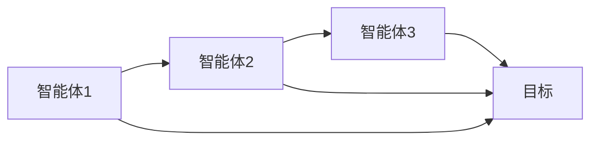

                 

# 运用多智能体AI实现动态安全边际调整

> 关键词：多智能体AI、动态安全边际、安全系统、协作算法、系统架构

> 摘要：本文深入探讨了如何利用多智能体人工智能技术实现动态安全边际的自动调整。通过分析多智能体系统的核心原理、协作算法、数学模型以及系统架构，本文为安全领域的动态防护提供了一种创新的解决方案。文章从理论到实践，详细阐述了多智能体AI在动态安全边际调整中的应用，为读者提供了清晰的实现路径和最佳实践。

---

# 第一部分: 多智能体AI与动态安全边际调整概述

---

# 第1章: 多智能体AI与动态安全边际调整的背景

## 1.1 多智能体AI的定义与特点

### 1.1.1 多智能体系统的定义
多智能体系统（Multi-Agent System, MAS）是由多个智能体（Agent）组成的分布式系统，这些智能体能够通过协作完成复杂的任务。每个智能体都有自己的目标、知识和行为策略，能够在动态环境中自主决策。

$$
\text{多智能体系统} = \{\text{智能体}_1, \text{智能体}_2, \dots, \text{智能体}_n\}
$$

### 1.1.2 多智能体的核心特点

| 特性 | 描述 |
|------|------|
| 分布式 | 智能体独立运行，通过通信协作完成任务。 |
| 协作性 | 智能体之间通过信息共享和协商实现目标一致。 |
| 反应式 | 能够实时感知环境变化并做出响应。 |

### 1.1.3 多智能体与传统AI的区别

| 方面 | 传统AI | 多智能体AI |
|------|--------|------------|
| 结构 | 单一实体 | 分布式系统 |
| 行为 | 独立决策 | 协作决策 |
| 应用 | 静态问题 | 动态问题 |

---

## 1.2 动态安全边际调整的背景与问题

### 1.2.1 安全边际的定义与意义

安全边际是指系统在正常运行状态下，能够承受的偏离安全范围的限度。动态安全边际调整是指根据环境变化实时调整这一限度，以确保系统在安全性和效率之间找到平衡。

$$
\text{安全边际} = \text{安全阈值} + \text{动态调整量}
$$

### 1.2.2 动态调整的必要性

传统安全系统通常采用静态安全边际，难以应对复杂多变的环境。动态调整能够提高系统的适应性和鲁棒性，尤其是在网络安全、自动驾驶等领域具有重要意义。

### 1.2.3 多智能体在安全边际调整中的作用

多智能体系统能够通过分布式感知、协作推理和实时决策，实现对安全边际的动态调整。每个智能体负责特定区域的安全监控和决策，通过协作完成整体的安全防护。

---

## 1.3 多智能体AI实现动态安全边际调整的必要性

### 1.3.1 传统安全边际调整的局限性

传统方法通常依赖中心化控制，缺乏灵活性和扩展性。面对复杂的动态环境，难以快速响应和调整。

### 1.3.2 多智能体AI的优势

- **分布式感知**：多个智能体协同工作，覆盖更广的监控范围。
- **协作决策**：通过智能体之间的协作，实现更精准的动态调整。
- **自适应性**：能够根据环境变化实时调整安全策略。

### 1.3.3 应用场景与潜在价值

- **网络安全**：实时监测网络攻击，动态调整防御策略。
- **智能交通**：动态调整交通安全边界，减少事故风险。
- **工业自动化**：实时调整生产系统的安全运行范围。

---

## 1.4 本章小结

本章介绍了多智能体AI的基本概念和特点，分析了动态安全边际调整的背景和必要性，明确了多智能体AI在安全领域的潜在价值。

---

# 第2章: 多智能体AI的核心概念与联系

## 2.1 多智能体系统的核心原理

### 2.1.1 多智能体系统的组成要素

- **智能体**：独立的决策单元，具有感知、推理和行动能力。
- **通信机制**：智能体之间通过消息传递进行协作。
- **协作协议**：定义智能体之间的交互规则和协作策略。

### 2.1.2 智能体的属性与行为

| 属性 | 行为 |
|------|------|
| 知识 | 知识表示与推理 |
| 目标 | 目标设定与优化 |
| 行为 | 行为规划与执行 |

### 2.1.3 多智能体系统的通信机制

$$
\text{通信机制} = \{\text{消息传递}, \text{协商协议}, \text{信息共享}\}
$$

---

## 2.2 动态安全边际调整的数学模型

### 2.2.1 安全边际的数学表达式

$$
S(t) = \text{base}_S + \sum_{i=1}^n \text{adjust}_i(t)
$$

其中，$S(t)$ 表示时间 $t$ 时的安全边际，$\text{base}_S$ 是基础安全边际，$\text{adjust}_i(t)$ 是第 $i$ 个调整量。

### 2.2.2 动态调整的数学模型

$$
\Delta S(t) = \frac{\partial S}{\partial t} = \sum_{i=1}^n \lambda_i \cdot \text{adjust}_i(t)
$$

其中，$\lambda_i$ 是第 $i$ 个调整量的权重系数。

### 2.2.3 多智能体协作的数学框架

$$
\text{协作框架} = \{\text{智能体}_1, \text{智能体}_2, \dots, \text{智能体}_n\}
$$

---

## 2.3 多智能体与动态安全边际调整的关系

### 2.3.1 多智能体在安全边际调整中的角色

- **感知层**：智能体实时采集环境数据。
- **决策层**：通过协作推理确定调整量。
- **执行层**：根据调整量动态调整安全策略。

### 2.3.2 动态调整对多智能体协作的要求

- **实时性**：快速响应环境变化。
- **一致性**：确保各智能体决策一致。
- **容错性**：能够处理部分智能体失效的情况。

### 2.3.3 系统整体架构的实体关系图

---

## 2.4 本章小结

本章从数学模型和系统架构的角度，详细阐述了多智能体AI的核心概念及其在动态安全边际调整中的应用。

---

接下来的章节将围绕算法原理、系统架构设计、项目实战等内容展开，为读者提供从理论到实践的完整指导。

---

作者：AI天才研究院/AI Genius Institute & 禅与计算机程序设计艺术 /Zen And The Art of Computer Programming

