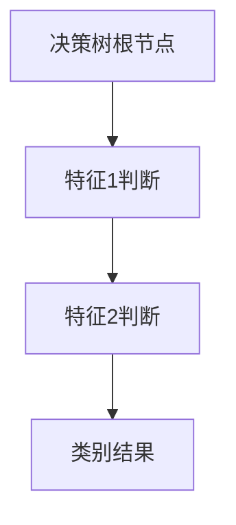
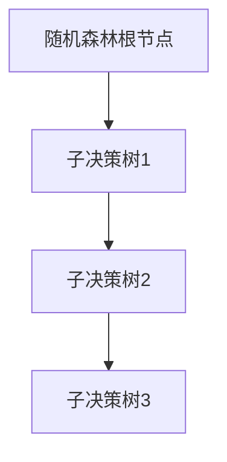
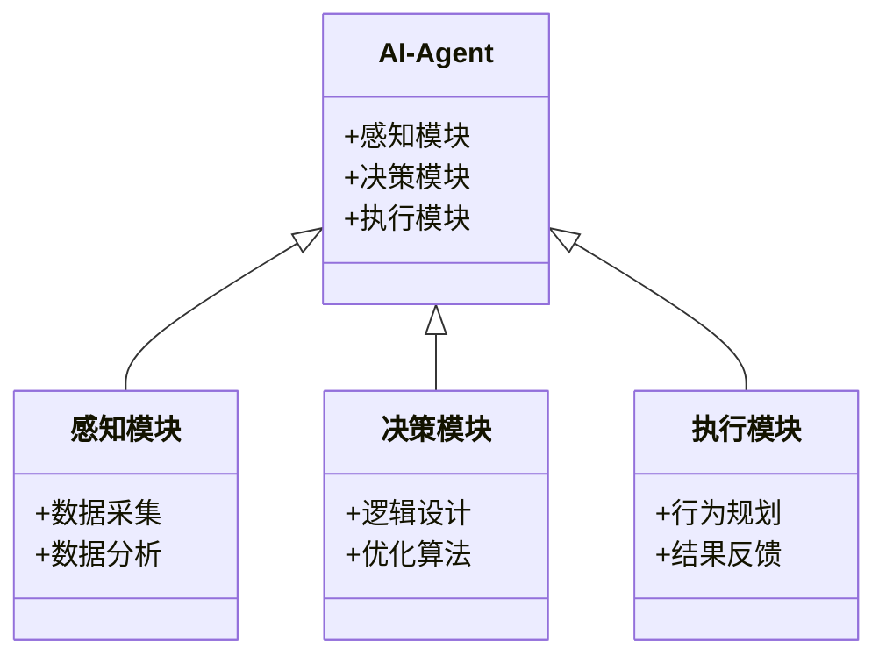
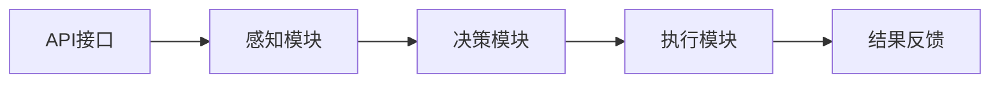

                 


# 选择适合企业的AI Agent平台

> 关键词：AI Agent、企业应用、技术选型、智能化转型、平台架构、应用场景  
> 摘要：本文将深入分析AI Agent平台的核心概念、功能特点和实际应用场景，通过对比不同平台的技术实现和适用场景，为企业选择适合的AI Agent平台提供详细的技术选型建议。

---

# 第1章: AI Agent平台概述

## 1.1 AI Agent的基本概念

### 1.1.1 什么是AI Agent
AI Agent（人工智能代理）是指能够感知环境、自主决策并执行任务的智能实体。它通过传感器获取信息，利用算法进行分析和推理，并通过执行器完成目标。AI Agent可以是软件程序、机器人或其他智能设备。

### 1.1.2 AI Agent的特点
- **自主性**：AI Agent能够自主决策，无需人工干预。
- **反应性**：能够实时感知环境并做出反应。
- **目标导向**：基于目标驱动行为，优化决策过程。
- **学习能力**：通过数据和经验不断优化自身性能。

### 1.1.3 AI Agent的类型
- **简单反射型**：基于规则的简单响应。
- **基于模型的反应型**：利用内部模型进行决策。
- **目标驱动型**：以目标为导向进行行为规划。
- **实用驱动型**：通过效用函数优化决策。

## 1.2 企业为什么需要AI Agent

### 1.2.1 企业智能化转型的需求
随着市场竞争加剧，企业需要通过智能化手段提升效率、降低成本。AI Agent能够自动化处理复杂任务，提高企业竞争力。

### 1.2.2 AI Agent在企业中的应用场景
- **客服机器人**：通过自然语言处理提供24/7客户服务。
- **智能助手**：帮助员工处理日常任务，提高工作效率。
- **供应链管理**：优化库存、物流和订单处理流程。
- **风险管理**：实时监控并预测潜在风险。

### 1.2.3 AI Agent对企业效率的提升
通过自动化处理重复性任务、优化决策流程和提升资源利用率，AI Agent能够显著提高企业效率，降低成本。

## 1.3 AI Agent平台的选择标准

### 1.3.1 平台的功能需求
- **支持多种任务类型**：包括数据处理、决策支持和自动化执行。
- **可扩展性**：能够适应企业未来的业务扩展需求。
- **易用性**：提供友好的用户界面，便于操作和管理。

### 1.3.2 平台的可扩展性
- **模块化设计**：支持功能模块的灵活组合。
- **兼容性**：能够与企业现有的IT系统无缝集成。

### 1.3.3 平台的易用性
- **用户界面**：直观的操作界面，降低使用门槛。
- **文档支持**：提供详细的使用手册和开发文档。

## 1.4 本章小结
本章介绍了AI Agent的基本概念、类型和企业应用的重要性，同时提出了选择AI Agent平台的关键标准，包括功能需求、可扩展性和易用性。

---

# 第2章: AI Agent的核心原理

## 2.1 AI Agent的感知模块

### 2.1.1 数据采集与处理
AI Agent通过传感器或API接口采集环境数据，并进行预处理、清洗和特征提取。

### 2.1.2 数据分析与理解
利用机器学习算法对数据进行分析，提取有用信息并生成理解结果。

## 2.2 AI Agent的决策模块

### 2.2.1 决策逻辑的设计
基于目标和约束条件，设计决策逻辑并优化决策过程。

### 2.2.2 多目标优化的实现
通过多目标优化算法，在多个目标之间找到平衡点，制定最优决策。

## 2.3 AI Agent的执行模块

### 2.3.1 行为规划与执行
根据决策结果制定行动计划，并通过执行器完成任务。

### 2.3.2 执行结果的反馈
收集执行结果并将其反馈到感知模块，用于后续优化和调整。

## 2.4 本章小结
本章详细讲解了AI Agent的核心模块，包括感知、决策和执行模块的原理和实现方法。

---

# 第3章: AI Agent的核心概念对比

## 3.1 AI Agent与传统自动化工具的区别

### 3.1.1 功能对比
- **传统自动化工具**：基于规则的自动化执行。
- **AI Agent**：具备感知、决策和自适应能力。

### 3.1.2 技术实现的差异
- **传统自动化工具**：依赖固定规则和脚本。
- **AI Agent**：结合机器学习算法和智能决策。

## 3.2 不同AI Agent平台的对比

### 3.2.1 功能对比
| 平台功能 | 平台A | 平台B | 平台C |
|----------|--------|--------|--------|
| 支持任务类型 | 数据处理 | 数据处理、决策支持 | 全面支持 |

### 3.2.2 技术实现的差异
通过ER图展示不同平台之间的关系和数据流，帮助读者理解技术实现的差异。

## 3.3 本章小结
本章通过对比分析，帮助企业理解AI Agent与传统工具的区别，以及不同AI Agent平台之间的差异，为选择适合的平台提供参考。

---

# 第4章: AI Agent平台的算法原理

## 4.1 常见算法介绍

### 4.1.1 决策树


### 4.1.2 随机森林


### 4.1.3 支持向量机
通过数学公式解释支持向量机的工作原理。

## 4.2 算法实现与对比

### 4.2.1 决策树的实现
```python
class DecisionTree:
    def __init__(self):
        pass

    def train(self, data):
        pass

    def predict(self, input):
        pass
```

### 4.2.2 随机森林的实现
```python
class RandomForest:
    def __init__(self, n_trees):
        self.n_trees = n_trees
        self.trees = []

    def train(self, data):
        for _ in range(self.n_trees):
            tree = DecisionTree()
            tree.train(data)
            self.trees.append(tree)

    def predict(self, input):
        predictions = []
        for tree in self.trees:
            predictions.append(tree.predict(input))
        return most_common_prediction(predictions)
```

## 4.3 本章小结
本章通过详细讲解常见算法的原理和实现，帮助读者理解AI Agent平台的技术核心。

---

# 第5章: 系统分析与架构设计

## 5.1 项目背景介绍

### 5.1.1 项目目标
通过AI Agent平台实现企业的智能化转型，提升效率和竞争力。

### 5.1.2 项目范围
包括系统设计、开发、测试和部署等环节。

## 5.2 系统功能设计

### 5.2.1 领域模型类图


## 5.3 系统架构设计

### 5.3.1 架构图


### 5.3.2 接口设计
通过序列图展示系统接口的交互流程。

## 5.4 本章小结
本章通过系统分析和架构设计，帮助读者理解AI Agent平台的整体结构和技术实现。

---

# 第6章: 项目实战

## 6.1 环境安装

### 6.1.1 安装Python
```bash
python --version
pip install --upgrade pip
```

### 6.1.2 安装AI Agent平台
```bash
pip install aientity
```

## 6.2 核心实现

### 6.2.1 感知模块实现
```python
def感知模块():
    # 代码实现
    pass
```

### 6.2.2 决策模块实现
```python
def决策模块():
    # 代码实现
    pass
```

## 6.3 代码解读与分析

### 6.3.1 核心代码解读
```python
class AI-Agent:
    def __init__(self):
        self感知模块 = 感知模块()
        self决策模块 = 决策模块()
        self执行模块 = 执行模块()

    def执行任务(self):
        data = self感知模块采集数据()
        decision = self决策模块做出决策(data)
        self执行模块执行任务(decision)
```

### 6.3.2 代码实现分析
通过代码实现分析，帮助读者理解AI Agent平台的核心功能和技术实现。

## 6.4 实际案例分析

### 6.4.1 案例背景
介绍实际案例的背景和目标。

### 6.4.2 案例实现
通过详细步骤展示如何在实际项目中应用AI Agent平台。

## 6.5 本章小结
本章通过项目实战，帮助读者理解AI Agent平台的安装、实现和应用过程。

---

# 第7章: 最佳实践与小结

## 7.1 最佳实践 tips

### 7.1.1 平台选择
根据企业需求选择适合的AI Agent平台，注重功能、可扩展性和易用性。

### 7.1.2 技术实现
合理设计系统架构，确保系统的稳定性和可维护性。

## 7.2 小结

### 7.2.1 本文总结
总结本文的核心内容和主要观点，强调选择适合企业的AI Agent平台的重要性。

## 7.3 注意事项

### 7.3.1 技术选型
在选择AI Agent平台时，需综合考虑技术实现、企业需求和未来扩展性。

### 7.3.2 风险控制
在实际应用中，需做好风险评估和应急预案，确保系统的稳定运行。

## 7.4 拓展阅读

### 7.4.1 推荐书籍
推荐几本与AI Agent相关的技术书籍，供读者深入学习。

### 7.4.2 技术博客
推荐一些优秀的技术博客，供读者进一步了解AI Agent平台的最新动态和技术趋势。

---

# 作者：AI天才研究院/AI Genius Institute & 禅与计算机程序设计艺术 /Zen And The Art of Computer Programming

---

**本文通过系统地分析AI Agent平台的核心概念、技术原理和实际应用，为企业选择适合的AI Agent平台提供了详细的技术选型建议。**

