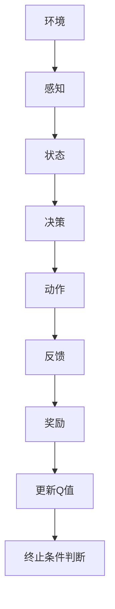
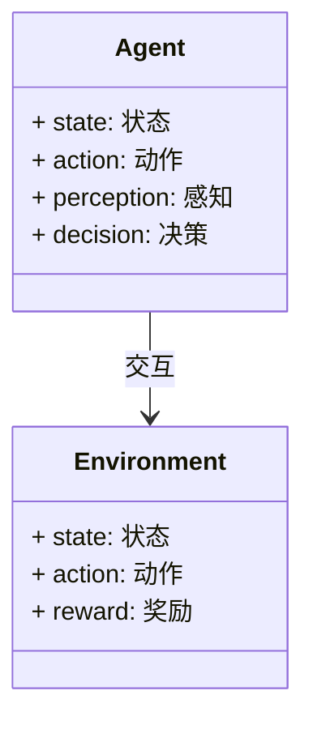
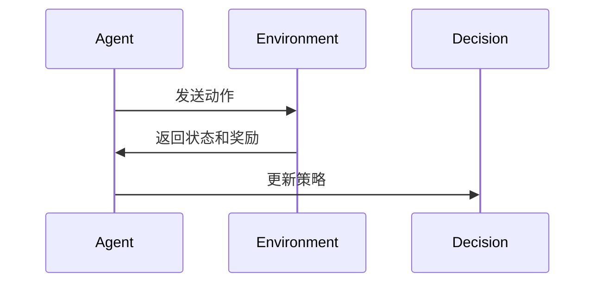

                 


# 选择适合的技术栈：构建高效AI Agent

> 关键词：AI Agent，技术栈选择，高效构建，算法原理，系统架构，项目实战

> 摘要：选择适合的技术栈对于构建高效AI Agent至关重要。本文将从AI Agent的基本概念、技术栈选择、算法原理、系统架构、项目实战等方面，详细阐述如何选择适合的技术栈，并结合实际案例进行分析。文章内容丰富，结构清晰，旨在帮助读者掌握AI Agent的核心技术，并能够实际应用于项目中。

---

# 第1章: AI Agent 的基本概念与重要性

## 1.1 AI Agent 的定义与特点

### 1.1.1 AI Agent 的定义

AI Agent（人工智能代理）是指能够感知环境、自主决策并执行任务的智能实体。它可以是一个软件程序、机器人或其他智能系统，通过与环境交互，实现特定目标。

### 1.1.2 AI Agent 的核心特点

- **自主性**：AI Agent能够在没有外部干预的情况下自主运行。
- **反应性**：能够实时感知环境变化并做出反应。
- **目标导向**：所有行为都以实现特定目标为导向。
- **学习能力**：能够通过经验或数据优化自身行为。

### 1.1.3 AI Agent 与传统 AI 的区别

AI Agent不仅能够执行任务，还能够与环境动态交互，传统AI则更多关注静态问题的解决。

---

## 1.2 技术栈选择的重要性

### 1.2.1 技术栈选择的背景

AI Agent的实现涉及算法、编程语言、框架等多个方面，选择合适的组合能够显著提升性能和开发效率。

### 1.2.2 技术栈选择的核心问题

- **算法选择**：强化学习、监督学习等算法的适用场景。
- **编程语言**：Python、Java等语言的优缺点。
- **框架选择**：TensorFlow、PyTorch等框架的特性。

### 1.2.3 技术栈选择的边界与外延

技术栈的选择需要综合考虑性能、开发效率、团队能力等因素。

---

## 1.3 构建高效 AI Agent 的重要性

### 1.3.1 高效 AI Agent 的目标

在有限资源下最大化任务完成效率，降低延迟，提升用户体验。

### 1.3.2 高效 AI Agent 的应用场景

- 智能客服
- 自动交易
- 游戏AI
- 自动驾驶

### 1.3.3 高效 AI Agent 的实现挑战

- 复杂环境的适应性
- 多目标优化的平衡
- 实时决策的效率

---

## 1.4 本章小结

本章介绍了AI Agent的基本概念、技术栈选择的重要性以及构建高效AI Agent的意义。

---

# 第2章: AI Agent 的核心概念原理

## 2.1 AI Agent 的核心原理

### 2.1.1 AI Agent 的基本原理

AI Agent通过感知环境信息，利用算法做出决策，并执行动作以实现目标。

### 2.1.2 AI Agent 的工作流程

1. 环境感知
2. 状态识别
3. 决策制定
4. 动作执行

### 2.1.3 AI Agent 的核心算法

- 强化学习
- 监督学习
- 贝叶斯推理

---

## 2.2 AI Agent 的核心概念对比

### 2.2.1 不同 AI Agent 技术栈的对比

| 技术栈 | 优点 | 缺点 |
|--------|------|------|
| Python + TensorFlow | 易用性高，库丰富 | 适合小规模任务 |
| Java + DL4J | 高并发能力 | 学习曲线陡峭 |

### 2.2.2 AI Agent 核心概念的特征对比（表格）

---

## 2.3 AI Agent 的 ER 实体关系图

```mermaid
erDiagram
    agent : AI Agent
    environment : 环境
    action : 动作
    perception : 感知
    decision : 决策
    goal : 目标
    agent --> environment : 交互
    agent --> action : 执行
    environment --> perception : 感知
    agent --> decision : 制定
    decision --> goal : 优化
```

---

# 第3章: AI Agent 的算法原理与数学模型

## 3.1 强化学习算法

### 3.1.1 Q-Learning 算法

Q-Learning是一种经典的强化学习算法，适用于离散动作空间。

### 3.1.2 DQN 算法

DQN（Deep Q-Network）通过神经网络近似Q值函数，适用于复杂环境。

### 3.1.3 算法流程图



### 3.1.4 数学公式

Q-Learning的更新公式为：

$$ Q(s, a) \leftarrow Q(s, a) + \alpha (r + \max_{a'} Q(s', a') - Q(s, a)) $$

其中：
- \( Q(s, a) \)：当前状态 \( s \) 下动作 \( a \) 的Q值。
- \( \alpha \)：学习率。
- \( r \)：奖励值。
- \( \max_{a'} Q(s', a') \)：下一个状态下的最大Q值。

---

## 3.2 监督学习算法

### 3.2.1 线性回归

简单线性回归用于预测任务，数学公式为：

$$ y = \theta x + b $$

### 3.2.2 支持向量机

适用于分类任务，通过最大化间隔实现。

---

## 3.3 贝叶斯推理

### 3.3.1 贝叶斯网络

通过概率推理进行决策，适用于不确定性环境。

---

# 第4章: AI Agent 的系统架构设计

## 4.1 问题场景介绍

构建一个高效的AI Agent需要考虑环境、算法、硬件等多方面因素。

### 4.2 系统功能设计



### 4.3 系统架构设计

```mermaid
graph TD
    Agent --> Environment : 交互
    Agent --> Perception : 感知
    Agent --> Decision : 决策
    Agent --> Action : 执行
```

---

## 4.4 系统接口设计

- 输入接口：接收环境反馈
- 输出接口：发送决策动作

---

## 4.5 系统交互设计



---

# 第5章: AI Agent 的项目实战

## 5.1 环境安装

安装Python、TensorFlow、Keras等工具。

## 5.2 核心代码实现

### 5.2.1 Q-Learning 实现

```python
import numpy as np

class Agent:
    def __init__(self, state_space, action_space):
        self.state_space = state_space
        self.action_space = action_space
        self.Q = np.zeros((state_space, action_space))

    def act(self, state):
        return np.argmax(self.Q[state, :])

    def learn(self, state, action, reward, next_state):
        self.Q[state, action] += 0.1 * (reward + np.max(self.Q[next_state, :]) - self.Q[state, action])
```

### 5.2.2 实际案例分析

以一个简单的迷宫导航问题为例，展示AI Agent如何学习路径规划。

---

## 5.3 项目小结

通过实战项目，掌握了技术栈选择和算法实现的关键点。

---

# 第6章: 最佳实践与注意事项

## 6.1 小结

选择适合的技术栈能够显著提升AI Agent的性能和开发效率。

## 6.2 注意事项

- 确保算法与场景匹配
- 定期优化和调整参数
- 注意硬件资源限制

## 6.3 拓展阅读

推荐相关书籍和论文，进一步深入学习。

---

# 作者

作者：AI天才研究院 & 禅与计算机程序设计艺术

