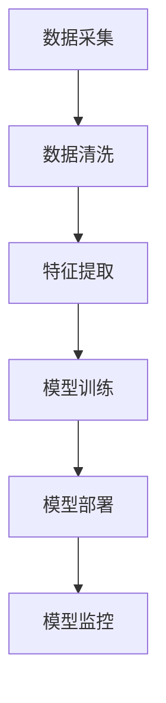
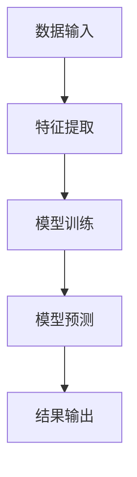
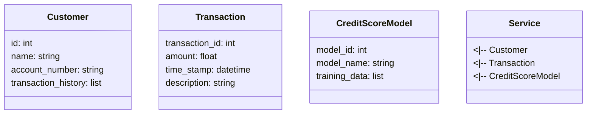
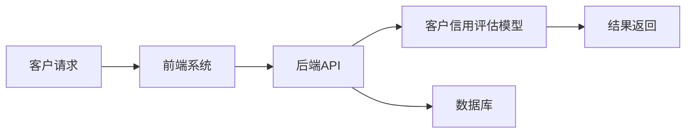
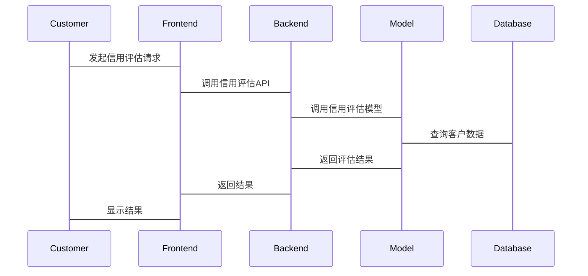

                 


# 《金融AI应用的DevOps流程设计与实施》

## 关键词：金融AI、DevOps、机器学习、自动化部署、持续集成、系统架构

## 摘要：  
本文详细探讨了金融AI应用的DevOps流程设计与实施，从背景介绍、核心概念、算法原理到系统架构、项目实战，结合实际案例和最佳实践，深入分析了金融AI应用与DevOps结合的关键环节。文章通过清晰的结构和丰富的图表，帮助读者理解如何在金融领域高效实施AI应用的DevOps流程。

---

## 第一部分: 金融AI应用的背景与基础

### 第1章: 金融AI应用的背景与概述

#### 1.1 金融AI应用的背景
- **1.1.1 金融行业的数字化转型**  
  随着科技的发展，金融行业正经历从传统模式向数字化、智能化转型的过程。AI技术的引入极大地提升了金融服务的效率和精准度，例如智能投顾、风险管理、欺诈检测等领域。

- **1.1.2 AI技术在金融领域的应用现状**  
  当前，AI技术在金融领域的应用已较为广泛，包括股票预测、客户画像、信用评估、交易自动化等。然而，AI模型的复杂性和金融数据的敏感性也带来了新的挑战。

- **1.1.3 金融AI应用的核心问题与挑战**  
  金融AI应用面临数据隐私、模型解释性、实时性要求高等挑战，同时需要结合DevOps理念，实现快速迭代和高效部署。

#### 1.2 DevOps的定义与特点
- **1.2.1 DevOps的基本概念**  
  DevOps是一种强调开发（Development）和运维（Operations）协作的实践方法，旨在通过自动化工具和流程提高软件交付效率。

- **1.2.2 DevOps的核心理念与优势**  
  DevOps通过持续集成、持续交付（CI/CD）和自动化运维，显著提高了软件开发的效率和稳定性。其优势包括缩短交付周期、提高代码质量、降低运维成本等。

- **1.2.3 DevOps在金融行业中的应用前景**  
  金融行业对系统的稳定性和安全性要求极高，DevOps的引入可以帮助金融机构更快响应市场需求，同时降低运维风险。

#### 1.3 金融AI应用与DevOps的结合
- **1.3.1 金融AI应用的业务场景**  
  金融AI应用的典型场景包括智能投顾、风险评估、欺诈检测、高频交易等。

- **1.3.2 DevOps在金融AI应用中的作用**  
  DevOps为金融AI应用提供了高效的开发和部署流程，特别是在模型迭代、代码管理和环境配置方面具有重要作用。

- **1.3.3 金融AI应用与DevOps的融合趋势**  
  随着AI技术的快速发展，金融AI应用与DevOps的结合将更加紧密，通过自动化流程实现AI模型的快速迭代和部署。

---

## 第二部分: 金融AI应用的核心概念与联系

### 第2章: 金融AI应用的核心概念

#### 2.1 金融AI应用的核心要素
- **2.1.1 数据：金融AI应用的基础**  
  数据是AI模型的核心输入，金融数据包括股票价格、客户交易记录、市场新闻等。数据的清洗、预处理和特征提取是模型训练的关键步骤。

- **2.1.2 模型：金融AI应用的核心**  
  模型是AI应用的“大脑”，常用的模型包括线性回归、随机森林、神经网络等。模型的选择和优化直接影响应用的效果。

- **2.1.3 算法：金融AI应用的驱动**  
  算法是模型实现的核心，不同的算法适用于不同的金融场景。例如，时间序列分析适用于股票预测，分类算法适用于欺诈检测。

#### 2.2 金融AI应用的实体关系图

**ER实体关系图：**

```mermaid
erd
    Customer
    --------
    id: int
    name: string
    account_number: string
    transaction_history: string

    Stock
    ------
    stock_id: int
    stock_name: string
    stock_price: float
    time_stamp: datetime

    Model
    ------
    model_id: int
    model_name: string
    model_type: string
    training_data: string
```

#### 2.3 金融AI应用的流程图



### 第3章: DevOps流程的关键环节

#### 3.1 DevOps的核心流程

- **3.1.1 CI/CD：持续集成与持续交付**  
  CI（持续集成）通过自动化工具将代码频繁合并到主分支，确保代码的健康性。CD（持续交付）则确保代码可以随时部署到生产环境。

- **3.1.2 持续监控与反馈**  
  通过实时监控系统运行状态，快速发现和解决问题，同时为开发团队提供反馈，优化后续开发。

- **3.1.3 持续优化与改进**  
  基于监控数据和用户反馈，持续优化系统性能和用户体验。

#### 3.2 金融AI应用中的DevOps流程

- **3.2.1 数据准备与模型开发的DevOps实践**  
  数据工程师和数据科学家通过协作实现数据的准备和模型的开发，确保数据质量和模型性能。

- **3.2.2 模型部署与监控的DevOps实践**  
  通过自动化工具将模型部署到生产环境，并实时监控模型的性能和预测结果。

- **3.2.3 环境配置与版本管理**  
  使用容器化技术（如Docker）和版本控制系统（如Git）实现环境的统一管理和版本控制。

---

## 第三部分: 金融AI应用的算法原理

### 第4章: 金融AI应用的算法原理

#### 4.1 金融AI应用中的常见算法
- **4.1.1 线性回归**  
  用于预测连续型变量，如股票价格。  
  $$ y = \beta_0 + \beta_1x + \epsilon $$

- **4.1.2 随机森林**  
  用于分类和回归问题，适合处理高维数据。  
  ```python
  from sklearn.ensemble import RandomForestClassifier
  model = RandomForestClassifier(n_estimators=100)
  model.fit(X_train, y_train)
  ```

- **4.1.3 神经网络**  
  用于复杂非线性关系的建模，如深度学习在金融时间序列分析中的应用。

#### 4.2 算法原理的数学模型
- **随机森林算法**  
  随机森林通过生成多个决策树并进行投票或平均，提高模型的泛化能力。  
  $$ y = \text{多数投票}(\{y_1, y_2, ..., y_n\}) $$

- **神经网络算法**  
  神经网络通过多层非线性激活函数实现复杂的特征提取。  
  $$ a^{(l+1)} = \sigma(w^{(l)}a^{(l)} + b^{(l)}) $$

#### 4.3 算法流程图



---

## 第四部分: 金融AI应用的系统分析与架构设计

### 第5章: 金融AI应用的系统分析与架构设计

#### 5.1 问题场景介绍
- **场景描述**  
  某银行需要开发一个基于AI的客户信用评估系统，通过客户的历史交易数据和行为数据，预测客户的信用风险。

#### 5.2 系统功能设计

**领域模型类图：**



#### 5.3 系统架构设计

**系统架构图：**



#### 5.4 系统接口设计

- **API接口定义**  
  - GET /api/v1/credit-score?customer_id=123
  - POST /api/v1/train-model

#### 5.5 系统交互流程图



---

## 第五部分: 金融AI应用的项目实战

### 第6章: 金融AI应用的项目实战

#### 6.1 环境安装
- **Python环境配置**  
  使用Anaconda或virtualenv管理Python环境，安装必要的库，如Pandas、Scikit-learn、TensorFlow等。

- **Docker安装与配置**  
  使用Docker容器化部署模型服务，确保环境一致性。

#### 6.2 系统核心实现源代码

**核心代码示例：**

```python
# 模型训练代码
from sklearn.ensemble import RandomForestClassifier
import pandas as pd

# 加载数据
data = pd.read_csv('credit_data.csv')
X = data.drop('credit_score', axis=1)
y = data['credit_score']

# 划分训练集和测试集
from sklearn.model_selection import train_test_split
X_train, X_test, y_train, y_test = train_test_split(X, y, test_size=0.2)

# 训练模型
model = RandomForestClassifier(n_estimators=100)
model.fit(X_train, y_train)

# 保存模型
import joblib
joblib.dump(model, 'credit_score_model.pkl')
```

#### 6.3 案例分析与详细讲解
- **案例背景**  
  某银行希望通过AI技术预测客户的信用评分，降低信贷风险。

- **数据预处理**  
  清洗数据，处理缺失值和异常值，进行特征工程。

- **模型训练与优化**  
  使用随机森林模型进行训练，并通过网格搜索优化模型参数。

- **模型部署与测试**  
  将训练好的模型部署到生产环境，进行实时预测和结果分析。

#### 6.4 项目小结
- **项目成果**  
  成功开发并部署了一个基于AI的客户信用评估系统，显著提高了信贷审批的效率和准确性。

- **经验总结**  
  在金融AI应用的开发过程中，数据质量和模型解释性是关键，同时DevOps流程的引入极大提升了开发效率。

---

## 第六部分: 金融AI应用的最佳实践与总结

### 第7章: 金融AI应用的最佳实践

#### 7.1 最佳实践 tips
- **数据安全与隐私保护**  
  在金融AI应用中，必须严格遵守数据隐私法规，确保数据的安全性。

- **模型解释性与可解释性**  
  选择具有较高解释性的模型，便于业务人员理解和监管合规。

- **持续监控与优化**  
  实时监控模型性能，根据反馈不断优化模型和部署流程。

#### 7.2 小结
- **核心内容回顾**  
  本文从背景、核心概念、算法原理到系统架构和项目实战，全面探讨了金融AI应用的DevOps流程设计与实施。

#### 7.3 注意事项
- **数据质量管理**  
  数据的清洗和特征工程是模型训练的关键，必须重视数据质量。

- **模型部署与维护**  
  模型部署后需要持续监控和维护，确保系统的稳定性和准确性。

#### 7.4 拓展阅读
- **推荐书籍**  
  《金融数据分析与机器学习实战》、《DevOps实践指南》

---

## 作者：AI天才研究院/AI Genius Institute & 禅与计算机程序设计艺术/Zen And The Art of Computer Programming

---

以上是《金融AI应用的DevOps流程设计与实施》的完整目录和内容概要，涵盖了从背景介绍到项目实战的各个方面，结合了理论与实践，为读者提供了全面的指导和参考。

