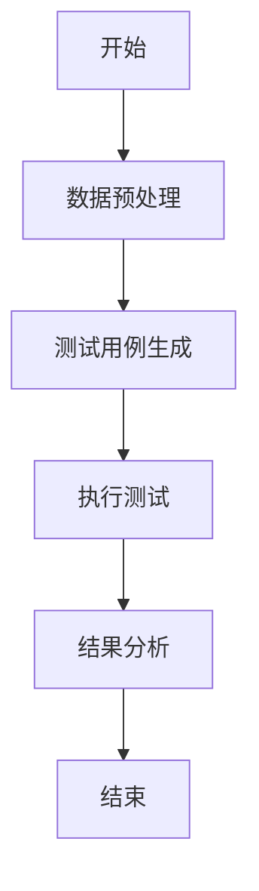
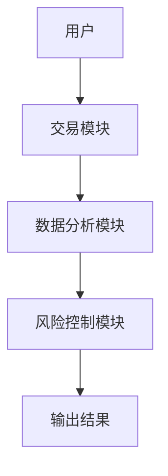
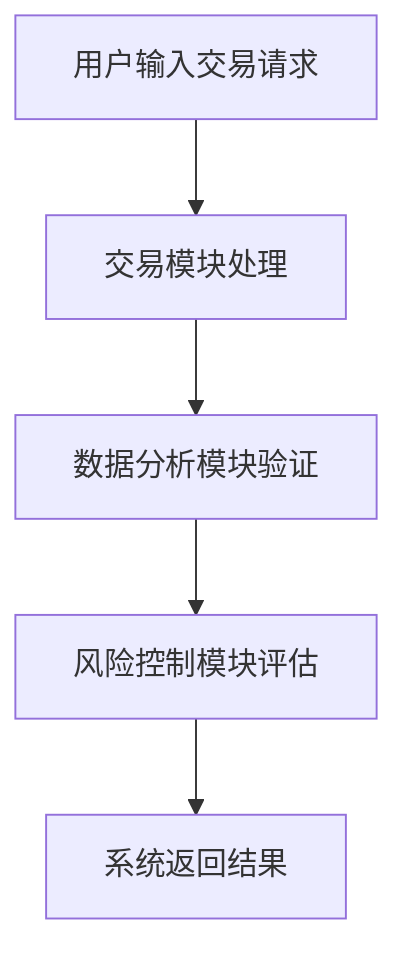

                 


# 第三章: 金融AI应用测试算法原理

## 3.1 测试算法的核心原理

### 3.1.1 测试数据的生成与处理
金融AI应用的测试数据需要涵盖多种场景，包括正常交易、异常交易、边界条件等。数据生成需要考虑金融市场的波动性、交易时间窗口、用户行为模式等因素。数据预处理包括数据清洗、特征提取和数据增强。

### 3.1.2 测试用例的设计与优化
测试用例的设计需要基于金融业务逻辑，确保覆盖所有关键路径。测试用例的优化可以通过遗传算法或模拟退火算法来提高覆盖率和减少冗余。

### 3.1.3 测试结果的分析与评估
测试结果的分析需要结合业务指标和模型指标，如准确率、召回率、F1分数等。同时，还需要考虑模型的可解释性和鲁棒性。

## 3.2 测试算法的数学模型

### 3.2.1 测试数据的特征提取
特征提取是测试数据处理的关键步骤，可以通过主成分分析（PCA）或因子分析（FA）来降维。

$$
\text{PCA: } X = X_{\text{主成分}} \cdot P^T + \mu
$$

其中，$P$是主成分矩阵，$\mu$是均值向量。

### 3.2.2 测试用例的覆盖率计算
测试覆盖率可以通过以下公式计算：

$$
\text{覆盖率} = \frac{\text{已测试的用例数}}{\text{总用例数}} \times 100\%
$$

### 3.2.3 测试结果的误差分析
误差分析可以通过回归分析或贝叶斯网络进行，帮助识别模型的弱点和改进方向。

## 3.3 测试算法的mermaid流程图



## 3.4 本章小结

---

# 第四章: 金融AI应用的测试技术与工具

## 4.1 测试技术的选择与应用

### 4.1.1 常用测试工具
常用的金融AI测试工具包括：
- **Selenium**: 用于自动化测试用户界面和交易流程。
- **TestComplete**: 支持自动化测试和数据驱动测试。
- **JMeter**: 用于性能测试和压力测试。

### 4.1.2 测试框架的设计
测试框架的设计需要考虑模块化、可扩展性和可维护性。推荐使用BDD（行为驱动开发）框架，通过`Cucumber`进行测试用例编写和执行。

## 4.2 测试工具的安装与配置

### 4.2.1 环境搭建
安装Python 3.8以上版本，安装必要的库：

```bash
pip install selenium pytest pytest-cov
```

### 4.2.2 测试框架的实现
实现一个简单的测试框架：

```python
# conftest.py
import pytest
from selenium import webdriver

@pytest.fixture
def browser():
    driver = webdriver.Chrome()
    yield driver
    driver.quit()
```

## 4.3 自动化测试的代码实现

### 4.3.1 测试用例编写
编写一个测试交易流程的用例：

```python
# test_trading.py
def test_trading(browser):
    browser.get("http://example.com/trading")
    browser.find_element_by_id("username").send_keys("testuser")
    browser.find_element_by_id("password").send_keys("testpass")
    browser.find_element_by_xpath("//button[@type='submit']").click()
    assert "欢迎" in browser.title
```

### 4.3.2 测试报告生成
使用`pytest-cov`生成测试报告：

```bash
pytest test_trading.py -v --cov
```

## 4.4 模型测试与验证

### 4.4.1 模型预测准确性测试
通过对比实际结果和模型预测结果来验证模型的准确性：

```python
def test_model_accuracy():
    actual = [1, 2, 3, 4]
    predicted = [1, 2, 4, 4]
    accuracy = sum(actual == predicted) / len(actual)
    assert accuracy >= 0.8
```

## 4.5 本章小结

---

# 第五章: 金融AI应用的系统架构与设计

## 5.1 系统架构设计

### 5.1.1 系统功能模块
金融AI应用的系统架构包括：
- 用户模块
- 交易模块
- 风险控制模块
- 数据分析模块

### 5.1.2 系统架构图


## 5.2 系统接口设计

### 5.2.1 API接口定义
常用接口包括：
- `POST /api/trade`: 提交交易请求
- `GET /api/history`: 获取交易历史
- `PUT /api/risk`: 更新风险参数

### 5.2.2 接口测试用例
编写接口测试用例：

```python
# test_api.py
import requests

def test_api_trade():
    response = requests.post("http://example.com/api/trade", json={"amount": 100, "type": "buy"})
    assert response.status_code == 200
```

## 5.3 系统交互设计

### 5.3.1 交互流程图


## 5.4 本章小结

---

# 第六章: 金融AI应用的项目实战

## 6.1 环境搭建与配置

### 6.1.1 开发环境
安装必要的工具和库：

```bash
pip install numpy pandas scikit-learn
```

### 6.1.2 项目结构
项目结构如下：

```
project/
├── data/
├── models/
├── tests/
│   └── test_trading.py
└── requirements.txt
```

## 6.2 核心代码实现

### 6.2.1 数据处理代码
```python
# data_processor.py
import pandas as pd

def load_data(path):
    df = pd.read_csv(path)
    return df
```

### 6.2.2 模型训练代码
```python
# model_trainer.py
from sklearn.ensemble import RandomForestClassifier

def train_model(X, y):
    model = RandomForestClassifier()
    model.fit(X, y)
    return model
```

## 6.3 测试用例设计与执行

### 6.3.1 测试用例设计
设计测试用例，确保覆盖所有关键功能：

```python
# test_core.py
def test_model_prediction():
    X = [[1, 2, 3], [4, 5, 6]]
    y = [0, 1]
    model = train_model(X, y)
    assert model.predict(X) == y
```

### 6.3.2 测试结果分析
运行测试并分析结果：

```bash
pytest tests/ -v
```

## 6.4 本章小结

---

# 第七章: 金融AI应用测试与质量保证的最佳实践

## 7.1 最佳实践与经验分享

### 7.1.1 测试环境管理
确保测试环境与生产环境一致，避免环境差异导致的测试失败。

### 7.1.2 持续集成与持续测试
使用Jenkins或GitHub Actions进行持续集成和持续测试，确保代码质量。

### 7.1.3 可视化测试报告
生成详细的测试报告，包括覆盖率、错误分布等信息，方便团队分析和优化。

## 7.2 未来趋势与发展建议

### 7.2.1 自动化测试的深化
随着AI模型的复杂性增加，自动化测试将更加重要。

### 7.2.2 可解释性测试
未来，模型的可解释性测试将成为重点，确保模型决策的透明性和合理性。

## 7.3 小结

---

# 附录: 工具与技术参考资料

## 附录A: 测试工具列表

| 工具名称 | 描述 | 官网链接 |
|----------|------|----------|
| Selenium  | 自动化测试工具 | [官网](https://www.selenium.dev) |
| TestComplete | 全功能测试工具 | [官网](https://www.testcomplete.com) |
| JMeter     | 性能测试工具 | [官网](https://jmeter.apache.org) |

## 附录B: 开发库与框架

| 库名称 | 描述 | 安装命令 |
|--------|------|----------|
| pytest  | 测试框架 | `pip install pytest` |
| scikit-learn | 机器学习库 | `pip install scikit-learn` |
| Cucumber | BDD测试框架 | `pip install pytest-cucumber` |

---

# 作者：AI天才研究院/AI Genius Institute & 禅与计算机程序设计艺术 /Zen And The Art of Computer Programming

