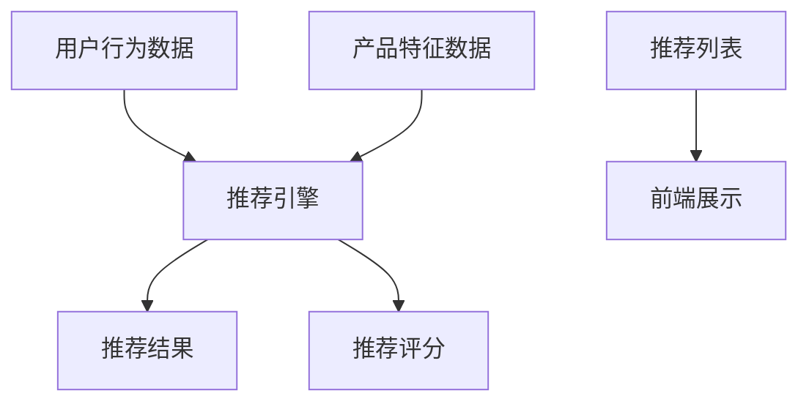
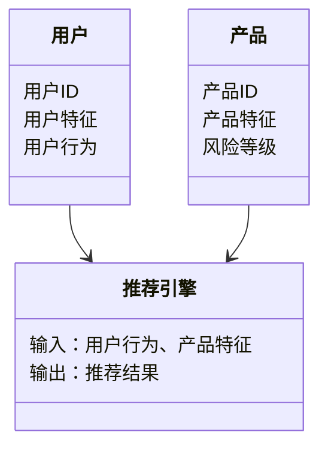
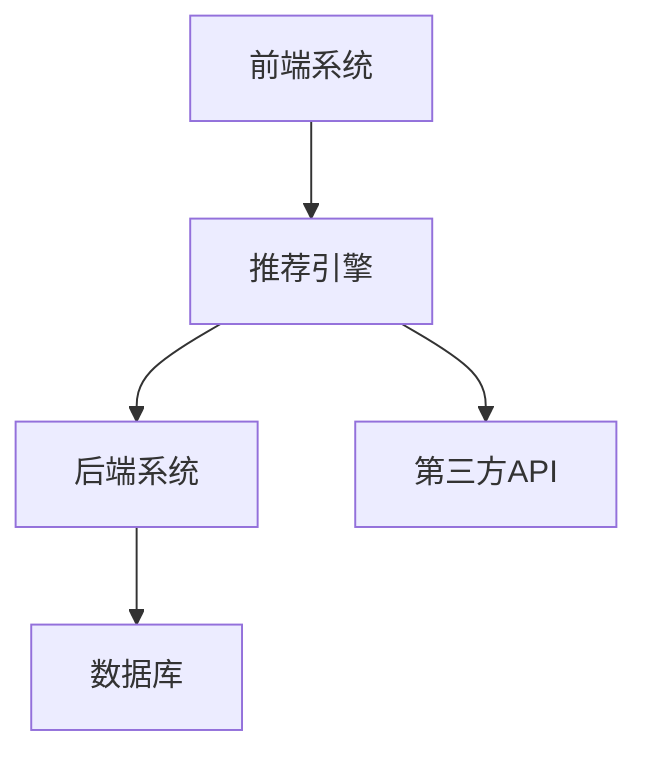
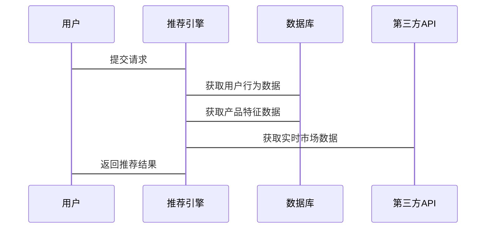

                 


# 《金融产品交叉销售推荐引擎优化》

> 关键词：金融产品，交叉销售，推荐引擎，机器学习，数据挖掘，系统架构

> 摘要：本文深入探讨了金融产品交叉销售推荐引擎的优化策略，结合数据挖掘、机器学习和系统架构等多领域知识，分析了推荐引擎的核心原理，详细讲解了协同过滤、基于内容的推荐和混合推荐算法，并通过系统架构设计和项目实战，展示了如何构建高效、准确的金融产品推荐系统。文章最后总结了优化推荐引擎的关键点，提供了实际应用中的最佳实践。

---

## 第一部分: 金融产品交叉销售推荐引擎背景与核心概念

### 第1章: 问题背景与描述

#### 1.1 问题背景

##### 1.1.1 金融行业交叉销售的重要性
在金融行业，交叉销售（Cross-Selling）是指在同一客户互动过程中，向客户销售多个产品或服务。这不仅是提升客户满意度和忠诚度的重要手段，也是提高金融机构收入和市场份额的关键策略。例如，银行在为客户提供贷款服务时，可以推荐相关的保险产品或投资理财产品。

##### 1.1.2 传统交叉销售的局限性
传统的交叉销售依赖于人工经验或简单的规则引擎，这种方式存在以下问题：
- **低效性**：人工推荐效率低下，难以覆盖大规模客户群体。
- **片面性**：基于经验的推荐缺乏数据支持，可能导致推荐结果不准确。
- **缺乏个性化**：无法根据客户的实时行为和偏好进行动态调整。

##### 1.1.3 数据驱动推荐的兴起
随着大数据和人工智能技术的快速发展，基于数据驱动的推荐系统逐渐取代传统方法。通过分析客户的交易数据、行为数据和产品特征，推荐系统能够提供个性化的推荐，显著提高交叉销售的成功率。

#### 1.2 问题描述

##### 1.2.1 交叉销售推荐的目标
交叉销售推荐的核心目标是通过分析客户行为和产品特征，为客户提供适合的产品组合，从而提高销售转化率和客户满意度。

##### 1.2.2 金融产品推荐的核心挑战
- **数据稀疏性**：金融产品种类繁多，但客户行为数据可能不足以支持准确的推荐。
- **推荐实时性**：金融市场的波动性和客户需求的实时性要求推荐系统必须快速响应。
- **用户隐私**：在处理客户数据时，必须严格遵守隐私保护法规，如GDPR。

##### 1.2.3 用户行为与产品匹配的复杂性
用户的购买决策受到多种因素的影响，包括个人风险偏好、市场趋势和产品特性等。如何将这些复杂因素纳入推荐系统，是交叉销售推荐的核心挑战。

#### 1.3 问题解决与边界

##### 1.3.1 数据驱动推荐的优势
- **准确性**：基于大量数据的分析能够提高推荐的准确性。
- **个性化**：能够根据客户的实时行为和历史数据提供个性化的推荐。
- **高效性**：通过自动化推荐减少人工干预，提高效率。

##### 1.3.2 系统边界与功能范围
推荐引擎作为一个独立的系统模块，其边界包括：
- **输入**：用户行为数据、产品特征数据。
- **输出**：推荐的产品列表或推荐评分。
- **交互**：与前端系统（如CRM）、后端系统（如数据库）的接口。

##### 1.3.3 与相关系统（如CRM）的交互
推荐引擎通常与客户关系管理系统（CRM）集成，通过CRM获取客户信息和交易数据，并将推荐结果反馈给CRM，以优化客户管理和服务流程。

#### 1.4 核心概念与联系

##### 1.4.1 推荐引擎的核心原理
推荐引擎通过分析用户行为和产品特征，利用算法生成推荐列表。其核心原理包括：
- **协同过滤**：基于用户相似性或产品相似性进行推荐。
- **基于内容的推荐**：根据产品特征进行推荐。
- **混合推荐**：结合协同过滤和内容推荐的优势。

##### 1.4.2 用户、产品、交易的ER实体关系图
```mermaid
er
    actor: 用户
    product: 金融产品
    transaction: 交易记录
    recommendation_engine: 推荐引擎
    actor --> transaction: 发起交易
    transaction --> product: 关联产品
    actor --> recommendation_engine: 提供用户行为数据
    recommendation_engine --> product: 输出推荐结果
```

##### 1.4.3 推荐引擎的架构流程图


---

## 第二部分: 金融产品交叉销售推荐引擎的算法原理

### 第2章: 协同过滤算法

#### 2.1 协同过滤的原理
协同过滤基于“相似的用户喜欢相似的产品”的假设，通过计算用户或产品的相似性来生成推荐。

##### 2.1.1 用户协同过滤
- **步骤**：
  1. 计算用户之间的相似性（如余弦相似度）。
  2. 根据相似用户的购买记录推荐产品。
- **公式**：
  $$ \text{余弦相似度} = \frac{\sum u_i v_i}{\sqrt{\sum u_i^2} \sqrt{\sum v_i^2}} $$

##### 2.1.2 物品协同过滤
- **步骤**：
  1. 计算产品之间的相似性。
  2. 根据用户购买的产品推荐相似产品。
- **公式**：
  $$ \text{产品相似度} = \frac{\sum u_i v_i}{\sqrt{\sum u_i^2} \sqrt{\sum v_i^2}} $$

##### 2.1.3 协同过滤的实现代码
```python
import numpy as np

def cosine_similarity(user1, user2):
    return np.dot(user1, user2) / (np.linalg.norm(user1) * np.linalg.norm(user2))
```

#### 2.2 协同过滤的优点与不足
- **优点**：简单易实现，适合数据稀疏场景。
- **不足**：计算复杂度高，难以实时处理大规模数据。

### 第3章: 基于内容的推荐

#### 3.1 基于内容的推荐原理
基于内容的推荐通过分析产品的特征（如产品类型、风险等级）进行推荐。

##### 3.1.1 特征提取与处理
- **步骤**：
  1. 提取产品特征（如金融产品的风险等级、收益类型）。
  2. 对特征进行标准化或向量化处理。
- **工具**：使用TF-IDF或Word2Vec进行特征提取。

##### 3.1.2 内容相似度计算
- **方法**：基于向量的余弦相似度。
- **公式**：
  $$ \text{相似度} = \frac{\sum w_i \cdot v_i}{\sqrt{\sum w_i^2} \sqrt{\sum v_i^2}} $$

#### 3.2 基于内容的推荐实现
```python
from sklearn.feature_extraction.text import TfidfVectorizer

vectorizer = TfidfVectorizer()
product_features = vectorizer.fit_transform(products)
```

### 第4章: 混合推荐算法

#### 4.1 混合推荐的原理
混合推荐结合了协同过滤和基于内容的推荐，通过集成两种方法的优势提高推荐准确性和多样性。

#### 4.2 混合推荐的实现
- **步骤**：
  1. 分别生成协同过滤和基于内容的推荐列表。
  2. 根据权重融合两个推荐列表。
- **权重计算**：使用AUC评分或其他指标评估推荐效果，动态调整权重。

#### 4.3 混合推荐的优点
- **准确性**：结合两种方法的优势，提高推荐准确性。
- **多样性**：推荐结果更具多样性，避免单一方法的局限性。

---

## 第三部分: 金融产品交叉销售推荐引擎的系统架构设计

### 第5章: 系统分析与架构设计方案

#### 5.1 系统分析
- **问题场景**：金融产品推荐系统需要处理大规模数据，要求实时性和准确性。
- **项目介绍**：构建一个高效、准确的金融产品推荐引擎。

#### 5.2 领域模型设计


#### 5.3 系统架构设计


#### 5.4 系统接口设计
- **输入接口**：用户行为数据、产品特征数据。
- **输出接口**：推荐结果、推荐评分。

#### 5.5 系统交互流程


---

## 第四部分: 项目实战

### 第6章: 金融产品交叉销售推荐引擎的实现

#### 6.1 环境安装
- **Python**：安装Python 3.x。
- **依赖库**：安装numpy、pandas、scikit-learn、mermaid等。

#### 6.2 系统核心实现源代码
```python
import numpy as np
from sklearn.metrics.pairwise import cosine_similarity

def recommend_products(user_id, user_features, product_features):
    # 计算用户与所有用户的相似性
    user_vector = user_features[user_id]
    similarities = cosine_similarity([user_vector], product_features)
    # 返回相似度最高的前n个产品
    top_indices = np.argsort(similarities, axis=1)[-n:]
    return product_ids[top_indices]

# 示例代码
user_features = np.array([[0.5, 0.8, 0.2], [0.3, 0.4, 0.7]])
product_features = np.array([[0.6, 0.3, 0.5], [0.2, 0.8, 0.1], [0.4, 0.1, 0.5]])
recommend_products(0, user_features, product_features)
```

#### 6.3 代码应用解读与分析
- **代码功能**：计算用户与产品的相似性，返回推荐结果。
- **优化点**：通过调整相似度计算方法或引入混合推荐策略，可以进一步提高推荐准确性。

#### 6.4 实际案例分析
- **案例背景**：假设一个客户购买了定期存款，推荐引擎可以根据客户的存款类型和风险偏好，推荐相关的理财产品或保险产品。

#### 6.5 项目小结
通过实际项目的实现，可以验证推荐算法的有效性，并根据实际效果不断优化推荐策略。

---

## 第五部分: 金融产品交叉销售推荐引擎优化的最佳实践

### 第7章: 优化策略与注意事项

#### 7.1 优化关键点
- **数据质量**：确保数据的完整性和准确性。
- **模型选择**：根据数据特征选择合适的推荐算法。
- **性能优化**：通过分布式计算和缓存技术提高推荐效率。

#### 7.2 小结
通过本文的分析和实践，我们可以得出以下结论：
- **数据驱动推荐**：基于大数据的推荐系统能够显著提高交叉销售的成功率。
- **算法优化**：通过混合推荐和实时计算，可以进一步提升推荐准确性和效率。

#### 7.3 注意事项
- **用户隐私保护**：在处理用户数据时，必须严格遵守相关法律法规。
- **系统稳定性**：确保推荐系统的高可用性和容错性。

#### 7.4 拓展阅读
- **推荐系统前沿技术**：如深度学习在推荐系统中的应用。
- **金融领域的最新研究**：如基于强化学习的金融产品推荐。

---

## 作者：AI天才研究院/AI Genius Institute & 禅与计算机程序设计艺术 /Zen And The Art of Computer Programming

---

这篇文章详细探讨了金融产品交叉销售推荐引擎的优化策略，结合了理论分析和实际案例，帮助读者全面理解推荐系统的构建和优化过程。通过本文的学习，读者可以掌握如何利用数据驱动的方法提升金融产品的交叉销售效果，并在实际应用中不断优化推荐策略。

