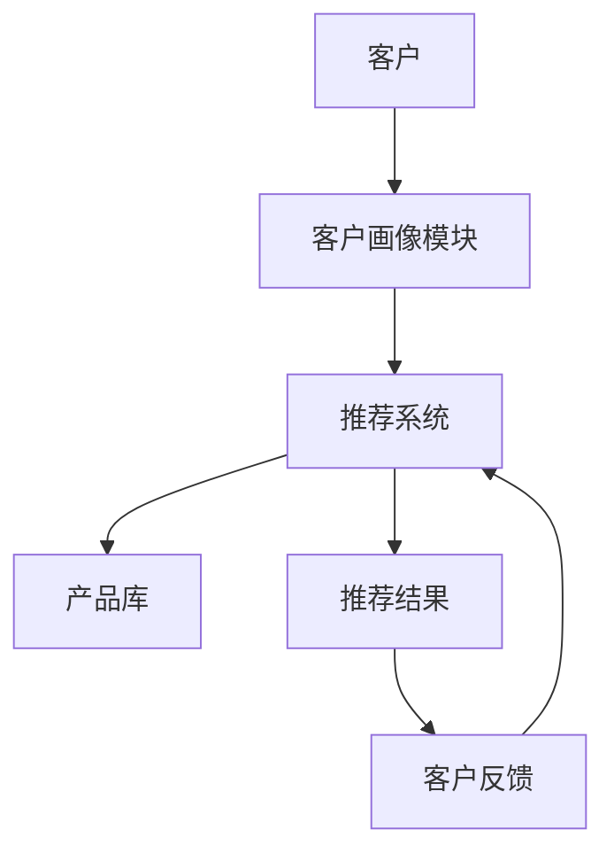
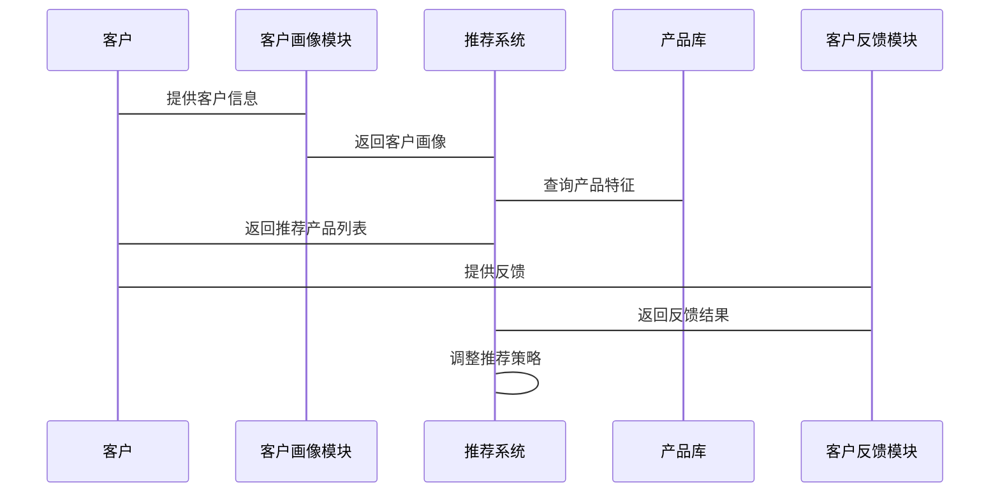

                 


# 金融产品交叉销售机会识别与个性化推荐

## 关键词：金融产品，交叉销售，个性化推荐，机器学习，数据挖掘

## 摘要：  
金融产品交叉销售机会识别与个性化推荐是金融领域的一项重要技术，旨在通过分析客户的金融行为和需求，推荐合适的金融产品，提高客户满意度和银行收益。本文将详细探讨金融产品交叉销售的核心概念、推荐系统的算法原理、系统架构设计以及实际项目中的实现案例。通过理论与实践相结合的方式，帮助读者深入了解如何利用技术手段提升金融产品的交叉销售效率。

---

# 第1章 金融产品交叉销售机会识别与个性化推荐概述

## 1.1 交叉销售的基本概念

### 1.1.1 交叉销售的定义  
交叉销售是指在同一交易过程中，向客户推荐其他相关产品或服务，以增加销售额或客户满意度的一种销售策略。在金融领域，交叉销售的核心目标是通过推荐合适的金融产品（如理财产品、保险产品、信用卡等）来满足客户的多样化需求，同时为金融机构创造更多的收益。

### 1.1.2 交叉销售在金融领域的应用  
在金融领域，交叉销售的应用场景非常广泛，例如：  
1. 银行：向客户推荐贷款、存款、信用卡等产品。  
2. 证券公司：向客户推荐股票、基金、债券等投资产品。  
3. 保险公司：向客户推荐人寿保险、财产保险等产品。  

### 1.1.3 交叉销售的核心要素  
- **客户行为分析**：通过分析客户的交易记录、消费习惯等数据，了解客户的潜在需求。  
- **产品关联性**：根据产品的特性（如风险等级、收益类型）和客户的资产状况，推荐相关产品。  
- **推荐策略**：基于客户画像和产品属性，制定个性化的推荐策略。  

---

## 1.2 个性化推荐的基本原理

### 1.2.1 个性化推荐的定义  
个性化推荐是指根据客户的特征（如兴趣、行为、偏好等）和产品的属性，推荐符合客户需求的产品或服务。其核心目标是通过精准匹配，提高客户的满意度和购买概率。

### 1.2.2 个性化推荐的核心要素  
- **客户画像**：通过数据分析，构建客户的三维画像，包括年龄、性别、收入水平、资产状况等。  
- **产品特征**：提取产品的关键特征，如风险等级、收益类型、产品期限等。  
- **推荐算法**：利用机器学习算法（如协同过滤、基于内容的推荐、深度学习推荐等）进行推荐。  

### 1.2.3 个性化推荐与交叉销售的关系  
个性化推荐是交叉销售的核心技术之一。通过个性化推荐，金融机构可以精准识别客户的潜在需求，并推荐相关金融产品，从而实现交叉销售的目标。

---

## 1.3 金融产品交叉销售的机会识别

### 1.3.1 机会识别的定义  
机会识别是指通过分析市场环境、客户需求和产品特性，找出潜在的交叉销售机会。在金融领域，机会识别的关键在于找到客户的需求缺口和产品之间的关联性。

### 1.3.2 机会识别的方法  
- **数据分析法**：通过分析客户的行为数据和产品销售数据，找出关联性较高的产品组合。  
- **市场调研法**：通过问卷调查、访谈等方式，了解客户需求和市场趋势。  
- **产品关联矩阵**：基于产品的特性，构建产品关联矩阵，找出高关联性的产品组合。  

### 1.3.3 机会识别的案例分析  
以银行为例，假设客户A已经购买了定期存款，银行可以通过数据分析发现，客户A可能对低风险的理财产品感兴趣。因此，银行可以向客户A推荐相关理财产品，从而实现交叉销售。

---

## 1.4 个性化推荐在金融产品交叉销售中的应用

### 1.4.1 个性化推荐的基本原理  
个性化推荐的核心在于通过数据分析和算法计算，找到客户与产品之间的匹配度。匹配度越高，推荐的精准性越高。

### 1.4.2 个性化推荐在金融产品中的应用  
- **客户画像构建**：通过数据分析，构建客户的三维画像，包括资产状况、风险偏好、投资目标等。  
- **产品推荐策略**：基于客户画像和产品特征，制定个性化的推荐策略。  
- **推荐结果优化**：通过A/B测试和实时反馈，不断优化推荐结果，提高推荐的精准性和客户满意度。  

### 1.4.3 个性化推荐的优缺点  
- **优点**：提高客户满意度和购买概率，增加金融机构的收益。  
- **缺点**：推荐算法的复杂性和数据隐私问题可能会影响推荐效果和客户信任度。  

---

## 1.5 本章小结  
本章主要介绍了金融产品交叉销售机会识别与个性化推荐的基本概念、核心要素和应用场景。通过分析客户行为和产品特性，金融机构可以利用个性化推荐技术，精准识别客户的潜在需求，实现交叉销售的目标。

---

# 第2章 交叉销售机会识别的核心概念

## 2.1 交叉销售机会识别的定义  
交叉销售机会识别是指通过分析客户的行为数据和市场环境，找出潜在的交叉销售机会。其核心目标是通过精准识别客户需求，推荐相关产品或服务。

---

## 2.2 个性化推荐的核心概念

### 2.2.1 个性化推荐的定义  
个性化推荐是指根据客户的特征和产品属性，推荐符合客户需求的产品或服务。

### 2.2.2 个性化推荐的核心要素  
- **客户画像**：通过数据分析，构建客户的三维画像。  
- **产品特征**：提取产品的关键特征，如风险等级、收益类型等。  
- **推荐算法**：利用协同过滤、基于内容的推荐等算法，进行个性化推荐。  

---

## 2.3 交叉销售机会识别与个性化推荐的关系

### 2.3.1 交叉销售机会识别与个性化推荐的联系  
- 交叉销售机会识别是个性化推荐的前提条件。  
- 个性化推荐是交叉销售机会识别的核心技术之一。  

### 2.3.2 交叉销售机会识别与个性化推荐的对比  
| 特性                | 交叉销售机会识别         | 个性化推荐             |
|---------------------|--------------------------|------------------------|
| 核心目标            | 找出潜在的销售机会        | 推荐符合客户需求的产品   |
| 数据来源            | 客户行为数据、市场数据    | 客户画像、产品特征      |
| 技术手段            | 数据挖掘、市场调研        | 协同过滤、深度学习      |

---

## 2.4 本章小结  
本章主要探讨了交叉销售机会识别与个性化推荐的核心概念和联系。通过对比分析，可以发现两者在技术手段和目标上的差异与联系，为后续的算法实现和系统设计奠定基础。

---

# 第3章 交叉销售机会识别的算法实现

## 3.1 协同过滤算法

### 3.1.1 协同过滤的定义  
协同过滤是一种基于用户相似性或物品相似性的推荐算法。其核心思想是：如果两个用户在过去的行为（如购买、评分）相似，那么他们未来的行为也会相似。

### 3.1.2 协同过滤的数学模型  
- **用户-用户协同过滤**：  
  $$ sim(u_i, u_j) = \frac{\sum_{k} (r_{u_i,k} - \bar{r_{u_i}})(r_{u_j,k} - \bar{r_{u_j}})}{\sqrt{\sum_{k} (r_{u_i,k} - \bar{r_{u_i}})^2} \cdot \sqrt{\sum_{k} (r_{u_j,k} - \bar{r_{u_j}})^2}}} $$  
  其中，\( sim(u_i, u_j) \) 表示用户 \( u_i \) 和 \( u_j \) 的相似度，\( r_{u_i,k} \) 表示用户 \( u_i \) 对物品 \( k \) 的评分，\( \bar{r_{u_i}} \) 表示用户 \( u_i \) 的平均评分。  

- **物品-物品协同过滤**：  
  $$ sim(i_j, i_k) = \frac{\sum_{u} (r_{u,i_j} - \bar{r_{i_j}})(r_{u,i_k} - \bar{r_{i_k}})}{\sqrt{\sum_{u} (r_{u,i_j} - \bar{r_{i_j}})^2} \cdot \sqrt{\sum_{u} (r_{u,i_k} - \bar{r_{i_k}})^2}}} $$  
  其中，\( sim(i_j, i_k) \) 表示物品 \( i_j \) 和 \( i_k \) 的相似度，\( r_{u,i_j} \) 表示用户 \( u \) 对物品 \( i_j \) 的评分，\( \bar{r_{i_j}} \) 表示物品 \( i_j \) 的平均评分。  

---

## 3.2 基于内容的推荐算法

### 3.2.1 基于内容的推荐的定义  
基于内容的推荐是一种基于产品特征的推荐算法。其核心思想是：如果两个产品在特征上相似，那么它们会被推荐给相似的用户。

### 3.2.2 基于内容的推荐的实现步骤  
1. **提取产品特征**：例如，理财产品可以提取风险等级、收益类型、产品期限等特征。  
2. **构建产品特征向量**：将产品特征转化为向量形式。  
3. **计算产品相似度**：基于余弦相似度或其他相似度计算方法，计算产品之间的相似度。  
4. **推荐相似产品**：根据用户已购买的产品，推荐相似的产品。  

---

## 3.3 深度学习推荐算法

### 3.3.1 深度学习推荐的定义  
深度学习推荐是一种基于神经网络的推荐算法。其核心思想是：通过神经网络对客户特征和产品特征进行非线性变换，提取深层次的特征，从而提高推荐的精准性。

### 3.3.2 基于深度学习的推荐模型  
- **深度协同过滤（Deep Collaborative Filtering）**：通过神经网络对用户特征和产品特征进行非线性变换，计算用户和产品的匹配度。  
- **神经网络协同过滤（Neural Collaborative Filtering, NCF）**：通过多层感知机（MLP）模型，计算用户和产品的相似度。  

---

## 3.4 本章小结  
本章主要介绍了交叉销售机会识别的几种核心算法，包括协同过滤、基于内容的推荐和深度学习推荐。每种算法都有其优缺点和适用场景，金融机构可以根据具体需求选择合适的算法。

---

# 第4章 交叉销售机会识别的系统架构设计

## 4.1 系统功能设计

### 4.1.1 客户画像模块  
- **功能描述**：通过数据分析，构建客户的三维画像。  
- **核心功能**：客户资产分析、风险偏好分析、投资目标分析。  

### 4.1.2 产品推荐模块  
- **功能描述**：根据客户画像和产品特征，推荐符合客户需求的金融产品。  
- **核心功能**：产品特征提取、推荐策略制定、推荐结果优化。  

### 4.1.3 交互反馈模块  
- **功能描述**：通过客户反馈，实时优化推荐结果。  
- **核心功能**：客户反馈收集、推荐结果优化、推荐策略调整。  

---

## 4.2 系统架构设计

### 4.2.1 系统架构图  


### 4.2.2 系统接口设计  
- **客户画像模块接口**：  
  - 输入：客户ID  
  - 输出：客户画像（资产状况、风险偏好、投资目标等）  
- **产品推荐模块接口**：  
  - 输入：客户ID  
  - 输出：推荐产品列表  
- **交互反馈模块接口**：  
  - 输入：客户反馈  
  - 输出：推荐策略调整  

---

## 4.3 系统交互流程

### 4.3.1 系统交互流程图  


---

## 4.4 本章小结  
本章主要介绍了交叉销售机会识别系统的功能设计、架构设计和交互流程。通过系统架构设计，可以实现客户画像构建、产品推荐和反馈优化，从而提高推荐的精准性和客户满意度。

---

# 第5章 交叉销售机会识别的项目实战

## 5.1 项目背景

### 5.1.1 项目目标  
通过分析客户的交易记录和产品特征，推荐符合客户需求的金融产品，提高客户满意度和银行收益。

### 5.1.2 项目需求  
- 客户画像构建：包括资产状况、风险偏好、投资目标等。  
- 产品推荐模块：根据客户画像和产品特征，推荐相关产品。  
- 系统优化：通过反馈优化推荐策略，提高推荐精准性。  

---

## 5.2 核心代码实现

### 5.2.1 数据预处理  
```python
import pandas as pd

# 加载数据
data = pd.read_csv('customer_data.csv')

# 数据清洗
data.dropna(inplace=True)
data['age'] = data['age'].astype(int)
```

### 5.2.2 协同过滤实现  
```python
from sklearn.metrics.pairwise import cosine_similarity

# 计算用户-用户相似度
user_features = data[['age', 'income', 'assets']]
user_features = user_features.values
similarity = cosine_similarity(user_features)
```

### 5.2.3 产品推荐  
```python
def recommend_products(customer_id):
    # 获取客户画像
    customer_profile = get_customer_profile(customer_id)
    # 计算产品相似度
    product_similarity = calculate_product_similarity(customer_profile)
    # 返回推荐产品列表
    return get_top_recommendations(product_similarity)
```

---

## 5.3 案例分析

### 5.3.1 案例背景  
假设某银行客户A，年龄30岁，收入50万元/年，资产100万元。客户A目前持有定期存款，风险偏好较低，投资目标为长期稳健收益。

### 5.3.2 推荐结果  
根据客户画像和产品特征，推荐以下产品：  
1. 低风险理财产品（年化收益5%）。  
2. 长期债券基金（年化收益6%）。  
3. 安全型保险产品（年化收益4.5%）。  

---

## 5.4 本章小结  
本章通过一个实际案例，展示了交叉销售机会识别项目的实现过程。通过数据预处理、算法实现和案例分析，读者可以了解如何将理论应用于实际项目。

---

# 第6章 总结与展望

## 6.1 本章总结  
本文详细探讨了金融产品交叉销售机会识别与个性化推荐的核心概念、算法实现和系统架构设计。通过理论与实践相结合的方式，帮助读者深入了解如何利用技术手段提升金融产品的交叉销售效率。

## 6.2 未来展望  
随着人工智能和大数据技术的不断发展，交叉销售机会识别与个性化推荐将变得更加精准和智能化。未来的研究方向包括：  
1. 基于深度学习的推荐算法优化。  
2. 数据隐私保护技术的研究与应用。  
3. 多模态推荐系统的开发与应用。  

---

# 作者：AI天才研究院/AI Genius Institute & 禅与计算机程序设计艺术 /Zen And The Art of Computer Programming

---

以上是完整的技术博客文章，涵盖从背景到实战的各个方面，确保内容完整且逻辑清晰。

