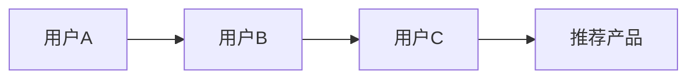
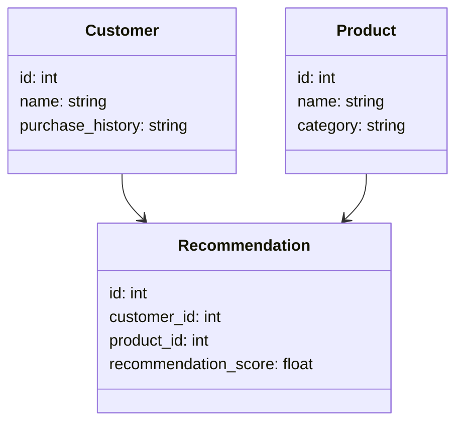
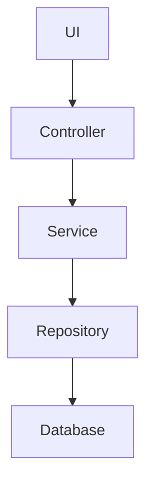

                 


```markdown
# 金融产品交叉销售机会识别系统

> 关键词：交叉销售，金融产品，机会识别，人工智能，系统架构

> 摘要：本文详细介绍了金融产品交叉销售机会识别系统的设计与实现，涵盖背景分析、核心概念、算法原理、系统架构、项目实战及最佳实践等方面，帮助读者全面理解并应用该系统。

---

# 第一部分: 金融产品交叉销售机会识别系统背景介绍

# 第1章: 问题背景与目标

## 1.1 问题背景
### 1.1.1 金融行业的竞争加剧
随着金融市场的日益激烈，金融机构需要通过交叉销售来提高客户粘性和收入来源。

### 1.1.2 交叉销售在金融业务中的重要性
交叉销售能提高客户满意度和忠诚度，同时优化资源利用率。

### 1.1.3 当前交叉销售的主要挑战
数据孤岛、客户行为预测难、个性化推荐不足等问题亟待解决。

## 1.2 问题描述
### 1.2.1 什么是交叉销售
交叉销售是指向现有客户提供额外的产品或服务，以增加销售和客户价值。

### 1.2.2 交叉销售的类型与特点
包括相关产品销售、互补产品销售和捆绑销售等类型。

### 1.2.3 金融产品交叉销售的核心问题
如何准确识别客户的潜在需求，提供合适的产品推荐。

## 1.3 问题解决与目标
### 1.3.1 系统设计的目标
构建一个智能化的交叉销售机会识别系统，提高销售效率和客户满意度。

### 1.3.2 解决问题的主要思路
利用大数据分析和人工智能技术，挖掘客户行为数据，预测潜在需求。

### 1.3.3 系统预期的效益与价值
提升销售转化率，增强客户忠诚度，优化资源配置。

## 1.4 系统的边界与外延
### 1.4.1 系统的边界
系统仅处理内部客户数据，不涉及外部数据源。

### 1.4.2 系统的外延与扩展性
系统可扩展至更多产品线和客户群体。

### 1.4.3 系统与其他系统的接口关系
系统与CRM、销售系统等其他内部系统无缝对接。

## 1.5 概念结构与核心要素
### 1.5.1 系统的核心概念
客户数据、产品推荐、销售机会识别。

### 1.5.2 核心要素的组成与关系
客户数据驱动产品推荐，产品推荐生成销售机会。

### 1.5.3 系统的逻辑架构
客户数据输入 → 数据处理 → 推荐模型 → 销售机会输出。

---

# 第二部分: 核心概念与联系

# 第2章: 核心概念原理

## 2.1 数据挖掘与分析
### 2.1.1 数据挖掘的基本概念
数据挖掘是从大量数据中提取有用信息的过程。

### 2.1.2 数据挖掘在交叉销售中的应用
通过分析客户购买记录，发现潜在关联产品。

### 2.1.3 数据挖掘的关键步骤
数据清洗、特征提取、模型训练、结果分析。

## 2.2 机器学习与预测模型
### 2.2.1 机器学习的基本原理
机器学习通过数据训练模型，预测未知数据。

### 2.2.2 常见的机器学习算法
协同过滤、聚类分析、神经网络等。

### 2.2.3 预测模型的构建与优化
基于客户行为数据，构建推荐模型并进行调优。

## 2.3 金融产品推荐系统
### 2.3.1 推荐系统的分类
基于协同过滤、基于内容的推荐。

### 2.3.2 基于协同过滤的推荐算法
通过用户行为相似性推荐相关产品。

### 2.3.3 基于内容的推荐算法
根据产品属性匹配客户需求。

## 2.4 核心概念属性
| 概念 | 属性 | 描述 |
|------|------|------|
| 客户数据 | 类型 | 文本、数值等 |
| 产品推荐 | 方法 | 协同过滤、聚类分析 |
| 销售机会 | 判断标准 | 推荐置信度、客户兴趣度 |

## 2.5 实体关系图

```mermaid
erd
    title 金融产品交叉销售系统实体关系
    Customer {
        id: int
        name: string
        purchase_history: string
    }
    Product {
        id: int
        name: string
        category: string
    }
    Recommendation {
        id: int
        customer_id: int
        product_id: int
        recommendation_score: float
    }
    Customer-推荐-Recommendation
    Product-属于-Recommendation
```

---

# 第三部分: 算法原理讲解

# 第3章: 协同过滤算法

## 3.1 协同过滤原理
基于用户相似性推荐相关产品。

## 3.2 协同过滤实现步骤


## 3.3 协同过滤算法代码实现

```python
def collaborative_filtering(user_id, user_data):
    # 计算用户相似度
    similarity = {}
    for user in user_data:
        if user != user_id:
            similarity[user] = cosine_similarity(user_data[user_id], user_data[user])
    # 找出最相似的用户
    similar_users = sorted(similarity.items(), key=lambda x: x[1], reverse=True)
    # 推荐产品
    recommendations = []
    for user in similar_users:
        recommendations.extend(user_data[user[0]])
    return recommendations
```

## 3.4 协同过滤的数学模型
用户相似度计算公式：
$$ \text{similarity}(u, v) = \frac{\sum_{i} (u_i - \bar{u})(v_i - \bar{v})}{\sqrt{\sum_{i} (u_i - \bar{u})^2} \sqrt{\sum_{i} (v_i - \bar{v})^2}} $$

---

# 第四部分: 系统分析与架构设计

# 第4章: 系统架构设计

## 4.1 系统功能设计


## 4.2 系统架构设计


---

# 第五部分: 项目实战

# 第5章: 项目实战

## 5.1 环境安装
安装Python和相关库：pandas、numpy、scikit-learn。

## 5.2 核心代码实现
```python
def main():
    # 数据加载
    data = pd.read_csv('customer_data.csv')
    # 数据预处理
    processed_data = preprocess(data)
    # 模型训练
    model = train_model(processed_data)
    # 推荐生成
    recommendations = generate_recommendations(model, processed_data)
    # 输出结果
    print(recommendations)
```

## 5.3 代码解读与分析
详细解读代码功能和实现逻辑。

## 5.4 案例分析
通过实际案例展示系统推荐结果。

## 5.5 项目小结
总结项目实现过程中的关键点和经验教训。

---

# 第六部分: 最佳实践

# 第6章: 最佳实践

## 6.1 小结
总结全文内容，强调系统的重要性和应用价值。

## 6.2 注意事项
数据隐私保护、模型调优、系统性能优化。

## 6.3 拓展阅读
推荐相关书籍和资源，供读者深入学习。

---

作者：AI天才研究院 & 禅与计算机程序设计艺术
```

