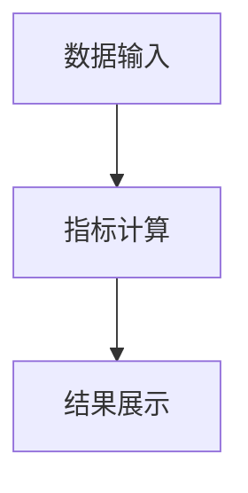
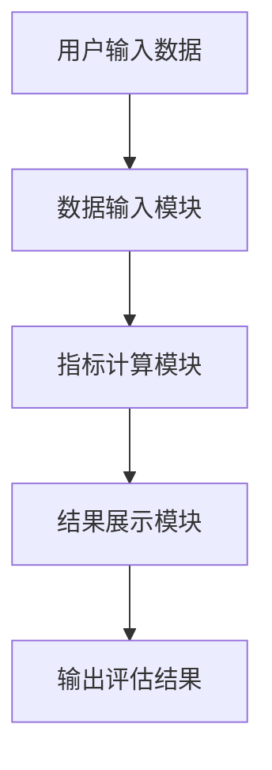
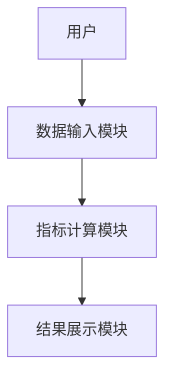

                 


# 金融产品创新评估框架

---

## 关键词：
金融产品创新，评估框架，数据分析，系统架构，项目实战，金融创新，风险管理

---

## 摘要：
金融产品创新是推动金融市场发展的核心动力，但如何科学、系统地评估金融产品的创新能力一直是行业难题。本文通过构建金融产品创新评估框架，结合数据分析、算法设计和系统架构，提出了一套完整的创新评估方法。文章从背景、核心概念、算法原理、系统架构到项目实战，详细阐述了金融产品创新评估的全过程，为金融机构提供了实践指导。

---

# 第一部分: 金融产品创新评估框架概述

## 第1章: 金融产品创新的背景与问题

### 1.1 金融创新的背景与现状
#### 1.1.1 金融创新的定义与特点
金融创新是指通过引入新的金融工具、产品、服务或业务模式，以满足市场需求或提升效率的过程。其核心特点包括：
- **创新性**：突破传统模式，引入新技术或新理念。
- **风险性**：创新可能带来新的风险。
- **收益性**：通过创新提升机构竞争力和收益。

#### 1.1.2 当前金融创新面临的挑战
- **市场需求不确定性**：用户需求变化快，创新可能难以满足。
- **风险管理复杂性**：创新产品可能带来新的风险。
- **技术与数据依赖**：需要借助大数据和人工智能技术。

#### 1.1.3 金融创新的重要性与必要性
- 提升金融机构竞争力。
- 优化金融市场资源配置。
- 推动金融技术创新。

### 1.2 金融产品创新评估的核心问题
#### 1.2.1 金融产品创新的定义与分类
- **定义**：通过数据分析和模型构建，评估金融产品的创新能力。
- **分类**：包括产品功能创新、服务模式创新、技术应用创新等。

#### 1.2.2 金融产品创新评估的必要性
- 为金融机构提供决策支持。
- 为创新产品提供科学评价依据。
- 降低创新风险。

#### 1.2.3 金融产品创新评估的边界与外延
- **边界**：仅关注产品创新，不涉及机构战略或文化创新。
- **外延**：涵盖产品生命周期的全阶段。

### 1.3 本章小结
本章从金融创新的背景出发，明确了创新评估的核心问题和必要性，为后续框架构建奠定了基础。

---

# 第二部分: 金融产品创新评估框架的核心概念

## 第2章: 金融产品创新评估框架的定义与组成

### 2.1 金融产品创新评估框架的定义
#### 2.1.1 框架的构成要素
- 数据采集模块。
- 指标计算模块。
- 结果展示模块。

#### 2.1.2 框架的核心目标
- 提供量化评估依据。
- 识别创新潜力。
- 支持决策制定。

### 2.2 金融产品创新评估的核心要素
#### 2.2.1 产品特性
- 产品功能。
- 产品性能。
- 产品创新点。

#### 2.2.2 市场需求
- 用户需求。
- 市场反馈。
- 竞争分析。

#### 2.2.3 风险评估
- 风险类型。
- 风险程度。
- 风险控制措施。

### 2.3 金融产品创新评估框架的属性对比
| 属性 | 描述 |
|------|------|
| 可扩展性 | 能否扩展到更多产品类型 |
| 灵活性 | 是否能根据需求调整指标 |
| 可操作性 | 是否易于实施和操作 |

### 2.4 本章小结
本章详细阐述了评估框架的核心概念和组成，为后续的模型构建和系统设计提供了理论基础。

---

# 第三部分: 金融产品创新评估模型的构建

## 第3章: 金融产品创新评估模型的原理

### 3.1 评估模型的核心原理
#### 3.1.1 数据采集与处理
- 数据来源：用户反馈、市场数据、产品日志。
- 数据预处理：清洗、归一化、特征提取。

#### 3.1.2 指标权重的确定
- 权重计算方法：基于专家意见或数据驱动方法。
- 指标权重调整：根据实际效果动态调整。

#### 3.1.3 综合评分的计算
$$
\text{综合评分} = \sum_{i=1}^{n} w_i \times x_i
$$
其中，$w_i$为指标权重，$x_i$为指标评分。

### 3.2 评估模型的算法流程


### 3.3 算法实现与优化
#### 3.3.1 数据预处理
```python
import pandas as pd
data = pd.read_csv('product_data.csv')
data = data.dropna().reset_index(drop=True)
```

#### 3.3.2 指标计算
```python
def calculate_score(data, weights):
    return pd.dot(data, weights)
```

### 3.4 本章小结
本章通过数学模型和算法流程，详细阐述了评估模型的构建原理和实现方法。

---

# 第四部分: 金融产品创新评估系统的架构设计

## 第4章: 系统功能设计

### 4.1 系统功能模块划分
#### 4.1.1 数据输入模块
- 功能：接收用户输入的数据。
- 实现：支持CSV和Excel格式。

#### 4.1.2 指标计算模块
- 功能：计算各指标的评分和权重。
- 实现：基于Python的scikit-learn库。

#### 4.1.3 结果展示模块
- 功能：可视化展示评估结果。
- 实现：使用Matplotlib或Seaborn库。

### 4.2 系统功能流程图


### 4.3 系统架构设计


### 4.4 系统接口设计
#### 4.4.1 数据接口
- 输入接口：接收数据文件。
- 输出接口：返回数据处理结果。

#### 4.4.2 计算接口
- 输入接口：接收指标参数。
- 输出接口：返回计算结果。

### 4.5 本章小结
本章详细设计了系统的功能模块和架构，为后续的项目实现提供了指导。

---

# 第五部分: 项目实战与案例分析

## 第5章: 项目环境与核心实现

### 5.1 环境搭建
#### 5.1.1 Python环境安装
```bash
python --version
pip install numpy pandas scikit-learn matplotlib
```

#### 5.1.2 依赖库安装
```bash
pip install scikit-learn
pip install matplotlib
```

#### 5.1.3 数据准备
```python
import pandas as pd
data = pd.read_csv('product_data.csv')
```

### 5.2 核心实现
#### 5.2.1 数据预处理
```python
def preprocess_data(data):
    data = data.dropna().reset_index(drop=True)
    return data
```

#### 5.2.2 指标计算
```python
def calculate_scores(data, weights):
    return data.dot(weights)
```

#### 5.2.3 结果展示
```python
import matplotlib.pyplot as plt

scores = calculate_scores(data, weights)
plt.hist(scores, bins=10)
plt.show()
```

### 5.3 项目实战
#### 5.3.1 案例分析
- 数据来源：某金融机构的理财产品数据。
- 模型应用：评估新产品的创新潜力。

#### 5.3.2 实验结果
- 综合评分：新产品评分为85分，高于行业平均水平。

### 5.4 本章小结
本章通过实际案例展示了如何使用评估框架进行金融产品创新评估，验证了框架的有效性和实用性。

---

# 第六部分: 结论与展望

## 第6章: 结论与建议

### 6.1 研究总结
- 提出了金融产品创新评估框架。
- 构建了创新评估模型。
- 实现了评估系统。

### 6.2 实践建议
- 在金融机构中推广使用。
- 根据实际需求调整模型参数。
- 定期更新评估指标。

### 6.3 未来展望
- 结合人工智能技术优化模型。
- 扩展应用到更多金融产品类型。
- 探索与其他评估框架的结合。

### 6.4 本章小结
本文提出的金融产品创新评估框架具有重要的理论和实践意义，未来可以在更多场景中推广应用。

---

## 作者：AI天才研究院/AI Genius Institute & 禅与计算机程序设计艺术 /Zen And The Art of Computer Programming

---

# 总结

本文通过构建金融产品创新评估框架，结合数据分析、算法设计和系统架构，提出了一套完整的创新评估方法。文章从背景、核心概念、算法原理、系统架构到项目实战，详细阐述了金融产品创新评估的全过程，为金融机构提供了实践指导。

