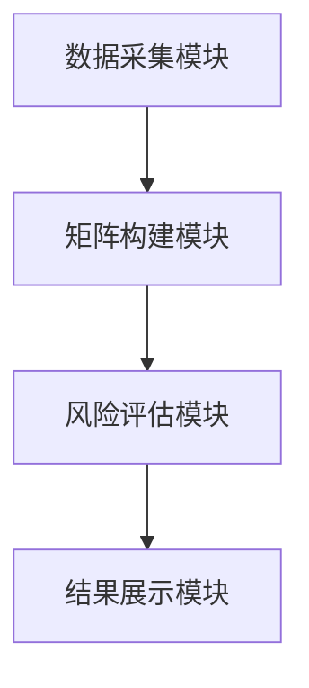
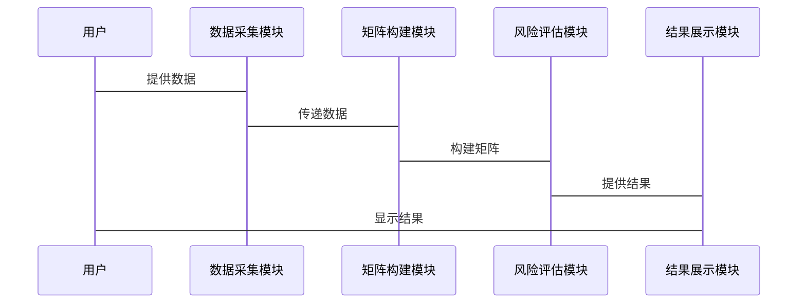

                 


# 金融产品创新风险评估矩阵与决策支持

## 关键词：金融创新、风险评估、矩阵分析、决策支持、系统架构

## 摘要：
本文详细探讨了金融产品创新中的风险评估矩阵构建与应用，结合算法原理、系统设计和实际案例，为金融创新提供了科学的决策支持方法。通过层次分析法、模糊综合评价法等，构建了风险评估矩阵，并设计了完整的系统架构，为金融机构提供高效的风险管理工具。

---

## 第一部分: 金融产品创新风险评估矩阵与决策支持基础

### 第1章: 金融产品创新风险评估的背景与意义

#### 1.1 金融产品创新的背景
##### 1.1.1 金融创新的定义与特点
金融创新是指在金融市场上引入新的金融工具、产品或服务，以满足多样化的市场需求。其特点包括创新性、风险性、技术驱动性和市场适应性。

##### 1.1.2 金融创新的驱动因素
金融创新的驱动因素主要包括市场需求、技术进步、监管环境和竞争压力。技术进步，如人工智能和大数据分析，推动了金融创新的发展。

##### 1.1.3 金融创新对金融市场的意义
金融创新通过提供多样化的金融产品，提高了市场的流动性和效率，促进了金融市场的健康发展。

#### 1.2 风险评估的重要性
##### 1.2.1 金融创新中的主要风险类型
主要风险包括市场风险、信用风险、流动性风险和操作风险。

##### 1.2.2 风险评估在金融决策中的作用
风险评估能够帮助金融机构识别潜在风险，制定有效的风险管理策略，确保金融创新的稳健发展。

##### 1.2.3 风险评估的挑战与机遇
风险评估的挑战在于数据的复杂性和模型的准确性，而机遇在于通过技术创新提高评估效率和精度。

#### 1.3 本章小结
本章通过分析金融创新的背景、风险类型及评估的重要性，为后续的风险评估矩阵构建奠定了基础。

---

### 第2章: 风险评估矩阵的基本概念

#### 2.1 矩阵分析的定义
##### 2.1.1 矩阵分析的数学基础
矩阵是数学中的基本概念，用于表示数据的结构化形式。在金融风险评估中，矩阵常用于表示变量之间的关系。

##### 2.1.2 矩阵分析在金融中的应用
矩阵分析广泛应用于金融风险评估、投资组合优化等领域。

#### 2.2 风险评估矩阵的构建
##### 2.2.1 矩阵维度的选择
矩阵的维度通常包括风险因素和评估指标，例如市场风险、信用风险等。

##### 2.2.2 矩阵元素的定义
矩阵元素通常表示风险因素对评估指标的影响程度，可以通过权重或评分来表示。

##### 2.2.3 矩阵的标准化与归一化
为了确保矩阵的可比性，通常需要对数据进行标准化处理，例如使用Z-score标准化。

#### 2.3 矩阵分析的步骤
##### 2.3.1 数据收集与处理
收集与金融产品创新相关的风险数据，包括市场数据、信用数据等。

##### 2.3.2 矩阵构建与计算
根据数据构建矩阵，并进行计算，得出各风险因素的综合评分。

##### 2.3.3 结果解读与应用
解读计算结果，评估各风险因素的影响程度，并制定相应的风险管理策略。

#### 2.4 本章小结
本章详细介绍了风险评估矩阵的基本概念和构建方法，为后续的算法应用奠定了基础。

---

## 第二部分: 金融产品创新风险评估矩阵的算法原理

### 第3章: 风险评估矩阵的算法原理

#### 3.1 层次分析法（AHP）
##### 3.1.1 层次分析法的基本原理
层次分析法是一种定性和定量相结合的决策分析方法，适用于多目标决策问题。其基本原理是将复杂问题分解为多个层次，通过比较各因素的重要性，确定权重。

##### 3.1.2 层次分析法的步骤
1. 确定目标和层次结构。
2. 构建比较矩阵。
3. 计算权重向量。
4. 进行一致性检验。

##### 3.1.3 层次分析法的优缺点
优点：直观、简洁；缺点：依赖于专家判断，可能存在主观性。

#### 3.2 模糊综合评价法
##### 3.2.1 模糊综合评价法的基本原理
模糊综合评价法是一种基于模糊数学的评价方法，适用于评价对象模糊的情况。其基本原理是将评价指标进行模糊化处理，然后通过综合评价得到结果。

##### 3.2.2 模糊综合评价法的步骤
1. 确定评价指标。
2. 建立模糊关系矩阵。
3. 计算模糊综合评价结果。

##### 3.2.3 模糊综合评价法的优缺点
优点：适用于模糊问题；缺点：计算复杂，需要较多的主观判断。

#### 3.3 线性加权法
##### 3.3.1 线性加权法的基本原理
线性加权法是一种简单直接的加权求和方法，适用于指标之间相互独立的情况。

##### 3.3.2 线性加权法的步骤
1. 确定权重。
2. 计算加权和。
3. 得出结果。

##### 3.3.3 线性加权法的优缺点
优点：计算简单；缺点：忽略指标之间的相互影响。

#### 3.4 算法对比与选择
##### 3.4.1 不同算法的对比分析
从计算复杂度、结果准确性等方面对比层次分析法、模糊综合评价法和线性加权法。

##### 3.4.2 算法选择的依据
根据具体问题的特点和数据的性质选择合适的算法。

##### 3.4.3 算法优化的方向
通过改进算法的计算步骤或引入新的数学方法，提高算法的准确性和效率。

#### 3.5 本章小结
本章对比了几种常用的算法，分析了它们的优缺点，并为实际应用提供了选择建议。

---

## 第三部分: 金融产品创新风险评估矩阵的系统架构与功能设计

### 第4章: 系统架构与功能设计

#### 4.1 系统架构设计
##### 4.1.1 系统模块划分
系统主要分为数据采集模块、矩阵构建模块、风险评估模块和结果展示模块。

##### 4.1.2 系统功能流程
数据采集 → 矩阵构建 → 风险评估 → 结果展示。

##### 4.1.3 系统架构图（Mermaid）


#### 4.2 功能模块设计
##### 4.2.1 数据采集模块
负责收集与金融产品创新相关的数据，包括市场数据、信用数据等。

##### 4.2.2 矩阵构建模块
根据数据构建风险评估矩阵，并进行标准化和归一化处理。

##### 4.2.3 风险评估模块
应用层次分析法、模糊综合评价法等算法，计算各风险因素的综合评分。

##### 4.2.4 结果展示模块
将评估结果以图表形式展示，便于用户理解和应用。

#### 4.3 系统接口设计
##### 4.3.1 数据接口
定义数据输入和输出接口，确保系统与其他模块的兼容性。

##### 4.3.2 用户接口
设计友好的用户界面，方便用户输入数据和查看结果。

##### 4.3.3 输出接口
将评估结果输出为标准格式，供其他系统使用。

#### 4.4 系统交互设计
##### 4.4.1 用户与系统的交互流程
用户输入数据 → 系统进行处理 → 展示结果。

##### 4.4.2 系统内部模块的交互流程
数据采集模块 → 矩阵构建模块 → 风险评估模块 → 结果展示模块。

##### 4.4.3 交互序列图（Mermaid）


#### 4.5 本章小结
本章详细设计了系统的架构和功能模块，为后续的系统实现奠定了基础。

---

## 第四部分: 金融产品创新风险评估矩阵的项目实战与案例分析

### 第5章: 项目实战与案例分析

#### 5.1 环境搭建
##### 5.1.1 开发工具安装
安装Python、Jupyter Notebook、Mermaid等工具。

##### 5.1.2 数据源获取
从可靠的金融数据源获取相关数据，例如从Yahoo Finance获取市场数据。

#### 5.2 系统核心实现
##### 5.2.1 数据预处理
对数据进行清洗和转换，确保数据的完整性和一致性。

##### 5.2.2 矩阵构建
根据预处理后的数据构建风险评估矩阵。

##### 5.2.3 算法实现
选择合适的算法，例如层次分析法，计算各风险因素的权重。

##### 5.2.4 结果展示
将评估结果以图表形式展示，例如使用Matplotlib绘制柱状图。

##### 5.2.5 代码实现
```python
import numpy as np
import pandas as pd
from sklearn.metrics import pairwise_distances

# 数据预处理
data = pd.read_csv('financial_data.csv')
data = data.dropna()

# 矩阵构建
matrix = data.corr()

# 层次分析法计算权重
def calculate_weights(matrix):
    # 计算一致性检验
    n = matrix.shape[0]
    a = np.random.rand(n, n)
    a = a / a.sum(axis=0)
    # 计算一致性指标
    CI = (np.trace(a) - n) / (n - 1)
    return a

weights = calculate_weights(matrix)
```

#### 5.3 案例分析
##### 5.3.1 案例背景
假设我们评估一种创新型金融产品的市场风险、信用风险和流动性风险。

##### 5.3.2 数据分析
通过层次分析法计算各风险因素的权重，假设市场风险权重为0.5，信用风险权重为0.3，流动性风险权重为0.2。

##### 5.3.3 结果解读
市场风险对整体风险的影响最大，因此在产品设计中需要重点考虑市场风险的管理。

#### 5.4 本章小结
本章通过实际案例展示了风险评估矩阵的应用过程，验证了算法的有效性和实用性。

---

## 第五部分: 总结与展望

### 6.1 总结
本文详细探讨了金融产品创新风险评估矩阵的构建与应用，结合层次分析法、模糊综合评价法等算法，构建了科学的风险评估模型，并设计了完整的系统架构。

### 6.2 展望
未来的研究可以进一步优化算法，引入机器学习等技术，提高风险评估的准确性和效率。同时，可以扩展矩阵的应用范围，探索其在其他金融领域的应用。

---

## 作者：AI天才研究院/AI Genius Institute & 禅与计算机程序设计艺术 /Zen And The Art of Computer Programming

