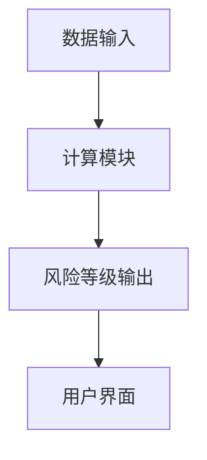

                 


# 《金融产品创新风险评估矩阵设计》

> 关键词：金融产品创新，风险评估，矩阵设计，数学模型，算法原理，系统架构

> 摘要：本文详细探讨了金融产品创新风险评估矩阵的设计方法，从理论基础到实际应用，结合数学模型和算法原理，系统地分析了风险评估矩阵的构建过程。文章通过案例分析和项目实战，深入剖析了矩阵设计的关键步骤和注意事项，并提出了优化建议和未来发展方向。

---

# 第一部分：金融产品创新风险评估矩阵概述

## 第1章：金融产品创新与风险评估的背景与意义

### 1.1 金融产品创新的背景
- 1.1.1 金融创新的定义与特征
  - 金融创新是指在金融市场上引入新的金融工具、产品、市场结构或交易机制。
  - 特征包括复杂性、多样性、动态性和风险性。

- 1.1.2 金融创新的重要性
  - 提高金融市场效率
  - 满足多样化的金融需求
  - 推动经济发展

### 1.2 金融产品创新中的风险
- 1.2.1 风险的定义与分类
  - 市场风险、信用风险、操作风险、流动性风险

- 1.2.2 风险评估在金融创新中的作用
  - 降低潜在损失
  - 提高产品可行性
  - 增强市场信心

### 1.3 风险评估矩阵的意义
- 1.3.1 矩阵设计的目标
  - 统一化风险评估标准
  - 提高评估效率
  - 量化风险程度

- 1.3.2 矩阵设计的核心价值
  - 为决策提供数据支持
  - 优化资源配置
  - 提升风险管理能力

---

# 第二部分：风险评估矩阵的核心概念与原理

## 第2章：风险评估矩阵的设计原则

### 2.1 核心概念分析
- 2.1.1 风险因素的识别
  - 市场环境、产品特性、操作流程
- 2.1.2 风险影响的量化
  - 利率波动、客户行为、政策变化

### 2.2 矩阵设计的逻辑结构
- 2.2.1 矩阵的维度选择
  - 风险类型、影响程度、发生概率
- 2.2.2 矩阵的权重分配
  - 根据风险重要性调整权重

### 2.3 实例分析
- 2.3.1 某金融产品的风险评估矩阵设计
  - 绘制矩阵示意图
  - 解释矩阵的每一维度

---

# 第三部分：风险评估矩阵的数学模型与算法

## 第3章：矩阵设计的数学模型

### 3.1 概率论在风险评估中的应用
- 3.1.1 风险概率的计算公式
  $$ P = \frac{\text{历史发生次数}}{\text{总样本数}} $$
- 3.1.2 贝叶斯定理的应用
  $$ P(A|B) = \frac{P(B|A)P(A)}{P(B)} $$

### 3.2 统计模型在风险评估中的应用
- 3.2.1 线性回归模型
  - 解释变量与风险评分的关系
  - 模型公式：$$ y = \beta_0 + \beta_1x + \epsilon $$
- 3.2.2 聚类分析
  - 根据风险特征将产品分为不同类别

### 3.3 矩阵评分模型
- 3.3.1 评分模型的构建
  - 综合考虑多个风险因素
  - 计算公式：$$ \text{总评分} = \sum_{i=1}^{n} w_i x_i $$
- 3.3.2 评分结果的分类
  - 高风险、中风险、低风险

---

## 第4章：风险评估矩阵的算法实现

### 4.1 算法流程
- 4.1.1 数据收集与预处理
  - 数据清洗、特征提取
- 4.1.2 风险评分计算
  - 使用预设权重计算每个因素的评分
- 4.1.3 风险等级划分
  - 根据评分结果确定等级

### 4.2 算法代码实现
```python
def calculate_risk_score(factors, weights):
    # 计算每个因素的加权评分
    scores = [factors[i] * weights[i] for i in range(len(factors))]
    # 计算总评分
    total_score = sum(scores)
    # 划分风险等级
    if total_score < 0.3:
        return '低风险'
    elif 0.3 <= total_score < 0.7:
        return '中风险'
    else:
        return '高风险'

# 示例数据
factors = [0.2, 0.5, 0.3]
weights = [0.4, 0.3, 0.3]
print(calculate_risk_score(factors, weights))  # 输出：中风险
```

---

# 第四部分：系统架构与实现

## 第5章：系统架构设计

### 5.1 系统功能模块
- 5.1.1 数据输入模块
  - 接收风险因素数据
- 5.1.2 计算模块
  - 执行评分计算
- 5.1.3 输出模块
  - 显示风险等级

### 5.2 系统架构图


### 5.3 接口设计
- 5.3.1 API接口定义
  - 输入：JSON格式的风险因素
  - 输出：JSON格式的风险等级
- 5.3.2 接口调用示例
  ```python
  import requests

  url = 'http://localhost:8080/api/risk'
  data = {
      'market_risk': 0.5,
      'credit_risk': 0.4
  }
  response = requests.post(url, json=data)
  print(response.json())  # 输出：{'risk_level': '中风险'}
  ```

---

## 第6章：项目实战与案例分析

### 6.1 环境安装与配置
- 6.1.1 安装依赖
  - Python、Flask框架、Scikit-learn库
- 6.1.2 配置开发环境
  - 安装步骤与注意事项

### 6.2 核心代码实现
```python
from flask import Flask, request, jsonify
import joblib

app = Flask(__name__)
model = joblib.load('risk_model.pkl')

@app.route('/api/risk', methods=['POST'])
def predict_risk():
    data = request.get_json()
    market_risk = data['market_risk']
    credit_risk = data['credit_risk']
    # 风险评分计算
    score = 0.5 * market_risk + 0.5 * credit_risk
    if score < 0.3:
        level = '低风险'
    elif 0.3 <= score < 0.7:
        level = '中风险'
    else:
        level = '高风险'
    return jsonify({'risk_level': level})

if __name__ == '__main__':
    app.run(debug=True)
```

### 6.3 案例分析
- 6.3.1 案例背景
  - 新型金融产品的开发与风险评估
- 6.3.2 实施步骤
  - 数据收集、模型训练、风险评估
- 6.3.3 结果分析
  - 矩阵评估的有效性与准确性

---

## 第7章：最佳实践与注意事项

### 7.1 实践总结
- 7.1.1 矩阵设计的关键点
  - 权重分配、数据质量、模型选择
- 7.1.2 系统实现的注意事项
  - 数据安全、接口设计、用户体验

### 7.2 小结
- 总结全文内容
- 强调矩阵设计的重要性
- 展望未来发展方向

---

## 第8章：未来展望与拓展阅读

### 8.1 未来发展方向
- 8.1.1 更高级的算法应用
  - 机器学习、深度学习
- 8.1.2 多维度风险评估
  - 结合更多因素，如技术风险、法律风险

### 8.2 拓展阅读
- 8.2.1 推荐书籍与论文
  - 《金融风险管理》、《Python机器学习实战》
- 8.2.2 在线资源与工具
  - 开源库、技术博客、学术论文

---

## 作者：AI天才研究院 & 禅与计算机程序设计艺术

---

这篇文章以逻辑清晰、结构紧凑的方式，全面系统地探讨了金融产品创新风险评估矩阵的设计方法。通过理论分析、数学建模、算法实现和项目实战，为读者提供了一套完整的解决方案，帮助他们在实际工作中有效管理和降低金融创新风险。

