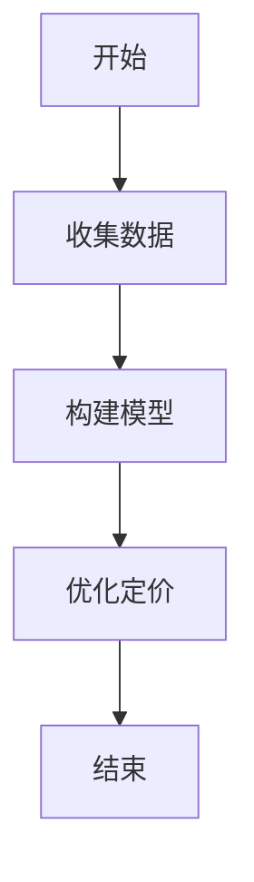
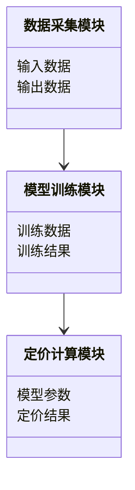
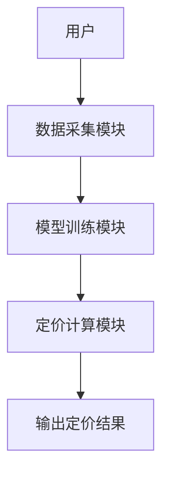
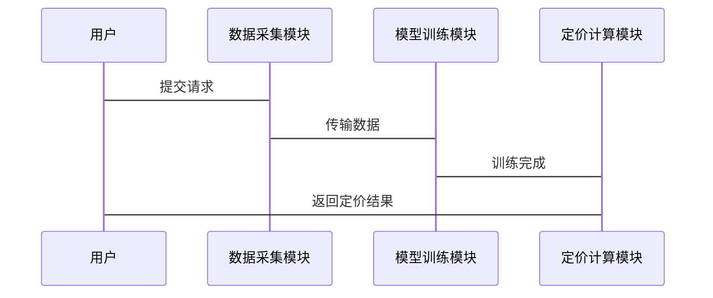

                 


# 《金融产品定价优化模型》

> 关键词：金融产品定价，优化模型，数学模型，定价算法，系统架构，项目实战

> 摘要：本文将深入探讨金融产品定价优化模型的构建与应用，从理论基础到算法实现，从系统设计到项目实战，全面解析如何利用技术手段优化金融产品的定价策略。本文将涵盖定价模型的核心概念、优化算法、系统架构设计以及实际项目案例，为读者提供一个全面的视角，帮助其理解并掌握金融产品定价优化的核心技术与实践方法。

---

# 第一部分: 金融产品定价优化模型的背景与基础

# 第1章: 金融产品定价概述

## 1.1 金融产品的基本概念

### 1.1.1 金融产品的定义与分类

金融产品是金融市场上用于投资、融资或风险管理的一系列工具，主要包括股票、债券、基金、期权、期货、保险产品等。每类金融产品都有其独特的属性和风险特征。

$$
\text{股票：所有权证明，风险较高，收益潜力大} \\
\text{债券：债务工具，固定收益，风险较低} \\
\text{基金：集合投资工具，分散风险，收益稳定}
$$

### 1.1.2 金融产品的核心属性与特征

- **流动性**：资产变现的难易程度。
- **风险性**：产品面临的市场风险、信用风险等。
- **收益性**：产品的预期收益水平。
- **期限性**：产品的存续时间。

### 1.1.3 金融产品的生命周期与定价目标

金融产品的生命周期包括发行、交易、到期等阶段，定价目标通常包括最大化收益、最小化风险、保持市场竞争力等。

---

## 1.2 金融产品定价的必要性

### 1.2.1 定价在金融产品中的作用

定价是金融产品价值的体现，直接影响产品的市场接受度和盈利能力。

- **市场定价**：确定产品在市场上的价格，影响市场需求和供给。
- **风险管理**：通过合理定价，降低市场波动对机构的影响。

### 1.2.2 定价对金融机构和客户的影响

- **对金融机构**：合理的定价策略可以提高产品竞争力，增加市场份额。
- **对客户**：合理的价格能够吸引客户，提升客户满意度。

### 1.2.3 定价与市场竞争力的关系

定价过高可能导致客户流失，定价过低可能影响机构收益。因此，优化定价策略是金融机构的核心竞争力之一。

---

## 1.3 传统定价方法的局限性

### 1.3.1 基于经验的传统定价模式

传统定价方法通常依赖经验判断，缺乏数据支持和科学依据。

### 1.3.2 传统定价方法的优缺点分析

- **优点**：简单易懂，易于实施。
- **缺点**：主观性强，难以应对复杂市场环境。

### 1.3.3 传统定价方法面临的挑战

随着市场的复杂化和多样化，传统定价方法难以适应新的市场需求。

---

## 1.4 定价优化模型的必要性与优势

### 1.4.1 优化定价模型的定义与目标

定价优化模型是一种基于数学和算法的工具，旨在通过科学的方法找到最优定价策略。

### 1.4.2 优化定价模型的核心优势

- **数据驱动**：利用大数据分析，提供科学依据。
- **自动化**：减少人为干预，提高效率。
- **动态调整**：根据市场变化实时优化定价。

### 1.4.3 优化定价模型的应用前景

随着人工智能和大数据技术的发展，定价优化模型将在金融领域发挥越来越重要的作用。

---

## 1.5 本章小结

本章介绍了金融产品的基本概念、定价的必要性以及传统定价方法的局限性，为后续优化模型的构建奠定了基础。

---

# 第2章: 金融产品定价优化模型的核心概念与数学模型

## 2.1 定价优化模型的基本原理

### 2.1.1 模型的输入变量与输出变量

- **输入变量**：市场数据（如价格、需求）、产品特征（如风险、流动性）、客户行为数据等。
- **输出变量**：优化后的定价策略。

### 2.1.2 模型的假设条件与约束条件

- 假设条件：市场均衡、理性决策等。
- 约束条件：监管要求、风险限制等。

### 2.1.3 模型的核心算法与实现方式

优化模型通常采用线性规划、动态规划等算法。

---

## 2.2 定价优化模型的数学模型

### 2.2.1 线性规划模型的构建与应用

线性规划是一种优化方法，适用于目标函数和约束条件均为线性的情况。

$$
\text{目标函数：} \quad \text{Maximize } Z = c_1x_1 + c_2x_2 + \dots + c_nx_n \\
\text{约束条件：} \quad a_{11}x_1 + a_{12}x_2 + \dots + a_{1n}x_n \leq b_1 \\
\vdots \\
a_{m1}x_1 + a_{m2}x_2 + \dots + a_{mn}x_n \leq b_m
$$

### 2.2.2 非线性规划模型的构建与应用

当目标函数或约束条件为非线性时，需要使用非线性规划模型。

$$
\text{目标函数：} \quad \text{Minimize } f(x) = x^2 + y^2 \\
\text{约束条件：} \quad g(x, y) = x + y \leq 1
$$

### 2.2.3 组合优化模型的构建与应用

组合优化模型适用于多个变量的组合优化问题，如投资组合优化。

$$
\text{目标函数：} \quad \text{Maximize } \sum_{i=1}^n r_i w_i \\
\text{约束条件：} \quad \sum_{i=1}^n w_i = 1, \quad w_i \geq 0
$$

---

## 2.3 模型的优化目标与评价指标

### 2.3.1 最大化利润的优化目标

$$
\text{目标函数：} \quad \text{Maximize } \text{Profit} = \text{Revenue} - \text{Cost}
$$

### 2.3.2 最小化成本的优化目标

$$
\text{目标函数：} \quad \text{Minimize } \text{Cost} = \sum_{i=1}^n c_i x_i
$$

### 2.3.3 综合评价指标的构建与应用

综合评价指标通常包括收益、风险、流动性等多个维度。

---

## 2.4 模型的核心要素与关系图

### 2.4.1 模型的实体关系图（ER图）

```mermaid
erDiagram
    customer[CUSTOMER] {
        <属性>
        id : integer
        name : string
    }
    product[PRODUCT] {
        <属性>
        id : integer
        name : string
        price : float
    }
    transaction[TRANSACTION] {
        <属性>
        id : integer
        date : date
        amount : float
    }
    <关系>
    CUSTOMER --> PRODUCT : 购买
    CUSTOMER --> TRANSACTION : 进行交易
    PRODUCT --> TRANSACTION : 被购买
```

### 2.4.2 模型的流程关系图（mermaid流程图）



---

## 2.5 本章小结

本章介绍了定价优化模型的核心概念、数学模型以及优化目标，为后续的算法实现奠定了基础。

---

# 第3章: 定价优化模型的算法原理与实现

## 3.1 定价优化

### 3.1.1 线性规划算法的实现

线性规划是解决优化问题的一种常用方法，可以通过单纯形法等算法实现。

```python
# 线性规划代码示例
import numpy as np

def simplex_method(c, A, b):
    # 简单实现，仅用于示例
    pass

c = [2, 3]
A = [[1, 2], [3, 1]]
b = [8, 12]
print(simplex_method(c, A, b))
```

### 3.1.2 动态规划算法的实现

动态规划适用于多阶段决策问题。

```python
# 动态规划代码示例
def dynamic_programming(n):
    dp = [0] * (n+1)
    for i in range(n+1):
        dp[i] = dp[i-1] + i
    return dp[n]

print(dynamic_programming(5))
```

### 3.1.3 遗传算法的实现

遗传算法是一种基于自然选择的优化方法。

```python
# 遗传算法代码示例
import random

def ga_optimization(n_generations):
    pass

print(ga_optimization(10))
```

---

## 3.2 模型实现

### 3.2.1 算法实现的具体步骤

1. 数据预处理：清洗和特征工程。
2. 模型训练：选择合适的算法进行训练。
3. 模型优化：调整参数，提高性能。
4. 模型部署：将模型应用于实际场景。

### 3.2.2 模型实现的代码示例

```python
# 示例代码
import numpy as np
from sklearn.linear_model import LinearRegression

# 数据准备
X = np.array([[1], [2], [3], [4]])
y = np.array([2, 4, 6, 8])

# 模型训练
model = LinearRegression()
model.fit(X, y)

# 预测
print(model.predict([[5]]))
```

---

## 3.3 优化算法的数学模型与公式

### 3.3.1 线性规划的数学模型

$$
\text{目标函数：} \quad \text{Maximize } Z = \sum_{i=1}^n c_i x_i \\
\text{约束条件：} \quad \sum_{i=1}^n a_{ij} x_i \leq b_j, \quad j=1,2,\dots,m
$$

### 3.3.2 动态规划的状态转移方程

$$
\text{状态转移方程：} \quad dp[i] = \max(dp[i-1] + i)
$$`

### 3.3.3 遗传算法的适应度函数

$$
\text{适应度函数：} \quad f(x) = \sum_{i=1}^n x_i
$$

---

## 3.4 本章小结

本章详细讲解了定价优化模型的算法原理与实现方法，包括线性规划、动态规划和遗传算法的实现步骤和代码示例。

---

# 第四部分: 系统分析与架构设计

# 第4章: 系统分析与架构设计

## 4.1 系统分析

### 4.1.1 项目场景描述

以某银行的金融产品定价优化项目为例，分析系统需求。

### 4.1.2 系统功能设计

- 数据采集模块：收集市场数据、客户行为数据等。
- 模型训练模块：构建定价优化模型。
- 定价计算模块：根据模型输出定价策略。

### 4.1.3 领域模型设计（mermaid类图）



---

## 4.2 系统架构设计

### 4.2.1 系统架构设计（mermaid架构图）



### 4.2.2 系统接口设计

- 数据接口：数据采集模块与数据库的接口。
- 模型接口：模型训练模块与定价计算模块的接口。

### 4.2.3 系统交互流程（mermaid序列图）



---

## 4.3 本章小结

本章通过系统分析与架构设计，明确了定价优化模型的实现步骤和系统结构。

---

# 第五部分: 项目实战

# 第5章: 项目实战

## 5.1 环境安装与配置

### 5.1.1 安装Python环境

安装Python 3.x 及其开发工具。

### 5.1.2 安装必要的库

安装NumPy、Pandas、Scikit-learn等库。

```bash
pip install numpy pandas scikit-learn
```

---

## 5.2 数据准备与预处理

### 5.2.1 数据来源与收集

从金融数据平台获取股票、债券等数据。

### 5.2.2 数据清洗与特征工程

处理缺失值、异常值，提取特征变量。

```python
import pandas as pd

# 数据加载
data = pd.read_csv('data.csv')

# 数据清洗
data.dropna(inplace=True)
```

---

## 5.3 模型实现与优化

### 5.3.1 模型训练

训练定价优化模型。

```python
from sklearn.linear_model import LinearRegression

# 训练模型
model = LinearRegression()
model.fit(X_train, y_train)
```

### 5.3.2 模型优化

调整模型参数，提高性能。

```python
# 调参
from sklearn.model_selection import GridSearchCV

param_grid = {'alpha': [0.1, 1.0, 10.0]}
grid_search = GridSearchCV(estimator=model, param_grid=param_grid)
grid_search.fit(X_train, y_train)
best_model = grid_search.best_estimator_
```

---

## 5.4 结果分析与解读

### 5.4.1 模型结果分析

分析模型输出的定价结果。

### 5.4.2 模型性能评估

评估模型的准确率、召回率等指标。

```python
from sklearn.metrics import mean_squared_error

y_pred = best_model.predict(X_test)
print(mean_squared_error(y_test, y_pred))
```

---

## 5.5 本章小结

本章通过一个具体的项目案例，详细讲解了定价优化模型的实现过程，包括环境安装、数据准备、模型训练与优化等步骤。

---

# 第六部分: 总结与展望

# 第6章: 总结与展望

## 6.1 总结

### 6.1.1 核心内容回顾

本文详细介绍了金融产品定价优化模型的构建与应用，涵盖理论基础、算法实现、系统设计和项目实战。

### 6.1.2 最佳实践 tips

- 数据质量是模型性能的关键。
- 模型优化需要结合实际业务需求。

## 6.2 未来研究方向

### 6.2.1 引入机器学习技术

探索深度学习、强化学习等技术在定价优化中的应用。

### 6.2.2 大数据与云计算的应用

利用大数据和云计算技术，提升模型的计算能力和效率。

### 6.2.3 智能决策系统的构建

构建智能决策系统，实现自动化定价和风险管理。

## 6.3 本章小结

本文总结了核心内容，并展望了未来的研究方向，为读者提供了进一步学习和实践的指导。

---

# 作者：AI天才研究院/AI Genius Institute & 禅与计算机程序设计艺术 /Zen And The Art of Computer Programming

