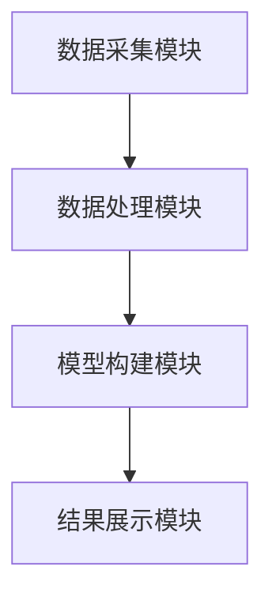
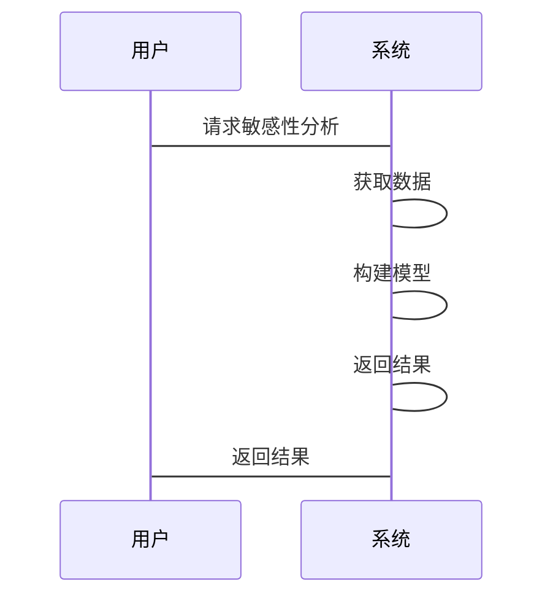

                 


# 《金融产品定价敏感性分析系统》

> 关键词：金融产品定价，敏感性分析，系统架构，算法实现，项目实战

> 摘要：本文将详细探讨金融产品定价敏感性分析系统的构建与实现，涵盖从理论基础到实际应用的全过程。通过分析敏感性分析的数学模型、算法实现、系统架构设计以及项目实战，本文将为读者提供一个全面的视角，帮助理解如何通过技术手段优化金融产品定价过程。

---

# 第一部分: 金融产品定价敏感性分析系统概述

## 第1章: 金融产品定价与敏感性分析概述

### 1.1 金融产品定价的基本概念

#### 1.1.1 金融产品的定义与分类
- 金融产品的定义：金融产品是指以货币形式存在的各种金融工具，包括股票、债券、基金、衍生品等。
- 金融产品的分类：按风险等级分类（低风险、中风险、高风险）；按收益方式分类（固定收益类、浮动收益类）。

#### 1.1.2 金融产品定价的基本原理
- 定价的核心要素：市场风险、流动性风险、信用风险。
- 定价方法：现金流折现法（DCF）、相对估值法（PE、PB等指标）。

#### 1.1.3 敏感性分析的定义与作用
- 敏感性分析：研究金融产品价格对市场变量（如利率、汇率、波动率等）变化的敏感程度。
- 作用：评估风险、优化定价策略、辅助决策。

### 1.2 金融产品定价中的敏感性分析

#### 1.2.1 敏感性分析的背景与意义
- 背景：金融市场的波动性和不确定性要求对产品定价的敏感性进行深入分析。
- 意义：帮助机构识别和管理风险，制定更稳健的定价策略。

#### 1.2.2 敏感性分析的核心概念
- 核心概念：利率敏感性、汇率敏感性、波动率敏感性。
- 指标：久期（衡量利率变动对债券价格的影响）、凸性（久期的变化对利率变动的敏感性）。

#### 1.2.3 敏感性分析的边界与外延
- 边界：假设市场变量独立变动，忽略其他变量的联动效应。
- 外延：结合其他分析方法（如情景分析、压力测试）进行综合评估。

### 1.3 敏感性分析系统的构成要素

#### 1.3.1 数据采集与处理
- 数据来源：市场数据（如利率、汇率）、产品数据（如债券面值、期限）。
- 数据处理：清洗、标准化、特征提取。

#### 1.3.2 模型构建与分析
- 模型选择：线性回归模型、非线性回归模型。
- 分析方法：参数估计、假设检验、预测。

#### 1.3.3 结果展示与应用
- 结果展示：可视化图表（如散点图、回归线）。
- 应用场景：优化定价策略、风险控制、产品组合管理。

---

# 第二部分: 敏感性分析的数学模型与算法原理

## 第2章: 敏感性分析的数学模型

### 2.1 线性回归模型

#### 2.1.1 线性回归的基本原理
- 定义：通过最小二乘法拟合一条直线，描述自变量与因变量之间的线性关系。
- 数学公式：
  - 单变量线性回归：$$y = \beta_0 + \beta_1 x + \epsilon$$
  - 多变量线性回归：$$y = \beta_0 + \beta_1 x_1 + \beta_2 x_2 + \dots + \beta_n x_n + \epsilon$$

#### 2.1.2 线性回归的数学公式
- 普通最小二乘法（OLS）：
  - 参数估计：$$\hat{\beta} = (X^T X)^{-1} X^T y$$
  - 残差：$$e = y - \hat{y}$$

#### 2.1.3 线性回归的应用场景
- 适用于变量之间存在线性关系的情况，如股票价格与市盈率的关系。

### 2.2 非线性回归模型

#### 2.2.1 非线性回归的定义与特点
- 定义：回归函数中包含非线性参数，如指数函数、对数函数。
- 特点：拟合复杂关系，但计算复杂度较高。

#### 2.2.2 非线性回归的数学公式
- 对数线性回归：$$\ln(y) = \beta_0 + \beta_1 x + \epsilon$$
- 指数回归：$$y = \beta_0 e^{\beta_1 x} + \epsilon$$

#### 2.2.3 非线性回归的应用场景
- 适用于变量之间存在非线性关系的情况，如股价与市盈率的非线性关系。

### 2.3 系统的数学模型构建

#### 2.3.1 系统模型的构建步骤
1. 确定目标变量和自变量。
2. 选择合适的回归模型。
3. 进行参数估计和模型验证。
4. 优化模型并进行预测。

#### 2.3.2 系统模型的数学表达
- 线性回归模型：$$y = \beta_0 + \beta_1 x + \epsilon$$
- 非线性回归模型：$$y = \beta_0 e^{\beta_1 x} + \epsilon$$

#### 2.3.3 系统模型的验证与优化
- 验证方法：R平方值、残差分析。
- 优化方法：逐步回归、岭回归（Lasso）。

---

# 第三部分: 敏感性分析系统的算法实现

## 第3章: 敏感性分析算法的实现原理

### 3.1 线性回归算法的实现

#### 3.1.1 线性回归算法的步骤
1. 数据预处理：清洗、标准化。
2. 模型训练：使用最小二乘法估计参数。
3. 模型评估：计算R平方值、残差分析。

#### 3.1.2 线性回归算法的代码实现
```python
import numpy as np
from sklearn.linear_model import LinearRegression

# 示例数据
X = np.array([[1], [2], [3], [4], [5]])
y = np.array([2, 4, 5, 4, 6])

# 训练模型
model = LinearRegression()
model.fit(X, y)

# 预测
y_pred = model.predict(X)
print(y_pred)
```

#### 3.1.3 线性回归算法的优缺点
- 优点：简单、易于解释。
- 缺点：假设线性关系，可能不适用于复杂场景。

### 3.2 非线性回归算法的实现

#### 3.2.1 非线性回归算法的步骤
1. 数据预处理：清洗、标准化。
2. 模型选择：选择非线性回归模型。
3. 模型训练：使用非线性优化算法（如梯度下降）。

#### 3.2.2 非线性回归算法的代码实现
```python
import numpy as np
from sklearn.metrics import mean_squared_error

# 示例数据
X = np.array([[1], [2], [3], [4], [5]])
y = np.array([2, 4, 5, 4, 6])

# 模型训练
def objective(beta, X, y):
    return np.mean((y - beta[0] * np.exp(beta[1] * X[:, 0]))**2)

# 初始猜测
beta0 = [1.0, 0.0]
result = minimize(objective, beta0, args=(X, y))
print(result)

# 预测
y_pred = result.beta[0] * np.exp(result.beta[1] * X[:, 0])
print(y_pred)
```

#### 3.2.3 非线性回归算法的优缺点
- 优点：适用于复杂关系。
- 缺点：计算复杂，收敛性问题。

### 3.3 系统算法的优化与改进

#### 3.3.1 算法优化的目标
- 提高计算效率。
- 提高模型准确性。

#### 3.3.2 算法优化的策略
- 正则化： Ridge回归、Lasso回归。
- 参数调优：网格搜索、随机搜索。

#### 3.3.3 算法优化的效果评估
- 比较优化前后的模型性能指标：R平方值、均方误差（MSE）。

---

# 第四部分: 系统架构与设计

## 第4章: 敏感性分析系统的架构设计

### 4.1 系统功能模块划分

#### 4.1.1 数据采集模块
- 功能：采集市场数据、产品数据。
- 实现：使用API接口（如Yahoo Finance API）获取实时数据。

#### 4.1.2 数据处理模块
- 功能：清洗、标准化、特征提取。
- 实现：使用Pandas库进行数据处理。

#### 4.1.3 模型构建模块
- 功能：选择模型、训练模型、优化模型。
- 实现：使用Scikit-learn库进行模型构建。

#### 4.1.4 结果展示模块
- 功能：生成可视化图表、展示敏感性分析结果。
- 实现：使用Matplotlib或Seaborn库进行可视化。

### 4.2 系统架构图

#### 4.2.1 系统架构的层次划分
- 数据层：数据存储、数据处理。
- 模型层：模型训练、模型评估。
- 展示层：结果展示、用户交互。

#### 4.2.2 系统架构的模块关系


### 4.3 系统接口设计

#### 4.3.1 系统接口设计
- API接口：RESTful API，提供数据接口、模型接口。
- 数据接口：获取市场数据、产品数据。
- 模型接口：进行敏感性分析、返回结果。

#### 4.3.2 系统交互流程


### 4.4 本章小结

---

# 附录: 工具与参考文献

## 附录A: 工具安装与使用指南

### 1. Python环境安装
- 安装Python：https://www.python.org/downloads/
- 安装虚拟环境：使用Anaconda或virtualenv。

### 2. 相关库安装
- NumPy：```pip install numpy```
- Scikit-learn：```pip install scikit-learn```
- Matplotlib：```pip install matplotlib```
- Pandas：```pip install pandas```

## 附录B: 参考文献

### 1. 书籍
- 《金融工程与金融创新》——约翰·C·赫利
- 《统计学习习实战》——唐宇迪

### 2. 网站
- 官方文档：Scikit-learn官方文档：https://scikit-learn.org/stable/documentation.html
- API接口：Yahoo Finance API：https://developer.yahoo.com/financial/

---

# 总结与展望

## 总结
本文详细探讨了金融产品定价敏感性分析系统的构建与实现，从理论基础到实际应用，全面分析了系统的各个组成部分。通过数学模型、算法实现、系统架构设计以及项目实战，为读者提供了一个全面的视角。

## 展望
未来，随着人工智能技术的不断发展，敏感性分析系统将更加智能化和自动化。结合深度学习技术，可以进一步提升模型的准确性和效率，为金融产品的定价和风险管理提供更有力的支持。

---

# 作者：AI天才研究院/AI Genius Institute & 禅与计算机程序设计艺术 /Zen And The Art of Computer Programming

---

以上为《金融产品定价敏感性分析系统》的完整目录大纲和详细内容设计。

