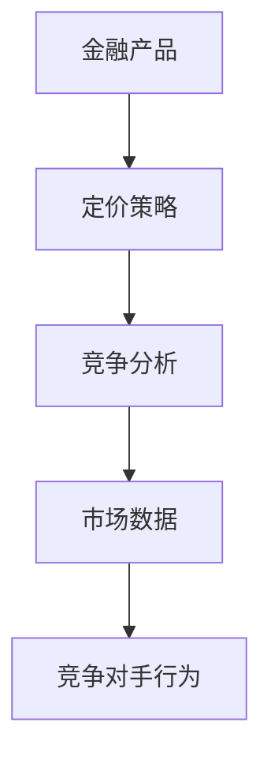
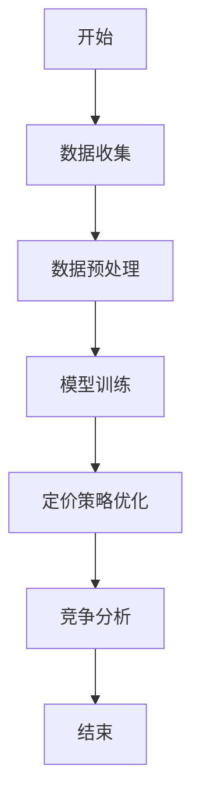

                 


# 《金融产品定价策略优化与竞争分析系统》

> 关键词：金融产品定价，定价策略优化，竞争分析，数学建模，优化算法，系统架构

> 摘要：本文将详细介绍金融产品定价策略优化与竞争分析系统的构建与应用。通过分析定价策略的核心概念、优化算法的数学模型，以及系统架构的设计，结合实际案例，系统地阐述如何利用数据驱动的方法优化定价策略，并通过竞争分析确保市场竞争力。文章内容涵盖背景介绍、核心概念、算法原理、系统架构、项目实战等多个方面，旨在为金融行业从业者提供实用的理论与实践指导。

---

## 第一部分: 金融产品定价策略优化与竞争分析系统概述

### 第1章: 金融产品定价策略优化与竞争分析系统背景

#### 1.1 金融产品定价策略的背景与意义
##### 1.1.1 金融产品定价的核心问题
金融产品的定价是金融机构的核心竞争力之一，直接影响收益和市场占有率。定价策略的优化需要考虑市场供需、成本结构、竞争对手行为等多方面因素。在金融市场中，准确的定价不仅能够确保产品的 profitability，还能在竞争激烈的市场中占据优势地位。

##### 1.1.2 定价策略在金融行业中的重要性
定价策略直接决定了金融产品的市场定位和盈利能力。合理的定价策略能够帮助金融机构在价格战中获胜，同时也能吸引更多的客户。此外，定价策略的优化还能帮助金融机构降低风险，提高资本效率。

##### 1.1.3 竞争分析在定价策略中的作用
竞争分析是定价策略优化的重要组成部分。通过对竞争对手的定价策略、市场份额、产品特点等进行分析，金融机构可以更好地了解市场动态，制定更具竞争力的定价策略。竞争分析还能帮助金融机构预测市场趋势，提前做出应对策略。

#### 1.2 金融产品定价策略的分类与特点
##### 1.2.1 基于成本的定价策略
基于成本的定价策略是以产品的成本为基础，加上预期利润来确定价格。这种方法适用于市场较为稳定、竞争不激烈的情况。然而，这种方法忽视了市场需求和竞争对手的定价策略，可能导致定价偏离市场实际。

##### 1.2.2 基于市场供需的定价策略
基于市场供需的定价策略是根据市场供需关系来确定价格。这种方法能够更好地反映市场需求，但在竞争激烈的市场中，可能无法有效应对竞争对手的定价策略。

##### 1.2.3 基于竞争导向的定价策略
基于竞争导向的定价策略是以竞争对手的定价为参考，结合自身产品的特点和成本来确定价格。这种方法能够更好地应对市场竞争，但需要及时获取竞争对手的定价信息，并根据市场变化进行调整。

#### 1.3 金融产品定价策略优化的必要性
##### 1.3.1 传统定价策略的局限性
传统定价策略往往基于经验或简单的市场分析，缺乏数据支持，难以应对复杂的市场环境。此外，传统定价策略难以实时调整，可能导致定价偏离市场实际。

##### 1.3.2 数据驱动定价的优势
数据驱动定价通过收集和分析大量的市场数据，利用数学模型和优化算法，能够更准确地反映市场需求和竞争对手的定价策略。数据驱动定价能够实时调整定价策略，提高定价的灵活性和准确性。

##### 1.3.3 竞争分析对定价策略的影响
竞争分析能够帮助金融机构更好地了解竞争对手的定价策略、市场份额和产品特点，从而制定更具竞争力的定价策略。竞争分析还能帮助金融机构预测市场趋势，提前做出应对策略，降低市场风险。

---

### 第2章: 核心概念与联系

#### 2.1 核心概念原理
##### 2.1.1 金融产品定价的数学模型
金融产品定价的数学模型是基于市场需求、成本结构和竞争对手行为等因素，通过数学建模来确定最优价格。常用的数学模型包括线性回归模型、优化模型和博弈论模型。

##### 2.1.2 竞争分析的基本原理
竞争分析的基本原理是通过对竞争对手的定价策略、市场份额和产品特点进行分析，了解市场动态和竞争对手的定价行为。竞争分析可以帮助金融机构制定更具竞争力的定价策略。

##### 2.1.3 定价策略优化的算法基础
定价策略优化的算法基础包括线性规划、非线性规划和动态规划等优化算法。这些算法能够帮助金融机构在满足约束条件的情况下，找到最优的定价策略。

#### 2.2 核心概念属性特征对比表格
| 概念       | 属性               | 特征对比             |
|------------|--------------------|----------------------|
| 定价策略   | 数据驱动           | 高度依赖市场数据     |
| 竞争分析   | 竞争对手行为分析   | 基于对手定价策略     |
| 优化模型   | 数学建模           | 基于优化目标函数     |

#### 2.3 ER实体关系图架构


---

### 第3章: 算法原理讲解

#### 3.1 算法流程图


#### 3.2 算法数学模型
$$ \text{目标函数：} \quad \min_{x} \sum_{i=1}^{n} (y_i - f(x_i))^2 $$
$$ \text{约束条件：} \quad g(x) \leq 0 $$

#### 3.3 代码实现示例
```python
import numpy as np
from sklearn.linear_model import LinearRegression

# 数据准备
X = np.array([[1], [2], [3], [4], [5]])
y = np.array([2, 3, 5, 4, 6])

# 模型训练
model = LinearRegression()
model.fit(X, y)

# 预测
print(model.predict([[6]]))
```

---

## 第二部分: 优化算法与系统架构设计

### 第4章: 系统分析与架构设计方案

#### 4.1 系统功能设计
- 数据采集模块：收集市场数据、竞争对手数据等。
- 数据处理模块：对数据进行清洗、转换和预处理。
- 模型训练模块：基于数据建立定价模型。
- 定价策略优化模块：根据模型结果优化定价策略。
- 竞争分析模块：分析竞争对手的定价策略。

#### 4.2 系统架构设计


#### 4.3 系统接口设计
- 数据接口：与数据源进行数据交互。
- API接口：提供定价策略优化结果和竞争分析报告。

#### 4.4 系统交互序列图


---

## 第三部分: 项目实战与总结

### 第5章: 项目实战

#### 5.1 环境安装
- 安装Python和必要的库：`numpy`, `pandas`, `scikit-learn`。

#### 5.2 系统核心实现
```python
import numpy as np
from sklearn.linear_model import LinearRegression

# 数据准备
X = np.array([[1], [2], [3], [4], [5]])
y = np.array([2, 3, 5, 4, 6])

# 模型训练
model = LinearRegression()
model.fit(X, y)

# 预测
print(model.predict([[6]]))
```

#### 5.3 实际案例分析
以某银行的信用卡产品为例，通过收集市场数据和竞争对手数据，利用定价模型优化定价策略，并通过竞争分析模块分析竞争对手的定价策略，制定更具竞争力的定价方案。

---

## 第四部分: 总结与展望

### 第6章: 总结与展望

#### 6.1 最佳实践 tips
- 定价策略的优化需要结合市场数据和竞争对手行为进行分析。
- 竞争分析是制定定价策略的重要组成部分，能够帮助金融机构在竞争中占据优势。

#### 6.2 项目小结
本文详细介绍了金融产品定价策略优化与竞争分析系统的构建与应用，通过数学建模和优化算法，结合实际案例，系统地阐述了如何利用数据驱动的方法优化定价策略，并通过竞争分析确保市场竞争力。

#### 6.3 未来展望
未来，随着人工智能和大数据技术的不断发展，金融产品定价策略优化与竞争分析系统将更加智能化和自动化。金融机构可以通过实时数据分析和动态调整定价策略，进一步提高市场竞争力和盈利能力。

---

## 附录

### 附录A: 术语表
- 优化算法：用于寻找最优解的数学算法。
- 竞争分析：分析竞争对手的定价策略、市场份额和产品特点。

### 附录B: 工具与库
- Python：编程语言。
- NumPy：数值计算库。
- Scikit-learn：机器学习库。

---

作者：AI天才研究院/AI Genius Institute & 禅与计算机程序设计艺术 /Zen And The Art of Computer Programming

