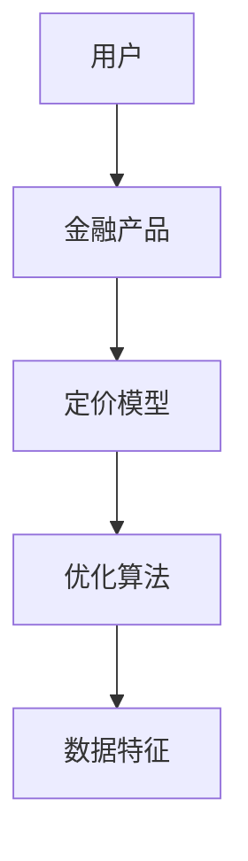
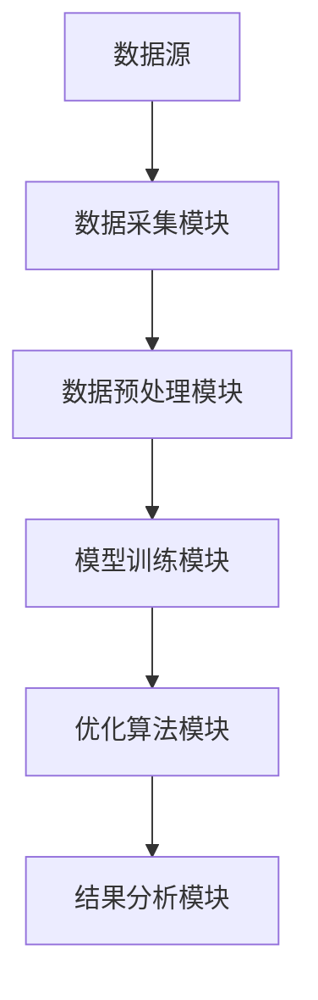
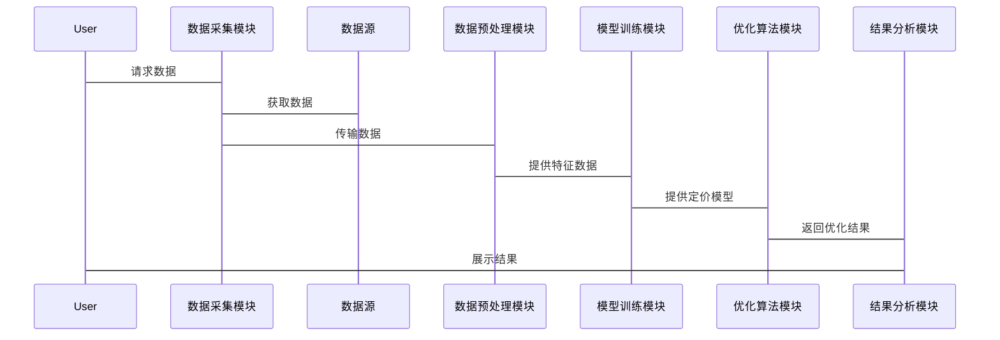

                 


# 金融产品定价策略优化系统

## 关键词：定价策略、人工智能、大数据分析、优化算法、系统架构

## 摘要：
本文详细探讨了金融产品定价策略优化系统的构建与实现。通过结合人工智能和大数据分析技术，我们提出了一种基于遗传算法和梯度下降算法的优化方法，并设计了一个模块化的系统架构。本文不仅分析了传统定价方法的局限性，还通过实际案例展示了如何利用先进的技术手段提升定价策略的科学性和准确性。

---

# 第1章: 金融产品定价策略优化系统背景介绍

## 1.1 金融产品定价的基本概念

金融产品定价是金融服务业的核心环节之一。本文将从以下几个方面介绍金融产品定价的基本概念：

- **金融产品的定义与分类**：金融产品可以分为贷款、债券、股票、基金等多种类型。每种金融产品的定价方式和影响因素都有所不同。
- **金融产品定价的核心问题**：定价的核心问题是如何在保证收益的同时，吸引更多的客户。这需要综合考虑市场环境、客户需求和产品特性等因素。
- **金融产品定价的常见方法**：传统上，金融产品定价主要依赖于历史数据分析和市场平均值法。然而，这些方法在面对复杂多变的市场环境时，往往显得力不从心。

## 1.2 传统金融产品定价方法的局限性

传统金融产品定价方法虽然在一定程度上能够满足需求，但仍然存在诸多不足之处：

- **基于历史数据分析的定价方法**：这种方法虽然能够提供一定的参考价值，但难以应对市场环境的快速变化。
- **基于市场平均值的定价方法**：这种方法容易受到市场波动的影响，且忽略了客户个体差异。
- **传统定价方法的优缺点分析**：传统方法虽然简单易行，但缺乏灵活性和针对性。

## 1.3 金融产品定价策略优化的必要性

随着市场竞争的加剧和客户需求的多样化，优化金融产品定价策略显得尤为重要：

- **市场竞争加剧的背景**：金融机构之间的竞争日益激烈，如何在价格上占据优势成为制胜的关键。
- **客户需求多样化的趋势**：客户对金融产品的需求日益多样化，单一的价格策略难以满足所有客户的需求。
- **优化定价策略的经济效益**：通过优化定价策略，金融机构可以提高收益、降低成本，并增强客户满意度。

## 1.4 本章小结

本章从金融产品定价的基本概念出发，分析了传统定价方法的局限性，并探讨了优化定价策略的必要性。通过这些分析，我们可以更好地理解金融产品定价策略优化的重要性。

---

# 第2章: 金融产品定价策略优化系统的核心概念与联系

## 2.1 定价策略优化系统的定义与边界

定价策略优化系统是一种基于人工智能和大数据分析的金融产品定价优化工具。其核心目标是通过数据分析和算法优化，帮助金融机构制定更加科学和精准的定价策略。

- **系统的定义**：定价策略优化系统通过收集和分析市场数据，利用优化算法对定价策略进行调整和优化。
- **系统的边界与外延**：系统的核心功能包括数据采集、模型训练、策略优化和结果分析等。系统的外延则涵盖了从数据源到最终用户的整个流程。

## 2.2 核心概念的属性特征对比

为了更好地理解定价策略优化系统的核心概念，我们需要对相关概念进行详细的分析和对比：

- **定价模型的特征对比**：不同的定价模型具有不同的特点，例如线性回归模型和随机森林模型在预测精度和计算复杂度上存在差异。
- **数据特征的维度分析**：金融产品定价涉及到多种数据特征，如市场利率、客户信用评分、经济指标等。这些特征在不同维度上具有不同的表现。
- **优化算法的性能指标**：不同的优化算法在性能指标上存在差异，例如遗传算法和梯度下降算法在收敛速度和优化效果上有所不同。

## 2.3 系统的ER实体关系图

为了更好地理解系统的结构和功能，我们可以通过ER实体关系图来展示系统的核心要素：



## 2.4 本章小结

本章通过定义和分析定价策略优化系统的核心概念，帮助读者更好地理解系统的构成和功能。通过ER实体关系图，我们展示了系统各要素之间的关系。

---

# 第3章: 金融产品定价策略优化算法的原理与实现

## 3.1 常见优化算法概述

定价策略优化系统的核心在于优化算法的选择和实现。以下是几种常用的优化算法及其特点：

- **遗传算法**：遗传算法是一种基于生物进化论的优化算法，具有全局搜索能力强的特点。
- **梯度下降算法**：梯度下降算法是一种常用在机器学习中的优化算法，适用于连续优化问题。
- **贪心算法**：贪心算法是一种简单直观的优化算法，适用于某些特定类型的优化问题。

## 3.2 算法原理的数学模型

为了更好地理解优化算法的工作原理，我们需要建立数学模型：

### 3.2.1 遗传算法的数学模型

遗传算法的核心是通过适应度函数来评估个体的适应度，并通过选择、交叉和变异等操作来优化种群。

$$ f(x) = \text{适应度函数} $$

### 3.2.2 梯度下降算法的数学模型

梯度下降算法通过不断调整参数，使得目标函数的梯度趋近于零，从而找到最优解。

$$ \theta := \theta - \alpha \frac{\partial}{\partial \theta} J(\theta) $$

## 3.3 算法实现的Python代码示例

为了帮助读者更好地理解优化算法的实现，我们提供以下Python代码示例：

```python
def genetic_algorithm(population, fitness_func):
    while True:
        population = evaluate(population, fitness_func)
        if stopping_condition():
            break
        population = select(population)
        population = crossover(population)
        population = mutate(population)
    return best_individual(population)
```

---

# 第4章: 金融产品定价策略优化系统的架构设计

## 4.1 问题场景介绍

定价策略优化系统需要解决以下问题：

- 如何高效地收集和处理市场数据？
- 如何选择合适的定价模型和优化算法？
- 如何确保系统的稳定性和可扩展性？

## 4.2 系统功能设计

系统的功能设计包括以下几个方面：

- 数据采集模块：负责从多种数据源采集市场数据。
- 数据预处理模块：对采集的数据进行清洗和特征提取。
- 模型训练模块：基于预处理后的数据，训练定价模型。
- 策略优化模块：利用优化算法对定价策略进行调整和优化。
- 结果分析模块：对优化结果进行分析和评估。

## 4.3 系统架构设计

为了更好地理解系统的架构，我们可以通过以下架构图来展示：



## 4.4 系统接口设计

系统的接口设计包括以下几个方面：

- 数据接口：与数据源进行数据交换。
- 模型接口：与定价模型进行交互。
- 优化接口：与优化算法进行交互。
- 用户接口：与最终用户进行交互。

## 4.5 系统交互设计

为了更好地理解系统的交互过程，我们可以通过以下交互流程图来展示：



## 4.6 本章小结

本章通过问题场景介绍、系统功能设计、架构设计和交互设计，详细描述了定价策略优化系统的整体架构。通过架构图和交互流程图，我们能够更好地理解系统的运行机制。

---

# 第5章: 金融产品定价策略优化系统的项目实战

## 5.1 环境安装与配置

为了运行定价策略优化系统，我们需要安装以下环境和工具：

- **Python**：用于开发和运行系统。
- **Pandas**：用于数据处理和分析。
- **Scikit-learn**：用于模型训练和优化。
- **Mermaid**：用于绘制系统架构图和交互流程图。

## 5.2 系统核心功能实现

以下是系统核心功能的实现代码：

```python
import pandas as pd
from sklearn.model import LinearRegression
from sklearn.metrics import mean_squared_error

def load_data():
    # 数据加载函数
    data = pd.read_csv('financial_data.csv')
    return data

def preprocess_data(data):
    # 数据预处理函数
    data = data.dropna()
    return data

def train_model(data):
    # 模型训练函数
    X = data[['market_rate', 'customer_score']]
    y = data['price']
    model = LinearRegression()
    model.fit(X, y)
    return model

def optimize_price(model, data):
    # 定价优化函数
    predicted_prices = model.predict(data[['market_rate', 'customer_score']])
    mse = mean_squared_error(data['price'], predicted_prices)
    return predicted_prices, mse

if __name__ == '__main__':
    data = load_data()
    processed_data = preprocess_data(data)
    model = train_model(processed_data)
    optimized_prices, mse = optimize_price(model, processed_data)
    print("优化后的价格:", optimized_prices)
    print("均方误差:", mse)
```

## 5.3 实际案例分析

通过以上代码，我们可以进行实际案例分析。例如，假设我们有一个包含市场利率和客户信用评分的数据集，我们可以利用线性回归模型进行定价预测，并通过均方误差来评估模型的性能。

## 5.4 本章小结

本章通过项目实战的方式，详细展示了定价策略优化系统的实现过程。通过环境安装、功能实现和案例分析，读者可以更好地理解系统的实际应用。

---

# 第6章: 金融产品定价策略优化系统的最佳实践

## 6.1 小结

本章对全文进行了总结，强调了定价策略优化系统的重要性和应用价值。

## 6.2 注意事项

在实际应用中，需要注意以下几点：

- 数据质量：数据是定价策略优化的核心，必须确保数据的准确性和完整性。
- 模型选择：不同场景下需要选择合适的定价模型和优化算法。
- 系统维护：定期对系统进行维护和更新，以应对市场环境的变化。

## 6.3 拓展阅读

为了进一步深入理解定价策略优化系统，读者可以参考以下文献：

- 《机器学习实战》：深入介绍机器学习算法及其应用。
- 《金融数据分析与建模》：详细讲解金融数据分析方法和建模技巧。

## 6.4 本章小结

本章通过小结、注意事项和拓展阅读，帮助读者更好地理解和应用定价策略优化系统。

---

# 作者：AI天才研究院/AI Genius Institute & 禅与计算机程序设计艺术 /Zen And The Art of Computer Programming

