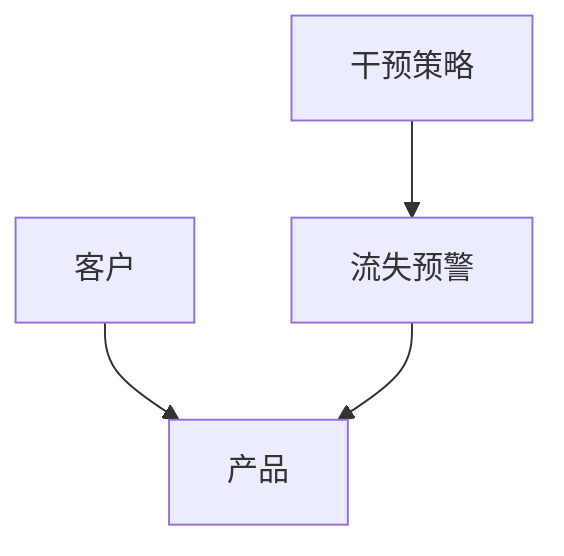
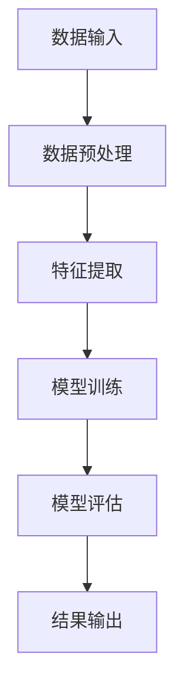
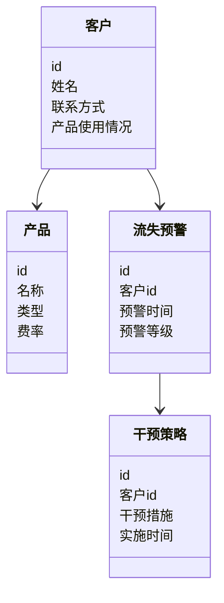
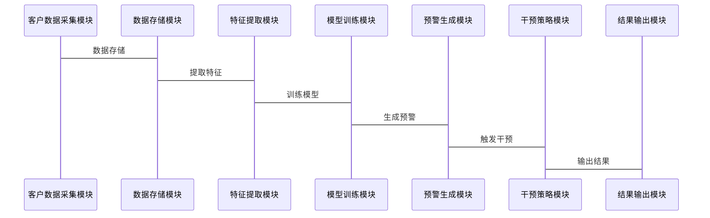

                 


# 《金融产品客户流失预警与干预系统》

> 关键词：客户流失预警、金融产品、干预策略、机器学习、系统架构

> 摘要：本文详细探讨了金融产品客户流失预警与干预系统的设计与实现。通过分析客户流失的背景与意义，介绍核心概念与算法原理，阐述系统架构，提供项目实战案例，并总结最佳实践，帮助读者全面理解如何利用技术手段有效管理客户流失问题。

---

# 第1章: 金融客户流失预警与干预的背景与意义

## 1.1 客户流失问题的背景介绍

### 1.1.1 金融行业客户流失的现状

- 金融行业的竞争日益激烈，客户流失率逐年上升。
- 经济波动、客户需求变化等因素导致客户流失。
- 客户流失不仅影响收入，还可能损害企业声誉。

### 1.1.2 客户流失对企业的影响

- 直接导致收入下降。
- 增加获取新客户的成本。
- 影响客户忠诚度和市场占有率。

### 1.1.3 客户流失预警的重要性

- 提前识别高风险客户，采取干预措施。
- 降低客户流失率，提升客户满意度。
- 增强企业的市场竞争力。

## 1.2 金融产品客户流失的定义与特征

### 1.2.1 客户流失的定义

- 客户流失：客户停止使用企业提供的金融产品或服务。
- 金融产品客户流失：客户停止使用特定金融产品或服务的行为。

### 1.2.2 金融产品客户流失的特征

| 特征 | 描述 |
|------|------|
| 时间性 | 流失可能发生在产品生命周期的任何阶段 |
| 阶段性 | 流失分为潜在流失、明确流失等阶段 |
| 可预测性 | 通过数据分析可以预测客户流失风险 |

### 1.2.3 客户流失的分类与阶段

- 分类：主动流失、被动流失、自然流失。
- 阶段：潜在阶段、预警阶段、干预阶段。

## 1.3 预警与干预的必要性

### 1.3.1 提前预警的意义

- 减少客户流失带来的损失。
- 提高客户满意度和忠诚度。
- 优化资源配置，降低运营成本。

### 1.3.2 干预措施的作用

- 通过个性化服务和优惠活动挽留客户。
- 提供针对性的产品推荐，满足客户需求。
- 建立长期客户关系，提升客户价值。

### 1.3.3 综合管理的价值

- 综合运用技术手段和管理策略，提升客户留存率。
- 通过数据驱动决策，优化业务流程。
- 提升企业的整体竞争力。

## 1.4 本章小结

本章介绍了客户流失的背景、定义、特征及其对企业的负面影响，强调了预警与干预的重要性。通过综合管理策略，企业可以有效降低客户流失率，提升客户满意度和市场竞争力。

---

# 第2章: 客户流失预警与干预的核心概念

## 2.1 客户流失预警的定义与范围

### 2.1.1 客户流失预警的定义

- 预警：通过数据分析，识别潜在流失客户，提前发出警报。

### 2.1.2 预警的范围与边界

- 范围：针对特定金融产品或服务的客户流失。
- 边界：不涉及其他业务领域，专注于金融产品客户。

### 2.1.3 核心要素与组成结构

- 核心要素：数据采集、特征提取、模型训练、预警生成。
- 组成结构：数据源、模型算法、预警系统、干预策略。

## 2.2 干预策略的制定与实施

### 2.2.1 干预策略的分类

- 分类：营销策略、产品策略、服务策略。
- 营销策略：优惠活动、个性化推荐。
- 产品策略：优化产品功能、提升用户体验。
- 服务策略：加强客户沟通、提供增值服务。

### 2.2.2 干预措施的实施步骤

- 步骤1：识别高风险客户。
- 步骤2：制定个性化干预方案。
- 步骤3：实施干预措施。
- 步骤4：评估干预效果。

### 2.2.3 干预效果的评估方法

- 方法：流失率降低、客户满意度提升、客户留存率提高。

## 2.3 核心概念的联系与对比

### 2.3.1 核心概念的属性特征对比表

| 概念 | 客户流失 | 预警 | 干预 |
|------|---------|------|------|
| 定义 | 客户停止使用产品 | 提前识别流失风险 | 采取措施挽留客户 |
| 特性 | 时间性、阶段性 | 可预测性 | 个性化、针对性 |
| 联系 | 预警是干预的前提 | 干预是预警的后续 | 形成闭环管理 |

### 2.3.2 ER实体关系图架构



## 2.4 本章小结

本章详细阐述了客户流失预警与干预的核心概念，包括定义、范围、策略制定与实施，以及核心概念的联系与对比。通过ER实体关系图，展示了系统各模块之间的关系，为后续章节的系统设计奠定了基础。

---

# 第3章: 客户流失预警的算法原理

## 3.1 算法原理概述

### 3.1.1 预警模型的基本原理

- 数据驱动：基于客户行为数据，构建预测模型。
- 特征分析：提取影响客户流失的关键特征。
- 模型训练：使用机器学习算法训练模型，预测客户流失概率。

### 3.1.2 常用算法的比较与选择

- 常用算法：逻辑回归、随机森林、支持向量机、神经网络。
- 选择标准：模型准确率、计算效率、可解释性。

### 3.1.3 算法流程的总体框架

- 流程：数据采集 → 数据预处理 → 特征选择 → 模型训练 → 模型评估 → 预警生成。

## 3.2 数据预处理与特征选择

### 3.2.1 数据清洗与标准化

- 数据清洗：去除重复数据、处理缺失值、剔除异常值。
- 数据标准化：归一化处理，确保不同特征的数据范围一致。

### 3.2.2 特征工程的关键步骤

- 特征选择：筛选对客户流失影响较大的特征，如交易频率、客户满意度、产品使用时长。
- 特征提取：通过主成分分析（PCA）降低特征维度，提升模型性能。

### 3.2.3 特征重要性评估

- 使用特征重要性评分（如随机森林的特征重要性）评估各特征对模型的影响程度。

## 3.3 模型训练与评估

### 3.3.1 常用机器学习算法介绍

- 逻辑回归：适用于二分类问题，输出概率值。
- 随机森林：基于决策树的集成算法，适合高维数据。
- 支持向量机：适用于小规模数据，分类性能好。
- 神经网络：适用于复杂数据，非线性关系。

### 3.3.2 模型训练的流程

- 数据集划分：训练集、验证集、测试集。
- 模型训练：使用训练数据拟合模型。
- 模型调优：通过交叉验证调整超参数，优化模型性能。

### 3.3.3 模型评估与优化

- 评估指标：准确率、召回率、F1分数、AUC曲线。
- 模型优化：使用网格搜索（Grid Search）或贝叶斯优化（Bayesian Optimization）调优。

## 3.4 算法流程图



## 3.5 数学模型与公式

### 3.5.1 逻辑回归模型

- 概率函数：$$ P(y=1|x) = \frac{e^{\beta_0 + \beta_1 x}}{1 + e^{\beta_0 + \beta_1 x}} $$
- 损失函数：$$ L = -\frac{1}{m} \sum_{i=1}^{m} [y_i \ln(p_i) + (1 - y_i) \ln(1 - p_i)] $$

### 3.5.2 随机森林模型

- 随机森林由多个决策树组成，通过投票或平均的方式得出最终预测结果。
- 每个决策树的特征选择采用袋装法（Bagging）和随机特征选择。

## 3.6 本章小结

本章详细介绍了客户流失预警系统的算法原理，包括数据预处理、特征选择、模型训练和评估优化。通过流程图和数学公式，展示了逻辑回归和随机森林等算法的应用，为后续系统设计奠定了理论基础。

---

# 第4章: 客户流失预警系统的架构设计

## 4.1 问题场景介绍

- 客户流失预警系统的目标：通过实时数据采集和分析，识别高风险客户，触发干预措施。
- 系统需具备高可用性、实时性、可扩展性。

## 4.2 系统功能设计

### 4.2.1 领域模型设计



### 4.2.2 系统架构设计


## 4.3 系统接口设计

- API接口：RESTful API，提供数据采集、模型训练、预警生成等接口。
- 接口协议：使用HTTP协议，支持JSON格式数据传输。

## 4.4 系统交互设计



## 4.5 本章小结

本章设计了客户流失预警系统的架构，包括功能模块、数据流、接口和交互流程，为后续实现提供了清晰的指导。

---

# 第5章: 项目实战——客户流失预警系统实现

## 5.1 环境安装与配置

- 环境要求：Python 3.6+，安装必要的库（scikit-learn、pandas、numpy、flask）。
- 数据准备：收集客户数据，包括交易记录、产品使用情况、客户反馈等。

## 5.2 系统核心实现

### 5.2.1 数据预处理代码

```python
import pandas as pd
import numpy as np

# 读取数据
data = pd.read_csv('customer_data.csv')

# 处理缺失值
data = data.dropna()

# 标准化处理
from sklearn.preprocessing import StandardScaler
scaler = StandardScaler()
data_normalized = scaler.fit_transform(data)
```

### 5.2.2 模型训练代码

```python
from sklearn.ensemble import RandomForestClassifier
from sklearn.model_selection import train_test_split
from sklearn.metrics import accuracy_score

# 划分数据集
X_train, X_test, y_train, y_test = train_test_split(data_normalized, target, test_size=0.2)

# 训练模型
model = RandomForestClassifier(n_estimators=100)
model.fit(X_train, y_train)

# 评估模型
y_pred = model.predict(X_test)
print('准确率:', accuracy_score(y_test, y_pred))
```

### 5.2.3 预警生成与干预策略

- 预警生成：根据模型预测结果，生成高风险客户列表。
- 干预策略：根据客户特征，制定个性化干预措施，如发送优惠券、提供产品升级服务。

## 5.3 项目小结

本章通过实际项目展示了客户流失预警系统的实现过程，包括数据处理、模型训练和结果应用。代码示例帮助读者理解如何将理论应用于实践。

---

# 第6章: 总结与展望

## 6.1 本章总结

- 本文系统介绍了客户流失预警与干预系统的设计与实现，涵盖背景、核心概念、算法原理、系统架构和项目实战。
- 通过数据分析和机器学习算法，有效识别高风险客户，降低客户流失率。

## 6.2 最佳实践 tips

- 数据质量是模型准确性的关键，确保数据清洗和特征选择的准确性。
- 模型调优需结合业务场景，选择合适的算法和参数。
- 干预策略应个性化，根据不同客户群体的需求制定针对性措施。

## 6.3 未来展望

- 结合人工智能技术，提升模型预测精度和实时性。
- 推动客户流失预警系统的智能化、自动化，实现预测和干预的闭环管理。

## 6.4 注意事项

- 数据隐私保护：遵守相关法律法规，确保客户数据安全。
- 模型解释性：选择可解释性较强的模型，便于业务人员理解。
- 系统稳定性：确保系统高可用性，避免因故障导致预警失败。

## 6.5 拓展阅读

- 《机器学习实战》：深入理解机器学习算法和应用。
- 《金融风险管理》：了解金融行业风险管理和客户关系管理的策略。

---

# 作者：AI天才研究院 & 禅与计算机程序设计艺术

