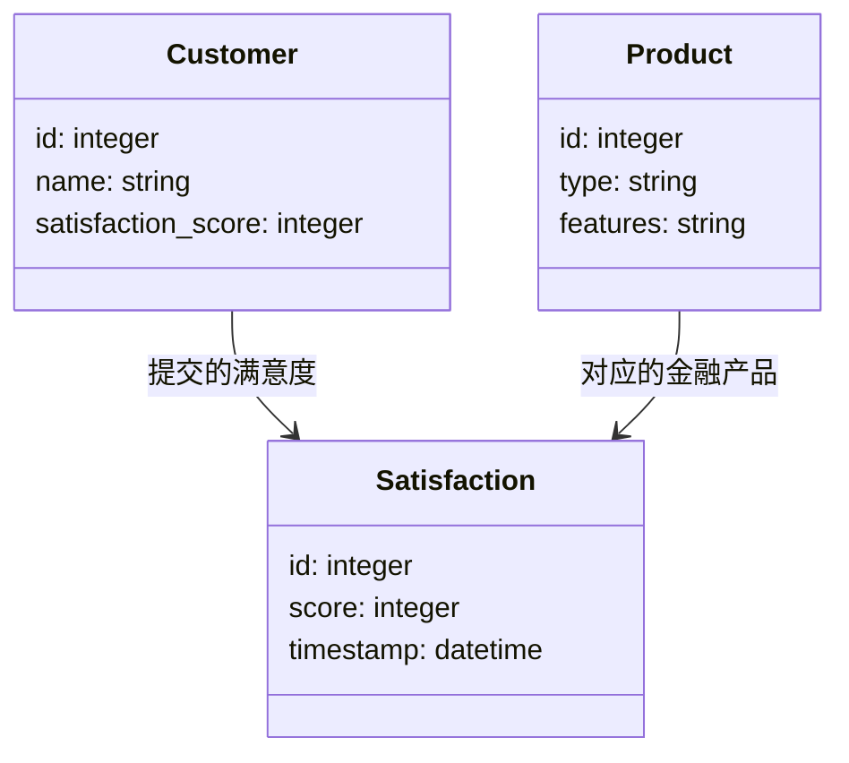
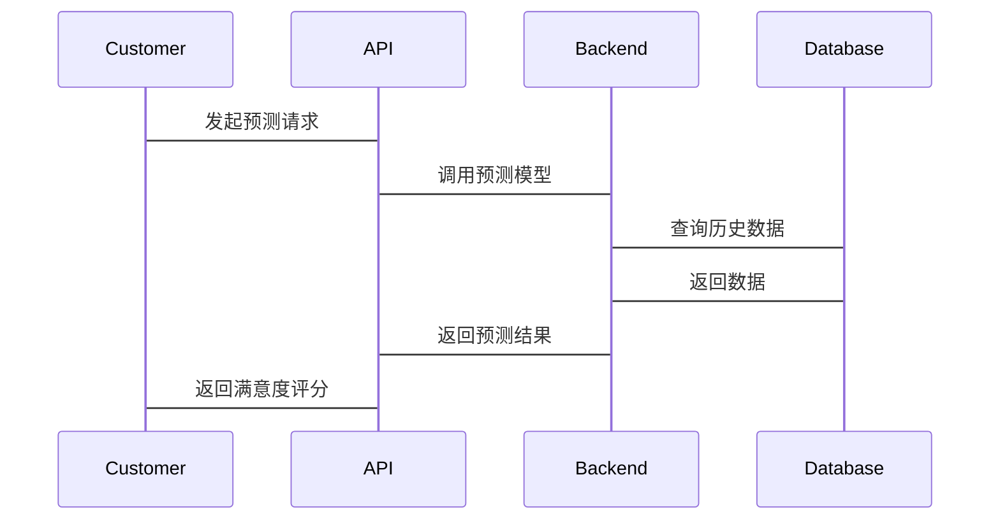

                 


# 《金融产品客户满意度预测与提升》

**关键词：** 金融产品，客户满意度，预测模型，提升策略，机器学习，数据驱动

**摘要：**  
本文深入探讨了金融产品客户满意度的预测与提升方法，结合数据分析和机器学习技术，提出了一套系统化的解决方案。通过背景分析、核心概念解析、算法原理阐述、系统设计与实战案例，本文为金融行业提供了从理论到实践的全面指导，助力企业优化客户体验，提升市场竞争力。

---

## # 第一部分: 金融产品客户满意度预测与提升的背景与基础

### ## 第1章: 金融产品客户满意度的背景与问题描述

#### ### 1.1 什么是金融产品客户满意度
- **1.1.1 金融产品的定义与分类**
  - 金融产品是指银行、证券、保险等金融机构提供的各类服务或工具，如存款、贷款、基金、保险等。
  - 分类：根据功能可分为投资类、融资类、风险管理类等。
- **1.1.2 客户满意度的定义与衡量标准**
  - 客户满意度是指客户对金融机构提供的产品或服务的满意程度。
  - 衡量标准：包括产品功能、服务质量、响应速度、客户体验等方面。
- **1.1.3 金融产品客户满意度的重要性**
  - 高满意度客户更可能长期使用产品并推荐给他人。
  - 低满意度可能导致客户流失，影响企业声誉和收益。

#### ### 1.2 金融产品客户满意度预测与提升的背景
- **1.2.1 当前金融行业的竞争现状**
  - 金融行业竞争激烈，客户获取和保留成本高昂。
  - 技术驱动金融创新，客户期望不断提高。
- **1.2.2 客户满意度在金融产品中的作用**
  - 直接影响客户忠诚度和市场份额。
  - 通过提升满意度，企业可以降低客户获取成本。
- **1.2.3 数据驱动的客户满意度分析趋势**
  - 大数据技术的发展使得客户行为分析成为可能。
  - 数据驱动的方法帮助企业更精准地预测和提升满意度。

#### ### 1.3 问题描述与目标设定
- **1.3.1 金融产品客户满意度预测的核心问题**
  - 如何从历史数据中提取有效特征，建立预测模型。
  - 如何处理数据中的噪声和缺失值。
- **1.3.2 提升客户满意度的目标与意义**
  - 提高客户满意度，增强客户忠诚度。
  - 通过预测模型优化产品设计和服务流程。
- **1.3.3 本研究的边界与外延**
  - 研究范围：限于金融产品，不包括其他金融服务。
  - 外延：研究结果可推广到其他相关领域。

#### ### 1.4 本章小结
- 本章通过背景分析，明确了金融产品客户满意度的重要性，并提出了研究的目标和范围。

---

## # 第二部分: 金融产品客户满意度的核心概念与联系

### ## 第2章: 金融产品客户满意度的核心概念与属性分析

#### ### 2.1 客户满意度的核心概念
- **2.1.1 客户满意度的构成要素**
  - 产品功能：是否满足客户需求。
  - 服务质量：服务的响应速度和专业性。
  - 客户体验：整体体验是否愉快。
- **2.1.2 金融产品与服务的关系**
  - 产品是基础，服务是提升客户满意度的关键。
  - 服务的质量直接影响客户满意度。
- **2.1.3 顾客期望与实际体验的差异**
  - 过高的期望可能导致客户不满。
  - 低于期望的体验可能导致客户流失。

#### ### 2.2 客户满意度的关键影响因素
- **2.2.1 产品功能与特性**
  - 产品是否满足客户需求。
  - 是否易于使用。
- **2.2.2 服务质量与响应速度**
  - 客服响应是否及时。
  - 服务人员的专业性。
- **2.2.3 客户体验与情感因素**
  - 使用产品的整体感受。
  - 情感因素对满意度的影响。

#### ### 2.3 客户满意度与产品生命周期的关系
- **2.3.1 产品生命周期的不同阶段**
  - 引入期：客户对产品不熟悉，满意度可能较低。
  - 成熟期：客户满意度达到高峰。
  - 衰退期：客户可能转向其他产品。
- **2.3.2 各阶段客户满意度的影响因素**
  - 引入期：产品功能是否完善。
  - 成熟期：服务质量是否持续。
  - 衰退期：客户是否有替代选择。
- **2.3.3 产品生命周期与客户满意度的动态关系**
  - 长期来看，客户满意度与产品生命周期密切相关。

#### ### 2.4 核心概念的属性特征对比表格
| **因素**       | **重要性** | **影响程度** | **可控性** |
|------------------|------------|--------------|------------|
| 产品功能         | 高         | 高           | 高         |
| 服务质量         | 高         | 高           | 中         |
| 客户体验         | 高         | 中           | 低         |

#### ### 2.5 ER实体关系图
```mermaid
erDiagram
    customer[客户] {
        id : integer
        name : string
        age : integer
        satisfaction_score : integer
    }
    product[产品] {
        id : integer
        type : string
        features : string
    }
    satisfaction[满意度] {
        id : integer
        score : integer
        timestamp : datetime
    }
    customer -|> satisfaction : 提交的满意度
    product -|> satisfaction : 对应的金融产品
```

#### ### 2.6 本章小结
- 本章通过分析客户满意度的核心概念及其影响因素，为后续的预测与提升策略奠定了基础。

---

## # 第三部分: 金融产品客户满意度预测的算法原理与实现

### ## 第3章: 常见的客户满意度预测算法

#### ### 3.1 简单统计分析法
- **3.1.1 均值、中位数、标准差的计算**
  - 均值：$\mu = \frac{1}{n}\sum_{i=1}^{n}x_i$
  - 中位数：将数据排序后取中间值。
  - 标准差：$\sigma = \sqrt{\frac{1}{n}\sum_{i=1}^{n}(x_i - \mu)^2}$
- **3.1.2 频率分析法的应用**
  - 统计每个满意度分数的出现频率，识别主要趋势。

#### ### 3.2 机器学习算法
- **3.2.1 线性回归模型**
  - 回归方程：$y = \beta_0 + \beta_1x_1 + \beta_2x_2 + ... + \beta_kx_k + \epsilon$
  - 适用于线性关系的预测。
- **3.2.2 支持向量机（SVM）**
  - 通过构建超平面，将数据分成高满意度和低满意度两类。
  - 使用核函数处理非线性问题。
- **3.2.3 随机森林与决策树**
  - 随机森林：通过集成多个决策树提高预测准确率。
  - 决策树：基于特征进行分类，直观易懂。

#### ### 3.3 深度学习模型
- **3.3.1 神经网络模型**
  - 多层感知机（MLP）：通过多层网络结构捕捉复杂模式。
  - LSTM网络的应用：处理时间序列数据，如客户行为数据。
- **3.3.2 模型选择与优化**
  - 使用交叉验证选择最佳模型。
  - 调参：通过网格搜索优化模型参数。

#### ### 3.4 算法选择与评估指标
- **3.4.1 模型评估指标**
  - 准确率：$\text{Accuracy} = \frac{\text{正确预测数}}{\text{总样本数}}$
  - 召回率：$\text{Recall} = \frac{\text{真阳性}}{\text{真阳性 + 假阴性}}$
  - F1值：$F1 = 2 \times \frac{\text{Precision} \times \text{Recall}}{\text{Precision} + \text{Recall}}$
- **3.4.2 模型调优与交叉验证**
  - 使用k折交叉验证评估模型性能。
  - 调整超参数，如学习率、树深度等。

#### ### 3.5 用Python实现客户满意度预测
```python
import pandas as pd
from sklearn.ensemble import RandomForestClassifier
from sklearn.model_selection import train_test_split
from sklearn.metrics import accuracy_score, recall_score, f1_score

# 加载数据
data = pd.read_csv('customer_satisfaction.csv')

# 特征选择
X = data[['feature1', 'feature2', ...]]
y = data['satisfaction_score']

# 数据分割
X_train, X_test, y_train, y_test = train_test_split(X, y, test_size=0.2, random_state=42)

# 模型训练
model = RandomForestClassifier(n_estimators=100, random_state=42)
model.fit(X_train, y_train)

# 预测
y_pred = model.predict(X_test)

# 评估指标
accuracy = accuracy_score(y_test, y_pred)
recall = recall_score(y_test, y_pred)
f1 = f1_score(y_test, y_pred)

print(f'准确率: {accuracy:.3f}')
print(f'召回率: {recall:.3f}')
print(f'F1值: {f1:.3f}')
```

#### ### 3.6 本章小结
- 本章介绍了多种客户满意度预测算法，并通过Python代码示例展示了如何实现这些算法，帮助读者更好地理解和应用这些模型。

---

## # 第四部分: 系统分析与架构设计方案

### ## 第4章: 金融产品客户满意度预测与提升系统

#### ### 4.1 问题场景介绍
- 企业希望通过数据驱动的方式优化客户满意度。
- 需要一个系统化的解决方案来预测客户满意度并提出改进建议。

#### ### 4.2 系统功能设计
- **4.2.1 领域模型类图**


#### ### 4.3 系统架构设计
- **4.3.1 系统架构图**


#### ### 4.4 系统接口设计
- **4.4.1 API接口**
  - 输入：客户ID、产品ID。
  - 输出：预测的满意度评分。
- **4.4.2 数据接口**
  - 数据来源：客户反馈、产品信息、交易记录。

#### ### 4.5 系统交互设计
- **4.5.1 序列图**


#### ### 4.6 本章小结
- 本章通过系统设计，展示了如何将客户满意度预测与提升转化为实际的系统解决方案。

---

## # 第五部分: 项目实战与最佳实践

### ## 第5章: 项目实战

#### ### 5.1 环境安装与数据准备
- **5.1.1 安装Python与相关库**
  - 安装：`pip install numpy pandas scikit-learn`
- **5.1.2 数据准备**
  - 数据来源：客户反馈、产品信息、交易记录。
  - 数据清洗：处理缺失值、异常值。

#### ### 5.2 核心代码实现
- **5.2.1 数据预处理**
```python
import pandas as pd
import numpy as np

data = pd.read_csv('customer_satisfaction.csv')
data.dropna(inplace=True)
data = pd.get_dummies(data)
```
- **5.2.2 模型训练与预测**
```python
from sklearn.model_selection import train_test_split
from sklearn.ensemble import RandomForestClassifier

X = data.drop('satisfaction_score', axis=1)
y = data['satisfaction_score']

X_train, X_test, y_train, y_test = train_test_split(X, y, test_size=0.2, random_state=42)

model = RandomForestClassifier(n_estimators=100, random_state=42)
model.fit(X_train, y_train)
y_pred = model.predict(X_test)
```

#### ### 5.3 实际案例分析
- 案例背景：某银行的信用卡客户满意度分析。
- 数据分析：通过模型预测，发现服务响应速度是影响满意度的主要因素。
- 实施改进：优化客服响应机制，提升客户满意度。

#### ### 5.4 项目小结
- 本章通过实际案例展示了如何将理论应用于实践，验证了模型的有效性。

---

## # 第六部分: 最佳实践与总结

### ## 第6章: 最佳实践

#### ### 6.1 小结
- 通过数据分析和机器学习，可以有效预测客户满意度。
- 提升满意度需要从产品功能、服务质量、客户体验等多个方面入手。

#### ### 6.2 注意事项
- 数据质量直接影响模型性能，需重视数据清洗和特征工程。
- 模型选择需结合实际业务需求，避免过度复杂化。

#### ### 6.3 拓展阅读
- 《机器学习实战》
- 《金融数据分析与建模》

#### ### 6.4 本章小结
- 本章总结了研究的主要成果，并提出了未来研究的方向。

---

## # 作者信息

作者：AI天才研究院/AI Genius Institute & 禅与计算机程序设计艺术/Zen And The Art of Computer Programming

---

**注：** 本文内容基于《金融产品客户满意度预测与提升》的大纲，实际文章需要根据具体数据和业务需求进行补充和完善。

