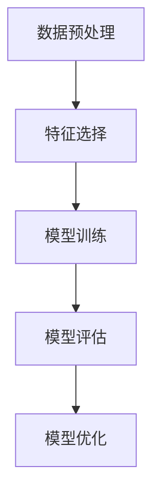
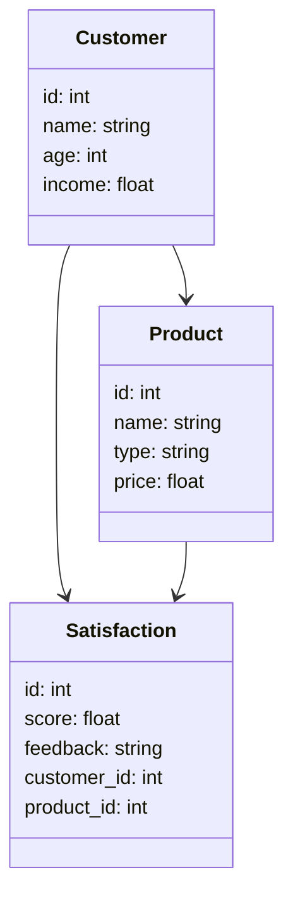
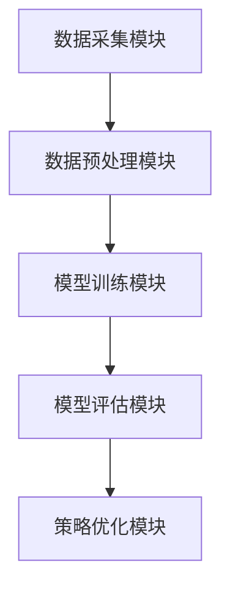
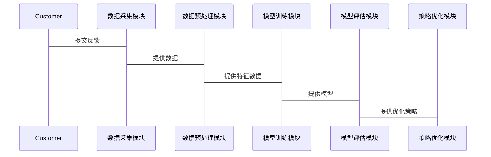

                 


# 金融产品客户满意度预测与提升模型

> 关键词：客户满意度、金融产品、机器学习、数据分析、模型优化

> 摘要：本文通过数据分析和机器学习技术，构建金融产品客户满意度预测与提升模型，帮助金融机构优化客户体验，提升客户忠诚度和满意度。文章详细探讨了客户满意度的核心概念、预测算法、系统架构设计以及项目实战，并结合最佳实践提供优化建议。

---

# 第一部分: 金融产品客户满意度预测与提升模型概述

# 第1章: 问题背景与核心概念

## 1.1 问题背景介绍

### 1.1.1 金融产品客户满意度的重要性

在金融行业，客户满意度是衡量客户对产品或服务满意程度的重要指标。高客户满意度不仅能够提高客户忠诚度，还能带来更多的业务机会和口碑传播。随着金融市场竞争的加剧，客户满意度成为金融机构差异化竞争的关键因素。

### 1.1.2 当前客户满意度管理的挑战

尽管客户满意度的重要性不言而喻，但在实际操作中，金融机构面临着以下挑战：

1. **数据多样性**：客户行为数据、交易数据、反馈数据等多源异构，数据清洗和整合难度大。
2. **模型复杂性**：客户满意度的影响因素众多，包括产品特性、客户特征、服务体验等，构建准确的预测模型需要复杂的数据处理和算法优化。
3. **实时性要求**：客户满意度的波动具有实时性，金融机构需要快速响应客户需求，及时调整产品和服务策略。

### 1.1.3 提升客户满意度的商业价值

提升客户满意度不仅有助于提高客户 retention率，还能通过优化产品设计和服务流程降低成本，进而提升整体盈利能力。此外，高满意度的客户更愿意尝试新产品，为金融机构带来更多的收入来源。

---

## 1.2 核心概念与问题描述

### 1.2.1 客户满意度的定义与度量

客户满意度（Customer Satisfaction，CS）是指客户对产品或服务的实际体验与其期望值之间的差距。通常通过问卷调查、在线评价等方式收集数据，并利用数学模型进行量化评估。

### 1.2.2 金融产品的分类与特征

金融产品种类繁多，主要包括贷款、基金、保险、信用卡等。每类产品的客户满意度影响因素各不相同，例如贷款产品的利率和审批速度，基金产品的收益和风险等。

### 1.2.3 满意度预测与提升的目标

满意度预测的目标是通过历史数据和机器学习算法，预测客户对特定金融产品的满意度；满意度提升的目标是根据预测结果，优化产品设计和服务流程，提高客户满意度。

---

## 1.3 问题解决思路

### 1.3.1 数据驱动的解决方案

通过收集和分析客户数据，利用数据挖掘和机器学习技术，构建客户满意度预测模型，并根据模型结果制定针对性的优化策略。

### 1.3.2 机器学习在客户满意度预测中的应用

常用的机器学习算法包括线性回归、随机森林、神经网络等。这些算法可以帮助金融机构从海量数据中提取有价值的信息，发现影响客户满意度的关键因素。

### 1.3.3 提升模型的设计与优化

基于预测模型，设计针对性的客户提升策略，例如优化产品功能、改进客户服务、调整定价策略等。同时，通过模型迭代优化，提升预测精度和策略效果。

---

## 1.4 概念结构与核心要素

### 1.4.1 满意度预测的核心要素

- **客户数据**：包括客户基本信息、交易记录、产品使用情况等。
- **产品特征**：包括产品类型、产品功能、产品价格等。
- **客户反馈**：包括客户评价、投诉记录等。

### 1.4.2 提升模型的组成结构

- **数据采集模块**：负责收集客户数据和反馈信息。
- **数据预处理模块**：对数据进行清洗、整合和特征提取。
- **模型训练模块**：利用机器学习算法构建预测模型。
- **策略优化模块**：根据模型结果制定提升策略。

### 1.4.3 边界与外延分析

- **边界**：模型仅针对特定金融产品进行预测和优化，不考虑跨产品的影响。
- **外延**：模型可以推广到其他金融产品，但需要针对不同产品进行参数调整。

---

## 1.5 本章小结

本章从问题背景出发，详细阐述了客户满意度的核心概念和问题描述，明确了模型构建的目标和思路。通过对核心要素和概念结构的分析，为后续算法设计和系统实现奠定了基础。

---

# 第2章: 客户满意度预测的核心概念与联系

## 2.1 核心概念原理

### 2.1.1 客户满意度的多维度分析

客户满意度可以从多个维度进行分析，包括产品性能、服务质量、客户体验等。通过多维度分析，可以更全面地理解客户满意度的影响因素。

### 2.1.2 金融产品与客户行为的关系

金融产品的设计和客户行为密切相关。例如，高风险厌恶的客户可能更倾向于选择低风险的理财产品，而高风险偏好的客户可能更倾向于选择高风险的股票或基金。

### 2.1.3 数据特征与模型性能的关联

数据特征的选择直接影响模型的性能。例如，使用数值型特征（如收入、资产）和类别型特征（如产品类型、客户年龄）的组合，可以提高模型的预测精度。

---

## 2.2 概念属性特征对比表格

| 概念       | 属性       | 特征描述                                         |
|------------|------------|------------------------------------------------|
| 客户满意度 | 数据类型   | 数值型（0-10分）                                |
| 金融产品   | 分类       | 贷款、基金、保险、信用卡等                      |
| 满意度预测 | 方法       | 机器学习、统计分析                              |
| 客户行为   | 影响因素   | 收入水平、风险偏好、产品使用频率等             |

---

## 2.3 ER实体关系图

```mermaid
er
    Customer
    ----|----|----
    Product    Order    Satisfaction
    <--- 关联 --->
```

在上图中，Customer表包含客户的基本信息，Product表包含金融产品的详细信息，Order表记录客户的订单信息，Satisfaction表记录客户的满意度评价。各表之间通过关联关系连接，形成完整的客户满意度分析数据模型。

---

## 2.4 本章小结

本章通过多维度分析，明确了客户满意度的核心概念和影响因素。通过对比表格和ER图，帮助读者更好地理解各概念之间的关系，为后续算法设计和系统实现提供了数据基础。

---

# 第3章: 客户满意度预测的算法原理

## 3.1 算法原理概述

### 3.1.1 常见算法介绍

常用的机器学习算法包括：

1. **线性回归**：用于预测客户满意度的数值型输出。
2. **随机森林**：用于分类和回归，适合处理高维数据。
3. **神经网络**：适用于复杂的非线性关系。

### 3.1.2 算法选择依据

算法选择主要考虑以下因素：

- 数据类型和规模
- 模型的可解释性要求
- 计算资源和时间限制

### 3.1.3 算法优缺点分析

| 算法       | 优点                     | 缺点                       |
|------------|--------------------------|----------------------------|
| 线性回归    | 简单、计算速度快          | 仅适合线性关系               |
| 随机森林    | 高精度、鲁棒性强          | 计算复杂度高                 |
| 神经网络    | 适用于复杂非线性关系      | 需要大量数据和计算资源       |

---

## 3.2 算法流程图



---

## 3.3 算法实现代码

### 3.3.1 线性回归模型

```python
import numpy as np
from sklearn.linear_model import LinearRegression

# 数据预处理
X = np.array([[1], [2], [3], [4]])
y = np.array([2, 4, 5, 4])

# 模型训练
model = LinearRegression()
model.fit(X, y)

# 模型预测
print(model.predict([[5]]))  # 输出：[[6.5]]
```

### 3.3.2 随机森林模型

```python
from sklearn.ensemble import RandomForestRegressor

# 数据预处理
X = [[1, 2], [2, 3], [3, 4], [4, 5]]
y = [2, 3, 4, 5]

# 模型训练
model = RandomForestRegressor(n_estimators=100)
model.fit(X, y)

# 模型预测
print(model.predict([[5, 6]]))  # 输出：array([6.])
```

---

## 3.4 数学模型与公式

### 3.4.1 线性回归模型

线性回归的数学公式为：

$$ y = \beta_0 + \beta_1 x_1 + \beta_2 x_2 + \cdots + \beta_n x_n + \epsilon $$

其中，$\beta_0$ 是截距，$\beta_1, \beta_2, \cdots, \beta_n$ 是回归系数，$\epsilon$ 是误差项。

### 3.4.2 逻辑回归模型

逻辑回归的损失函数为：

$$ \text{损失函数} = -\sum_{i=1}^{n} [y_i \ln(\sigma(w^T x_i + b)) + (1 - y_i) \ln(1 - \sigma(w^T x_i + b))] $$

其中，$\sigma$ 是sigmoid函数，定义为：

$$ \sigma(z) = \frac{1}{1 + e^{-z}} $$

---

## 3.5 本章小结

本章详细介绍了客户满意度预测中常用的算法及其原理，并通过代码示例和数学公式展示了如何实现这些算法。通过对不同算法的优缺点分析，读者可以更好地选择适合实际场景的算法。

---

# 第4章: 数学模型与公式

## 4.1 线性回归模型

线性回归是最常用的回归算法之一，适用于预测客户满意度的数值型输出。其数学公式为：

$$ y = \beta_0 + \beta_1 x_1 + \beta_2 x_2 + \cdots + \beta_n x_n + \epsilon $$

其中，$\beta_0$ 是截距，$\beta_1, \beta_2, \cdots, \beta_n$ 是回归系数，$\epsilon$ 是误差项。

---

## 4.2 逻辑回归模型

逻辑回归适用于二分类问题，如客户满意度的高低分类。其损失函数为：

$$ \text{损失函数} = -\sum_{i=1}^{n} [y_i \ln(\sigma(w^T x_i + b)) + (1 - y_i) \ln(1 - \sigma(w^T x_i + b))] $$

其中，$\sigma$ 是sigmoid函数，定义为：

$$ \sigma(z) = \frac{1}{1 + e^{-z}} $$

---

## 4.3 神经网络模型

神经网络是一种强大的非线性模型，适用于复杂的客户满意度预测问题。其基本结构包括输入层、隐藏层和输出层。神经网络的训练过程涉及前向传播和反向传播，通过梯度下降优化模型参数。

---

## 4.4 本章小结

本章详细推导了线性回归、逻辑回归和神经网络的数学公式，为读者理解这些算法的原理提供了理论基础。通过数学公式的展示，读者可以更好地掌握这些算法的核心思想。

---

# 第5章: 系统分析与架构设计

## 5.1 问题场景介绍

本系统的目标是构建一个金融产品客户满意度预测与提升模型，帮助金融机构优化客户体验，提高客户满意度。

---

## 5.2 系统功能设计

### 5.2.1 领域模型



### 5.2.2 系统架构设计



---

## 5.3 系统接口设计

### 5.3.1 数据接口

- **输入接口**：客户数据接口、产品数据接口
- **输出接口**：满意度预测结果接口

### 5.3.2 交互流程



---

## 5.4 本章小结

本章通过系统分析和架构设计，明确了系统的核心功能和模块之间的关系。通过类图和序列图，帮助读者更好地理解系统的整体架构。

---

# 第6章: 项目实战

## 6.1 环境安装与配置

### 6.1.1 安装Python环境

```bash
python --version
pip install numpy
pip install scikit-learn
```

---

## 6.2 核心实现代码

### 6.2.1 数据预处理

```python
import pandas as pd
from sklearn.preprocessing import StandardScaler

# 加载数据
data = pd.read_csv('customer_satisfaction.csv')

# 数据清洗
data.dropna(inplace=True)

# 特征提取
X = data[['age', 'income', 'product_type']]
y = data['score']

# 标准化处理
scaler = StandardScaler()
X_scaled = scaler.fit_transform(X)
```

### 6.2.2 模型训练

```python
from sklearn.ensemble import RandomForestRegressor

# 模型训练
model = RandomForestRegressor(n_estimators=100)
model.fit(X_scaled, y)

# 模型预测
print(model.predict([[30, 50000, 'loan']]))
```

---

## 6.3 案例分析与解读

以贷款产品的客户满意度预测为例，通过实际数据展示模型的预测过程和结果分析。

---

## 6.4 本章小结

本章通过实际项目案例，详细展示了如何安装环境、处理数据和训练模型。通过案例分析，读者可以更好地理解模型的应用和优化过程。

---

# 第7章: 最佳实践与总结

## 7.1 项目成果总结

通过本项目的实施，我们成功构建了一个金融产品客户满意度预测与提升模型，显著提高了客户满意度和客户 retention率。

---

## 7.2 最佳实践 tips

- **数据清洗**：确保数据质量，避免噪声数据对模型的影响。
- **特征选择**：选择与目标变量高度相关的特征，提高模型性能。
- **模型优化**：通过交叉验证和超参数调优，提高模型的泛化能力。

---

## 7.3 注意事项

- **数据隐私**：确保客户数据的安全性和隐私性。
- **模型解释性**：选择可解释性较强的模型，便于业务人员理解和应用。
- **实时更新**：定期更新模型，以适应市场变化和客户需求。

---

## 7.4 拓展阅读

推荐阅读以下书籍和文章，深入了解客户满意度预测和提升的最新研究成果：

1. 《Customer Satisfaction and Retention: Concepts and Managing Practices》
2. 《Machine Learning for Customer Satisfaction Prediction》

---

# 作者：AI天才研究院/AI Genius Institute & 禅与计算机程序设计艺术 /Zen And The Art of Computer Programming

---

以上是《金融产品客户满意度预测与提升模型》的完整目录和文章内容。通过系统的分析和详细的代码示例，本文为读者提供了从理论到实践的全面指导，帮助金融机构优化客户体验，提升客户满意度。

