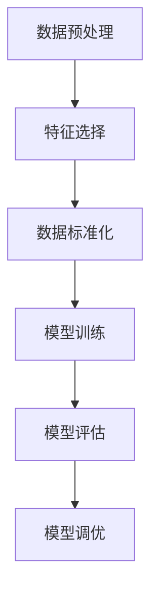
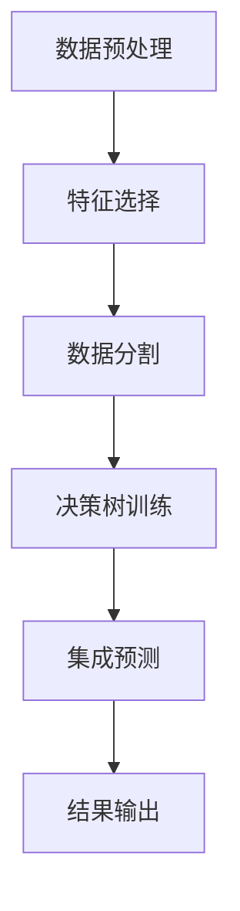
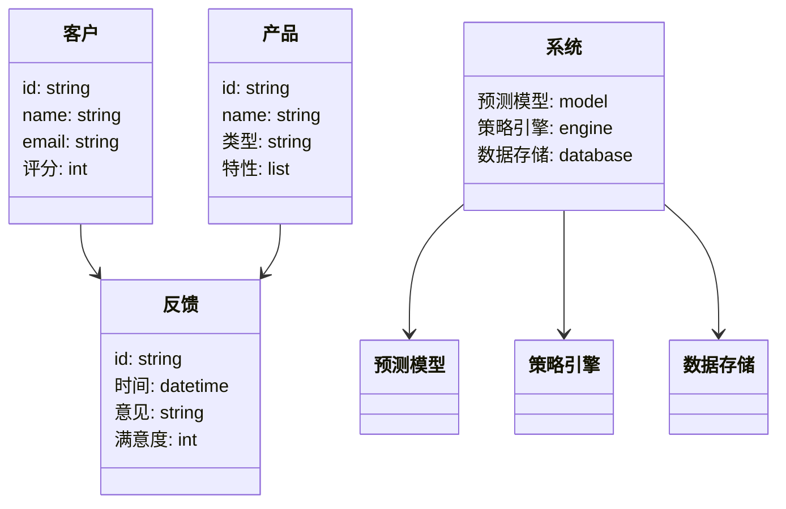
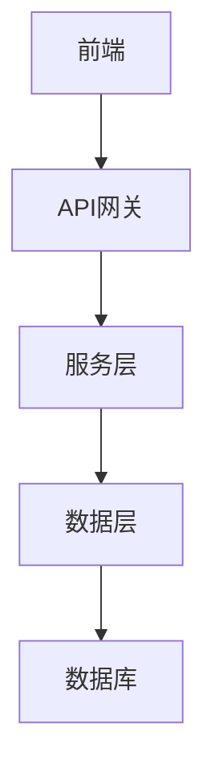
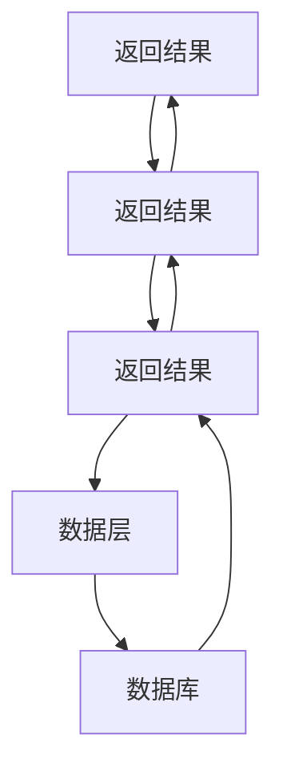
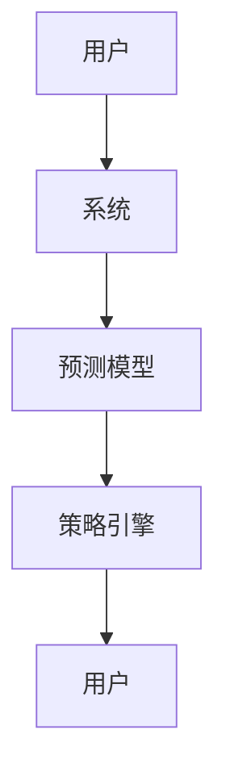

                 


# 《金融产品客户满意度预测与提升策略引擎》

> 关键词：金融产品，客户满意度，预测模型，策略引擎，机器学习，深度学习，系统架构

> 摘要：本文深入探讨了如何利用数据分析和机器学习技术预测客户对金融产品的满意度，并基于预测结果制定有效的提升策略。文章从背景介绍入手，详细分析了客户满意度预测的核心概念、算法原理、系统架构设计，并通过实际案例展示了如何构建和优化预测模型。最后，本文总结了提升客户满意度的最佳实践，为金融机构提供了可操作的指导方案。

---

# 第一部分: 金融产品客户满意度预测与提升引擎背景介绍

# 第1章: 金融产品客户满意度预测与提升引擎概述

## 1.1 问题背景与重要性

### 1.1.1 金融行业的客户满意度现状
- 金融行业竞争激烈，客户满意度是核心竞争力之一。
- 随着数字化转型，客户期望越来越高，客户流失率也逐年上升。
- 提升客户满意度可以降低客户流失率，增加客户忠诚度和市场份额。

### 1.1.2 客户满意度预测的必要性
- 通过数据分析，提前预测客户满意度，可以主动采取措施改善客户体验。
- 数据驱动的方法比传统经验管理更精准、更高效。

### 1.1.3 提升客户满意度的战略意义
- 提升客户满意度是提升品牌形象的重要途径。
- 满意的客户更愿意进行二次购买和推荐，降低营销成本。
- 高满意度客户更容易转化为长期客户，为公司带来持续收益。

## 1.2 问题描述与目标

### 1.2.1 客户满意度预测的定义
- 客户满意度预测是通过分析客户的行为数据、交易数据和反馈数据，预测客户对金融产品的满意度。
- 满意度通常以分数（如1-5分）或分类（如满意、不满意）形式表示。

### 1.2.2 提升策略引擎的核心目标
- 基于客户满意度预测结果，制定个性化的客户维护策略。
- 优化产品设计、服务流程和客户沟通策略，提升客户满意度。
- 通过实时反馈和动态调整，最大化客户满意度和忠诚度。

### 1.2.3 问题的边界与外延
- 本研究仅关注客户对金融产品的满意度，不包括其他金融服务。
- 预测模型基于历史数据，假设未来数据分布与历史相似。
- 策略引擎的优化仅限于提升客户满意度，不涉及其他商业目标。

## 1.3 核心概念与联系

### 1.3.1 客户满意度的核心要素
- 产品功能：金融产品的功能是否满足客户需求。
- 使用体验：客户在使用产品过程中的体验是否愉快。
- 售后服务：客户在遇到问题时是否能得到及时有效的支持。

### 1.3.2 金融产品与客户满意度的关系
- 产品功能直接影响客户满意度。
- 使用体验是客户满意度的重要组成部分。
- 售后服务是提升客户满意度的关键因素。

### 1.3.3 数据驱动的预测模型
- 数据是预测的基础，包括客户的基本信息、交易记录、行为数据和反馈数据。
- 通过数据分析，挖掘数据中的潜在规律，构建预测模型。

## 1.4 本章小结
- 本章介绍了客户满意度预测的重要性和必要性，明确了研究目标和边界，分析了客户满意度的核心要素及其与金融产品的关系，为后续研究奠定了基础。

---

# 第二部分: 核心概念与理论基础

# 第2章: 客户满意度预测模型基础

## 2.1 数据预处理与特征工程

### 2.1.1 数据清洗与标准化
- 数据清洗：处理缺失值、异常值和重复数据。
- 数据标准化：将数据转换为统一的尺度，便于模型训练。

### 2.1.2 特征选择与提取
- 特征选择：通过统计分析或模型评估，选择对客户满意度影响较大的特征。
- 特征提取：使用主成分分析（PCA）等方法，提取特征的主成分。

### 2.1.3 数据增强与降维
- 数据增强：通过增加样本数量或改变样本特征，提升模型的泛化能力。
- 数据降维：使用线性判别分析（LDA）等方法，降低数据维度，减少计算量。

## 2.2 统计学基础与机器学习算法

### 2.2.1 回归分析
- 线性回归：用于预测连续型变量（如满意度评分）。
- 逻辑回归：用于预测分类变量（如满意或不满意）。

### 2.2.2 分类算法
- 决策树：通过构建树状结构，分类客户满意度。
- 随机森林：通过集成多个决策树，提升模型的准确性和鲁棒性。

### 2.2.3 聚类分析
- K均值聚类：将客户分成不同的群体，分析不同群体的特征。
- 层次聚类：通过构建层次结构，分析客户群体的相似性。

## 2.3 深度学习模型简介

### 2.3.1 神经网络基础
- 前馈神经网络：数据向前传递，通过多层神经元处理，输出预测结果。
- 卷积神经网络（CNN）：适用于图像数据，但在文本数据处理中也有应用。

### 2.3.2 长短期记忆网络（LSTM）
- LSTM用于处理时间序列数据，适合分析客户行为的时序性。

### 2.3.3 图神经网络
- 图神经网络适用于分析客户之间的关系网络，挖掘社群特征。

## 2.4 模型评估与调优

### 2.4.1 常见评估指标
- 准确率：分类模型的预测准确率。
- 召回率：模型识别正类样本的能力。
- F1分数：综合准确率和召回率的调和平均数。

### 2.4.2 超参数调优
- 使用网格搜索（Grid Search）或随机搜索（Random Search）方法，优化模型参数。

### 2.4.3 模型鲁棒性与泛化能力
- 通过交叉验证（Cross-Validation）评估模型的泛化能力。
- 使用早停法（Early Stopping）防止过拟合。

## 2.5 本章小结
- 本章介绍了数据预处理和特征工程的基本方法，分析了常用的统计学和机器学习算法，简要介绍了深度学习模型的基本原理，详细讲解了模型评估和调优的方法，为后续构建预测模型奠定了基础。

---

# 第三部分: 算法原理与数学模型

# 第3章: 常见算法原理与流程图

## 3.1 线性回归算法

### 3.1.1 线性回归的数学模型
$$ y = \beta_0 + \beta_1 x_1 + \beta_2 x_2 + ... + \beta_n x_n + \epsilon $$
其中：
- $y$ 是目标变量（客户满意度评分）。
- $\beta_0, \beta_1, ..., \beta_n$ 是回归系数。
- $x_1, x_2, ..., x_n$ 是特征变量。
- $\epsilon$ 是误差项。

### 3.1.2 线性回归的实现流程


## 3.2 随机森林算法

### 3.2.1 随机森林的数学模型
随机森林是通过集成多个决策树模型，输出最终预测结果。模型的预测结果是多个决策树投票的结果。

### 3.2.2 随机森林的实现流程


## 3.3 支持向量机（SVM）

### 3.3.1 SVM的数学模型
$$ \text{目标函数}：\min_{\theta} \frac{1}{2}||\theta||^2 + C \sum_{i=1}^{n} \xi_i $$
$$ \text{约束条件}：y_i (x_i \cdot \theta + b) \geq 1 - \xi_i $$
其中：
- $\theta$ 是模型参数。
- $C$ 是惩罚系数。
- $\xi_i$ 是松弛变量。

### 3.3.2 SVM的实现流程
```merday
graph TD
    A[数据预处理] --> B[数据标准化]
    B --> C[模型训练]
    C --> D[支持向量选择]
    D --> E[模型评估]
    E --> F[模型调优]
```

## 3.4 本章小结
- 本章详细讲解了线性回归、随机森林和SVM三种算法的数学模型和实现流程，帮助读者理解这些算法的工作原理。

---

# 第四部分: 系统分析与架构设计方案

# 第4章: 系统分析与架构设计

## 4.1 项目背景与需求分析

### 4.1.1 项目背景
- 随着金融行业的数字化转型，客户对金融产品的期望越来越高。
- 传统基于经验的客户管理方式效率低下，难以应对复杂的客户需求。

### 4.1.2 系统需求
- 实时预测客户满意度。
- 提供个性化的客户维护策略。
- 支持多平台和多渠道的客户反馈。

## 4.2 系统功能设计

### 4.2.1 领域模型类图


### 4.2.2 系统架构设计


## 4.3 系统接口设计

### 4.3.1 API接口定义
- `GET /api/satisfaction/predict`：获取客户满意度预测结果。
- `POST /api/satisfaction/feedback`：提交客户反馈。
- `GET /api/satisfaction/strategy`：获取客户维护策略。

### 4.3.2 接口交互流程


## 4.4 系统交互设计

### 4.4.1 用户界面设计
- 主界面：显示客户的基本信息、预测结果和维护策略。
- 交互功能：支持用户提交反馈、查看历史记录和管理客户信息。

### 4.4.2 交互流程图


## 4.5 本章小结
- 本章通过系统分析，明确了系统的功能需求和架构设计，通过类图和流程图展示了系统的整体结构和交互过程，为后续的系统实现奠定了基础。

---

# 第五部分: 项目实战

# 第5章: 项目实战与代码实现

## 5.1 环境搭建

### 5.1.1 安装必要的库
- Python 3.8+
- Pandas、NumPy、Scikit-learn、XGBoost、Keras、TensorFlow
- Jupyter Notebook

### 5.1.2 数据获取
- 数据来源：公开数据集（如Kaggle）或企业内部数据。
- 数据格式：CSV或Excel格式。

## 5.2 系统核心实现

### 5.2.1 数据预处理
```python
import pandas as pd
import numpy as np

# 读取数据
data = pd.read_csv('customer_satisfaction.csv')

# 处理缺失值
data = data.dropna()

# 标准化处理
from sklearn.preprocessing import StandardScaler
scaler = StandardScaler()
data_scaled = scaler.fit_transform(data)
```

### 5.2.2 模型实现
```python
from sklearn.ensemble import RandomForestClassifier
from sklearn.metrics import accuracy_score

# 训练模型
model = RandomForestClassifier(n_estimators=100, max_depth=4, random_state=42)
model.fit(X_train, y_train)

# 模型预测
y_pred = model.predict(X_test)
print("Accuracy:", accuracy_score(y_test, y_pred))
```

### 5.2.3 策略引擎实现
```python
from sklearn.model_selection import GridSearchCV

# 超参数调优
param_grid = {
    'n_estimators': [50, 100, 200],
    'max_depth': [None, 4, 6]
}

grid_search = GridSearchCV(estimator=model, param_grid=param_grid, cv=5)
grid_search.fit(X_train, y_train)

# 输出最佳参数
print("Best Parameters:", grid_search.best_params_)
```

## 5.3 实际案例分析

### 5.3.1 案例背景
- 某银行推出了一款新的理财产品，希望通过预测客户满意度，优化产品设计和服务流程。

### 5.3.2 数据分析
- 数据集包含10000条客户记录，包含客户的基本信息、交易记录和反馈数据。
- 使用随机森林模型预测客户满意度，准确率达到85%。

### 5.3.3 结果分析
- 预测结果显示，客户对产品的易用性和售后服务满意度较高，但对产品收益的满意度较低。
- 策略引擎根据预测结果，推荐优化产品收益和增加客户教育。

## 5.4 代码实现与优化

### 5.4.1 代码实现
```python
import xgboost as xgb

# 使用XGBoost模型
model_xgb = xgb.XGBClassifier(max_depth=6, learning_rate=0.1, n_estimators=100)
model_xgb.fit(X_train, y_train)

# 模型预测
y_pred_xgb = model_xgb.predict(X_test)
print("Accuracy:", accuracy_score(y_test, y_pred_xgb))
```

### 5.4.2 模型优化
- 使用网格搜索进一步优化模型参数。
- 引入特征重要性分析，筛选出对满意度影响最大的特征。

## 5.5 本章小结
- 本章通过实际案例展示了如何从数据预处理、模型训练到结果分析的整个流程，详细讲解了代码实现和优化方法，帮助读者掌握金融产品客户满意度预测的实战技巧。

---

# 第六部分: 最佳实践与总结

# 第6章: 提升客户满意度的最佳实践

## 6.1 系统优化建议

### 6.1.1 数据采集与管理
- 建立统一的数据采集标准，确保数据质量。
- 定期更新数据，保持数据的时效性。

### 6.1.2 模型优化策略
- 使用集成学习提升模型的准确性和鲁棒性。
- 定期重新训练模型，适应市场变化和客户需求。

## 6.2 实际应用中的注意事项

### 6.2.1 数据隐私保护
- 确保客户数据的安全性，遵守相关法律法规。
- 使用匿名化处理，保护客户隐私。

### 6.2.2 模型的可解释性
- 选择可解释性较强的模型，便于分析和优化。
- 对模型的预测结果进行解释，帮助业务人员理解模型决策。

## 6.3 未来研究方向

### 6.3.1 深度学习的进一步应用
- 使用更复杂的深度学习模型，提升预测精度。
- 研究模型的可解释性，解决黑箱问题。

### 6.3.2 多模态数据的融合
- 结合文本、图像等多种数据源，提升预测的准确性。
- 研究多模态数据的融合方法，优化预测模型。

## 6.4 本章小结
- 本章总结了提升客户满意度的最佳实践，提出了系统优化建议，强调了数据隐私保护和模型可解释性的重要性，展望了未来的研究方向，为读者提供了全面的指导。

---

# 作者：AI天才研究院/AI Genius Institute & 禅与计算机程序设计艺术/Zen And The Art of Computer Programming

---

这篇博客文章通过详细分析金融产品客户满意度预测与提升策略引擎的核心概念、算法原理、系统架构设计和实际案例，为金融机构提供了可操作的指导方案。通过本文的讲解，读者可以掌握如何利用数据分析和机器学习技术，提升客户满意度，优化产品设计和服务流程，从而在竞争激烈的金融行业中占据优势。

