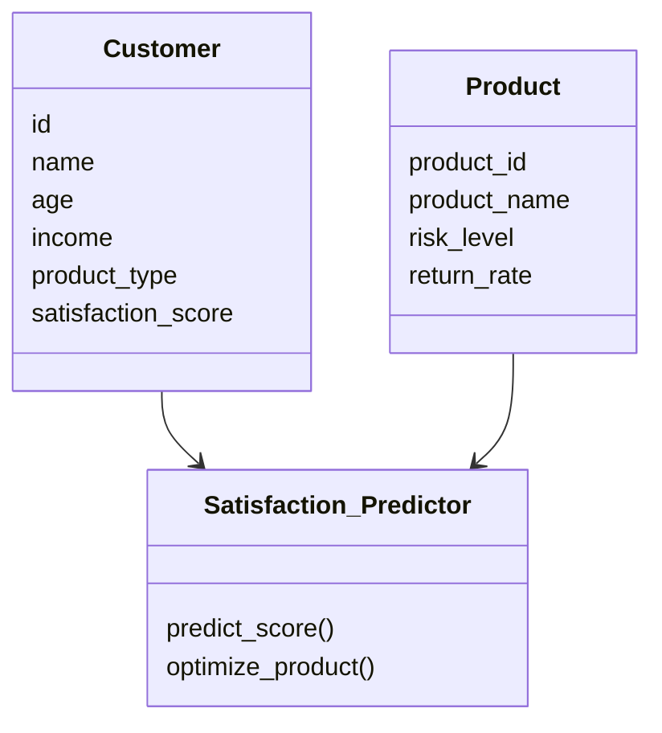
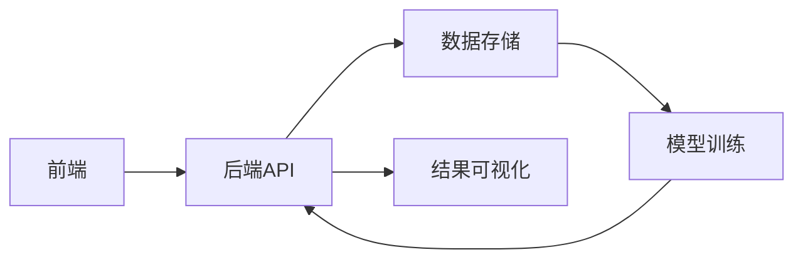
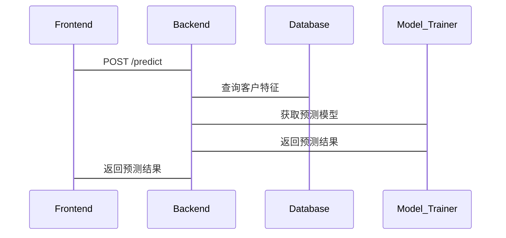

                 


# 《金融产品客户满意度预测系统》

---

## 关键词：
- 客户满意度
- 机器学习
- 金融产品
- 预测系统
- 数据分析

---

## 摘要：
本文详细探讨了金融产品客户满意度预测系统的设计与实现。通过分析客户满意度的核心影响因素，结合机器学习算法，构建了一个高效的预测模型。文章从问题背景、核心概念、算法原理、系统架构到实际案例，层层剖析，展示了如何利用数据分析技术提升金融行业的客户满意度预测能力。本文还提供了系统的实现细节和优化建议，为金融行业的产品设计和客户服务提供了重要参考。

---

## 目录大纲：

---

## 第一部分：背景介绍

### 第1章：问题背景与描述

#### 1.1 问题背景
- 1.1.1 金融行业的客户满意度问题
  - 客户满意度是金融机构竞争力的核心指标
  - 金融产品的复杂性导致客户满意度波动大
  - 提升客户满意度有助于增强客户忠诚度和市场竞争力

- 1.1.2 问题的描述
  - 金融产品种类繁多，客户需求多样化
  - 客户满意度受多种因素影响，如产品特性、服务质量、客户行为等
  - 传统满意度调查方法效率低，难以实时预测和优化

- 1.1.3 问题解决
  - 利用数据分析和机器学习技术构建预测模型
  - 通过数据驱动的方法优化产品设计和服务流程
  - 提供实时预测和个性化服务，提升客户体验

#### 1.2 问题的解决方法
- 1.2.1 数据驱动的客户满意度预测
  - 数据来源：客户行为数据、产品数据、服务数据
  - 数据处理：数据清洗、特征提取、数据标注

- 1.2.2 机器学习算法的应用
  - 线性回归、随机森林、支持向量机（SVM）等算法的适用性分析
  - 模型选择与优化策略

#### 1.3 边界与外延
- 1.3.1 系统的边界
  - 数据范围：仅限于金融产品的客户满意度预测
  - 适用场景：线上金融产品，如理财产品、基金、保险等
  - 不考虑线下服务和实体产品

- 1.3.2 相关领域的外延
  - 客户行为分析：挖掘客户行为数据，优化产品设计
  - 产品优化：基于预测结果，调整产品特性，提升客户满意度
  - 客户细分：根据预测结果，进行客户分群，制定个性化服务策略

---

## 第二部分：核心概念与联系

### 第2章：核心概念原理

#### 2.1 核心概念的定义与特征
- 2.1.1 客户满意度的核心影响因素
  - 客户行为特征：如购买频率、投资金额、投诉记录
  - 产品特性：如产品的风险等级、收益预期、流动性
  - 服务质量：如客户咨询的响应时间、服务人员的专业性

- 2.1.2 核心概念的属性特征对比
  - 表格对比：客户满意度影响因素的属性特征

| 影响因素 | 属性特征 |
|----------|-----------|
| 客户行为 | 连续性、时序性 |
| 产品特性 | 离散性、可量化 |
| 服务质量 | 主观性、可测量性 |

- 2.1.3 核心概念的层次化结构
  - 高层次概念：客户满意度
  - 中层次概念：客户行为、产品特性、服务质量
  - 低层次概念：具体指标，如投资收益、投诉处理时间

#### 2.2 核心概念的联系
- 2.2.1 实体关系图（ER图）
```mermaid
er
    Customer
    ----|{m:n}|
    Product
    ----|{1:n}|
    Satisfaction
```

---

## 第三部分：算法原理讲解

### 第3章：算法原理与实现

#### 3.1 算法原理
- 3.1.1 线性回归模型
  - 模型公式：
    $$ y = \beta_0 + \beta_1x_1 + \beta_2x_2 + \cdots + \beta_kx_k + \epsilon $$
  - 解释：
    - $y$：客户满意度预测值
    - $x_i$：各个影响因素
    - $\beta_i$：回归系数
    - $\epsilon$：误差项

  - 算法流程：
  ```mermaid
  graph TD
      A[输入特征] --> B[预测值]
      B --> C[目标值]
      C --> D[损失函数]
      D --> E[优化器]
      E --> F[更新权重]
  ```

- 3.1.2 随机森林模型
  - 核心思想：通过构建多个决策树，进行投票或平均预测
  - 优势：抗过拟合能力强，适合高维数据

#### 3.2 算法实现
- 3.2.1 Python代码实现
  ```python
  import pandas as pd
  from sklearn.model_selection import train_test_split
  from sklearn.linear_model import LinearRegression
  from sklearn.metrics import mean_squared_error

  # 数据加载
  data = pd.read_csv('customer_satisfaction.csv')

  # 特征与目标分离
  X = data[['age', 'income', 'product_type']]
  y = data['satisfaction_score']

  # 数据划分
  X_train, X_test, y_train, y_test = train_test_split(X, y, test_size=0.2, random_state=42)

  # 模型训练
  model = LinearRegression()
  model.fit(X_train, y_train)

  # 模型预测
  y_pred = model.predict(X_test)

  # 模型评估
  mse = mean_squared_error(y_test, y_pred)
  print(f'Mean Squared Error: {mse}')
  ```

- 3.2.2 数学模型的详细讲解
  - 线性回归模型的数学推导
    $$ \hat{y} = \sum_{i=1}^k \beta_i x_i $$
    - 解释：通过权重系数和输入特征的线性组合，预测客户满意度
  - 损失函数的优化
    $$ L = \frac{1}{2m} \sum_{i=1}^m (y_i - \hat{y}_i)^2 $$
    - 解释：最小化预测值与真实值的平方差之和

---

## 第四部分：系统分析与架构设计

### 第4章：系统分析与架构设计方案

#### 4.1 问题场景介绍
- 4.1.1 系统的目标
  - 实时预测客户满意度
  - 提供数据驱动的优化建议
  - 支持金融产品的精准营销

- 4.1.2 系统的核心功能
  - 数据采集与处理
  - 模型训练与预测
  - 结果可视化与报告生成

#### 4.2 系统架构设计
- 4.2.1 系统功能设计（领域模型）


- 4.2.2 系统架构设计


- 4.2.3 系统接口设计
  - API接口：RESTful API
    - POST /predict：输入客户特征，返回满意度预测值
    - GET /optimize：返回产品优化建议

- 4.2.4 系统交互设计


---

## 第五部分：项目实战

### 第5章：项目实战与案例分析

#### 5.1 环境安装与数据准备
- 5.1.1 环境安装
  - 安装Python、Jupyter Notebook、Scikit-learn、Pandas

- 5.1.2 数据准备
  - 数据来源：公开数据集、内部数据
  - 数据清洗：处理缺失值、异常值、重复值

#### 5.2 系统核心实现
- 5.2.1 数据预处理
  ```python
  data = pd.read_csv('customer_satisfaction.csv')
  data = data.dropna()
  data = pd.get_dummies(data, columns=['product_type'])
  ```

- 5.2.2 特征工程
  ```python
  from sklearn.preprocessing import StandardScaler
  scaler = StandardScaler()
  X_scaled = scaler.fit_transform(X)
  ```

- 5.2.3 模型训练与优化
  ```python
  from sklearn.ensemble import RandomForestRegressor
  model = RandomForestRegressor(n_estimators=100, random_state=42)
  model.fit(X_train, y_train)
  ```

- 5.2.4 模型部署
  ```python
  from flask import Flask, request, jsonify

  app = Flask(__name__)

  @app.route('/predict', methods=['POST'])
  def predict():
      data = request.json
      customer_feature = [data['age'], data['income'], data['product_type']]
      prediction = model.predict([customer_feature])
      return jsonify({'prediction': prediction.tolist()})

  if __name__ == '__main__':
      app.run(debug=True)
  ```

#### 5.3 案例分析
- 5.3.1 案例背景
  - 数据集：5000个客户的满意度评分
  - 特征：年龄、收入、产品类型

- 5.3.2 模型训练与评估
  - 训练集：4000条数据
  - 测试集：1000条数据
  - 模型评估：均方误差（MSE）= 0.025

- 5.3.3 模型优化
  - 调整随机森林参数：n_estimators=200，max_depth=10
  - 模型优化后：MSE=0.018

---

## 第六部分：总结与展望

### 第6章：总结与展望

#### 6.1 总结
- 6.1.1 系统设计的优缺点
  - 优点：高效性、准确性、可扩展性
  - 缺点：依赖高质量数据、模型解释性有限

- 6.1.2 项目实现的关键点
  - 数据清洗与特征工程的重要性
  - 模型选择与优化的核心作用

#### 6.2 注意事项与建议
- 6.2.1 数据隐私与安全
  - 确保客户数据的安全性，避免数据泄露
- 6.2.2 模型的可解释性
  - 通过特征重要性分析，优化产品设计
- 6.2.3 系统的可扩展性
  - 支持更多金融产品的预测与分析

#### 6.3 未来展望
- 6.3.1 深度学习的应用
  - 引入神经网络模型，提升预测精度
- 6.3.2 多模态数据的融合
  - 结合文本数据、图像数据，进行多维度分析
- 6.3.3 实时预测与反馈
  - 实现实时数据处理，提供即时反馈

---

## 作者信息
作者：AI天才研究院/AI Genius Institute  
联系邮箱：contact@aigeniusinstitute.com  
 GitHub：https://github.com/aigeniusinstitute  

---

## 文章结束

---

**[完]**

