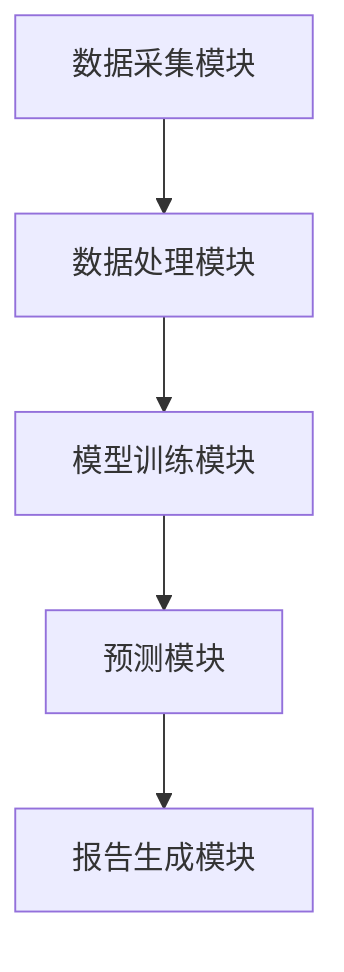

                 


# 金融产品客户生命周期价值最大化

> 关键词：金融产品、客户生命周期、价值最大化、数据驱动、人工智能、金融创新  
> 摘要：本文探讨了如何通过客户生命周期分析和数据驱动的方法，最大化金融产品的客户价值。结合金融行业的特点，详细分析了客户生命周期的核心概念、价值评估模型、算法实现、系统架构设计以及实际案例，为金融机构提供理论和实践指导。

---

# 第一部分: 金融产品客户生命周期价值最大化概述

## 第1章: 客户生命周期与金融产品概述

### 1.1 客户生命周期的基本概念

#### 1.1.1 客户生命周期的定义
客户生命周期（Customer Life Cycle）是指客户与企业之间的关系从初次接触、购买、长期互动到最终终止或忠诚的过程。这个概念在金融行业尤为重要，因为客户的行为和需求会随着生命周期的变化而变化。

#### 1.1.2 客户生命周期的阶段划分
客户生命周期通常分为以下几个阶段：
1. **获取阶段**：吸引新客户。
2. **激活阶段**：让新客户开始使用产品。
3. **成长阶段**：客户逐渐增加使用频率和深度。
4. **成熟阶段**：客户达到使用产品的高峰。
5. **衰退阶段**：客户逐渐减少使用或终止关系。

#### 1.1.3 客户生命周期与金融产品的关系
金融产品（如银行理财、保险、基金等）的生命周期与客户生命周期密不可分。通过分析客户在不同阶段的行为，金融机构可以设计针对性的产品和服务，提升客户满意度和忠诚度。

### 1.2 金融产品的基本概念

#### 1.2.1 金融产品的定义
金融产品是金融机构提供的各种服务或工具，旨在满足客户的财务需求。这些产品可以是贷款、存款、投资产品或保险等。

#### 1.2.2 金融产品的分类
金融产品主要分为以下几类：
1. **信贷产品**：如个人贷款、企业贷款。
2. **存款产品**：如活期存款、定期存款。
3. **投资产品**：如股票、基金、债券。
4. **保险产品**：如人寿保险、财产保险。

#### 1.2.3 金融产品与客户生命周期的结合
金融机构通过分析客户生命周期，可以更好地匹配产品特性与客户需求。例如，在客户成熟阶段，可以推荐高收益的产品；在衰退阶段，提供低风险的产品以稳定客户关系。

---

## 第2章: 客户生命周期价值最大化的重要性

### 2.1 价值最大化的核心概念

#### 2.1.1 客户生命周期价值的定义
客户生命周期价值（Customer Lifetime Value，CLV）是客户在与企业关系存续期间为企业带来的总收入减去相关成本的净现值。公式为：
$$ CLV = \frac{R}{1 - \o $$
其中，\( R \) 是客户每年带来的收入，\( \o $ 是客户流失率的贴现率。

#### 2.1.2 价值最大化的目标
价值最大化的目标是通过优化客户体验和产品策略，提升客户在生命周期中为企业带来的价值。这不仅包括收入的增加，还包括客户忠诚度和口碑传播的提升。

#### 2.1.3 价值最大化与企业利润的关系
客户生命周期价值直接影响企业的利润。通过延长客户生命周期和提高客户忠诚度，企业可以降低获取新客户的成本，从而提高整体利润率。

### 2.2 金融行业中的应用前景

#### 2.2.1 金融行业客户生命周期的特点
金融行业的客户生命周期通常较长，且客户行为受到经济波动和市场环境的影响较大。因此，金融机构需要具备灵活的产品策略和风险管理能力。

#### 2.2.2 价值最大化在金融产品中的应用
通过分析客户生命周期，金融机构可以设计不同的产品组合，满足客户在不同阶段的需求。例如，在客户获取阶段，提供低门槛的产品；在成熟阶段，提供高收益的产品。

#### 2.2.3 价值最大化对客户满意度和忠诚度的影响
客户生命周期价值的提升直接关系到客户的满意度和忠诚度。通过提供个性化服务和精准的产品推荐，金融机构可以增强客户粘性，降低客户流失率。

---

# 第二部分: 客户生命周期价值最大化的方法论

## 第3章: 客户分层与价值评估模型

### 3.1 客户分层的理论基础

#### 3.1.1 客户分层的定义
客户分层是根据客户的行为、需求和价值将客户划分为不同的群体。这种划分有助于金融机构制定针对性的营销和服务策略。

#### 3.1.2 客户分层的分类标准
客户分层的常见分类标准包括：
1. **客户价值**：基于客户生命周期价值的高低。
2. **客户行为**：基于客户的购买频率和金额。
3. **客户特征**：基于客户的年龄、性别和收入水平。

#### 3.1.3 客户分层与价值评估的关系
客户分层是价值评估的基础。通过分层，金融机构可以更精准地预测客户行为，优化资源配置。

### 3.2 价值评估模型的构建

#### 3.2.1 价值评估模型的定义
价值评估模型是用于计算客户生命周期价值的数学模型。通过分析客户的收入、成本和流失率，可以预测客户在未来一段时间内的贡献。

#### 3.2.2 价值评估模型的构建步骤
1. **数据收集**：收集客户的交易数据、行为数据和人口统计数据。
2. **数据清洗**：去除异常值和缺失数据。
3. **特征工程**：提取关键特征，如客户年龄、收入和购买频率。
4. **模型训练**：使用回归或分类算法训练模型。
5. **模型评估**：通过交叉验证评估模型的准确性。

#### 3.2.3 价值评估模型的数学表达式
客户生命周期价值的计算公式可以表示为：
$$ CLV = \frac{R}{1 - \o $$
其中，\( R \) 是客户年收入，\( \o $ 是客户流失率的贴现率。

---

## 第4章: 数据驱动的客户生命周期管理

### 4.1 数据收集与处理

#### 4.1.1 数据来源的分类
数据来源可以分为内部数据和外部数据：
1. **内部数据**：来自金融机构的交易系统和客户数据库。
2. **外部数据**：来自第三方数据供应商和市场调研。

#### 4.1.2 数据清洗与预处理
数据清洗包括去除重复数据、填补缺失值和处理异常值。预处理包括数据标准化和特征提取。

#### 4.1.3 数据存储与管理
数据可以存储在数据库中，如关系型数据库（MySQL）或分布式数据库（Hadoop）。数据管理需要确保数据的安全性和可访问性。

### 4.2 客户行为分析与预测

#### 4.2.1 客户行为分析的定义
客户行为分析是通过分析客户的交易记录和行为数据，预测客户的未来行为。

#### 4.2.2 客户行为预测的算法选择
常用的算法包括：
1. **线性回归**：用于预测客户的未来收入。
2. **决策树**：用于分类客户的行为模式。
3. **随机森林**：用于处理复杂的客户行为预测。

#### 4.2.3 客户行为预测的实现步骤
1. **数据收集**：收集客户的交易记录和行为数据。
2. **特征工程**：提取关键特征，如购买频率和金额。
3. **模型训练**：使用机器学习算法训练模型。
4. **模型评估**：通过准确率和召回率评估模型性能。

---

# 第三部分: 客户生命周期价值最大化算法原理

## 第5章: 客户价值评估的数学模型

### 5.1 客户生命周期价值的计算公式
客户生命周期价值的计算公式可以表示为：
$$ CLV = \frac{R}{1 - \o $$
其中，\( R \) 是客户年收入，\( \o $ 是客户流失率的贴现率。

### 5.2 客户行为预测的算法实现

#### 5.2.1 算法原理
客户行为预测通常使用机器学习算法，如决策树和随机森林。这些算法能够处理复杂的客户行为数据，提供准确的预测结果。

#### 5.2.2 算法实现步骤
1. **数据预处理**：清洗和标准化数据。
2. **特征选择**：提取关键特征。
3. **模型训练**：使用训练数据训练模型。
4. **模型评估**：通过测试数据评估模型性能。

#### 5.2.3 算法实现的Python代码示例
以下是使用决策树算法预测客户行为的Python代码示例：
```python
from sklearn.tree import DecisionTreeClassifier
from sklearn.model_selection import train_test_split
from sklearn.metrics import accuracy_score

# 数据预处理
data = ...  # 数据集
X = data.drop('label', axis=1)
y = data['label']

# 数据分割
X_train, X_test, y_train, y_test = train_test_split(X, y, test_size=0.2)

# 模型训练
model = DecisionTreeClassifier()
model.fit(X_train, y_train)

# 模型评估
y_pred = model.predict(X_test)
print("准确率:", accuracy_score(y_test, y_pred))
```

---

## 第6章: 客户生命周期价值最大化系统架构设计

### 6.1 系统功能设计

#### 6.1.1 功能模块划分
系统功能模块包括：
1. **数据采集模块**：收集客户数据。
2. **数据处理模块**：清洗和预处理数据。
3. **模型训练模块**：训练客户价值评估模型。
4. **预测模块**：预测客户行为和价值。
5. **报告生成模块**：生成价值评估报告。

#### 6.1.2 系统功能模块的交互流程
1. **数据采集模块**接收客户数据，传输至**数据处理模块**。
2. **数据处理模块**清洗数据后，传输至**模型训练模块**。
3. **模型训练模块**训练模型后，将结果传输至**预测模块**。
4. **预测模块**生成预测结果，传输至**报告生成模块**。
5. **报告生成模块**生成报告，供用户查看。

### 6.2 系统架构设计

#### 6.2.1 系统架构图
以下是系统架构设计的Mermaid图：


#### 6.2.2 系统交互流程图
以下是系统交互流程的Mermaid图：
```mermaid
sequenceDiagram
    客户数据 --> 数据采集模块
    数据采集模块 --> 数据处理模块
    数据处理模块 --> 模型训练模块
    模型训练模块 --> 预测模块
    预测模块 --> 报告生成模块
    报告生成模块 --> 用户
```

---

## 第7章: 项目实战

### 7.1 项目背景介绍

#### 7.1.1 项目介绍
本项目旨在设计一个基于客户生命周期价值最大化的金融产品管理系统。通过分析客户的生命周期，优化产品推荐策略，提升客户满意度和忠诚度。

### 7.2 环境安装与配置

#### 7.2.1 环境要求
1. **Python 3.8+**
2. **Jupyter Notebook**
3. **scikit-learn**（机器学习库）
4. **pandas**（数据分析库）
5. **numpy**（数值计算库）

#### 7.2.2 环境配置
安装所需的库：
```bash
pip install scikit-learn pandas numpy
```

### 7.3 系统核心实现源代码

#### 7.3.1 数据预处理代码
```python
import pandas as pd
import numpy as np

# 数据加载
data = pd.read_csv('customer_data.csv')

# 数据清洗
data.dropna(inplace=True)
data = pd.get_dummies(data)
```

#### 7.3.2 模型训练代码
```python
from sklearn.tree import DecisionTreeClassifier
from sklearn.model_selection import train_test_split

# 数据分割
X = data.drop('label', axis=1)
y = data['label']

X_train, X_test, y_train, y_test = train_test_split(X, y, test_size=0.2)

# 模型训练
model = DecisionTreeClassifier()
model.fit(X_train, y_train)
```

#### 7.3.3 预测与评估代码
```python
from sklearn.metrics import accuracy_score

# 模型预测
y_pred = model.predict(X_test)

# 模型评估
print("准确率:", accuracy_score(y_test, y_pred))
```

### 7.4 实际案例分析与解读

#### 7.4.1 案例背景
假设我们有一个银行客户的数据集，包括客户的年龄、收入、购买记录等信息。目标是预测客户在未来的生命周期中是否会流失。

#### 7.4.2 数据分析与解读
通过数据分析，我们发现高收入客户更有可能成为高价值客户。因此，银行可以针对高收入客户推出高收益理财产品，提升客户生命周期价值。

---

## 第8章: 高级应用与最佳实践

### 8.1 客户生命周期价值最大化在金融创新中的应用

#### 8.1.1 个性化产品推荐
通过分析客户生命周期，金融机构可以为不同阶段的客户提供个性化的推荐服务。例如，在客户获取阶段，推荐低风险、低门槛的产品；在成熟阶段，推荐高收益、高风险的产品。

#### 8.1.2 数据驱动的营销策略
通过数据驱动的方法，金融机构可以制定精准的营销策略。例如，根据客户的行为预测，制定针对性的促销活动，提升客户转化率。

### 8.2 客户生命周期价值最大化最佳实践

#### 8.2.1 数据质量管理
确保数据的准确性和完整性是提升客户生命周期价值的基础。金融机构需要建立完善的数据采集和处理机制。

#### 8.2.2 模型优化与迭代
模型的准确性和稳定性直接影响客户价值的评估结果。金融机构需要定期优化模型，提升预测精度。

#### 8.2.3 客户体验优化
通过提升客户体验，金融机构可以延长客户生命周期，提高客户忠诚度。例如，提供个性化的客户服务和便捷的交互渠道。

---

## 第9章: 结语与展望

### 9.1 结语
客户生命周期价值最大化是金融机构提升竞争力的重要手段。通过数据驱动的方法和人工智能技术，金融机构可以更好地满足客户需求，提升客户价值。

### 9.2 展望
随着人工智能和大数据技术的不断发展，客户生命周期价值最大化将在金融行业中发挥越来越重要的作用。未来，金融机构需要更加注重数据的深度挖掘和算法的优化，以实现客户价值的最大化。

---

# 作者：AI天才研究院/AI Genius Institute & 禅与计算机程序设计艺术 /Zen And The Art of Computer Programming

---

通过本文的详细讲解和实际案例分析，读者可以深入了解客户生命周期价值最大化的核心概念、算法原理和系统设计。希望本文能为金融机构在提升客户价值方面提供有价值的参考和指导。

