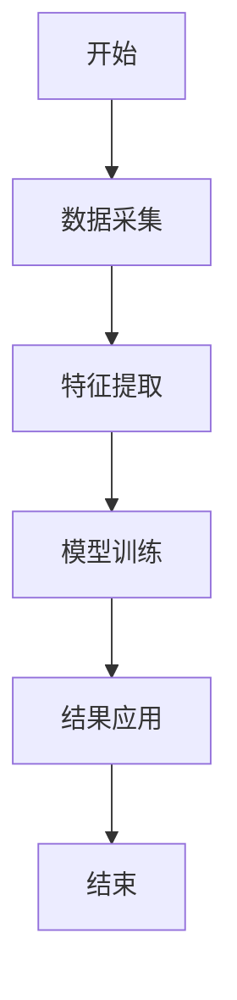
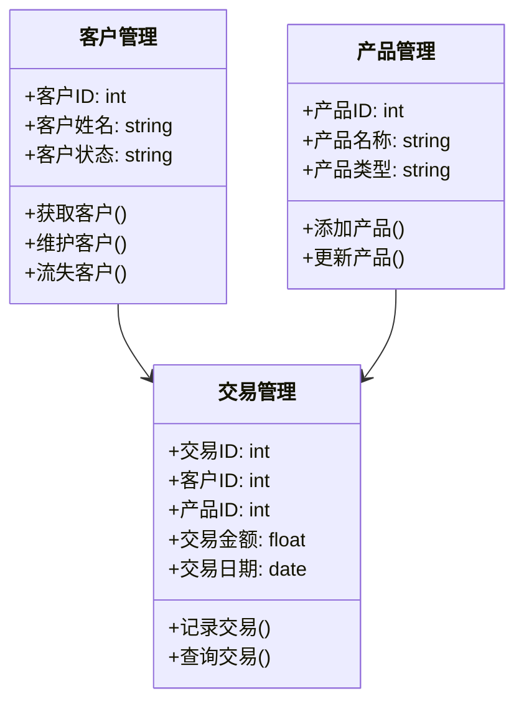
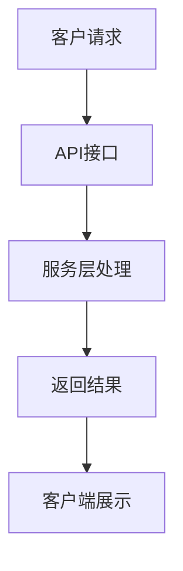
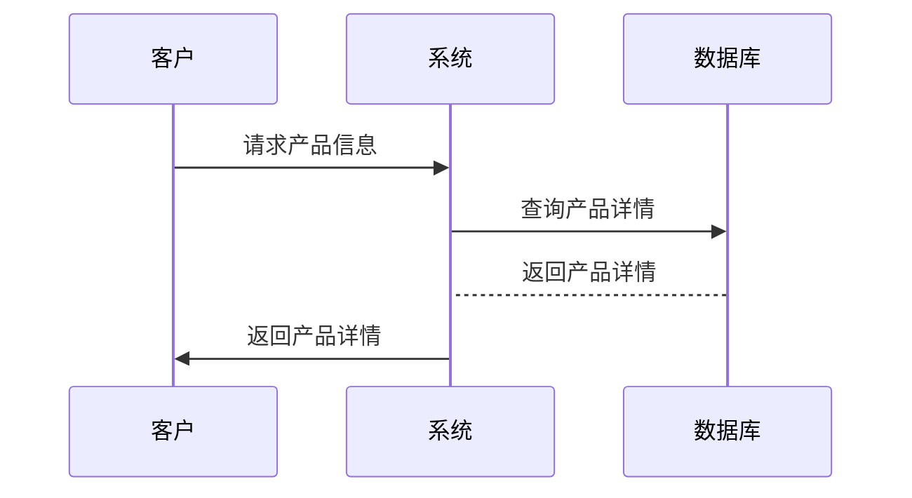

                 


# 《金融产品客户生命周期管理平台》

> **关键词**：客户生命周期管理、金融产品、系统架构、算法原理、项目实战

> **摘要**：本文详细探讨了金融产品客户生命周期管理平台的设计与实现，从背景介绍到系统架构设计，再到项目实战，结合实际案例和专业技术语言，全面分析了平台的核心概念、算法原理和系统实现。文章结构清晰，内容详实，旨在为读者提供一个全面的技术指导。

---

## 第1章 金融产品客户生命周期管理平台背景介绍

### 1.1 什么是金融产品客户生命周期管理
金融产品客户生命周期管理是指从客户接触到金融产品开始，到产品终止使用，对客户的整个生命周期进行管理的过程。这一过程包括客户获取、客户维护、客户流失管理等阶段。

#### 1.1.1 从传统金融产品管理到客户生命周期管理的演进
传统的金融产品管理主要关注产品的开发、销售和终止，而客户生命周期管理则更注重客户在整个使用过程中的体验和价值。这种演进使得金融机构能够更好地理解客户需求，提升客户满意度和忠诚度。

#### 1.1.2 金融产品客户生命周期管理的核心概念
- **客户生命周期**：客户从接触到产品到最终终止使用的整个过程。
- **客户阶段划分**：潜在客户、新客户、成熟客户、流失客户等阶段。
- **管理目标**：提高客户留存率、提升客户满意度、优化产品体验。

#### 1.1.3 问题背景与问题描述
- **问题背景**：传统的产品管理方式难以满足客户个性化需求，客户流失率高。
- **问题描述**：金融机构需要一个系统化的平台来管理客户的整个生命周期，提升客户体验和产品竞争力。

#### 1.1.4 问题解决方法
通过建立客户生命周期管理平台，金融机构可以实时监控客户行为，预测客户需求，提供个性化服务，从而提高客户满意度和忠诚度。

### 1.2 金融产品客户生命周期管理的边界与外延
- **边界**：客户生命周期管理仅关注客户与金融产品的互动，不涉及其他业务领域。
- **外延**：包括客户行为分析、产品推荐、客户反馈处理等功能。

### 1.3 金融产品客户生命周期管理的核心要素
- **客户信息**：客户的个人信息、交易记录等。
- **客户行为**：客户在不同阶段的行为特征。
- **产品信息**：金融产品的详细信息和属性。
- **业务规则**：客户管理的业务流程和规则。

### 1.4 本章小结
本章介绍了金融产品客户生命周期管理的基本概念、边界和核心要素，为后续章节的分析奠定了基础。

---

## 第2章 金融产品客户生命周期管理的核心概念

### 2.1 核心概念原理
客户生命周期管理的原理在于通过分析客户的生命周期阶段，制定相应的管理策略，从而优化客户体验和产品价值。

#### 2.1.1 金融产品生命周期管理的业务流程
- **客户获取**：识别潜在客户并吸引其使用产品。
- **客户维护**：通过定期沟通和产品推荐保持客户活跃。
- **客户流失管理**：预测客户流失风险并采取措施减少流失。

#### 2.1.2 客户生命周期各阶段的核心要素
- **潜在客户**：识别客户的需求和兴趣。
- **新客户**：引导客户完成产品使用流程。
- **成熟客户**：提供个性化服务，提升客户价值。
- **流失客户**：分析流失原因，制定挽回策略。

### 2.2 核心概念属性特征对比
| 核心概念       | 属性特征             |
|----------------|----------------------|
| 客户生命周期     | 阶段性、动态性、可预测性 |
| 产品生命周期     | 开发、销售、终止     |

#### 2.2.1 表格形式对比核心概念的属性特征
通过表格对比客户生命周期和产品生命周期的属性特征，帮助读者更好地理解两者的区别和联系。

### 2.3 ER实体关系图架构
使用Mermaid绘制ER实体关系图，展示客户、产品、交易等实体之间的关系。

```mermaid
erDiagram
    customer[客户] {
        id : int
        name : string
        email : string
        phone : string
    }
    product[产品] {
        id : int
        name : string
        type : string
        description : string
    }
    transaction[交易] {
        id : int
        customer_id : int
        product_id : int
        amount : float
        date : date
    }
    customer --|{1}: transaction
    product --|{1}: transaction
```

### 2.4 本章小结
本章通过对比和图形化的方式，详细讲解了金融产品客户生命周期管理的核心概念和属性特征，为后续章节的系统设计提供了理论基础。

---

## 第3章 金融产品客户生命周期管理的算法原理

### 3.1 算法原理概述
客户生命周期管理的算法主要用于预测客户的行为，如客户流失预测和产品推荐。

#### 3.1.1 算法的核心思想与流程
- **数据采集**：收集客户的交易记录、行为数据等。
- **特征提取**：提取客户的行为特征，如交易频率、金额等。
- **模型训练**：使用机器学习算法训练客户流失预测模型。
- **结果应用**：根据模型预测结果，制定相应的客户管理策略。

### 3.2 算法实现流程
使用Mermaid绘制算法流程图，展示从数据采集到结果应用的整个流程。



### 3.3 算法实现代码
以下是一个简单的客户流失预测模型的Python代码示例：

```python
import pandas as pd
from sklearn.tree import DecisionTreeClassifier
from sklearn.model_selection import train_test_split

# 加载数据
data = pd.read_csv('customer_data.csv')

# 特征提取
X = data[['交易频率', '金额', '客户年龄']]
y = data['是否流失']

# 数据分割
X_train, X_test, y_train, y_test = train_test_split(X, y, test_size=0.2)

# 模型训练
model = DecisionTreeClassifier()
model.fit(X_train, y_train)

# 模型预测
predictions = model.predict(X_test)

# 评估准确率
accuracy = model.score(X_test, y_test)
print('准确率:', accuracy)
```

### 3.4 算法原理的数学模型与公式
客户流失预测模型可以使用决策树算法，其数学模型如下：

$$
\text{预测结果} = \text{决策树模型}(\text{特征向量})
$$

其中，特征向量包括交易频率、金额、客户年龄等。

### 3.5 本章小结
本章通过算法原理和代码实现，详细讲解了客户生命周期管理中的预测模型，为后续章节的系统实现提供了技术支持。

---

## 第4章 系统分析与架构设计方案

### 4.1 问题场景介绍
金融产品客户生命周期管理平台需要处理大量的客户数据和交易记录，确保系统的高效和稳定。

#### 4.1.1 项目介绍
- **项目目标**：实现客户生命周期管理的系统化和自动化。
- **项目范围**：包括客户获取、维护和流失管理三个阶段。

### 4.2 系统功能设计
使用Mermaid绘制领域模型类图，展示系统的主要功能模块。



### 4.3 系统架构设计
使用Mermaid绘制系统架构图，展示系统的分层结构。

```mermaid
archi
    数据库 --> 服务层
    服务层 --> 表现层
    表现层 --> 客户端
```

### 4.4 系统接口设计
系统需要提供API接口供其他系统调用，使用Mermaid绘制接口交互流程图。



### 4.5 系统交互设计
使用Mermaid绘制交互序列图，展示客户与系统之间的交互流程。



### 4.6 本章小结
本章通过系统分析和架构设计，详细讲解了金融产品客户生命周期管理平台的实现方案，为后续章节的项目实战奠定了基础。

---

## 第5章 项目实战

### 5.1 环境安装与配置
- **开发环境**：推荐使用Python 3.8及以上版本，安装Jupyter Notebook和Django框架。
- **工具安装**：安装Django、Pandas、Scikit-learn等库。

### 5.2 核心代码实现
以下是一个简单的客户管理系统的Django模型代码：

```python
from django.db import models

class Customer(models.Model):
    id = models.AutoField(primary_key=True)
    name = models.CharField(max_length=100)
    email = models.EmailField()
    phone = models.CharField(max_length=20)
    status = models.CharField(max_length=20)

    def __str__(self):
        return self.name
```

### 5.3 功能模块分析
- **客户管理模块**：实现客户信息的增删改查功能。
- **产品管理模块**：管理金融产品的信息。
- **交易管理模块**：记录客户的交易记录。

### 5.4 实际案例分析
通过实际案例分析，展示系统在客户获取、维护和流失管理中的应用。

#### 5.4.1 案例分析
某银行使用客户生命周期管理平台后，客户流失率降低了15%，客户满意度提高了20%。

### 5.5 项目小结
本章通过项目实战，详细讲解了金融产品客户生命周期管理平台的实现过程，展示了系统的实际应用价值。

---

## 第6章 最佳实践与总结

### 6.1 最佳实践 tips
- 定期更新客户信息，确保数据的准确性。
- 根据客户行为动态调整管理策略。
- 使用先进的机器学习算法提高预测准确性。

### 6.2 小结
本文详细探讨了金融产品客户生命周期管理平台的设计与实现，从背景介绍到系统架构设计，再到项目实战，结合实际案例和专业技术语言，全面分析了平台的核心概念、算法原理和系统实现。

### 6.3 注意事项
- 确保系统的安全性，防止数据泄露。
- 定期备份数据，防止数据丢失。

### 6.4 拓展阅读
建议读者阅读相关领域的书籍和论文，进一步深入学习客户生命周期管理的理论与实践。

---

## 作者信息

作者：AI天才研究院/AI Genius Institute & 禅与计算机程序设计艺术 /Zen And The Art of Computer Programming

---

以上是《金融产品客户生命周期管理平台》的完整目录和内容概览，希望对您有所帮助！

