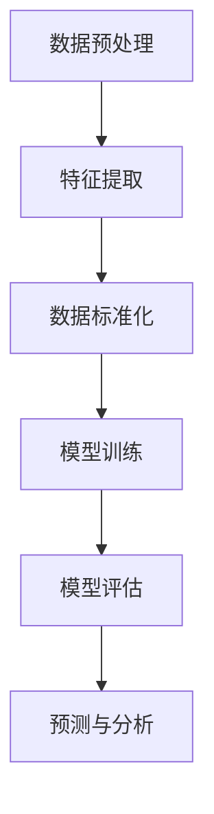
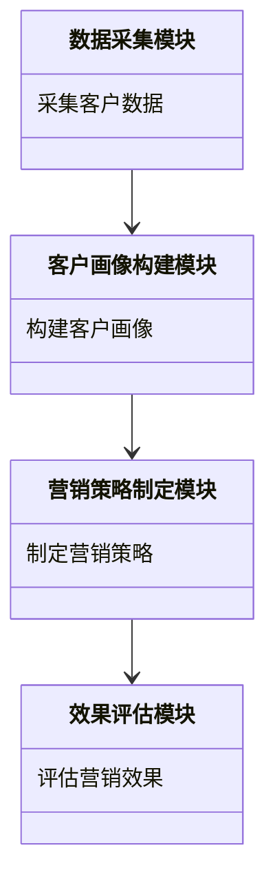

                 


# 《金融产品客户精准营销引擎》

## 关键词：金融产品、客户精准营销、人工智能、机器学习、系统架构

## 摘要：金融产品客户精准营销引擎是一种基于人工智能和大数据分析的营销解决方案，旨在通过客户画像、行为分析和算法模型，实现对金融客户的精准识别和营销策略优化。本文详细探讨了精准营销的核心概念、算法原理、系统架构以及项目实战，为读者提供全面的技术指导。

---

## 第1章：精准营销的背景与重要性

### 1.1 传统营销模式的局限性
- **问题背景**：传统营销模式依赖于广泛的广告投放和随机的客户接触，导致资源浪费和效率低下。
- **问题描述**：金融行业的客户群体多样，传统营销难以满足个性化需求，客户体验差，转化率低。
- **解决方法**：引入精准营销技术，通过数据分析和算法优化，实现对目标客户的精准识别和定制化服务。

### 1.2 金融行业的特点与需求
- **金融行业的复杂性**：金融产品种类繁多，客户风险偏好差异大。
- **金融产品的多样性**：不同客户对理财产品、保险产品的需求差异显著。
- **客户需求的差异性**：客户在收入、年龄、职业等方面存在显著差异，需要个性化的营销策略。

### 1.3 精准营销的核心价值
- **提高客户转化率**：通过精准识别潜在客户，提升营销活动的响应率。
- **降低营销成本**：减少无效营销，将资源集中在高价值客户上。
- **提升客户满意度**：通过定制化服务，增强客户体验和忠诚度。

---

## 第2章：客户画像与需求分析

### 2.1 客户画像的定义与构成
- **客户画像的定义**：客户画像是基于客户数据构建的用户模型，用于描述客户的特征和行为。
- **客户画像的核心要素**：
  - **用户属性**：性别、年龄、职业、收入等。
  - **行为特征**：消费习惯、投资偏好、交易频率等。
  - **风险偏好**：风险承受能力、投资风格等。
- **客户画像的构建方法**：通过数据收集、特征提取和模型训练，构建客户画像。

#### 表格：客户画像的核心要素对比
| 特性         | 描述                                                                 |
|--------------|----------------------------------------------------------------------|
| 用户属性     | 客户的基本信息，如性别、年龄、职业等。                              |
| 行为特征     | 客户的行为数据，如消费频率、投资偏好等。                            |
| 风险偏好     | 客户对风险的承受能力和投资偏好。                                    |

### 2.2 客户需求的层次分析
- **基本需求**：客户对产品的基本功能需求，如理财产品需要保本保息。
- **潜在需求**：客户未明确表达的需求，如对高收益产品的潜在兴趣。
- **个性化需求**：基于客户画像的个性化需求，如高净值客户对定制化理财产品的需求。

### 2.3 客户行为分析与预测
- **客户行为数据的收集**：通过日志记录、问卷调查等方式收集客户行为数据。
- **客户行为模式的识别**：使用聚类算法识别客户行为模式，如高频交易客户和低频交易客户。
- **客户行为预测的算法选择**：使用时间序列分析、随机森林等算法预测客户未来行为。

---

## 第3章：精准营销的核心算法与模型

### 3.1 精准营销算法的分类
- **分类算法**：逻辑回归、决策树、随机森林等，用于客户分类和目标客户识别。
- **聚类算法**：K-means、DBSCAN等，用于客户群体划分和细分。
- **回归算法**：线性回归、岭回归等，用于客户行为预测和需求预测。

### 3.2 常见的精准营销模型
- **逻辑回归模型**：用于客户 churn 预测和营销响应预测。
- **支持向量机模型**：用于客户分类和高维数据处理。
- **随机森林模型**：用于客户画像构建和特征重要性分析。

#### 图表：逻辑回归模型流程图


### 3.3 算法选择与优化
- **算法选择的依据**：数据规模、数据类型、模型复杂度和计算资源。
- **算法优化的方法**：参数调优、特征选择、模型集成和降维技术。
- **算法性能评估指标**：准确率、召回率、F1分数和AUC值。

---

## 第4章：精准营销引擎的系统架构与实现

### 4.1 系统功能模块划分
- **数据采集模块**：负责采集客户数据，包括用户属性、行为数据和市场数据。
- **客户画像构建模块**：基于数据预处理和特征提取，构建客户画像。
- **营销策略制定模块**：根据客户画像和需求分析，制定个性化营销策略。
- **效果评估模块**：评估营销活动的效果，优化营销策略。

#### 图表：系统功能模块划分


### 4.2 系统架构设计
- **分层架构**：包括数据层、业务逻辑层和表现层。
- **数据层**：负责数据存储和管理，使用数据库技术。
- **业务逻辑层**：负责数据处理和模型训练，使用Python和机器学习库。
- **表现层**：负责用户交互和结果展示，使用前端技术和API接口。

#### 图表：系统架构设计


### 4.3 系统接口设计
- **API接口设计**：定义RESTful API，用于数据采集、模型调用和结果返回。
- **接口交互流程**：客户端发送请求，服务层处理数据，返回结果。

#### 图表：系统接口交互流程
```mermaid
sequenceDiagram
client ->+> Web层: 发送请求
Web层 ->+> 服务层: 处理请求
服务层 ->+> 数据层: 查询数据
数据层 ->+> 服务层: 返回数据
服务层 ->+> Web层: 处理数据
Web层 ->+> client: 返回结果
```

---

## 第5章：项目实战——构建金融产品客户精准营销引擎

### 5.1 环境配置
```bash
pip install pandas scikit-learn django
```

### 5.2 数据预处理
```python
import pandas as pd

# 加载数据
data = pd.read_csv('customer_data.csv')

# 处理缺失值
data = data.dropna()
```

### 5.3 特征工程
```python
from sklearn.preprocessing import StandardScaler

# 特征提取
features = data[['age', 'income', 'investment_history']]
scaler = StandardScaler()
features_scaled = scaler.fit_transform(features)
```

### 5.4 模型训练
```python
from sklearn.linear_model import LogisticRegression

# 训练逻辑回归模型
model = LogisticRegression()
model.fit(features_scaled, target)
```

### 5.5 模型评估
```python
from sklearn.metrics import accuracy_score, recall_score, f1_score

# 预测结果
y_pred = model.predict(features_scaled)

# 评估指标
print('准确率:', accuracy_score(target, y_pred))
print('召回率:', recall_score(target, y_pred))
print('F1分数:', f1_score(target, y_pred))
```

### 5.6 系统实现
```python
from django.urls import path
from . import views

urlpatterns = [
    path('api/train/', views.train_model, name='train_model'),
    path('api/predict/', views.predict_customer, name='predict_customer'),
]
```

---

## 第6章：总结与最佳实践

### 6.1 总结
- 本文详细介绍了金融产品客户精准营销引擎的构建过程，包括背景、核心概念、算法原理和系统架构。
- 精准营销引擎能够提高客户转化率、降低营销成本并提升客户满意度。

### 6.2 最佳实践
- **数据质量**：确保数据的完整性和准确性，避免数据偏差。
- **算法选择**：根据具体场景选择合适的算法，避免过度复杂化。
- **系统安全性**：确保数据安全和系统稳定，避免信息泄露和系统崩溃。

### 6.3 小结
- 金融产品客户精准营销引擎是人工智能和大数据技术在金融领域的典型应用，具有重要的现实意义和商业价值。

### 6.4 注意事项
- 在实际应用中，需要注意数据隐私和合规性，确保符合相关法律法规。
- 系统上线后，需要定期监控和优化，确保性能稳定和用户体验良好。

### 6.5 拓展阅读
- 《机器学习实战》
- 《Python机器学习》
- 《金融工程》

---

## 作者：AI天才研究院/AI Genius Institute & 禅与计算机程序设计艺术 /Zen And The Art of Computer Programming

---

通过以上内容，您可以逐步构建一个完整的金融产品客户精准营销引擎，掌握从理论到实践的全过程。希望这篇文章能为您提供有价值的技术指导和启发！

