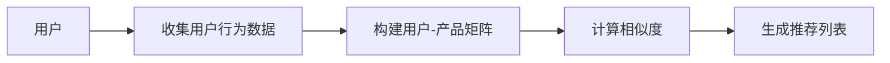
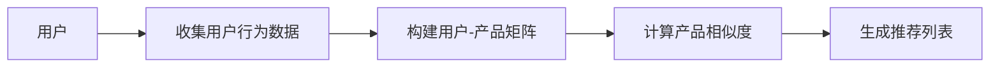
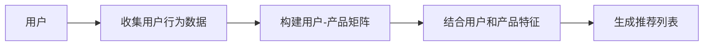
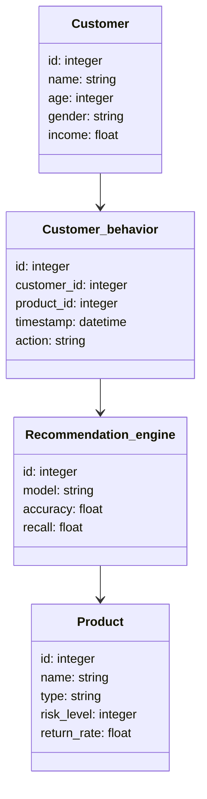
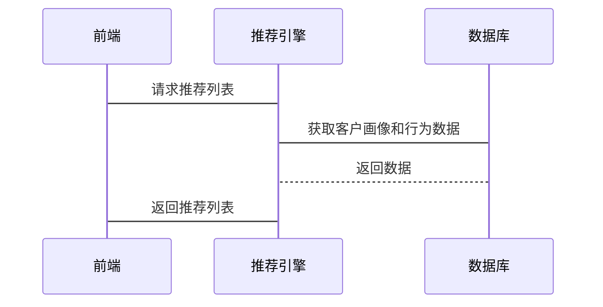

                 


# 《金融产品客户精准营销推荐引擎》

> **关键词**：金融产品，客户精准营销，推荐引擎，协同过滤，深度学习，系统架构

> **摘要**：本文详细探讨了金融产品客户精准营销推荐引擎的设计与实现。从背景介绍、核心概念、算法原理到系统架构，再到项目实战，全面分析了如何利用协同过滤算法和深度学习模型，构建一个高效、准确的金融产品推荐系统。文章结合理论与实践，为金融行业精准营销提供了有价值的参考。

---

# 第一章: 金融产品客户精准营销背景

## 1.1 金融营销的现状与挑战

### 1.1.1 传统金融营销模式的局限性

传统的金融营销模式主要依赖于人工推荐和简单的规则筛选，这种方式存在以下问题：

- **客户覆盖不全面**：难以覆盖所有潜在客户，尤其是长尾客户。
- **推荐精准度低**：基于简单规则的推荐，难以满足客户的个性化需求。
- **成本高**：需要大量人工干预，营销成本较高。
- **难以应对市场变化**：无法快速响应市场和客户需求的变化。

### 1.1.2 金融营销中的客户细分需求

金融产品种类繁多，客户群体多样化，不同客户的需求和风险承受能力差异显著。例如：

- **高净值客户**：需要高端理财服务和定制化产品。
- **中低净值客户**：更适合标准化产品和普惠金融服务。
- **风险厌恶型客户**：倾向于低风险、稳定收益的产品。
- **风险偏好型客户**：愿意承担较高风险以获取更高收益。

### 1.1.3 精准营销的必要性与重要性

精准营销能够通过数据分析和模型挖掘，识别客户的个性化需求，提供针对性的产品推荐，从而提高营销效率和客户满意度。其重要性体现在以下几个方面：

- **提升客户转化率**：通过精准推荐，增加潜在客户转化为实际客户的概率。
- **降低营销成本**：减少无效推荐，提高营销资源的利用效率。
- **增强客户忠诚度**：通过个性化服务，提升客户对品牌的忠诚度和满意度。

## 1.2 客户精准营销的核心概念

### 1.2.1 客户精准营销的定义

客户精准营销是指通过数据分析和模型挖掘，基于客户的画像、行为数据和偏好，进行个性化的产品推荐和服务。

### 1.2.2 精准营销与传统营销的区别

| **方面**         | **传统营销**                     | **精准营销**                     |
|------------------|----------------------------------|----------------------------------|
| **数据驱动**     | 依赖经验判断                     | 依赖数据和模型                   |
| **客户细分**     | 粗放式客户划分                   | 细化客户画像                     |
| **推荐精准度**   | 推荐准确率低                     | 推荐准确率高                     |
| **成本效率**     | 成本高，效率低                   | 成本低，效率高                   |

### 1.2.3 金融产品推荐引擎的目标与价值

- **目标**：基于客户画像和行为数据，推荐适合的产品，提升客户满意度和转化率。
- **价值**：通过精准推荐，提高客户忠诚度和产品销售效率，降低营销成本。

## 1.3 推荐引擎在金融营销中的应用

### 1.3.1 推荐引擎的基本原理

推荐引擎通过分析客户的特征、行为和偏好，结合金融产品的属性，生成个性化的推荐列表。

### 1.3.2 金融产品推荐引擎的特点

- **数据密集型**：需要大量客户和产品数据。
- **实时性要求高**：推荐结果需要快速生成。
- **模型复杂性**：需要结合多种推荐算法，提高推荐准确度。

### 1.3.3 金融产品推荐引擎的优势

- **提高客户转化率**：通过精准推荐，增加客户购买的可能性。
- **降低营销成本**：通过数据驱动的推荐，减少人工干预。
- **提升客户体验**：个性化推荐能够更好地满足客户需求。

## 1.4 本章小结

本章介绍了金融产品客户精准营销的背景、核心概念和推荐引擎的基本原理。通过对比传统营销和精准营销的区别，阐述了精准营销在金融行业中的重要性和优势。为后续章节的深入分析奠定了基础。

---

# 第二章: 推荐引擎的核心概念

## 2.1 推荐引擎的分类与特点

### 2.1.1 协同过滤推荐

- **基于用户的协同过滤**：根据用户的相似性推荐产品。
- **基于物品的协同过滤**：根据产品的相似性推荐产品。

### 2.1.2 混合推荐模型

结合协同过滤和基于内容的推荐，提高推荐准确度和多样性。

### 2.1.3 混合推荐模型的特点

- **鲁棒性**：能够同时处理用户和物品的特征。
- **多样性**：推荐结果更加多样化，避免单一性。

## 2.2 推荐引擎的关键指标

### 2.2.1 精准度（Precision）

$$ \text{Precision} = \frac{\text{True Positive}}{\text{True Positive + False Positive}} $$

精准度衡量推荐列表中实际被购买的比例。

### 2.2.2 召回率（Recall）

$$ \text{Recall} = \frac{\text{True Positive}}{\text{True Positive + False Negative}} $$

召回率衡量推荐列表中实际购买的客户数量。

### 2.2.3 F1分数（F1 Score）

$$ \text{F1 Score} = \frac{2 \cdot \text{Precision} \cdot \text{Recall}}{\text{Precision} + \text{Recall}} $$

F1分数是精准度和召回率的调和平均数。

## 2.3 推荐引擎的实体关系模型

以下是客户、产品、行为等实体的关系图：

```mermaid
er
    customer: 客户
    product: 金融产品
    customer_behavior: 客户行为
    recommendation_engine: 推荐引擎
    transaction: 交易记录
    customer: 建立关系 --> customer_behavior
    customer_behavior: 影响 --> recommendation_engine
    recommendation_engine: 输出 --> product
    transaction: 记录 --> customer
```

## 2.4 本章小结

本章详细介绍了推荐引擎的分类、关键指标和实体关系模型。通过定义精准度、召回率和F1分数，阐述了推荐引擎的性能评估方法。同时，通过ER图展示了推荐引擎的核心实体关系。

---

# 第三章: 推荐引擎的算法原理

## 3.1 协同过滤算法

### 3.1.1 协同过滤的基本原理

协同过滤通过分析用户的行为数据，找到相似的用户或产品，进行推荐。

### 3.1.2 基于用户的协同过滤

- **实现流程**：
  1. 收集用户行为数据。
  2. 构建用户-产品矩阵。
  3. 计算用户相似度。
  4. 生成推荐列表。

流程图如下：



### 3.1.3 基于物品的协同过滤

- **实现流程**：
  1. 收集用户行为数据。
  2. 构建用户-产品矩阵。
  3. 计算产品相似度。
  4. 生成推荐列表。

流程图如下：



### 3.1.4 混合协同过滤模型

- **实现流程**：
  1. 收集用户行为数据。
  2. 构建用户-产品矩阵。
  3. 结合用户和产品特征，计算相似度。
  4. 生成推荐列表。

流程图如下：



## 3.2 协同过滤的数学模型

### 3.2.1 基于用户的协同过滤公式

$$ \hat{r}_{u,i} = \frac{\sum_{k \in N_u} w_{u,k} \cdot r_{k,i}}{\sum_{k \in N_u} w_{u,k}} $$

其中：
- $\hat{r}_{u,i}$ 表示用户 $u$ 对产品 $i$ 的预测评分。
- $N_u$ 表示与用户 $u$ 相似的用户集合。
- $w_{u,k}$ 表示用户 $u$ 和用户 $k$ 的相似度。

### 3.2.2 基于物品的协同过滤公式

$$ \hat{r}_{u,i} = \frac{\sum_{j \in N_i} w_{i,j} \cdot r_{u,j}}{\sum_{j \in N_i} w_{i,j}} $$

其中：
- $\hat{r}_{u,i}$ 表示用户 $u$ 对产品 $i$ 的预测评分。
- $N_i$ 表示与产品 $i$ 相似的其他产品集合。
- $w_{i,j}$ 表示产品 $i$ 和产品 $j$ 的相似度。

## 3.3 深度学习模型

### 3.3.1 基于神经网络的推荐模型

- **输入层**：客户画像和行为数据。
- **隐层**：通过神经网络进行特征提取和学习。
- **输出层**：生成推荐列表。

### 3.3.2 基于深度学习的推荐模型

- **实现流程**：
  1. 收集用户行为数据。
  2. 构建神经网络模型。
  3. 训练模型。
  4. 生成推荐列表。

## 3.4 本章小结

本章详细介绍了协同过滤算法和深度学习模型的原理和实现流程。通过数学公式和流程图，阐述了推荐引擎的核心算法和技术。

---

# 第四章: 推荐引擎的系统分析与架构设计

## 4.1 系统分析

### 4.1.1 问题场景介绍

- **目标**：基于客户画像和行为数据，推荐适合的金融产品。
- **数据来源**：客户信息、交易记录、行为数据等。

### 4.1.2 项目介绍

- **项目目标**：构建一个金融产品推荐引擎，实现客户精准营销。
- **项目范围**：涵盖客户画像、产品推荐、交易记录等模块。

## 4.2 系统功能设计

### 4.2.1 领域模型设计

以下是领域模型的类图：



### 4.2.2 系统架构设计

以下是系统架构的架构图：


## 4.3 系统接口设计

- **API接口**：
  - `/api/recommend/?customer_id=123`：根据客户ID返回推荐列表。
  - `/api/train/`：训练推荐模型。

## 4.4 系统交互设计

以下是系统交互的序列图：



## 4.5 本章小结

本章详细介绍了推荐引擎的系统分析与架构设计，包括领域模型、系统架构、接口设计和交互设计。通过类图和架构图，展示了推荐引擎的整体结构和工作流程。

---

# 第五章: 推荐引擎的项目实战

## 5.1 项目环境安装

### 5.1.1 安装Python环境

```bash
python --version
pip install --upgrade pip
```

### 5.1.2 安装依赖库

```bash
pip install numpy pandas scikit-learn flask
```

## 5.2 系统核心实现

### 5.2.1 数据预处理代码

```python
import pandas as pd
from sklearn.model_selection import train_test_split

# 加载数据
data = pd.read_csv('customer_behavior.csv')

# 划分训练集和测试集
train, test = train_test_split(data, test_size=0.2)
```

### 5.2.2 模型训练代码

```python
from sklearn.metrics.pairwise import cosine_similarity

# 计算用户相似度
user_similarity = cosine_similarity(train[['age', 'income']], train[['age', 'income']])
```

### 5.2.3 推荐服务部署

```python
from flask import Flask, jsonify

app = Flask(__name__)

@app.route('/api/recommend/<int:customer_id>')
def recommend(customer_id):
    # 获取客户画像
    customer = data[data['id'] == customer_id]
    # 计算相似度
    similarities = user_similarity[customer_id]
    # 推荐产品
    recommendations = similarities.argsort()[::-1][:5]
    return jsonify({'recommendations': recommendations.tolist()})

if __name__ == '__main__':
    app.run(debug=True)
```

## 5.3 代码应用解读与分析

### 5.3.1 数据预处理

- **加载数据**：从CSV文件中加载客户行为数据。
- **划分训练集和测试集**：将数据分为训练集和测试集，用于模型训练和验证。

### 5.3.2 模型训练

- **计算用户相似度**：使用余弦相似度计算用户的相似性。
- **生成推荐列表**：基于相似度排序，生成推荐列表。

### 5.3.3 推荐服务

- **API接口设计**：提供RESTful API，根据客户ID返回推荐列表。
- **部署服务**：使用Flask框架部署推荐服务。

## 5.4 实际案例分析

### 5.4.1 案例背景

- **客户ID**：123
- **客户画像**：年龄30岁，收入中等，风险厌恶型。

### 5.4.2 推荐过程

1. 收集客户行为数据。
2. 计算客户相似度。
3. 生成推荐列表。

### 5.4.3 推荐结果

- 推荐低风险、稳定收益的理财产品。

## 5.5 本章小结

本章通过实际案例，详细讲解了推荐引擎的项目实战，包括数据预处理、模型训练和推荐服务的部署。通过代码实现和案例分析，展示了推荐引擎的实际应用。

---

# 第六章: 总结与展望

## 6.1 项目总结

- **核心成果**：构建了一个金融产品推荐引擎，实现了客户精准营销。
- **关键技术**：基于协同过滤算法，结合深度学习模型。
- **成功经验**：通过数据分析和模型优化，提高了推荐准确度。

## 6.2 项目经验总结

- **数据质量的重要性**：数据清洗和特征工程是推荐引擎的核心。
- **模型调优的必要性**：通过参数优化和模型融合，提高推荐性能。
- **实时性要求**：需要实时更新模型和数据。

## 6.3 未来展望

- **技术改进方向**：引入深度学习模型，提高推荐准确度。
- **业务扩展方向**：结合自然语言处理技术，实现智能对话推荐。
- **性能优化方向**：优化推荐引擎的实时性和响应速度。

## 6.4 最佳实践 tips

- **数据驱动决策**：基于数据和模型进行推荐，避免主观判断。
- **持续优化模型**：定期更新模型，适应市场和客户需求的变化。
- **关注客户体验**：推荐结果需要符合客户的实际需求和风险承受能力。

## 6.5 本章小结

本章总结了项目的成果和经验，并展望了未来的技术改进方向和业务扩展方向。通过最佳实践 tips，为读者提供了宝贵的参考和指导。

---

# 作者：AI天才研究院 & 禅与计算机程序设计艺术

---

**感谢您的阅读！如果文章对您有所帮助，请分享给更多人。**

