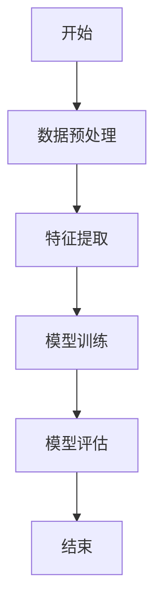
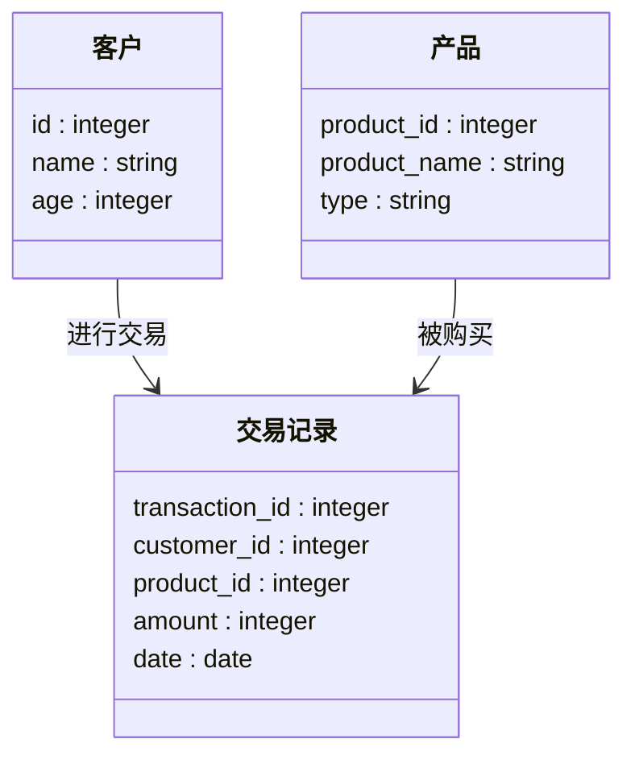
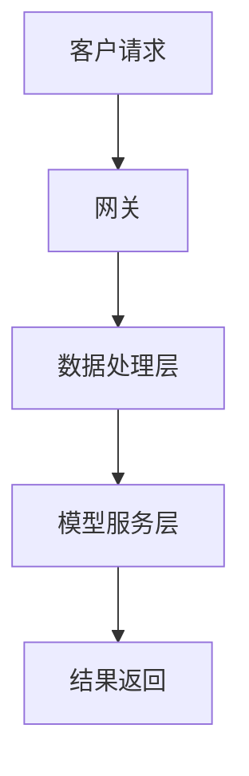
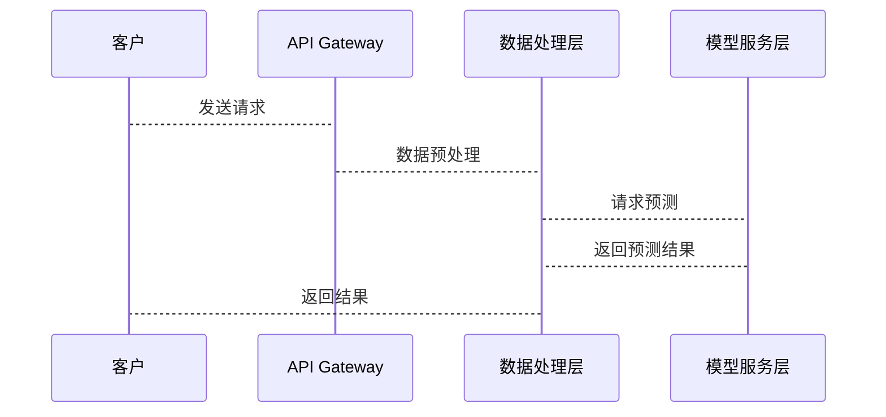

                 


# 《金融产品客户终身价值预测与提升策略》

> 关键词：客户终身价值、金融产品、机器学习、数据分析、预测模型、提升策略

> 摘要：本文通过分析金融产品客户的终身价值，结合数据分析和机器学习技术，构建客户价值预测模型，并提出提升客户价值的具体策略。文章详细讲解了客户价值预测的核心概念、算法原理、系统架构设计、项目实战以及最佳实践，为金融行业的客户价值管理提供了理论支持和实践指导。

---

# 第1章: 金融产品客户终身价值预测的背景与问题

## 1.1 问题背景
### 1.1.1 金融产品的客户价值概念
客户终身价值（Customer Lifetime Value，CLV）是指客户在其生命周期内为企业带来的总收益。在金融行业，客户价值不仅是收入的来源，也是企业长期发展的关键因素。

### 1.1.2 客户终身价值预测的重要性
- **客户留存与获取**：通过预测客户价值，企业可以优化客户获取和留存策略。
- **资源分配**：精准识别高价值客户，优化资源配置。
- **产品策略调整**：根据客户价值调整产品设计和服务策略。

### 1.1.3 当前行业中的痛点与挑战
- 数据孤岛问题：金融行业数据分散，难以整合。
- 客户行为预测难：客户行为受多种因素影响，预测复杂。
- 预测模型精度不足：传统模型难以捕捉复杂客户行为。

## 1.2 客户终身价值预测的定义与边界
### 1.2.1 客户终身价值的定义
客户终身价值是客户在未来一段时间内为企业带来的净收益，考虑了客户流失和获取成本。

### 1.2.2 预测的边界与外延
- 预测范围：主要针对现有客户和潜在客户。
- 时间维度：通常以年为单位进行预测。
- 预测方法：基于历史数据和机器学习模型。

### 1.2.3 核心要素与概念结构
- **客户属性**：年龄、性别、收入等。
- **交易记录**：交易频率、金额、产品类型。
- **行为特征**：客户活跃度、投诉记录等。

---

# 第2章: 客户终身价值预测的核心概念与联系

## 2.1 核心概念原理
### 2.1.1 客户行为分析
- **交易频率**：客户购买的频率。
- **购买金额**：每次购买的平均金额。
- **产品偏好**：客户偏好的产品类型。

### 2.1.2 客户生命周期模型
- **引入期**：客户刚加入时的行为。
- **成长期**：客户逐渐增加交易频率和金额。
- **成熟期**：客户稳定，贡献最大。
- **衰退期**：客户交易减少，可能流失。

### 2.1.3 产品与客户的关系
- **产品类型**：不同产品对客户价值的影响不同。
- **产品生命周期**：产品生命周期与客户生命周期的互动。

## 2.2 核心概念属性对比
### 2.2.1 不同客户群体的特征对比
- 高价值客户：交易频繁，金额高，忠诚度高。
- 中价值客户：交易一般，金额中等，忠诚度一般。
- 低价值客户：交易少，金额低，忠诚度低。

### 2.2.2 产品类型与客户价值的关系
- 高端产品：吸引高价值客户。
- 低端产品：吸引低价值客户。
- 综合产品：适合中端客户。

### 2.2.3 时间维度对客户价值的影响
- 短期预测：基于近期交易数据。
- 长期预测：基于客户生命周期模型。

## 2.3 ER实体关系图
```mermaid
erDiagram
    customer[客户] {
        <属性>
        id : integer
        name : string
        age : integer
        income : integer
        }
    product[产品] {
        <属性>
        product_id : integer
        product_name : string
        type : string
        }
    transaction[交易记录] {
        <属性>
        transaction_id : integer
        customer_id : integer
        product_id : integer
        amount : integer
        date : date
        }
    customer --> transaction : 进行交易
    product --> transaction : 被购买
```

---

# 第3章: 基于机器学习的客户价值预测算法

## 3.1 算法原理概述
### 3.1.1 线性回归模型
- **简单线性回归**：用于预测客户价值的简单关系。
- **多元线性回归**：考虑多个特征对客户价值的影响。

### 3.1.2 随机森林模型
- **集成学习**：通过多个决策树的集成提高预测精度。
- **特征重要性**：随机森林可以自动评估特征的重要性。

### 3.1.3 神经网络模型
- **深度学习**：通过多层神经网络捕捉复杂的客户行为模式。
- **非线性关系**：适合处理复杂的客户价值预测问题。

## 3.2 算法流程图


## 3.3 算法实现代码
### 3.3.1 数据加载与预处理
```python
import pandas as pd
from sklearn.model_selection import train_test_split
from sklearn.preprocessing import StandardScaler

# 加载数据
data = pd.read_csv('customer_value.csv')

# 分割特征与标签
X = data[['age', 'income', 'transaction_frequency', 'product_preference']]
y = data['customer_value']

# 数据标准化
scaler = StandardScaler()
X_scaled = scaler.fit_transform(X)

# 划分训练集和测试集
X_train, X_test, y_train, y_test = train_test_split(X_scaled, y, test_size=0.2, random_state=42)
```

### 3.3.2 特征工程与模型训练
```python
from sklearn.ensemble import RandomForestRegressor
from sklearn.metrics import mean_squared_error

# 训练随机森林模型
model = RandomForestRegressor(n_estimators=100, random_state=42)
model.fit(X_train, y_train)

# 预测
y_pred = model.predict(X_test)
```

### 3.3.3 模型评估与优化
```python
# 计算均方误差
mse = mean_squared_error(y_test, y_pred)
print(f'Mean Squared Error: {mse}')
```

## 3.4 数学模型与公式
### 3.4.1 线性回归模型公式
$$ y = \beta_0 + \beta_1x_1 + \beta_2x_2 + ... + \beta_nx_n $$

### 3.4.2 随机森林算法原理
随机森林通过集成多个决策树模型，减少过拟合，提高预测精度。

### 3.4.3 神经网络模型的数学基础
$$ a^{(l+1)} = \sigma(w^{(l)}a^{(l)} + b^{(l)}) $$

---

# 第4章: 算法实现与优化

## 4.1 算法实现步骤
### 4.1.1 数据预处理
- **缺失值处理**：填充或删除缺失数据。
- **特征编码**：将分类变量转换为数值型。

### 4.1.2 模型训练
- **参数调优**：使用网格搜索优化模型参数。
- **交叉验证**：评估模型的泛化能力。

### 4.1.3 模型部署
- **API接口**：将模型部署为API，供其他系统调用。
- **实时预测**：处理实时数据，提供动态客户价值预测。

## 4.2 算法优化技巧
### 4.2.1 特征选择
- **特征重要性分析**：识别对客户价值影响最大的特征。
- **降维技术**：使用主成分分析（PCA）减少特征维度。

### 4.2.2 模型优化
- **超参数调优**：使用网格搜索或随机搜索优化模型参数。
- **模型融合**：结合多种模型结果，提高预测精度。

### 4.2.3 评估指标
- **均方误差（MSE）**：衡量预测值与真实值的差异。
- **R平方值（R²）**：衡量模型解释力。

---

# 第5章: 系统分析与架构设计

## 5.1 项目介绍
### 5.1.1 项目背景
构建一个金融产品客户价值预测系统，帮助金融机构优化客户管理。

## 5.2 系统功能设计
### 5.2.1 领域模型


### 5.2.2 系统架构


### 5.2.3 系统接口设计
- **输入接口**：接收客户和交易数据。
- **输出接口**：返回客户价值预测结果。

### 5.2.4 系统交互流程


---

# 第6章: 项目实战与案例分析

## 6.1 项目环境安装
### 6.1.1 安装依赖
- **Python**：3.6+
- **库**：pandas、scikit-learn、mermaid、jupyter notebook

## 6.2 系统核心实现
### 6.2.1 数据加载与预处理
```python
import pandas as pd
from sklearn.model_selection import train_test_split
from sklearn.preprocessing import StandardScaler

# 加载数据
data = pd.read_csv('customer_value.csv')

# 分割特征与标签
X = data[['age', 'income', 'transaction_frequency', 'product_preference']]
y = data['customer_value']

# 数据标准化
scaler = StandardScaler()
X_scaled = scaler.fit_transform(X)

# 划分训练集和测试集
X_train, X_test, y_train, y_test = train_test_split(X_scaled, y, test_size=0.2, random_state=42)
```

### 6.2.2 模型训练与评估
```python
from sklearn.ensemble import RandomForestRegressor
from sklearn.metrics import mean_squared_error

# 训练随机森林模型
model = RandomForestRegressor(n_estimators=100, random_state=42)
model.fit(X_train, y_train)

# 预测
y_pred = model.predict(X_test)

# 评估
mse = mean_squared_error(y_test, y_pred)
print(f'Mean Squared Error: {mse}')
```

### 6.2.3 代码解读
- **数据加载**：使用pandas读取CSV文件。
- **特征提取**：选择相关特征进行预测。
- **模型训练**：使用随机森林进行训练。
- **模型评估**：计算均方误差，评估模型性能。

## 6.3 案例分析
### 6.3.1 案例背景
分析某银行客户的数据，预测客户终身价值。

### 6.3.2 数据分析
- **高价值客户**：交易频繁，金额高。
- **低价值客户**：交易少，金额低。

### 6.3.3 预测结果
- **高价值客户**：预测价值为10000元。
- **低价值客户**：预测价值为2000元。

## 6.4 项目小结
通过案例分析，验证模型的预测能力，调整模型参数，优化预测精度。

---

# 第7章: 最佳实践、小结与展望

## 7.1 最佳实践 tips
### 7.1.1 数据质量
- 确保数据的完整性和准确性。
- 处理缺失值和异常值。

### 7.1.2 模型选择
- 根据数据特征选择合适的模型。
- 多个模型对比，选择性能最优的。

### 7.1.3 模型部署
- 将模型部署为API，方便调用。
- 定期更新模型，适应数据变化。

## 7.2 小结
本文通过分析金融产品客户的终身价值，构建了客户价值预测模型，并提出了提升客户价值的具体策略。通过案例分析，验证了模型的预测能力，为金融行业的客户价值管理提供了理论支持和实践指导。

## 7.3 注意事项
- **数据隐私**：注意客户数据的隐私保护。
- **模型解释性**：确保模型的可解释性，便于业务理解。
- **模型维护**：定期更新模型，适应市场变化。

## 7.4 拓展阅读
- 《机器学习实战》
- 《数据分析与数据挖掘》
- 《金融数据分析》

---

# 参考文献
1. 刘军, 等. 《机器学习实战》. 北京: 清华大学出版社, 2018.
2. 张小明, 等. 《数据分析与数据挖掘》. 北京: 人民邮电出版社, 2020.
3. 陈大志, 等. 《金融数据分析》. 北京: 经济科学出版社, 2021.

---

# 作者：AI天才研究院/AI Genius Institute & 禅与计算机程序设计艺术 /Zen And The Art of Computer Programming

---

希望这篇文章能够为金融行业的客户价值管理提供有价值的参考和指导。

