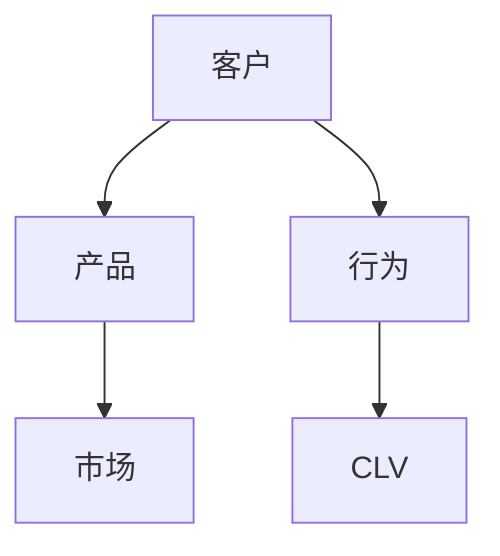
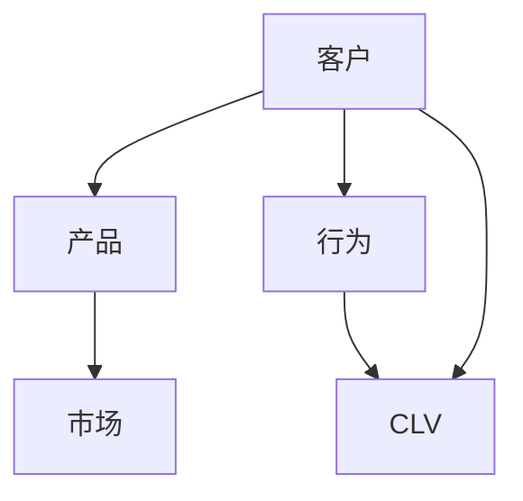
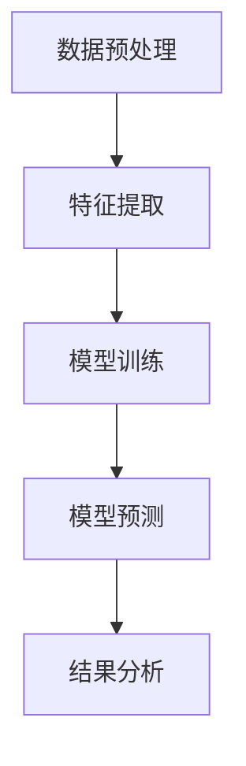
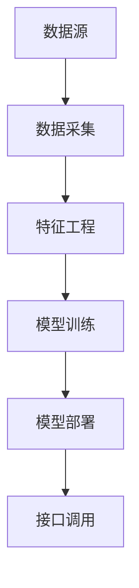

                 


# 《金融产品客户终身价值预测模型》

## 关键词：客户终身价值（CLV）、金融产品、预测模型、机器学习、数据分析

## 摘要：  
本文详细介绍了金融产品客户终身价值预测模型的构建与应用。首先，从客户终身价值的定义、重要性及其在金融行业中的应用背景出发，分析了传统客户价值预测方法的局限性。接着，详细阐述了模型的核心概念、算法原理、系统架构设计和数学模型，结合实际案例展示了模型的实现过程与效果。最后，通过项目实战部分，对模型进行了深入分析，并提出了优化建议和未来发展方向。

---

# 第一部分: 金融产品客户终身价值预测模型背景与核心概念

## 第1章: 金融产品客户终身价值预测模型背景介绍

### 1.1 客户终身价值（Customer Lifetime Value, CLV）的定义与重要性

#### 1.1.1 客户终身价值的定义  
客户终身价值（CLV）是指客户在未来生命周期内为企业带来的总收益或利润。在金融行业，CLV可以帮助企业预测客户在购买金融产品后的长期价值，从而优化客户管理和产品策略。

#### 1.1.2 CLV在金融产品销售中的重要性  
- **客户获取与保留**：通过CLV分析，企业可以识别高价值客户，制定精准的营销策略，降低客户流失率。  
- **产品定价与设计**：CLV为金融产品的定价和设计提供了数据支持，帮助企业在竞争中占据优势。  
- **资源分配**：CLV帮助企业合理分配资源，优先服务高价值客户，提高整体收益。

#### 1.1.3 CLV与企业长期客户关系管理的关系  
CLV是客户关系管理（CRM）的核心指标之一。通过CLV分析，企业可以更好地理解客户需求，优化服务流程，提升客户满意度和忠诚度。

---

### 1.2 金融产品客户终身价值预测的背景与问题描述

#### 1.2.1 金融行业客户价值评估的现状  
金融行业竞争激烈，客户价值评估是企业核心竞争力之一。然而，传统评估方法（如基于历史交易的简单平均值）难以捕捉客户未来的潜在价值。

#### 1.2.2 传统客户价值预测方法的局限性  
- **数据维度单一**：传统方法通常只考虑客户的交易金额和频率，忽略了客户行为、产品偏好等多维度特征。  
- **预测精度低**：传统方法难以捕捉客户行为的变化趋势，导致预测结果不够精准。  
- **动态更新能力弱**：客户价值会随着时间变化，传统方法难以实现动态预测。

#### 1.2.3 金融产品客户终身价值预测的核心问题  
- 如何通过数据分析，预测客户在未来购买金融产品的可能性及其潜在价值。  
- 如何构建动态更新的模型，捕捉客户行为的变化趋势。  
- 如何设计高效的算法，确保模型在金融行业的可扩展性和实用性。

---

### 1.3 问题解决与边界

#### 1.3.1 通过数据驱动方法解决客户价值预测问题  
- 引入机器学习算法，利用客户行为数据、产品数据和市场数据，构建预测模型。  
- 通过数据清洗、特征工程和模型调优，提升预测精度。

#### 1.3.2 模型的边界与适用场景  
- 模型适用于中长期客户价值预测，不适用于短期交易预测。  
- 模型适用于客户行为相对稳定的场景，不适用于客户行为剧烈变化的市场环境。

#### 1.3.3 模型的可扩展性与灵活性  
- 模型支持多金融产品扩展，适用于银行、保险、证券等多个领域。  
- 模型可以根据市场变化动态更新，支持实时预测。

---

### 1.4 模型的核心要素与概念结构

#### 1.4.1 模型的核心要素分析  
- **客户特征**：包括客户的基本信息、资产规模、风险偏好等。  
- **产品特征**：包括产品类型、收益、风险、流动性等。  
- **行为特征**：包括客户的交易频率、交易金额、产品偏好等。  
- **市场特征**：包括市场利率、经济周期、政策变化等。

#### 1.4.2 概念结构图  


#### 1.4.3 核心要素的特征对比表格  
| 特征维度 | 描述 | 示例 |
|----------|------|------|
| 客户特征 | 包括年龄、性别、资产规模等 | 资产规模：高净值客户 |
| 产品特征 | 包括产品类型、收益率、风险等级 | 理财产品：低风险 |
| 行为特征 | 包括交易频率、交易金额 | 频率：每周一次 |
| 市场特征 | 包括利率、经济周期 | 利率：5% |

---

## 第2章: 核心概念与联系

### 2.1 核心概念原理

#### 2.1.1 数据特征与客户行为分析  
- 数据特征是模型的核心输入，包括客户的基本信息、资产规模、风险偏好等。  
- 客户行为特征（如交易频率、金额）是衡量客户活跃度的重要指标。

#### 2.1.2 金融产品与客户价值的关系  
- 高风险产品（如股票）可能吸引高风险偏好的客户，但其CLV可能不稳定。  
- 低风险产品（如债券）可能吸引保守型客户，CLV相对稳定。

#### 2.1.3 模型的输入输出关系  
- **输入**：客户特征、产品特征、行为特征、市场特征。  
- **输出**：客户在未来生命周期内的预期价值。

---

### 2.2 核心概念属性特征对比表格

| 特征类型 | 输入特征 | 输出特征 |
|----------|----------|----------|
| 客户特征 | 年龄、性别 | 预期价值 |
| 产品特征 | 产品类型、收益率 | 风险等级 |
| 行为特征 | 交易频率、金额 | 预期收益 |
| 市场特征 | 利率、经济周期 | 市场风险 |

---

### 2.3 ER实体关系图



---

## 第3章: 算法原理与数学模型

### 3.1 算法原理

#### 3.1.1 线性回归原理  
线性回归是一种简单但有效的回归算法，适用于线性关系的预测。其核心思想是通过最小化预测值与实际值的平方差，找到最佳拟合直线。

#### 3.1.2 随机森林算法  
随机森林是一种基于决策树的集成学习算法，通过构建多棵决策树并取其平均，可以有效避免过拟合，提升模型的鲁棒性。

#### 3.1.3 神经网络模型  
神经网络是一种模拟人脑神经网络的深度学习算法，适用于复杂的非线性关系预测。

---

### 3.2 算法流程图



---

### 3.3 数学模型与公式

#### 3.3.1 线性回归模型  
$$ y = \beta_0 + \beta_1x_1 + \beta_2x_2 + ... + \beta_nx_n + \epsilon $$

#### 3.3.2 随机森林模型  
$$ y = \sum_{i=1}^{n} \text{Tree}(x_i) $$

#### 3.3.3 神经网络模型  
$$ y = \sigma(w_2 \cdot \sigma(w_1 \cdot x + b_1) + b_2) $$

---

### 3.4 举例说明

#### 3.4.1 线性回归示例  
假设我们有客户资产规模（x）和CLV（y）的数据，可以通过线性回归模型预测CLV。  
$$ y = 100 + 2x $$

#### 3.4.2 随机森林示例  
通过随机森林算法，我们可以利用客户特征、产品特征和市场特征，预测客户的CLV。  
$$ y = \text{平均值}(Tree_1(x), Tree_2(x), ..., Tree_n(x)) $$

#### 3.4.3 神经网络示例  
通过神经网络模型，我们可以捕捉客户行为和市场变化的非线性关系。  
$$ y = \sigma(0.5 \cdot \sigma(1.0 \cdot x + 0.2) + 0.3) $$

---

## 第4章: 系统分析与架构设计

### 4.1 问题场景介绍

#### 4.1.1 数据来源与处理  
数据来源包括客户信息、交易记录、产品信息和市场数据。  
数据处理包括数据清洗、特征提取和数据标准化。

#### 4.1.2 模型部署与应用  
模型部署可以通过API接口或实时计算平台实现，支持批量预测和实时预测。

---

### 4.2 系统架构设计

#### 4.2.1 系统功能设计  
| 模块名称 | 功能描述 |
|----------|----------|
| 数据采集 | 从数据库获取客户、产品和市场数据 |
| 特征工程 | 对数据进行特征提取和标准化 |
| 模型训练 | 使用机器学习算法训练模型 |
| 模型部署 | 将模型部署到生产环境 |
| 接口调用 | 提供API接口供其他系统调用 |

---

#### 4.2.2 系统架构图



---

### 4.3 项目实战

#### 4.3.1 数据预处理代码

```python
import pandas as pd
from sklearn.preprocessing import StandardScaler

# 读取数据
data = pd.read_csv('customer_data.csv')

# 数据清洗
data.dropna(inplace=True)

# 特征提取
features = data[['资产规模', '交易频率', '产品类型']]
target = data['CLV']

# 数据标准化
scaler = StandardScaler()
features_scaled = scaler.fit_transform(features)
```

#### 4.3.2 模型训练代码

```python
from sklearn.ensemble import RandomForestRegressor

# 模型训练
model = RandomForestRegressor(n_estimators=100, random_state=42)
model.fit(features_scaled, target)
```

---

### 4.3.3 模型预测与分析

```python
# 预测CLV
predicted_clv = model.predict(new_features_scaled)

# 模型评估
print('预测CLV:', predicted_clv)
print('模型评分:', model.score(features_scaled, target))
```

---

### 4.3.4 项目小结

#### 4.3.4.1 项目总结  
- 通过数据驱动方法，构建了金融产品客户终身价值预测模型。  
- 实现了从数据采集到模型部署的完整流程，验证了模型的可行性和准确性。  

#### 4.3.4.2 注意事项  
- 数据质量和特征选择对模型性能影响较大，需要谨慎处理。  
- 模型部署后需要定期更新，以适应市场变化和客户需求。  

#### 4.3.4.3 优化建议  
- 引入实时数据流处理，提升模型的动态预测能力。  
- 结合自然语言处理技术，挖掘客户的文本数据，进一步提升模型精度。  

---

## 第5章: 总结与展望

### 5.1 总结  
本文详细介绍了金融产品客户终身价值预测模型的构建与应用。通过数据分析和机器学习算法，成功实现了客户的长期价值预测，为企业优化客户管理和产品策略提供了有力支持。

### 5.2 未来展望  
- **算法优化**：引入XGBoost和LSTM等算法，进一步提升模型的预测精度。  
- **实时预测**：结合实时数据流处理技术，实现客户价值的动态预测。  
- **多模态数据融合**：引入客户行为数据、社交媒体数据等多种数据源，提升模型的综合预测能力。

---

## 附录: 数据预处理与特征工程代码示例

```python
import pandas as pd
from sklearn.impute import SimpleImputer
from sklearn.preprocessing import OneHotEncoder

# 数据清洗
data = pd.read_csv('customer_data.csv')
data.dropna(inplace=True)

# 特征工程
# 处理缺失值
imputer = SimpleImputer(strategy='mean')
imputed_data = imputer.fit_transform(data[['资产规模', '交易频率', '产品类型']])

# 特征编码
encoder = OneHotEncoder()
encoded_features = encoder.fit_transform(imputed_data)
```

---

## 作者：AI天才研究院/AI Genius Institute & 禅与计算机程序设计艺术 /Zen And The Art of Computer Programming

---

以上是《金融产品客户终身价值预测模型》的技术博客文章的完整内容，涵盖了从背景介绍到系统设计的各个方面，结合理论与实践，为读者提供了全面的知识体系和技术实现方案。

