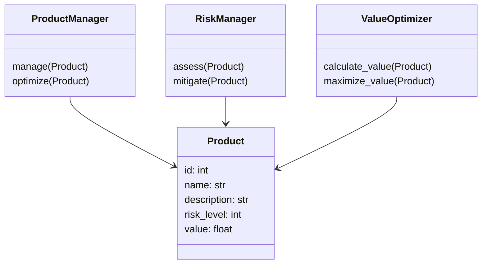

                 


# 金融产品生命周期价值最大化策略

> 关键词：金融产品生命周期，价值最大化，风险管理，算法模型，系统架构

> 摘要：本文详细探讨了金融产品生命周期管理的核心概念、算法模型、系统架构以及实战应用。通过分析各阶段的关键成功要素和优化策略，结合数学模型和实际案例，展示了如何通过科学的方法实现金融产品生命周期价值的最大化，同时有效控制风险，提升客户满意度。

---

## 第一部分：金融产品生命周期管理的背景与意义

### 第1章：金融产品生命周期管理的背景与意义

#### 1.1 金融产品的基本概念

##### 1.1.1 金融产品的定义与分类

金融产品是指金融机构向客户提供的各种金融工具和服务，包括但不限于存款、贷款、证券、基金、保险、衍生品等。根据功能和风险的不同，金融产品可以分为以下几类：

- **债务工具**：如债券、贷款等，投资者通过提供资金获得固定收益。
- **股权工具**：如股票，投资者通过持有公司股份获得收益。
- **衍生工具**：如期货、期权等，用于对冲或投机特定资产的价格波动。
- **混合工具**：如可转换债券，兼具债务和股权的特性。

##### 1.1.2 金融产品的核心要素与属性

金融产品的核心要素包括：

1. **期限**：产品的存续时间，影响流动性、收益和风险。
2. **收益**：产品的预期收益，通常与风险相关。
3. **风险**：产品的潜在损失，包括市场风险、信用风险等。
4. **流动性**：产品在市场上的交易活跃程度。
5. **定价模型**：用于确定产品价格的数学模型，如Black-Scholes模型。

##### 1.1.3 金融产品生命周期的阶段划分

金融产品的生命周期一般分为以下几个阶段：

1. **开发阶段**：产品设计、需求分析、风险评估。
2. **测试阶段**：产品测试、模拟运行、风险测试。
3. **上线阶段**：产品发布、市场推广、客户认购。
4. **运营阶段**：产品监控、风险管理、收益评估。
5. **终止阶段**：产品到期、清算、终止。

#### 1.2 金融产品生命周期管理的重要性

##### 1.2.1 生命周期管理的核心目标

- 提高产品市场竞争力。
- 优化资源配置，降低成本。
- 提升客户满意度和忠诚度。
- 有效控制风险，确保合规性。

##### 1.2.2 生命周期管理对金融机构的价值

- 通过科学的生命周期管理，金融机构可以更高效地推出符合市场需求的产品。
- 优化产品组合，提高整体收益。
- 降低产品失败的风险，提升市场适应能力。

##### 1.2.3 生命周期管理的挑战与机遇

- **挑战**：市场波动、政策变化、技术风险。
- **机遇**：技术创新、数据驱动、客户洞察。

#### 1.3 金融产品生命周期价值最大化的意义

##### 1.3.1 价值最大化的目标与原则

- **目标**：在各生命周期阶段实现最大化的价值创造。
- **原则**：客户导向、创新驱动、风险管理、持续优化。

##### 1.3.2 价值最大化与风险管理的关系

- 风险管理是价值最大化的重要保障。
- 通过风险管理，可以降低产品失败的概率，提升整体价值。

##### 1.3.3 价值最大化与客户满意度的关联

- 客户满意度是产品价值的重要体现。
- 提供高质量的产品和服务，可以提升客户忠诚度，进而提升产品价值。

---

## 第二部分：金融产品生命周期管理的核心概念

### 第2章：金融产品生命周期模型

#### 2.1 金融产品生命周期模型

##### 2.1.1 生命周期模型的构成要素

- **时间维度**：产品从开发到终止的时间跨度。
- **价值维度**：产品在各阶段创造的经济价值。
- **风险维度**：产品在各阶段面临的风险水平。
- **资源维度**：产品开发和运营所需的资源投入。

##### 2.1.2 生命周期模型的阶段划分与特点

- **开发阶段**：重点在产品设计和风险评估。
- **测试阶段**：通过模拟运行验证产品可行性。
- **上线阶段**：产品正式推向市场。
- **运营阶段**：持续监控和优化。
- **终止阶段**：产品清算和终止。

##### 2.1.3 生命周期模型的数学表达式

生命周期价值（LV）可以通过以下公式计算：

$$ LV = \sum_{t=1}^{n} (R_t - C_t) $$

其中，\( R_t \) 表示第 \( t \) 阶段的收益，\( C_t \) 表示第 \( t \) 阶段的成本。

---

### 第3章：金融产品生命周期管理的算法与模型

#### 3.1 产品生命周期预测算法

##### 3.1.1 算法原理与数学模型

- 使用机器学习算法（如随机森林、神经网络）预测产品生命周期的长度和各阶段的表现。

##### 3.1.2 算法实现步骤与代码示例

```python
import numpy as np
from sklearn.ensemble import RandomForestRegressor

# 示例数据
X = np.array([[1, 2], [3, 4], [5, 6]])
y = np.array([1, 2, 3])

# 模型训练
model = RandomForestRegressor(n_estimators=100)
model.fit(X, y)

# 预测
print(model.predict([[7, 8]]))  # 输出预测结果
```

---

### 第4章：系统分析与架构设计方案

#### 4.1 系统功能设计

##### 4.1.1 领域模型（Mermaid 类图）



---

### 第5章：项目实战

#### 5.1 环境安装

- **工具安装**：安装Python、Jupyter Notebook、Scikit-learn、Mermaid CLI。
- **依赖管理**：使用pip安装所需的库。

#### 5.2 核心代码实现

```python
import numpy as np
from sklearn import metrics
from sklearn.ensemble import RandomForestRegressor

# 示例数据
X = np.array([[1, 2], [3, 4], [5, 6]])
y = np.array([1, 2, 3])

# 模型训练
model = RandomForestRegressor(n_estimators=100)
model.fit(X, y)

# 预测与评估
predicted = model.predict(X)
print("均方误差:", metrics.mean_squared_error(y, predicted))
```

---

## 第三部分：总结与展望

### 第6章：最佳实践与注意事项

- **风险管理**：在各阶段进行风险评估和监控。
- **客户洞察**：深入了解客户需求，提升产品适配性。
- **持续优化**：根据市场反馈和技术进步，持续优化产品和流程。

### 第7章：小结

通过科学的生命周期管理，金融机构可以更高效地推出优质产品，实现价值最大化。本文从理论到实践，详细探讨了金融产品生命周期管理的各个方面，为从业者提供了实用的指导。

---

## 作者信息

作者：AI天才研究院/AI Genius Institute & 禅与计算机程序设计艺术/Zen And The Art of Computer Programming

