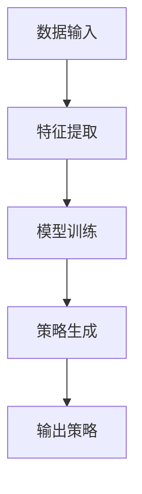
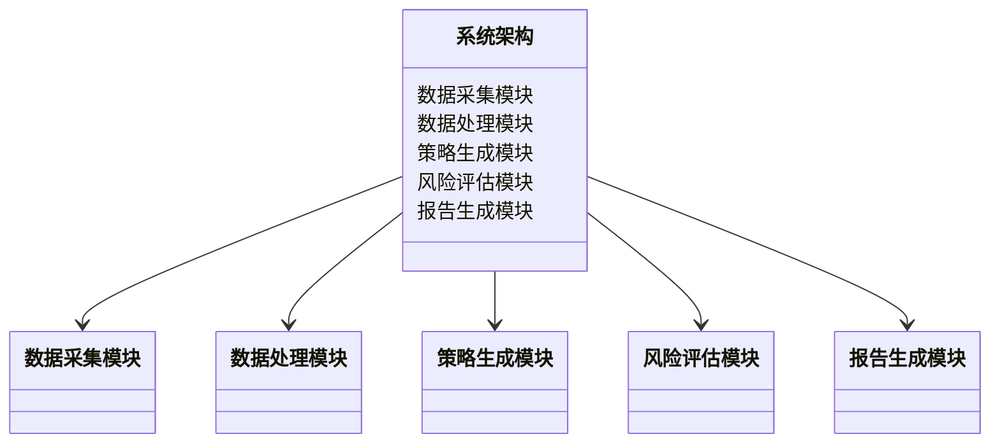
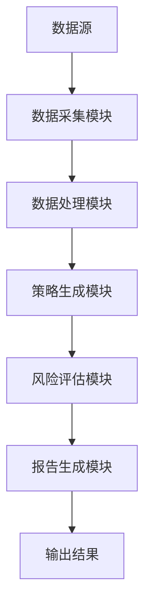
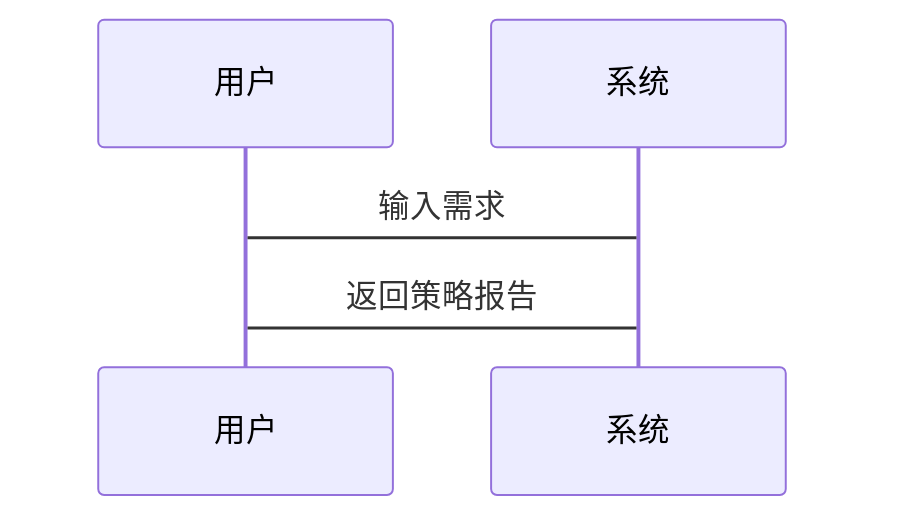

                 


# 《金融产品生命周期价值最大化策略生成器》

---

## 关键词：
金融产品、生命周期、策略生成器、价值最大化、风险管理、机器学习、系统架构

---

## 摘要：
本文探讨如何利用策略生成器最大化金融产品的生命周期价值。通过分析金融产品的生命周期阶段、策略生成器的核心算法以及系统架构，结合数学模型和实际案例，提供一套完整的解决方案。文章详细讲解了策略生成器的算法原理、数学模型、系统设计和项目实现，帮助读者理解如何在实际业务中应用这些方法来优化金融产品的价值。

---

## 第一部分：背景介绍

### 第1章：金融产品生命周期价值最大化问题背景

#### 1.1 问题背景
- **金融产品的定义与分类**  
  金融产品是金融机构提供给客户的各类服务或工具，包括储蓄、贷款、保险、基金、股票等。不同产品有不同的风险和收益特征。
  
- **金融产品生命周期的定义**  
  金融产品从设计、发行、运营到终止的全过程。不同阶段有不同的价值表现和管理重点。

- **价值最大化的重要性**  
  在竞争激烈的金融市场中，最大化金融产品的生命周期价值可以帮助金融机构提高市场占有率、客户满意度和整体收益。

#### 1.2 问题描述
- **问题的主要挑战**  
  金融产品在生命周期中面临市场需求变化、竞争压力、风险波动等挑战，如何在不同阶段优化产品价值是关键。

- **价值最大化的目标**  
  通过策略生成器，在产品设计、营销、运营等各阶段优化策略，实现收益与风险的最佳平衡。

- **现有解决方案的局限性**  
  传统方法依赖人工经验，难以快速响应市场变化，且缺乏系统性和前瞻性。

#### 1.3 问题解决方法
- **策略生成器的基本概念**  
  策略生成器是一种智能化工具，通过分析市场数据和产品特性，自动生成最优策略。

- **策略生成器的核心功能**  
  包括市场分析、产品定位、风险评估、收益预测和策略优化等功能。

- **策略生成器的优势与适用场景**  
  提高效率、降低成本、增强决策的科学性，适用于产品设计、市场推广、风险管理等多个场景。

#### 1.4 边界与外延
- **策略生成器的应用边界**  
  策略生成器主要用于产品生命周期的优化，不直接涉及产品的具体开发和实施。

- **与相关技术的区分**  
  区分于传统的数据分析工具和投资管理系统，策略生成器更注重策略的生成和优化。

- **未来发展的可能性**  
  随着AI技术的进步，策略生成器将更加智能化，能够处理更复杂的数据和场景。

#### 1.5 核心概念结构与组成
- **核心要素分析**  
  包括市场数据、产品特性、客户行为、风险因素等。

- **核心概念之间的关系**  
  通过数据驱动的方法，建立各要素之间的关系模型，用于生成最优策略。

- **案例分析**  
  以某基金产品为例，展示策略生成器如何在产品设计阶段优化投资策略。

---

## 第二部分：核心概念与联系

### 第2章：核心概念原理

#### 2.1 金融产品生命周期
- **生命周期阶段划分**  
  初期：产品设计与市场定位；中期：市场推广与客户获取；后期：产品维护与风险控制；终止：产品退市与收益结算。

- **各阶段的价值特征**  
  初期注重创新和差异化，中期关注市场份额和客户满意度，后期强调风险控制和收益稳定。

- **生命周期模型的构建**  
  通过分析各阶段的关键指标，构建动态的生命周期模型，指导策略生成。

#### 2.2 策略生成器
- **策略生成器的工作原理**  
  通过收集和分析市场、产品和客户数据，运用机器学习算法生成最优策略。

- **策略生成器的核心算法**  
  包括特征提取、模型训练、策略优化等步骤，具体流程见下图：



- **策略生成器的输入输出关系**  
  输入包括市场数据、产品特性、客户反馈等，输出为最优策略和执行建议。

#### 2.3 核心概念之间的关系
- **金融产品生命周期与策略生成器的关联**  
  策略生成器贯穿产品生命周期的各阶段，提供实时优化建议。

- **策略生成器对金融产品价值的影响**  
  通过优化产品设计和运营策略，提升产品在整个生命周期中的价值表现。

- **系统性风险与个体策略的关系**  
  系统性风险需要通过宏观分析和整体策略来应对，个体策略则关注具体产品的优化。

---

### 第2.4 核心概念属性特征对比表格

| **核心概念**       | **属性**             | **特征描述**                                                                 |
|--------------------|----------------------|------------------------------------------------------------------------------|
| 金融产品生命周期   | 生命周期阶段         | 包括设计、推广、维护、终止四个阶段                                       |
|                    | 关键指标             | 如市场占有率、客户满意度、收益增长率等                                   |
| 策略生成器         | 核心功能             | 包括市场分析、策略优化、风险评估等功能                                   |
|                    | 输入输出关系         | 输入市场数据和产品特性，输出优化策略和执行建议                           |

---

## 第三部分：算法原理与数学模型

### 第3章：算法原理

#### 3.1 策略生成器的核心算法
- **算法概述**  
  策略生成器基于机器学习，采用监督学习方法，训练模型生成最优策略。

- **算法流程图**  
  ```mermaid
  graph TD
  A[数据清洗] --> B[特征选择]
  B --> C[模型训练]
  C --> D[策略生成]
  D --> E[结果输出]
  ```

- **算法实现步骤**  
  1. 数据清洗：去除异常值和缺失数据；  
  2. 特征选择：提取关键特征，如市场趋势、客户行为等；  
  3. 模型训练：使用训练数据训练机器学习模型；  
  4. 策略生成：根据模型预测结果生成优化策略；  
  5. 结果输出：输出策略报告和执行建议。

#### 3.2 数学模型

##### 收益最大化模型
最大化收益目标函数：

$$
\max \sum_{i=1}^{n} w_i r_i
$$

约束条件：
- 投资组合的收益与风险平衡：
$$
\sum_{i=1}^{n} w_i = 1
$$
$$
\sum_{i=1}^{n} w_i^2 \leq \sigma^2
$$

其中，\( w_i \) 是第 \( i \) 个产品的投资权重，\( r_i \) 是预期收益，\( \sigma^2 \) 是风险容忍度。

##### 风险最小化模型
最小化风险目标函数：

$$
\min \sum_{i=1}^{n} w_i^2
$$

约束条件：
- 投资组合的收益下限：
$$
\sum_{i=1}^{n} w_i r_i \geq R_{min}
$$

##### 拉格朗日乘数法
通过拉格朗日乘数法求解上述优化问题，构建拉格朗日函数：

$$
L = \sum_{i=1}^{n} w_i r_i - \lambda \left( \sum_{i=1}^{n} w_i - 1 \right) - \mu \left( \sum_{i=1}^{n} w_i^2 - \sigma^2 \right)
$$

对 \( w_i \) 求导并令导数为零，得到最优解：

$$
w_i = \frac{r_i}{\lambda + 2\mu w_i}
$$

---

## 第四部分：系统分析与架构设计

### 第4章：系统分析

#### 4.1 问题场景介绍
- **目标用户**  
  金融机构的策略制定者、产品经理和风险管理师。

- **系统目标**  
  提供智能化的策略生成工具，帮助用户优化金融产品的生命周期价值。

- **系统功能需求**  
  - 数据采集与处理  
  - 策略生成与优化  
  - 风险评估与预警  
  - 报告生成与输出

#### 4.2 系统架构设计

##### 4.2.1 系统功能设计（领域模型）


##### 4.2.2 系统架构设计


##### 4.2.3 接口与交互设计


---

## 第五部分：项目实战

### 第5章：项目实战

#### 5.1 环境安装与配置
- **所需工具**  
  - Python 3.8+
  - 数据处理库：Pandas、NumPy  
  - 机器学习库：Scikit-learn、XGBoost  
  - 图表绘制库：Matplotlib、Seaborn  
  - 开发环境：Jupyter Notebook 或 VS Code

#### 5.2 核心代码实现

##### 5.2.1 数据预处理
```python
import pandas as pd
import numpy as np

# 数据加载
data = pd.read_csv('financial_products.csv')

# 数据清洗
data.dropna(inplace=True)
data = pd.get_dummies(data)
```

##### 5.2.2 模型训练与策略生成
```python
from sklearn.model

