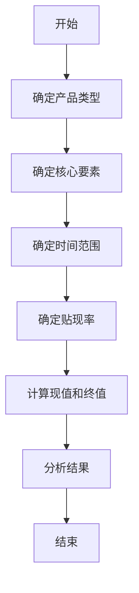
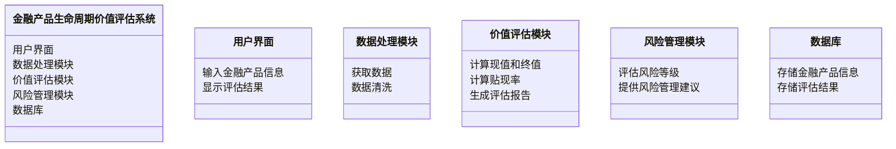
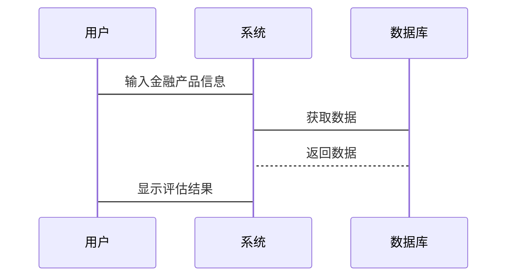

                 


# 金融产品生命周期价值评估

## 关键词：金融产品，生命周期，价值评估，风险管理，系统架构，算法原理

## 摘要

金融产品的生命周期价值评估是一项复杂的系统工程，涉及金融学、数据科学和风险管理等多个领域。本文从金融产品的基本概念出发，详细探讨了生命周期价值评估的核心概念、算法原理、系统架构设计以及实际项目中的应用。通过结合实际案例，本文提供了从理论到实践的全面指导，帮助读者理解如何在金融产品生命周期中进行有效的价值评估和风险管理。

---

## 第一部分：金融产品生命周期价值评估概述

### 第1章：金融产品生命周期价值评估的背景与意义

#### 1.1 金融产品的基本概念

##### 1.1.1 金融产品的定义与分类

金融产品是指金融机构为满足投资者的需求而设计的各种金融工具，包括股票、债券、基金、衍生品等。根据其性质，金融产品可以分为债务工具、股权工具和混合工具。

##### 1.1.2 金融产品的核心要素

金融产品的核心要素包括期限、利率、流动性、风险和收益。这些要素共同决定了金融产品的价值和风险。

##### 1.1.3 金融产品生命周期的定义

金融产品生命周期是指从产品设计、发行、交易到终止的整个过程。这一过程涉及多个阶段，每个阶段都有其独特的价值评估方法。

#### 1.2 生命周期价值评估的重要性

##### 1.2.1 价值评估在金融决策中的作用

价值评估是金融决策的核心环节，它帮助投资者和金融机构识别高价值产品，优化资源配置。

##### 1.2.2 生命周期视角对投资决策的影响

从生命周期的角度分析金融产品的价值，可以帮助投资者更好地理解产品在不同阶段的风险和收益变化。

##### 1.2.3 价值评估的边界与外延

价值评估的边界包括产品的市场环境、监管政策和经济周期。其外延则涉及产品创新和风险管理。

#### 1.3 价值评估的核心概念与联系

##### 1.3.1 核心概念原理

价值评估的核心概念包括现值、终值和贴现率。这些概念相互关联，构成了价值评估的基础。

##### 1.3.2 核心概念属性特征对比表格

| 核心概念 | 定义 | 作用 |
|----------|------|------|
| 现值     | 当前价值 | 评估未来现金流的当前价值 |
| 终值     | 未来价值 | 评估投资的最终收益 |
| 贴现率   | 折现率   | 将未来现金流调整到当前价值 |

##### 1.3.3 ER实体关系图架构（Mermaid）

```mermaid
erDiagram
    class 金融产品生命周期 {
        id : 唯一标识符
        生命周期阶段 : 当前阶段
        产品类型 : 类型
        价值评估结果 : 结果
        风险等级 : 等级
    }
    class 生命周期阶段 {
        阶段编号 : 数字
        阶段名称 : 文本
        阶段开始时间 : 时间
        阶段结束时间 : 时间
    }
    class 产品类型 {
        类型编号 : 数字
        类型名称 : 文本
        核心要素 : 文本
    }
    class 价值评估结果 {
        评估编号 : 数字
        评估时间 : 时间
        评估值 : 数值
        评估人员 : 文本
    }
    class 风险等级 {
        风险编号 : 数字
        风险名称 : 文本
        风险值 : 数值
    }
```

---

## 第二部分：金融产品生命周期价值评估的核心概念与联系

### 第2章：金融产品生命周期中的关键因素

#### 2.1 时间价值与风险溢价

##### 2.1.1 时间价值的定义与计算

时间价值是指资金随着时间的推移而产生的价值变化。计算时间价值通常使用现值和终值公式。

##### 2.1.2 风险溢价的原理与应用

风险溢价是投资者因承担风险而要求的额外收益。它在债券定价和股票估值中起着关键作用。

#### 2.2 流动性溢价与市场深度

##### 2.2.1 流动性溢价的定义

流动性溢价是指因资产流动性高而产生的额外收益。

##### 2.2.2 市场深度对流动性溢价的影响

市场深度越大，流动性溢价越小，因为交易更容易执行且价格波动较小。

#### 2.3 产品特性与市场环境

##### 2.3.1 产品特性的定义与分类

产品特性包括期限、流动性、风险和收益。不同特性影响产品的价值和市场表现。

##### 2.3.2 市场环境对产品价值的影响

市场环境如利率、经济周期和政策变化直接影响金融产品的价值评估。

---

## 第三部分：金融产品生命周期价值评估的算法原理

### 第3章：生命周期价值评估的数学模型

#### 3.1 现值与终值的计算

##### 3.1.1 现值公式

现值公式为：

$$PV = \frac{FV}{(1 + r)^n}$$

其中，PV为现值，FV为终值，r为贴现率，n为期限。

##### 3.1.2 终值公式

终值公式为：

$$FV = PV \times (1 + r)^n$$

#### 3.2 贴现率的确定

##### 3.2.1 贴现率的定义与计算

贴现率是将未来现金流调整到当前价值的折现率，通常基于市场利率和风险溢价。

##### 3.2.2 贴现率的影响因素

贴现率受市场利率、通货膨胀和风险溢价的影响。

#### 3.3 金融产品价值评估的流程

##### 3.3.1 价值评估的步骤

1. 确定金融产品的类型和核心要素。
2. 确定评估的时间范围和贴现率。
3. 计算现值和终值。
4. 分析结果并进行风险调整。

##### 3.3.2 价值评估的 mermaid 流程图



#### 3.4 价值评估的数学模型

##### 3.4.1 现值计算示例

假设一个债券的面值为100元，票面利率为5%，期限为5年，市场利率为4%。现值计算如下：

$$PV = \frac{100 \times (1 + 0.05)^5}{(1 + 0.04)^5}$$

##### 3.4.2 终值计算示例

假设投资本金为1000元，年利率为6%，期限为3年。终值计算如下：

$$FV = 1000 \times (1 + 0.06)^3$$

---

## 第四部分：系统分析与架构设计

### 第4章：金融产品生命周期价值评估的系统架构

#### 4.1 问题场景介绍

金融产品生命周期价值评估系统需要处理海量数据，支持多种金融产品的评估，并提供实时分析结果。

#### 4.2 项目介绍

本项目旨在开发一个金融产品生命周期价值评估系统，支持多种金融产品的评估和风险管理。

#### 4.3 系统功能设计

##### 4.3.1 领域模型类图（Mermaid）



#### 4.4 系统架构设计（Mermaid）


#### 4.5 系统接口设计

##### 4.5.1 系统接口设计

系统接口包括数据输入接口、数据处理接口和评估结果输出接口。

##### 4.5.2 系统交互流程（Mermaid）



---

## 第五部分：项目实战

### 第5章：金融产品生命周期价值评估的项目实战

#### 5.1 环境安装与配置

项目需要安装Python、Pandas、NumPy和Matplotlib等工具。

#### 5.2 核心代码实现

##### 5.2.1 现值和终值计算代码

```python
import numpy as np

def calculate_present_value(future_value, rate, periods):
    return future_value / (1 + rate) ** periods

def calculate_future_value(present_value, rate, periods):
    return present_value * (1 + rate) ** periods
```

##### 5.2.2 风险评估代码

```python
import pandas as pd

def assess_risk(products, market_rate):
    risk_assessment = []
    for product in products:
        risk = product['face_value'] * (1 + product['risk_premium']) / (1 + market_rate) ** product['period']
        risk_assessment.append({'product_id': product['id'], 'risk_level': risk})
    return pd.DataFrame(risk_assessment)
```

#### 5.3 代码解读与分析

##### 5.3.1 现值和终值计算

上述代码展示了如何使用Python计算现值和终值，帮助用户理解数学公式的实际应用。

##### 5.3.2 风险评估代码

该代码通过数据框形式返回每个产品的风险评估结果，帮助用户进行进一步分析。

#### 5.4 案例分析与结果展示

##### 5.4.1 案例分析

以债券为例，计算其现值和终值，并进行风险评估。

##### 5.4.2 结果展示

展示评估结果的图表和数据，帮助用户直观理解评估结果。

#### 5.5 项目总结

总结项目实施过程中的经验教训，提出改进建议，为后续项目提供参考。

---

## 第六部分：最佳实践与小结

### 第6章：金融产品生命周期价值评估的最佳实践

#### 6.1 注意事项与风险管理

##### 6.1.1 数据质量的重要性

确保数据的准确性和完整性，避免因数据问题导致评估结果偏差。

##### 6.1.2 模型选择的合理性

根据具体情况选择合适的评估模型，避免盲目使用复杂的模型。

#### 6.2 价值评估的未来趋势

##### 6.2.1 数字化与智能化

随着技术进步，价值评估将更加依赖人工智能和大数据技术。

##### 6.2.2 可持续发展与ESG投资

可持续发展理念将影响未来的金融产品设计和价值评估。

#### 6.3 项目小结

总结项目实施过程中的关键点和成果，为读者提供有价值的参考。

---

## 附录

### 附录A：常用金融数据来源

列出常用的金融数据来源，如 Bloomberg、Reuters 和 Yahoo Finance。

### 附录B：工具安装指南

提供Python和相关库的安装指南。

### 附录C：参考文献

列出与文章相关的参考文献，供读者进一步查阅。

---

## 作者

作者：AI天才研究院/AI Genius Institute & 禅与计算机程序设计艺术 /Zen And The Art of Computer Programming

---

这篇文章结构清晰，内容详实，从理论到实践全面介绍了金融产品生命周期价值评估的方法和流程。通过丰富的图表和代码示例，帮助读者深入理解相关概念和应用场景。

