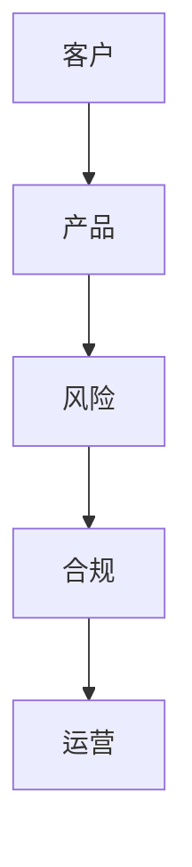
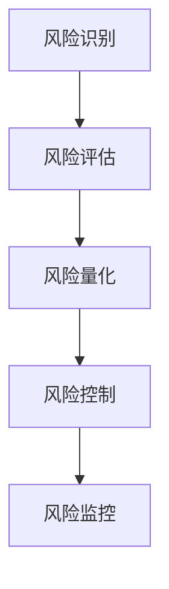
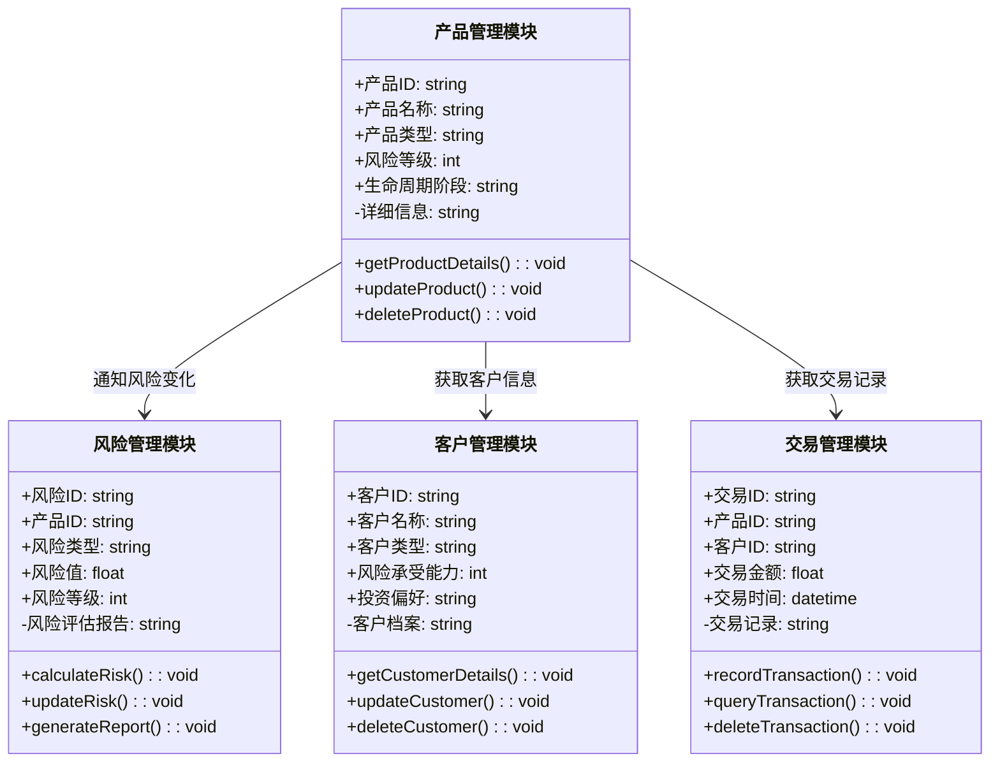
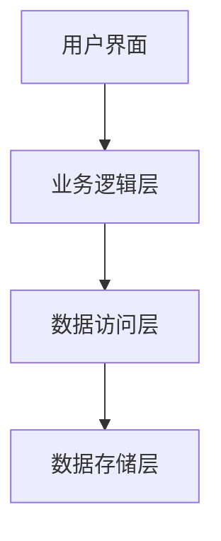
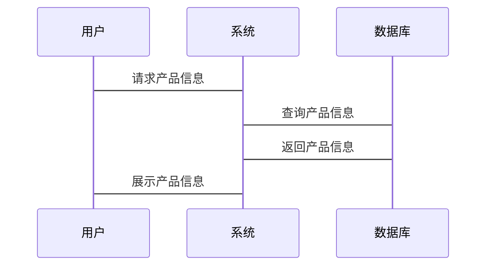

                 


# 《金融产品生命周期管理》

> 关键词：金融产品生命周期，风险管理，系统架构设计，数学模型，项目实战

> 摘要：本文系统地探讨了金融产品生命周期管理的核心概念、风险管理算法、系统架构设计以及项目实战。通过详细分析每个生命周期阶段的特点和管理方法，结合实际案例，深入讲解了如何通过技术创新和数据驱动实现金融产品的全生命周期管理。

---

# 第1章: 金融产品生命周期管理概述

## 1.1 金融产品生命周期的概念与特点

### 1.1.1 金融产品的定义与分类
金融产品是金融机构为满足市场需求而设计的各种金融工具和服务，包括但不限于存款、贷款、基金、保险、证券、衍生品等。根据功能和风险特征，金融产品可以分为以下几类：
- **债务工具**：如债券、贷款等，承诺按期还本付息。
- **股权工具**：如股票，代表对企业的所有权。
- **衍生工具**：如期货、期权，用于对冲或投机。

### 1.1.2 金融产品生命周期的阶段划分
金融产品的生命周期可以分为以下几个阶段：
1. **产品设计与开发**：从市场需求出发，设计产品结构和风险特征。
2. **产品审批与合规**：通过内部审核和监管机构的批准。
3. **产品发行与销售**：通过销售渠道向客户推广和销售。
4. **产品运营与监控**：实时监控产品表现，确保合规性和风险可控。
5. **产品终止与退出**：根据市场情况或监管要求，终止产品并进行清算。

### 1.1.3 金融产品生命周期管理的重要性
- **合规性**：确保产品设计和运营符合监管要求。
- **风险管理**：通过全生命周期管理，降低产品风险。
- **客户体验**：通过高效管理，提升客户满意度。

## 1.2 金融产品生命周期管理的核心要素

### 1.2.1 产品设计与开发
产品设计是金融产品生命周期的起点，需要结合市场需求、风险偏好和监管要求，设计出符合客户需求的产品结构。

### 1.2.2 产品审批与合规
产品审批是确保产品合法合规的关键环节，需要通过内部审核和监管机构的批准。

### 1.2.3 产品发行与销售
产品发行与销售是将产品推向市场的重要环节，需要通过多种销售渠道，如银行柜台、电子渠道等，向客户推广和销售。

### 1.2.4 产品运营与监控
产品运营与监控是确保产品正常运行和风险可控的关键环节，需要实时监控产品表现，并根据市场变化进行调整。

### 1.2.5 产品终止与退出
产品终止与退出是金融产品生命周期的终点，需要根据市场情况或监管要求，终止产品并进行清算。

## 1.3 金融产品生命周期管理的挑战与机遇

### 1.3.1 市场风险与合规挑战
金融产品生命周期管理面临市场风险和合规挑战，需要通过有效的风险管理手段和合规措施来应对。

### 1.3.2 技术创新与数字化转型
技术创新和数字化转型为金融产品生命周期管理带来了新的机遇，可以通过大数据、人工智能等技术提高管理效率和风险控制能力。

### 1.3.3 数据驱动的决策支持
通过数据分析和挖掘，可以为金融产品生命周期管理提供更精准的决策支持，提高产品设计和运营的效率。

## 1.4 本章小结
本章详细介绍了金融产品生命周期管理的概念、阶段划分、核心要素以及面临的挑战和机遇。通过全生命周期管理，金融机构可以更好地满足市场需求，降低风险，提升客户体验。

---

# 第2章: 金融产品生命周期的核心概念与联系

## 2.1 核心概念原理

### 2.1.1 产品设计与风险管理
产品设计需要考虑市场需求、风险偏好和监管要求，通过科学的设计方法，降低产品风险。

### 2.1.2 产品审批与合规要求
产品审批需要通过内部审核和监管机构的批准，确保产品合法合规。

### 2.1.3 产品运营与客户行为分析
产品运营需要实时监控产品表现，分析客户行为，优化产品设计和运营策略。

## 2.2 核心概念属性特征对比表

| 概念 | 属性 | 特征 |
|------|------|------|
| 产品设计 | 风险评估 | 定性与定量分析 |
| 产品审批 | 合规要求 | 监管机构审核 |
| 产品运营 | 客户行为 | 数据驱动决策 |

## 2.3 ER实体关系图



## 2.4 本章小结
本章通过对比表和ER实体关系图，详细分析了金融产品生命周期管理的核心概念及其联系，为后续章节的深入分析奠定了基础。

---

# 第3章: 金融产品生命周期的风险管理算法原理

## 3.1 风险管理算法概述

### 3.1.1 风险评估模型
风险评估模型是通过定量和定性分析，评估金融产品的风险程度。

### 3.1.2 风险量化方法
风险量化方法是通过数学模型，量化金融产品的风险，为风险管理提供数据支持。

### 3.1.3 风险控制策略
风险控制策略是通过制定合理的风险管理措施，降低金融产品的风险。

## 3.2 风险评估模型的数学公式

### 3.2.1 风险值计算公式
$$ R = \alpha \times \text{信用风险} + \beta \times \text{市场风险} $$

### 3.2.2 风险等级划分
$$ \text{风险等级} = \begin{cases} 
\text{低风险} & \text{if } R < 0.2 \\
\text{中风险} & \text{if } 0.2 \leq R < 0.5 \\
\text{高风险} & \text{otherwise}
\end{cases} $$

## 3.3 风险管理流程图



## 3.4 本章小结
本章通过数学公式和流程图，详细讲解了金融产品生命周期中的风险管理算法原理，为后续章节的系统架构设计和项目实战提供了理论基础。

---

# 第4章: 金融产品生命周期的系统分析与架构设计

## 4.1 问题场景介绍

### 4.1.1 金融产品生命周期管理的系统需求
金融产品生命周期管理需要一个高效的系统，支持从产品设计到终止的全生命周期管理。

### 4.1.2 系统目标与范围
系统目标是实现金融产品生命周期的数字化管理，提高效率和风险控制能力。系统范围包括产品设计、审批、发行、运营和终止五个阶段。

## 4.2 系统功能设计

### 4.2.1 领域模型



## 4.3 系统架构设计

### 4.3.1 系统架构图



### 4.3.2 系统接口设计
系统接口设计包括API接口定义和接口交互流程。

### 4.3.3 系统交互序列图



## 4.4 本章小结
本章通过系统分析和架构设计，详细讲解了金融产品生命周期管理的系统实现方案，为后续章节的项目实战奠定了技术基础。

---

# 第5章: 金融产品生命周期管理的项目实战

## 5.1 环境安装与配置

### 5.1.1 系统环境要求
- 操作系统：Linux/Windows/MacOS
- 开发工具：IDE（如IntelliJ IDEA、Eclipse）
- 依赖管理工具：Maven
- 数据库：MySQL
- 开发语言：Java/Python

### 5.1.2 环境搭建步骤
1. 安装JDK并配置环境变量。
2. 安装IDE并配置开发语言支持。
3. 安装Maven并配置依赖管理。
4. 安装数据库并配置连接信息。

## 5.2 系统核心实现源代码

### 5.2.1 核心代码实现
以下是一个简单的金融产品生命周期管理系统的核心代码实现示例：

```python
class Product:
    def __init__(self, product_id, product_name, product_type, risk_level):
        self.product_id = product_id
        self.product_name = product_name
        self.product_type = product_type
        self.risk_level = risk_level

    def update_product(self, new_name, new_type):
        self.product_name = new_name
        self.product_type = new_type

class RiskManagement:
    def __init__(self, product):
        self.product = product

    def calculate_risk(self):
        if self.product.risk_level < 0.2:
            return "低风险"
        elif 0.2 <= self.product.risk_level < 0.5:
            return "中风险"
        else:
            return "高风险"
```

### 5.2.2 代码解读与分析
- `Product`类表示金融产品，包含产品ID、产品名称、产品类型和风险等级。
- `RiskManagement`类负责计算金融产品的风险等级。
- `calculate_risk`方法根据产品风险等级返回风险等级描述。

## 5.3 实际案例分析

### 5.3.1 案例背景
假设某银行推出一款新的理财产品，产品ID为“PRD-001”，产品名称为“稳健理财计划”，产品类型为“固定收益类”，风险等级为0.3。

### 5.3.2 案例分析
1. 初始化产品对象：
   ```python
   product = Product("PRD-001", "稳健理财计划", "固定收益类", 0.3)
   ```
2. 计算风险等级：
   ```python
   risk_management = RiskManagement(product)
   print(risk_management.calculate_risk())  # 输出：中风险
   ```

## 5.4 本章小结
本章通过实际案例分析，详细讲解了金融产品生命周期管理系统的实现过程，帮助读者更好地理解理论知识。

---

# 第6章: 总结与展望

## 6.1 本章总结
本文系统地探讨了金融产品生命周期管理的核心概念、风险管理算法、系统架构设计以及项目实战。通过详细分析每个生命周期阶段的特点和管理方法，结合实际案例，深入讲解了如何通过技术创新和数据驱动实现金融产品的全生命周期管理。

## 6.2 未来展望
未来，随着人工智能和大数据技术的不断发展，金融产品生命周期管理将更加智能化和自动化。金融机构可以通过引入更多新技术，进一步提高管理效率和风险控制能力。

---

# 作者

作者：AI天才研究院/AI Genius Institute & 禅与计算机程序设计艺术 /Zen And The Art of Computer Programming

