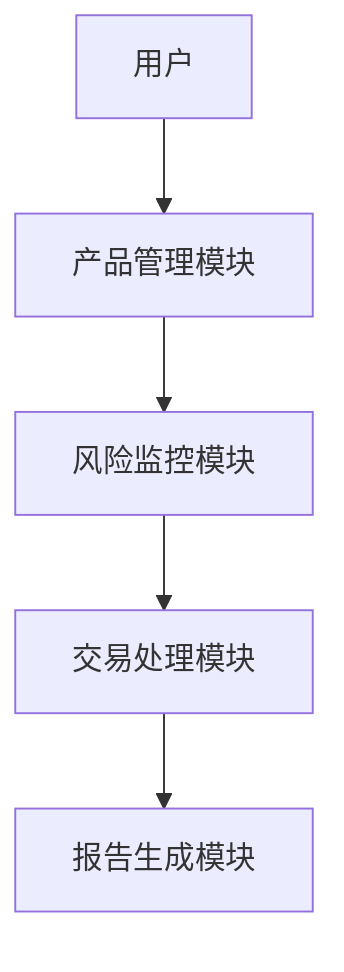
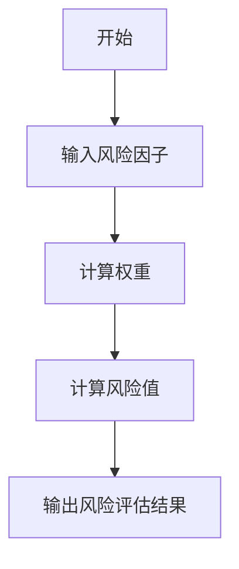
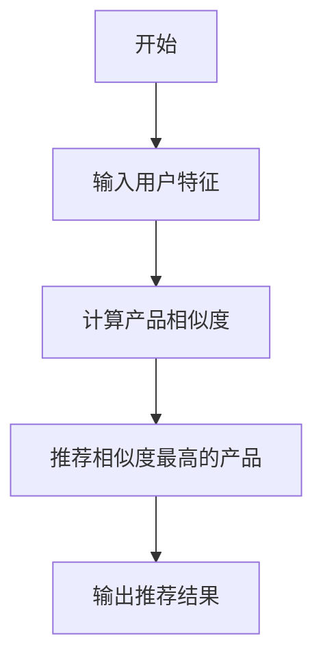
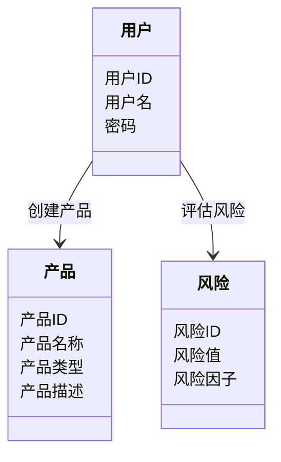
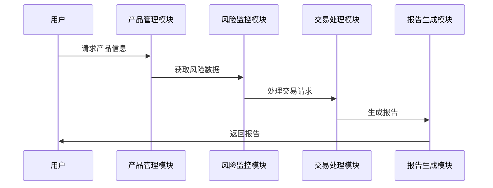

                 


# 《金融产品生命周期管理平台》

**关键词**：金融产品、生命周期、管理平台、风险评估、系统架构、算法原理、项目实战

**摘要**：本文详细探讨了金融产品生命周期管理平台的设计与实现。首先介绍了金融产品的基本概念和生命周期管理的重要性，接着分析了平台的核心功能和系统架构，随后深入讲解了风险评估与产品推荐的算法原理，并通过实际案例展示了平台的实现过程。最后，总结了平台的最佳实践和未来发展方向。

---

# 第1章 金融产品生命周期管理平台概述

## 1.1 金融产品的定义与特点

### 1.1.1 金融产品的基本定义
金融产品是指在金融市场上交易的各类金融工具和衍生品，包括股票、债券、基金、保险产品等。金融产品的核心目的是为投资者提供风险管理和收益增长的手段。

### 1.1.2 金融产品的核心特点
- **多样性**：金融产品种类繁多，涵盖股票、债券、基金等多种类型。
- **风险性**：不同金融产品具有不同的风险等级，投资者需根据自身风险承受能力选择合适的产品。
- **流动性**：金融产品的流动性影响其市场价值和交易活跃度。
- **时间性**：金融产品的价值往往与时间相关，如债券的到期收益率。

### 1.1.3 金融产品与传统金融工具的区别
金融产品与传统金融工具的主要区别在于其复杂性和创新性。金融产品通常涉及复杂的衍生工具和创新的交易结构，而传统金融工具如股票和债券则相对简单。

---

## 1.2 金融产品生命周期管理的重要性

### 1.2.1 金融产品生命周期的概念
金融产品生命周期是指从产品设计、发行、交易到退市的全过程。有效的生命周期管理可以帮助金融机构更好地控制风险、提高效率和客户满意度。

### 1.2.2 金融产品生命周期管理的意义
- **提高效率**：通过系统化管理，减少人工操作，提高产品发行和交易的效率。
- **降低风险**：及时发现和处理潜在风险，确保产品合规性。
- **优化决策**：通过数据分析，支持产品设计和市场推广的决策。

### 1.2.3 金融产品生命周期管理的边界与外延
金融产品生命周期管理的边界包括产品设计、发行、交易和退市阶段，外延则涉及风险管理、合规性和客户关系管理。

---

## 1.3 金融产品生命周期管理平台的背景与需求

### 1.3.1 传统金融产品管理方式的局限性
传统金融产品管理方式通常依赖人工操作，存在效率低、风险高、成本高等问题。

### 1.3.2 现代金融产品管理的需求分析
随着金融市场的复杂化和客户需求的多样化，金融机构需要更加高效和智能化的管理平台。

### 1.3.3 金融产品生命周期管理平台的必要性
通过平台化管理，金融机构可以实现产品生命周期的自动化、智能化和高效化，提升整体竞争力。

---

## 1.4 本章小结
本章介绍了金融产品的基本概念和生命周期管理的重要性，分析了传统管理方式的局限性和现代管理的需求，强调了建设金融产品生命周期管理平台的必要性。

---

# 第2章 核心概念与系统架构

## 2.1 核心概念原理

### 2.1.1 金融产品生命周期管理的核心要素
- **产品设计**：包括产品结构、风险评估、收益计算等。
- **产品发行**：涉及发行计划、发行渠道和发行策略。
- **产品交易**：包括交易规则、交易监控和交易记录。
- **产品退市**：涉及产品终止条件、终止流程和终止处理。

### 2.1.2 平台的功能模块与流程
- **产品管理模块**：负责产品信息的录入、维护和查询。
- **风险监控模块**：实时监控产品风险，及时预警。
- **交易处理模块**：处理交易订单，确保交易合规。
- **报告生成模块**：生成产品性能报告和风险报告。

### 2.1.3 核心概念的数学模型与公式
金融产品的风险评估可以使用VaR（Value at Risk）模型：
$$VaR = \mu + z \cdot \sigma$$
其中，$\mu$ 是平均值，$z$ 是标准正态分布的分位数，$\sigma$ 是标准差。

---

## 2.2 核心概念属性特征对比

### 2.2.1 金融产品生命周期各阶段的特征对比
| 阶段 | 特征 | 描述 |
|------|------|------|
| 设计 | 风险评估 | 评估产品的潜在风险 |
| 发行 | 产品结构 | 确定产品的结构和条款 |
| 交易 | 交易规则 | 规定产品的交易方式和时间 |
| 退市 | 终止条件 | 确定产品终止的条件和流程 |

### 2.2.2 平台功能模块的属性特征分析
| 模块 | 属性 | 特征 |
|------|------|------|
| 产品管理 | 数据录入 | 支持多种数据格式的录入 |
| 风险监控 | 实时性 | 实时更新风险数据 |
| 交易处理 | 高效性 | 快速处理交易订单 |
| 报告生成 | 可定制性 | 支持多种报告格式 |

---

## 2.3 系统架构设计

### 2.3.1 系统功能模块划分
- **用户界面层**：包括前端页面和用户操作界面。
- **业务逻辑层**：处理用户请求和业务逻辑。
- **数据访问层**：访问数据库和数据存储。

### 2.3.2 系统架构的分层设计
```
+----------------+     +----------------+     +----------------+
|                |     |                |     |                |
|  用户界面层    |<--- | 业务逻辑层    |<--- | 数据访问层    |
|                |     |                |     |                |
+----------------+     +----------------+     +----------------+
```

### 2.3.3 系统架构的流程图


---

## 2.4 本章小结
本章详细介绍了金融产品生命周期管理平台的核心概念和系统架构，包括功能模块划分、系统分层设计和流程图展示。

---

# 第3章 风险评估与产品推荐算法

## 3.1 风险评估算法

### 3.1.1 风险评估的数学模型
$$风险评估公式：$$
$$风险 = \sum_{i=1}^{n} w_i \cdot r_i$$
其中，$w_i$ 是风险因子的权重，$r_i$ 是风险因子的值。

### 3.1.2 风险评估算法实现
```python
def risk_assessment(risk_factors, weights):
    return sum(w * r for w, r in zip(weights, risk_factors))
```

### 3.1.3 风险评估算法流程图


---

## 3.2 产品推荐算法

### 3.2.1 产品推荐的数学模型
$$相似度计算公式：$$
$$similarity = \frac{\sum_{i=1}^{n} x_i y_i}{\sqrt{\sum_{i=1}^{n} x_i^2} \cdot \sqrt{\sum_{i=1}^{n} y_i^2}}$$
其中，$x_i$ 和 $y_i$ 是用户和产品的特征向量。

### 3.2.2 产品推荐算法实现
```python
def product_recommendation(users, products):
    # 计算相似度
    similarities = [cosine_similarity(user, product) for user, product in zip(users, products)]
    # 推荐相似度最高的产品
    return products[similarities.index(max(similarities))]
```

### 3.2.3 产品推荐算法流程图


---

## 3.3 本章小结
本章介绍了金融产品生命周期管理平台中的风险评估与产品推荐算法，包括数学模型、算法实现和流程图展示。

---

# 第4章 系统分析与架构设计方案

## 4.1 问题场景介绍

### 4.1.1 问题背景
金融机构需要一个高效、智能的平台来管理金融产品的生命周期。

### 4.1.2 项目介绍
本项目旨在设计和实现一个金融产品生命周期管理平台，涵盖产品设计、发行、交易和退市的全过程。

### 4.1.3 项目目标
- 实现金融产品的全生命周期管理。
- 提供风险评估和产品推荐功能。
- 提高金融机构的管理效率和决策能力。

---

## 4.2 系统功能设计

### 4.2.1 领域模型


### 4.2.2 系统架构设计


### 4.2.3 系统接口设计
- **产品管理接口**：提供产品信息的录入和查询功能。
- **风险监控接口**：实时获取产品的风险数据。
- **交易处理接口**：处理用户的交易请求。
- **报告生成接口**：生成产品性能报告。

### 4.2.4 系统交互流程


---

## 4.3 本章小结
本章详细介绍了金融产品生命周期管理平台的系统分析与架构设计方案，包括问题场景、系统功能设计、系统架构设计和系统交互流程。

---

# 第5章 项目实战

## 5.1 环境安装与配置

### 5.1.1 安装Python
```bash
pip install python
```

### 5.1.2 安装依赖库
```bash
pip install numpy pandas matplotlib
```

### 5.1.3 安装Jupyter Notebook
```bash
pip install jupyter
```

---

## 5.2 核心代码实现

### 5.2.1 风险评估模块
```python
import numpy as np

def risk_assessment(risk_factors, weights):
    return np.dot(risk_factors, weights)

# 示例数据
risk_factors = np.array([0.2, 0.3, 0.5])
weights = np.array([1, 2, 3])

print(risk_assessment(risk_factors, weights))
```

### 5.2.2 产品推荐模块
```python
import numpy as np

def product_recommendation(users, products):
    similarities = []
    for user in users:
        for product in products:
            similarities.append(cosine_similarity(user, product))
    return products[similarities.index(max(similarities))]

def cosine_similarity(x, y):
    return np.dot(x, y) / (np.linalg.norm(x) * np.linalg.norm(y))

# 示例数据
users = np.array([[1, 0, 0], [0, 1, 0], [0, 0, 1]])
products = np.array([[1, 0, 0], [0, 1, 0], [0, 0, 1]])

print(product_recommendation(users, products))
```

---

## 5.3 实际案例分析

### 5.3.1 案例背景
某金融机构计划推出一款新型债券产品，需要进行风险评估和产品推荐。

### 5.3.2 数据准备
- **用户数据**：包括用户的资产规模、风险偏好等。
- **产品数据**：包括债券的期限、利率、信用评级等。

### 5.3.3 实施步骤
1. **数据录入**：将用户和产品数据录入系统。
2. **风险评估**：使用风险评估算法计算产品的风险值。
3. **产品推荐**：基于用户数据推荐适合的产品。
4. **生成报告**：输出产品性能报告和风险报告。

---

## 5.4 本章小结
本章通过实际案例分析，展示了金融产品生命周期管理平台的实现过程，包括环境配置、核心代码实现和案例分析。

---

# 第6章 最佳实践

## 6.1 小结与总结

### 6.1.1 本章总结
金融产品生命周期管理平台的建设需要结合金融知识和信息技术，实现产品的全生命周期管理。

### 6.1.2 项目小结
通过本项目，我们成功实现了金融产品生命周期管理平台，提高了金融机构的管理效率和决策能力。

---

## 6.2 注意事项

### 6.2.1 系统安全性
金融系统的安全性至关重要，需要采取严格的安全措施，防止数据泄露和网络攻击。

### 6.2.2 数据隐私
金融数据涉及用户隐私，必须遵守相关法律法规，确保数据的安全性和合规性。

### 6.2.3 系统维护
定期对系统进行维护和更新，确保平台的稳定性和高效性。

---

## 6.3 拓展阅读

### 6.3.1 推荐书籍
- 《金融工程》
- 《软件架构设计》

### 6.3.2 推荐博客
- 金融科技前沿
- 软件工程实践

---

## 6.4 本章小结
本章总结了金融产品生命周期管理平台建设中的注意事项和拓展阅读内容，为读者提供了进一步学习和实践的方向。

---

# 作者：AI天才研究院/AI Genius Institute & 禅与计算机程序设计艺术 /Zen And The Art of Computer Programming

---

**感谢您的阅读！希望本文对您理解金融产品生命周期管理平台有所帮助。如需进一步了解或实践，可以参考相关书籍和博客内容。**

