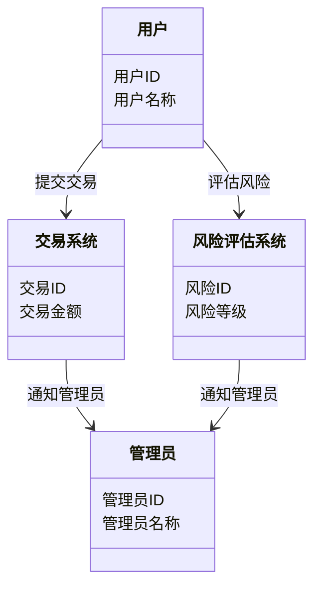
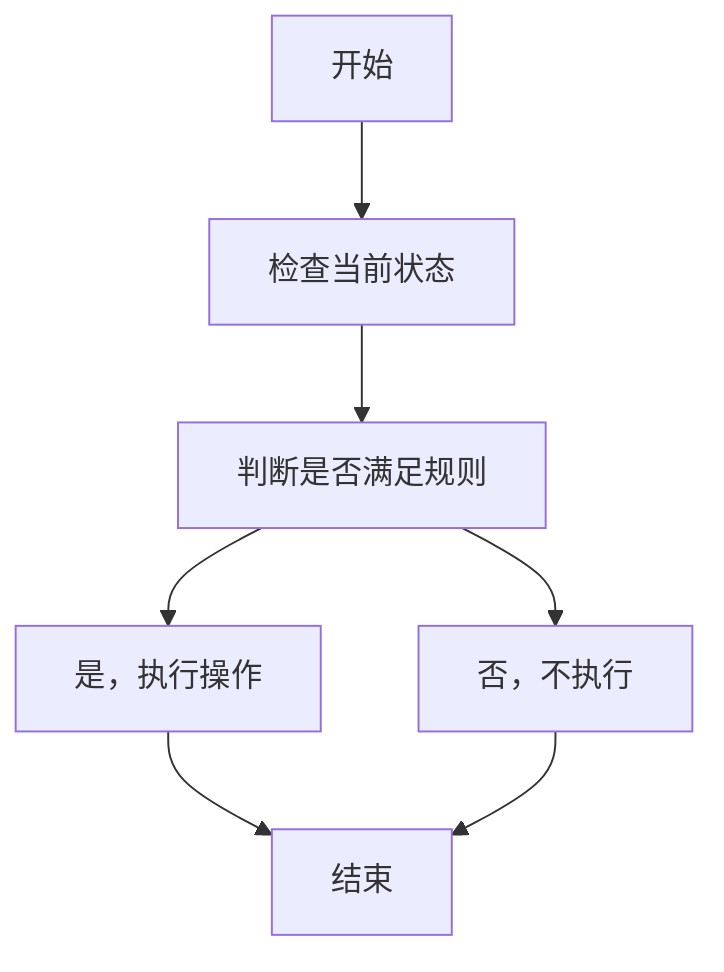
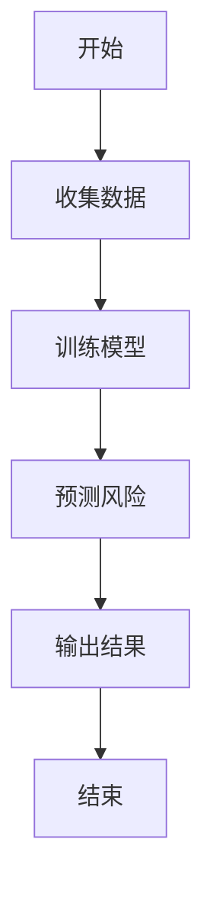
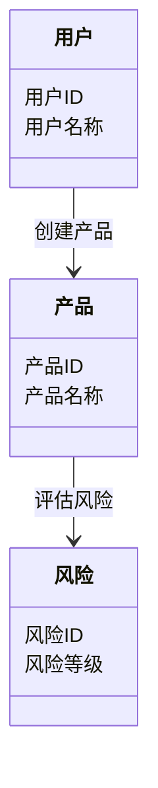
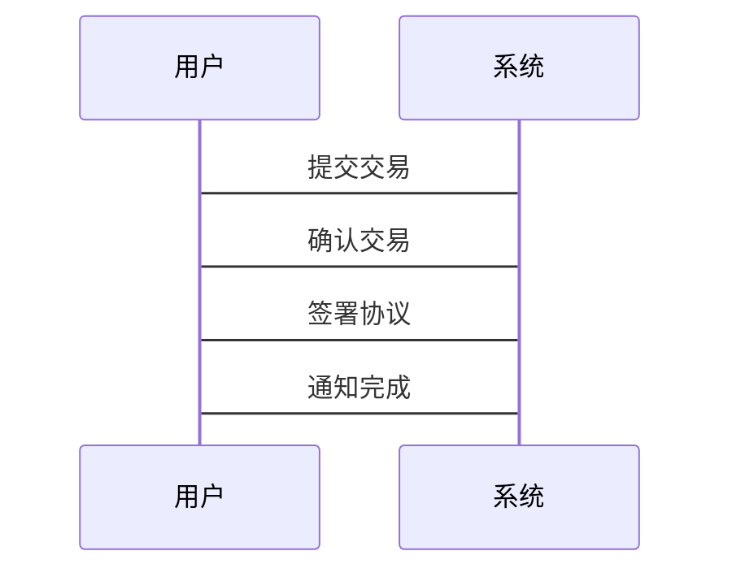

                 


# 金融产品生命周期管理自动化系统

> 关键词：金融产品，生命周期管理，自动化系统，金融科技，风险管理，系统架构

> 摘要：本文详细探讨了金融产品生命周期管理自动化系统的构建与实现，从系统背景、核心概念、算法原理到系统架构设计、项目实战以及最佳实践等方面，全面分析了该系统的设计与应用。文章结合实际案例，深入解读了系统的关键技术与实现细节，为金融行业的数字化转型提供了有价值的参考。

---

## 第一部分: 金融产品生命周期管理概述

### 第1章: 金融产品生命周期管理概述

#### 1.1 金融产品生命周期的概念

##### 1.1.1 金融产品的定义与分类
金融产品是指由金融机构提供给客户的各类服务或工具，旨在满足客户的资金需求或风险管理需求。金融产品可以分为以下几类：
- **债务工具**：如债券、贷款等。
- **股权工具**：如股票、股权融资等。
- **衍生品**：如期货、期权、掉期等。
- **基金产品**：如共同基金、对冲基金等。
- **保险产品**：如人寿保险、财产保险等。

##### 1.1.2 金融产品生命周期的阶段划分
金融产品的生命周期通常包括以下几个阶段：
1. **设计与开发阶段**：包括产品需求分析、设计、风险评估等。
2. **发行阶段**：产品上线，面向客户销售。
3. **运行阶段**：产品在市场上的运作，包括交易、监控等。
4. **终止阶段**：产品到期或提前终止。

##### 1.1.3 金融产品生命周期管理的重要性
- **提高效率**：自动化管理可以减少人工操作，提高处理速度。
- **降低风险**：通过实时监控和预警，及时发现并处理潜在风险。
- **增强客户体验**：自动化系统能够提供更快捷、准确的服务，提升客户满意度。

#### 1.2 金融产品生命周期管理的挑战

##### 1.2.1 传统金融产品管理的痛点
- **人工操作繁琐**：传统管理方式依赖大量人工操作，效率低下。
- **信息孤岛**：各部门之间数据不共享，导致信息不一致。
- **风险管理滞后**：缺乏实时监控，风险应对不及时。

##### 1.2.2 数字化转型的需求
- **技术驱动**：随着人工智能、大数据等技术的发展，金融行业正在加速数字化转型。
- **客户需求变化**：客户对个性化、智能化服务的需求日益增加。
- **监管要求提高**：监管机构对金融产品透明度和合规性的要求不断提高。

##### 1.2.3 自动化管理的必要性
- **提高效率**：自动化管理可以显著减少人工操作，降低成本。
- **增强风险控制**：通过自动化监控，实时发现和处理风险。
- **支持创新**：自动化系统能够快速适应金融产品的创新需求。

---

## 第二部分: 核心概念与系统架构

### 第2章: 核心概念与系统模块划分

#### 2.1 核心概念的定义与属性

##### 2.1.1 产品模块
- **功能**：产品设计、产品参数配置、产品生命周期管理。
- **属性**：产品类型、产品期限、产品收益率。

##### 2.1.2 风险模块
- **功能**：风险评估、风险预警、风险控制。
- **属性**：信用风险、市场风险、操作风险。

##### 2.1.3 定价模块
- **功能**：产品定价、定价模型配置、定价策略管理。
- **属性**：定价模型、定价参数、定价规则。

##### 2.1.4 交易模块
- **功能**：交易处理、交易监控、交易报告。
- **属性**：交易类型、交易金额、交易时间。

#### 2.2 核心概念的对比分析

##### 2.2.1 不同模块的功能对比
| 模块     | 功能                         |
|----------|------------------------------|
| 产品模块 | 产品设计、参数配置            |
| 风险模块 | 风险评估、预警、控制          |
| 定价模块 | 产品定价、策略管理          |
| 交易模块 | 交易处理、监控、报告          |

##### 2.2.2 模块之间的关系
- **产品模块与风险模块**：产品设计直接影响风险评估。
- **定价模块与交易模块**：产品定价影响交易行为。
- **风险模块与交易模块**：风险预警直接影响交易决策。

#### 2.3 系统架构设计

##### 2.3.1 系统架构的总体设计
- **分层架构**：分为数据层、业务逻辑层、表现层。
- **微服务架构**：每个模块独立运行，通过API进行通信。
- **数据库设计**：采用关系型数据库，确保数据完整性和一致性。

##### 2.3.2 实体关系图
```mermaid
erDiagram
    actor 用户
    actor 管理员
    actor 交易系统
    actor 风险评估系统
    actor 数据库
    用户 -> 交易系统: 提交交易
    用户 -> 风险评估系统: 评估风险
    交易系统 -> 数据库: 存储交易数据
    风险评估系统 -> 数据库: 存储风险数据
    管理员 -> 数据库: 管理数据
```

##### 2.3.3 系统功能设计


---

## 第三部分: 算法原理与实现

### 第3章: 算法原理与实现

#### 3.1 算法原理

##### 3.1.1 基于规则的匹配算法
- **描述**：通过预设的规则，匹配金融产品的生命周期状态。
- **流程图**


##### 3.1.2 基于机器学习的预测算法
- **描述**：利用机器学习模型，预测金融产品的生命周期风险。
- **流程图**


#### 3.2 算法实现

##### 3.2.1 基于规则的匹配算法实现
```python
def rule_based_matching(current_state):
    if current_state == '设计阶段':
        return '进入开发阶段'
    elif current_state == '开发阶段':
        return '进入测试阶段'
    elif current_state == '测试阶段':
        return '进入生产阶段'
    elif current_state == '生产阶段':
        return '进入终止阶段'
    else:
        return '无效状态'
```

##### 3.2.2 基于机器学习的预测算法实现
```python
from sklearn.tree import DecisionTreeClassifier
import pandas as pd

# 假设我们有一个训练数据集
data = pd.DataFrame({
    '特征1': [1, 0, 1, 0],
    '特征2': [0, 1, 0, 1],
    '目标': [1, 0, 1, 0]
})

# 训练模型
model = DecisionTreeClassifier()
model.fit(data[['特征1', '特征2']], data['目标'])

# 预测新数据
new_data = pd.DataFrame({
    '特征1': [1],
    '特征2': [1]
})
prediction = model.predict(new_data)
print(prediction)
```

---

## 第四部分: 系统分析与架构设计

### 第4章: 系统分析与架构设计

#### 4.1 系统分析

##### 4.1.1 问题场景介绍
- **目标**：设计一个高效的金融产品生命周期管理自动化系统。
- **问题**：传统管理方式效率低、风险高、成本高。
- **需求**：自动化、实时监控、智能化决策。

##### 4.1.2 项目介绍
- **项目目标**：实现金融产品生命周期的自动化管理。
- **项目范围**：覆盖产品设计、开发、测试、生产、终止全生命周期。
- **项目约束**：数据安全、系统稳定性、合规性要求。

#### 4.2 系统设计

##### 4.2.1 领域模型设计


##### 4.2.2 系统架构设计


##### 4.2.3 接口设计
- **API接口**：
  - `/api/product/create`：创建产品。
  - `/api/risk/assess`：评估风险。
  - `/api/transaction/process`：处理交易。

##### 4.2.4 交互设计


---

## 第五部分: 项目实战

### 第5章: 项目实战

#### 5.1 环境安装

##### 5.1.1 技术选型
- **前端**：React.js
- **后端**：Django框架
- **数据库**：MySQL
- **开发工具**：PyCharm、VS Code

##### 5.1.2 安装步骤
1. 安装Python：`python --version`
2. 安装Django：`pip install django`
3. 安装React：`npx create-react-app my-app`

#### 5.2 系统核心实现

##### 5.2.1 核心代码实现
```python
# Django后端代码
from django.http import JsonResponse
from .models import Product

def create_product(request):
    if request.method == 'POST':
        data = request.POST
        product = Product.objects.create(
            name=data['name'],
            description=data['description']
        )
        return JsonResponse({'status': 'success'})
```

##### 5.2.2 代码解读
- **后端代码**：实现产品创建功能。
- **前端代码**：实现用户界面，提交产品信息。

#### 5.3 实际案例分析

##### 5.3.1 案例背景
- **公司**：某大型银行
- **目标**：自动化管理理财产品生命周期。

##### 5.3.2 案例分析
- **产品设计**：设计自动化系统，覆盖理财产品全生命周期。
- **风险控制**：实时监控产品风险，及时预警。

#### 5.4 项目总结
- **项目成果**：成功实现金融产品生命周期管理自动化系统。
- **经验总结**：模块化设计、微服务架构是系统成功的关键。
- **未来计划**：进一步优化系统性能，扩展系统功能。

---

## 第六部分: 最佳实践与总结

### 第6章: 最佳实践与总结

#### 6.1 小结
- **系统价值**：提高效率、降低风险、增强客户体验。
- **技术创新**：结合人工智能、大数据等技术，推动金融行业数字化转型。

#### 6.2 注意事项
- **数据安全**：确保数据加密、访问权限控制。
- **系统稳定性**：设计高可用架构，确保系统不中断。
- **合规性**：遵守相关法律法规，确保系统合规。

#### 6.3 拓展阅读
- **推荐书籍**：
  - 《金融科技：区块链、人工智能与大数据》
  - 《金融风险管理》
- **推荐课程**：
  - Coursera：《金融科技创新与监管》
  - Udemy：《Python金融应用开发》

---

## 作者信息

作者：AI天才研究院/AI Genius Institute & 禅与计算机程序设计艺术/Zen And The Art of Computer Programming

---

通过以上详细的设计和实现，我们构建了一个完整的金融产品生命周期管理自动化系统，从理论到实践，全面展示了系统的各个方面。希望本文能够为金融行业的技术从业者提供有价值的参考和启示。

